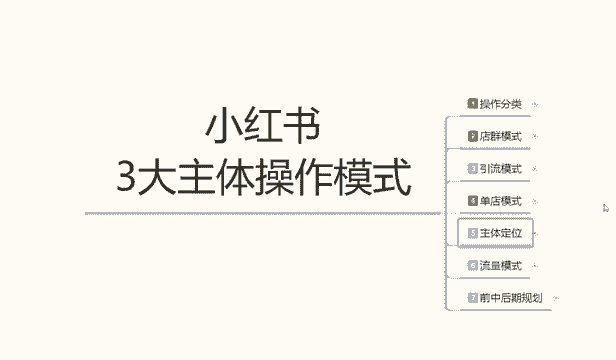
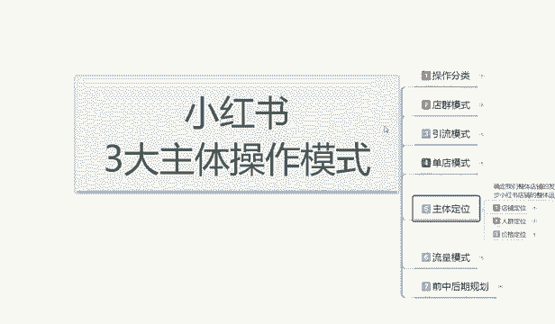
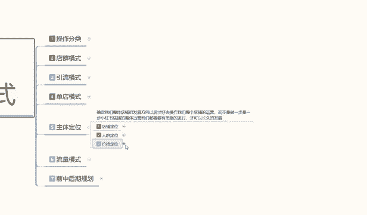
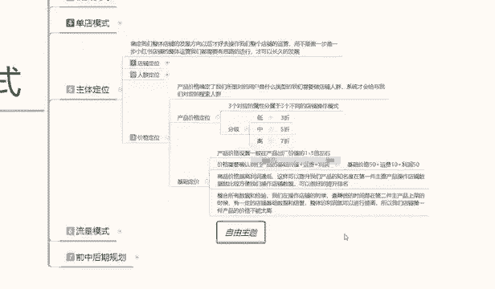
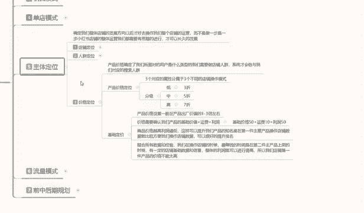
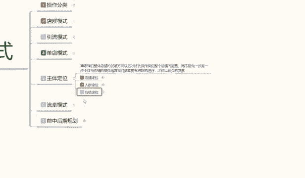
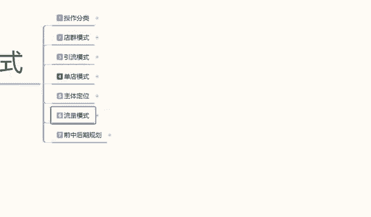

# 【2024版小红书体运营教程】全B站最良心的小红书开店运营高阶教程合集，从0开始做小红书体开店 ,起号真的快!!! - P25：P23、小红书开店-商品价格定位 - 瑶瑶不拿蓝buff - BV1no87eXEva

大家好，今天给大家分享的是小红书，三大主体操作模式里面的主体定位啊，第三小节的一个课程额。

小红书产品的一个价格定位。

这个的话是根据怎么说呢，就是说你要想赚钱，赚多赚少或者店铺定位里面最后一点啊，价格定位它是非常重要的，因为如果说你价格定位定位定位不好的话，你包括后期的一些操作的话，你去做额。

说实话它的一个流量模式的话，你整体不好起来的，所以说我们首先要把价格定位给确认好啊，包括前面的一个店铺定位，人群定位，这两个东西也选好以后的话，然后确定产品的一个价格和对应的一个人群。

他都是整个一体的，好吧，废话不多说，直接进入我们的一个课程内容，产品价格定位啊，价格定位的话，他是确定了我们所面对用户的话是什么类型的，我们店铺需要做的一个人群系统，才会给我们对应的一个展示啊。

就是给我们对应的一个搜索人群，他不管是通过呃笔记搜索也好，就是笔记搜索也好，产品搜索也好，产品关键词搜索也好，它都是通过这种方式啊，系统判定他可能会购买你的产品，才会推荐给你。

而不是说嗯什么人都往里面走什么的，什么都往店铺里面走的话，说实话对店铺来说不是一个好事啊，他会整体影响我们店铺的一个权重，而且他没有成交，如果说你像小红书里面，他给了你1000个访客。

你1000个访客里面一单都没有，你觉得你店铺还有权重吗，系统还会给你访客吗，对不对，那就是按照这种模式来确认的啊，那这个价格定位的话，在价格定位里面的话，我们给大家呃分享的话是两个内容。

第一个是产品价格的一个定位，第二个是基础定价啊，产品价格定位的话是折扣价定位，基础定价的话是产品本身的一个价值定位啊，这是两种不同的一个区别啊，正常来讲的话是先讲技术定价。

或者说是然后再讲产品的一个价格定位，但是这里呢我先给大家先讲产品价格定位，里面的一个折扣价，为什么，因为它整体的话影响我们店铺，你到底是做什么类型的一个店铺啊，整体的一个影响是非常严重的。

然后的话再给大家讲基础的一个定价啊，因为基础定价讲起来的话会稍微简单一点嗯，但是产品价格定位的话它会稍微复杂一点，产品价格定位的话，其实它整体的话对应三个对应的分属性啊，他三个分属性不同的话。

就是说店铺的一个操作模式也是不一样的啊，它分级的话可以分低中高三个三个阶层，就是一件产品相同的产品，它也是分嗯好产品，坏产品和差产品对吧，你要是买服装也一样，同样的同样的衣服啊，一样的颜色。

它的产品质量是不一样的呀，所用的材质是不一样的，它也是分低中端三个格三个分分成的，你包括你就是说你抽个smoke啊对吧，他还有好的，还有便宜的，还有贵的呢对吧，你烟头烟尾烟屁股它都是不一样的啊。

包括你的烟叶烟杆啊，烟叶烟芯他都是不一样的，所以说我们做店铺也是一样的啊，他在这个里面的话，所有的数据量它都是给你分了阶层的，你接神不一样，你说对应的人群不一样，不然他那么大的一个用户群体的话。

他没办法细分，他不可能说是把所有用户群体呃，像倒垃圾一样全部倒进一个桶里面去做啊，那样的话他他整个小红书系统它都起不来，所以说他都是有细分划分的啊，那在这个里面的话，我们把它可以分为低中高三个阶层。

三个阶层的话就是我们对应店铺里面嗯，所选的一个三个属性，低层阶段就是三则产品，两则产品，一则产品包括的话嗯四折产品不算底层了啊，三折以下才算啊，就是1233折的一个物品，它属于额低层低端产品。

什么叫低端产品呢，就是说这种产品的话，你我们产品标价的时候，本来产品的话价值可能是几十块钱，你标价的话标个一两百，你然后打个一折，两折三折，这种范围的话，系统就会判定你的话属于低端产品。

虽然说你也是卖几十块钱，但是说你的店铺流量形式进来的话，就是低端产品的一个流量，同样的道理，终端也好，高端也好，它都是对应的，你比方说你打五折，五折的话就是对半啊，四折也是相当于是对半，六折也是一样。

他就是中端人群，中端人群里面的话，它的一个对应的人群流量，也就是系统分配配给你的，也就是终端消费的一个水平流量，高端消费人群的话就是789十啊，就是全折，全折的话就是不打折啊，但是我们做系统的话。

基本上就说这这种店铺的话，他怎么都要有一点折扣性，因为折扣的话他是一个是吸引目的啊，第二个是嗯给店铺一个信任感，让他占点便宜，也就是分析用户的一个心理啊，当然了包括三折，五折，七折也是一样的。

它也是分析用户的一个心理分析，或者心理以后的话，对应的做的一个人人群之后，他爱占便宜的啊，低端的的就是买三折产品哇，这么便宜，平时买都要好贵好贵，然后去这么购买，所以说他每个阶段的话分低中酸。

低中高三个阶层的话，它对应的人群是不一样的啊，有人喜欢精品，有人喜欢便宜，有人喜欢终端的啊，不上不下啊，试用就行啊，用的时间稍微长一点，所以说我们在产品定价的时候，一定要把店铺的一个折扣价值目标明确好。

你把这个东西如果说你不明确好的话，你所对应的人群不一样的啊，你你拿高端的价格做低端的人群怎么去卖呢，对不对，你拿低端的人群做高端的价格，你怎么去卖呢，他不会买的呀对吧。

所以说我们在这个里面的话，一定要确认好，我们产品基础定价的一个价格分段啊，你到底是要做几折的一个产品，他的产品产品折扣分类的话，是也是根据小红书整体的一个系统去运营，去操作的啊。

然后下面呢给大家讲我们的一个基础定价啊，刚刚给大家讲了折扣的一分价的一个类目，你们了解一下就可以，然后我们后续怎么做，包括你店铺的对应人群怎么去做，都了解透彻以后的话。

你就知道自己给自己的产品定价怎么去定，然后打几折再去弄就好做了好吧，低端价格的话它吸引的用户流量是大，但是它的一个售后的话不是很好做啊，嗯比方说退款啊，换货之类的会多一点。

高端人群的话就很少出现这种情况啊，就是售后好做一点，就看你自己怎么选，然后基础定价在这个方面的话，就是说产品价格设置的话，一般都是产品出厂价的1~3倍左右，额你玩具的话可能会达到五倍十倍。

但是但是这种的话比较少，正常价格的话，我们在网络运营里面就说你做电商店铺的，你的产品出厂价也就1~3倍左右的，一个利润范围啊，你价格高一点的话，利润就低一点，价格低一点的话，利润就高一点。

他都是对应的啊，不是说你的你的产品价格低，我也利润也要高啊，很少有这种这种的话属于冷门产品啊，卖特定人群，不熟悉的人可能会有这么高的一个差价，但是正常的话，我们都是产品出厂价值的1~3倍是最好的啊。

比方说这个衣服出厂价30块钱一倍60啊，最多也就三倍120，你在这个范围去卖的话，还是可以卖得动，而且也比较好卖的啊，最高的120，这个的话我建议大家的话就是做99之类的，这种九十九九十八之类的。

有一个性价比性啊，然后准你要做产品差异化才可以，你产品不做差异化的，说实话你把价格拉到两到三倍的话，也没那么好做啊，这个就是产品的价格设置，一般的话就是说1~3倍左右范围。

是做网络运营营销最好的一个价格，你再多的话肯定就过分了啊，系统的话自动都会把你屏蔽掉的，第二个就是说价格需要确认，我们产品的基础价值啊，算价值的话，这个出厂价啊是出厂价不是基础价值啊。

就是我们设定产品价值的时候，产品价格需要我们产品的基础价值，加运费加利润，你要赚多少钱，连运运费花费多少，然后加上你的产品基础价值再去算啊，基础价格如果说是50块钱，加运费十块钱，加利润50。

那就是一倍的价格，就是110，按这种方式去定产品的一个定价啊，我只是说给大家打个比例，正常定价的话还要看我们自己啊，然后是商品的价格越高，利润越低啊，你比方说大型商品，你卖家具啊。

或者说卖这种大型的有名的化妆品的话，它的卖价是非常高，但是你的产品单品利润的话非常低，因为第一个它的销量不是很好，销量不会太高啊，卖家具的一天能卖个555件到六件，那就已经很厉害了。

因为有的家具的话可能会便宜点，有的那种实木家具的话，几千上万的都有对吧，所以说它的利润啊是和你的价格成正比的，你的价格越低，利润越高，你的价格越高，利润越低啊，只是说选项不一样，但是他的一个基础比例。

在这个地方就靠我们自己怎么怎么去调整，然后呢后面的我就不给大家说了啊，因为的话你们自己了解这部分内容的话，对这些产品也是比较比较了解的啊，最后一个点就是说，整合我们所有平台的一个数据经验。

我不光是小红书，包括其他平台的一些经验啊，我们在操作店铺的时候，最赚钱的时候永远都是在第二件主餐产品上面，你第一件做爆款的时候，如果说你做单单店单爆款，你把价格拉高一点没关系，但是你做单店多爆款的话。

第一件产品的话最好是拿平价去卖啊，整体的整体的利润的话，在第二件产品里面去做，那样的话整体效果是非常好的，因为你有一定的有一定的用户累积，有一定的信任基础，你在第二件产品去卖的时候。

别人对你店铺的一个信任和产品的一个了解，都有一定的清晰清晰度，那你产品第二件的话，说实话第一件做一倍利润就差不多了，或者是0。5，如果说你做多爆款的话，做0。5的利润或者说一倍的利润就行。

第二件的话可以做到两到三倍，这就是单店和多，单爆款和多爆款运营的一个区分啊，这也是我们产品价格定位的一个趋势和走向，如果说你不了解这些的话，你的产品你觉得别人卖多少，你去卖多少，正常的去做的话。

你不定位店铺，有不定位人群，不定位价格，你是做不出来的啊，你觉得你再多的资源你怼进去，说实话你的投入和收入是不成正比的啊，所以说我们在操作店铺的时候，首先要把自己整体的一个主体定位定位好好吧。

那么这节课的内容呢就给大家讲解到这，下一节课呢给大家讲解一下啊。

