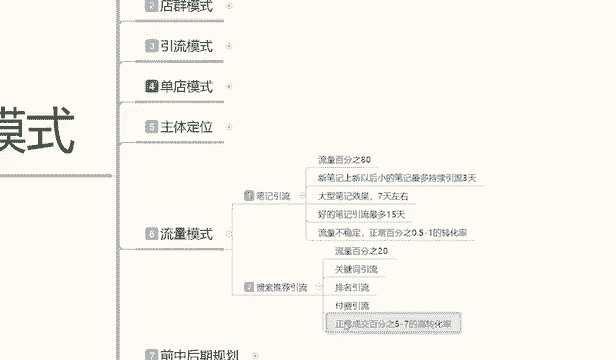
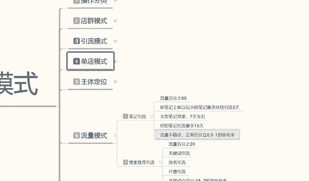

# 【2024版小红书体运营教程】全B站最良心的小红书开店运营高阶教程合集，从0开始做小红书体开店 ,起号真的快!!! - P26：P24、小红书开店-流量模式“笔记引流+搜索引流 - 瑶瑶不拿蓝buff - BV1no87eXEva

大家好，今天给大家分享小红书三大主体，超弱模式里面的第六节课时啊，第六节的一个小课时，他不是之前的一个分类课时啊，这一节课时的话主要是给大家讲解一下，我们小红书整体的一个流量运行方式啊。

和流流量运行的一个方法，让我们整体来了解我们店铺，包括小红书运营它的一个模式，分流好了。

废话不多说，直接开始我们今天的这个课程主题呃，小红书的一个流量模式啊，之前呢我给在分享的时候给大家已经说过了啊，小红书，小红书三大主体的一个，店铺运营的一个模式方法，因为他们的话是有区别的啊。

店群模式的话，你只是说你铺货嗯，做商品而已，引流模式的话，其实只要是流量进来都可以用，但是看你怎么去引流到其他地方，然后单店模式呢主要是卖产品，他们三个模式的话，他们基本上都是不一样的。

那在小红书笔记里面的话，我们首先要了解小红书，它整个系统体系的一个流量体系。

它是怎么分配的，这里呢我已经给大家给打出来了啊，大家可以看一下。

然后呢我给大家详细讲解一下啊，小红书笔记他的一个笔记引流和搜索引流啊，笔记引流的话就是我们小红书日常发的一个呃，推荐你的一个笔记，就相当于是抖音也好，或者是你的微信也好啊，他都有一个日常发送。

日常发送的话，小红书的日常发送的话，也就是说分享我们所见那些呃，新奇的奇奇闻趣事，或者说对大家感兴趣的一些内容，大家可以去搜索或者说是进行分享啊，包括你在里面聊天啊之类的都可以。

只是说他是以一种网络形式交流的，那小红书的笔记分流的话，它其实是可以分为两个部分的，它有80%的流量啊，是通过笔记去引流的，还有20%的是搜索流量，但是整体来说的话，它的整体引流的话。

其实是比例按百分之百计算啊，就是进入的人群他都是观看笔记去的，光看笔记里面的话，他有的人对里面的产品感兴趣，他就会去搜索，所以说他这一部分主流量的话不会太多，他的一般的所有的浏览浏览的一个信息的话。

都是冲着小红书，他系统匹配的一个笔记日常去的啊，所以说它整体流量的话，其实百分之百都是在笔记流量里面，只是说还有20%左右的一个部分人的话，他对笔记里面的兴趣感感兴趣了以后，转移到搜索产品内容里面去了。

就是说它占比的话可能接近20%左右，整体流量分配比的话应该是，笔记引流占80%啊，搜索引流占20%了，当然了，这个的话是商品购买的浏览啊，正常小红书搜索的话全都是比基引流。

但是笔记引流我们把它分分均了以后的话，就是说还有80%的流量，是通过笔记进入店铺进行购买商品，20%是通过搜索关键词进入商品，这就是小红书整体流量的一个划分划分比例啊。

但是这个里面的话啊，给大家说一下啊，笔记你不管再好的一个笔记，我在这里呢给大家列了一个小的一个笔记，规划路，为什么说小的笔记规划录呢，因为我们我做这个东西的话，时间也有一段时间了啊。

我做整个网络运销平台，就是电商运营平台有很多年了，但是小红书的话，我说实话啊，我没有做多久啊，我也也就做了一年多，接近两年，新笔记上新以后的话，就是说我们小红书他整个的一个新笔记，上新以后的话。

最多持续引流三天，你不管是新账号也好，老账号也好，老账号只说权重高一点，你做的笔记的话可能是大型笔记，或者说是好的笔记，它不是小的笔记，新的小的笔记的话就是我们普通用户去观察。

或者说自己分享自己的一些内容，他维持时间也就在三天，除非你点赞量，你新笔记上新以后，点赞量破200以后，可能会维持五天左右，但是绝对不会超过这个范围以内，所以除非你做的是精品的一个皮衣。

你正常随意发的话，笔记引流就三天时间，小红书就给你三天的一个在线，三天以后的话，你这个产品不是被下架，就是被隐藏了，就是别人搜索不到，除非是他主动去搜索，不然的话搜索不到就是不主动给你推流了啊。

这就是小红书笔记引流，做笔记我们要记住的几个点，第二个就是大型笔记，大型笔记的话，像我刚刚给大家说的，什么叫大型笔记呢，内容稍微多一点啊，内容的文案吸引力啊，稍微大一点。

就是对一部分人员进行了一个强制性吸引，他整个鼻炎引流效果也就只有七天啊，只有七天，超过这个时间的话，也就是被隐藏，被屏蔽掉了啊，你除非是拿关键词搜索，你才能把他的数据档案给搜索出来，就是小红书。

整个系统的话，他对你的笔记进行一个评价，平价的话它分为三个阶段啊，大型笔记，好的笔记和小的一个新型笔记，他就是三天七天，15天，最多也就15天，就说我的笔记做的非常的精细，而且很多人观看。

可能观看人数达到了几千上万甚至少10万，但是他系统给你推荐引流啊，大家一定要记住，系统给你的推荐引流最多就15天，除非你花钱再去做推推广啊，不然的话就只有15天，但是花钱做推广的，我们就没有必要了。

所以说我们在做小红书笔记的时候，这种笔记引流里面80%的流量啊。

一定要记住了，你不管发多少笔记，新的笔记他就三天，好的笔记就七天左右，最好的笔记你上万的上10万的，他的一个顶流数据也就15天左右，他不会给你太多的时间，这个的话说实话其实是和抖音差不多的啊。

其实是和抖音差不多的，你抖音你新上新的一个数据的话，它也是只是给你三天的一个自然展时期，能有人多少看见多少人感兴趣，多少人停留，就看你前面接触的这些用户，给你的一个数据反馈了啊。

系统如果说接触到足够的信息和足够的系统，反馈以后，会给你延长几天的一个效果啊，但是最多不会超过四五天，整体效果，这个就是比基引流，80%的流量的一个来源，那我们在发布商品，或者说是我们做引流模式的时候。

那你我们观察一下啊，你基本上是每天一到两个笔记最少的去操作，那这个笔记里的数据的话，就是按照这个去计算，你如果说想要流量保持稳定，那么你就要按照有一定的规划，你比方说三天推一篇，两天退一篇。

或一天推一篇，或者一天推两篇这种固定的模式去做，你能才能保证你对你的账号进行访问，我现在都不说店铺啊，他只是对你账号店铺进行访问，还还没有进入到你的店铺，进入到你店铺的话。

他那个流量的话是另外的一个来源啊，是下面给大家说的一个搜索流量来源和，笔记引流80%的来源，笔记引流啊，这里面有一个点就是流量它是不稳定的，你可能第一个笔记额内容多一点，丰富一点，观看的人数多一点。

可能引流七天左右，但是你下一个笔记的话，可能或者是下两个，下三个笔记的话，可能都只有三天内一流，而且流量数据非常少，这个就是说笔记引流流量不稳定啊，同时这些流量进入你店铺。

或者说是你推广的商品进行宣传以后，他的正常百分比，转化率还只有0。5%到一，就是说通过笔基金来观看你店铺经营购产品，购买的，如果说你没有维护好里面的一些评论啊，啊互动啊之类的，他转化率只有0。1%到百。

0。5%到1%，这已经算是高的了啊，可能还会更低，就是说大家不要把那个笔记引流的话，嗯当做主体的运营思路去操作，因为他的转化率实在太低了，他对你店铺整体影响的话呃，有一定的影响。

但是我们只是说把笔记嗯做精细化，做原创笔记去发布，或者说按照自己的思路推广给别人，按照这种模式去做，因为小红书的话和其他不一样，他第一个你要有自己的一个整体创造思路，如果说你没有创作思路的话。

你整个运营模式你就算做的话，也是真的不好做啊，小红书他对这些精细化的要求还是比较高的，你不要看他流量那么那么杂，但是他的人群的素质要求是特别高的，你低于这里面一点，我们是做不了的啊。

第二个就是搜索的一个推荐引流，虽然说这个流量的话是占比20%啊，就是说成交的流量比例占比20%啊，大家不要误会，不是小红书，整体访客有20%全部去做搜索了啊，它是百分之百的笔记观察，然后在百分之百里面。

有可能20%的人去会去搜索产品，或者是无意中点进来去观看产品，有20%左右的一个流量啊，然后这20%左右的流量的话，他会在里面搜索关键词，然后去搜索你的产品，看见你的商铺进去，但是这个里面的话。

它的一个正常情，成交比例是占5%到7%，就是说他对这个产品感兴趣了以后，他搜索成交的概率是非常大的啊，他基本上不不感兴趣了，他不会进来，那么他搜索了以后，你店铺成交转化率，可能就在5%到7%。

如果说我们在上面结合三。

上面三个主体模式来操作的话，就是电池模式也好，引流模式也好，单电模式也好，那你就已经知道自己要去做什么，对不对，你比方说电驱模式的话。

其实不用在乎这两个点，因为你完全就是比基引流的，你是商品和关键词引流的，他不管是搜不搜索商品，基本上这两个点它都包含了，但是引流模式的话，主体是做笔记引流啊，单电模式的话。

主体是做搜索引流，所以说这两个这几个点的话，我们一定要分清楚，我们在做任何的一个属性词，会或者说是做店铺也好，做运营也好，你都要了解整个小红书它运行的体系，你才能去把店铺做得更好。

你运行体系都不了解的话，我们是没办法做电脑，所以说我们一定要注意了啊，小红书整体的一个流量模式，它是笔记引流和搜索引流两大类目啊，当然了，如果说我们说做单点的话，你笔记引流做不做，你肯定是要做的。

因为你不做笔记引流系统的话，默认你是个死店，他是不会给你流量的啊，所以说你不要小瞧小红书比牛。

虽然说他转化率不高，但是你也必须得做啊，只是说我们投入的方式和密度不一样，我们再把店铺基础属性全部做好，以后的话，基本上所有的属性全部是靠笔记引流去做的啊，毕竟牛的话前期还是占大头啊，中后期占大头。

前期的话我们是要先维护好店铺的基础数据，你把数据做出来了，你才能去做维护，你数据都没做出来，你做维护维护什么数据呢对吧，所以说顺序一定要弄清楚，那这个呢就是我们这一节课的内容，整体的一个流量模式。

然后在搜索里面的话。

它这个里面还有一个搜索流量的一个关键词，引流，排名引流和付费引流三大引流的一个主体的话，说实话，这几这几个点的话都是可以拿单独来讲课的，为额给大家进行分享，用关键词引流，排名引流和付费引流的话。

他们都是有排名的啊，那后期呢我会给大家详细的说一下。

然后下一节课呢给大家分享呢啊。

