# 【2024版小红书体运营教程】全B站最良心的小红书开店运营高阶教程合集，从0开始做小红书体开店 ,起号真的快!!! - P27：P25、小红书开店-店铺前中后期规划（1） - 瑶瑶不拿蓝buff - BV1no87eXEva

大家好，今天给大家分享的是小红书，三大主体操作模式里面的啊，第七小节的一个内容啊，前中后期三个时间步骤，对于店铺进行的一个规划啊，当然包括引流模式和电竞模式，我在这边呢这一期的内容里面的话。

前中后期三期规划，我就不讲引流模式和店铺群模式，因为电驱模式的话，说实话是没有中后期的一个规划的，他只是说它整体模式基本上都是一样的，我们持续操作就可以了，引流模式的话，这三期规划对于你。

他是因为他是做小红书店的，你做引流模式的话，其实小红书店只是辅助啊，你的主要效应的话还是做笔记的，所以说在这个里面的话，对他们两个影响不大，我主要的话就是说按围绕单电模式，我们讲解一下。

前中后期三个规划的一个思路和了解。

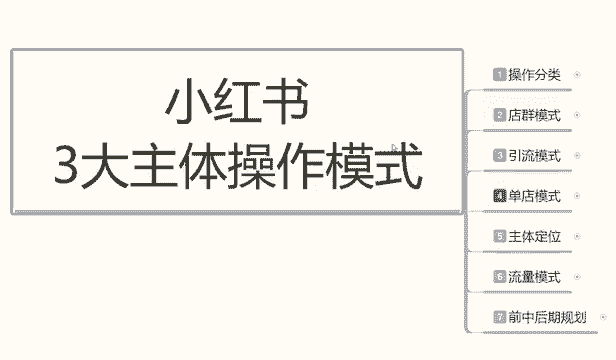

那我们首先来了解一下啊，我们在做单点模式，前期中期和后期三个规划啊，这里面的话我着重给大家讲解一下啊，前期规划和后期规划，中期规划的话我没有完全给大家列出来啊。

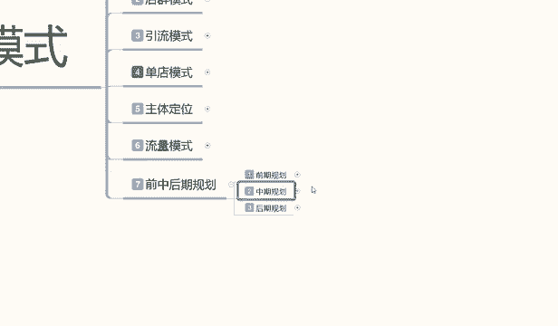

是有原因的，因为中期规划的话它的一个属性分类，你要了解，我们是要把店铺的数据去给做出来的啊，他整个一套系统的话是非常多的一个内容，我呢后续呢会专门拿一期啊，整个一期十几套课程给大家进行分享。

我们中期规划店铺的数据怎么去维护，怎么去操作，这一期的话主要是给大家讲解一下啊。

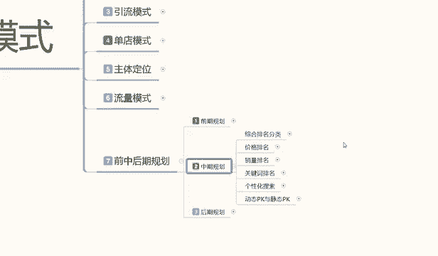

前期规划和后期规划，前期规划的就是我们店铺基础的一些属性，后期规划的话就是说我们在中期属性做完以后。

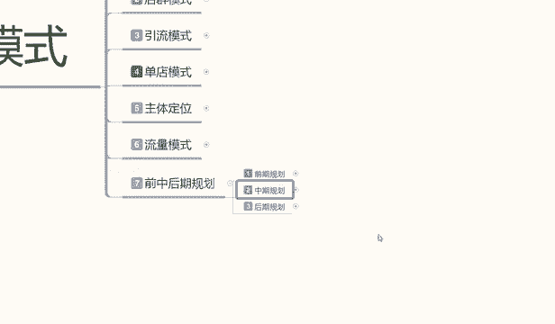

店铺面临两种选项啊，我们怎么去操作店铺的一个发展方向啊。

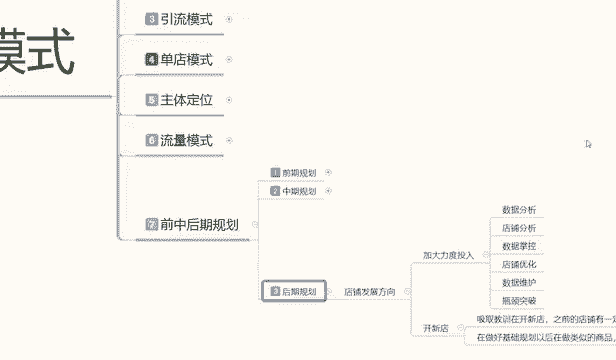

那先给大家讲解一下前期规划。

前期规划这个里面的话。

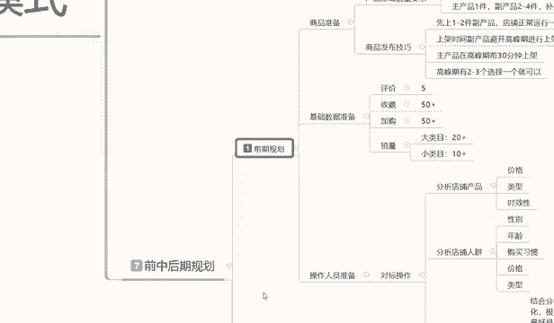

我说实话啊，我呢是准备拿两节来给大家做分享的，为什么呢。

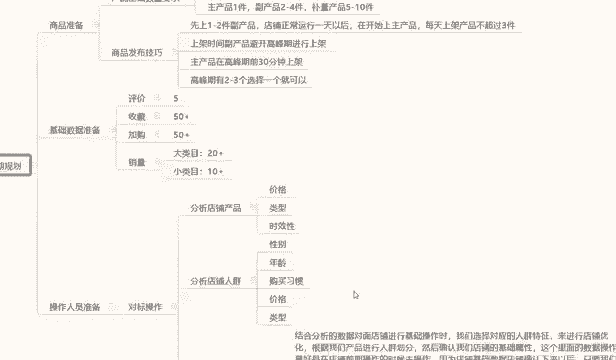

因为它的内容的话说实话比较大，下面那个操作人员和对标操作的。

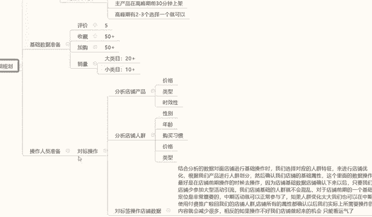

我先暂时不说，我先给大家说一下，我们这个前期规划的一个商品准备。

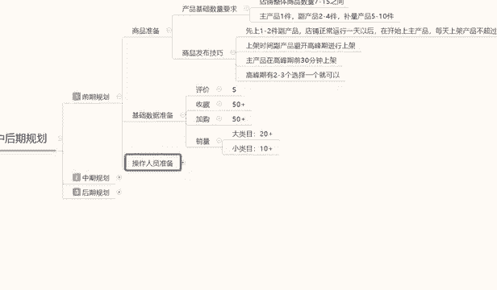

和一个基础数据啊，什么叫商品准备呢，就是我们在小红书里面做店的时候，你的产品可能我选主产品的时候可能是单一的，但说实话你选产品的时候不是单一的，你的店铺最少要保证7~15个之间的，一个商品数量。

如果说如果你的产品太少的话，别人进入你店铺观看你一个产品直接跳走，你店铺的跳失率太高，没有第二个产品选项，他对你的产品感兴趣的比例，可能不到60%，如果说你有多个产品，它会在反复之间就是减少。

减少你的店铺的一个产品跳失率，他会在反复产品之间观摩衡量以后，如果说感兴趣的话，他可能会买啊，他的一个成交率可能会达到70%，到90%，如果说你的产品太少，就一件两件产品的话，别人看完就走了。

不是说他都不在，大家继续到其他店铺里面去看了，都不会在你店铺里面进行停留和成交的，所以说店铺整体的一个商品数量的话，它是在7~40之间，然后在7~15之间的一个产品的话，其实我们还是有划分的啊。

这个划分是什么呢，第一个是主产品，一件副产品两到四件啊，不量就是存储填充店铺数量的产品5~10件啊，他的比例是什么呢，一比二比五，为什么叫一比二比五啊，就是一件主产品，两件副产品，五件不亮的一个产品。

这是最基本的一个数字配球，你在后面每多一件副产品，就要多加两件左右的一个副产品，但是整体的话7~15是最合适的，一个产品范围以内，再多的话影响你的店铺整体的一个多效率，再少的话。

对于你店铺的一个整体规划和啊顾客浏览，包括跳丝和浏览市场，它都是有影响的，所以说7~15件的产品是正好的，我刚刚所说的这些呢，内容就是我们产品基础数量的最低需求量啊，下面呢是给大家说一下。

我们的这个商品的一个发布技巧，商品发布技巧的话，他是有一个上新时间的啊，他这个的话会提升我们产品的一个技术，排名属性，我们把这个操作好的话，对我们店铺这个展展现和展示的话，他是有优先排序的。

产品发布技巧的话，这个里面的话是先送一到两件副产品，店铺正常运营一天以后呢，我们再开始上传主产品啊，每天上架的产品不超过三件，就是说你在第一天的话造一到两件副产品，或者是再加一个不量产品也可以。

不加也行，一到两件也行，然后上完产品以后的话，不要再做其他任何操作了，为什么这么做啊，这里面的话它是有一个时间保底的，什么时候要实现保底呢，就是你的店铺注册成功以后，他有一个系统更新时间。

同时包括你商品上新以后，他有一个系统更新时间，这个系统更新的话是让你的店铺有排名，商品有排名，当然这些排名的话，是根据我们店铺属性来做的啊，这个里面店铺整体的一个属性，你的属性越好，你的排名也就越高。

正常的话这就这个内容的话是在中期，就是我们中期规划里面的话，我会来给大家讲到，但是中期规划的话，你们可能需要看另外一些的乐分享视频了，因为我会单独把它列出来的话，给大家做一个那个分享模式。

因为它的内容实在是太多了，我们要了解的内容也是比较多的，小红书坐垫的话，你做商品单品店确实是要稍微复杂一点，你要了解的东西非常多啊，然后呃刚给大家说的是副产品啊，第一天上架以后就不要做其他任何操作了。

在第二天去进行上传就行了啊，因为让整个系统它有一个反馈的一个时间，系统反馈的话，你后面后续的产品虽然说也有更新时间，但是它不会像第一次那么明显，第一次的话是淘宝重新录入进行排名。

第二次的话是直接已经录入，有排名的情况下进行排名的一个比较啊，你再上新主产品的话，他的权重模式会比第一件，第二件产品要高，所以说我们在前面两件的话是副产品，后面第一件的话才是主产品啊。

上架时间副产品的话避开避开高峰期，就是说你不要在你产品的一个高峰期时间，去上架我们的主产品，避开高峰期就可以了啊，主产品在高峰期前30分钟进行上架啊，高峰期的话一般都有两到三个高峰期。

你除非是特别冷门的话，也最少最少的话就是两个高峰期，基本上多的话，正常比例的高峰期的话都有三个啊，我们在高峰期前30分钟上架去抢排名就行了，这个呢就是产品的一个发布技巧，后续呢就是我们产品就是新品。

不管上架也好，或者是老品上架也好，它都有一个产品的基础数据的，这个产品的基础数据的话，我们基础准备数据里面有评价，收藏架构和销量啊，数据我已经给你答案列出来了，评价的话就是说我们单品评价。

你要正常的把这个产品想把它卖出去的话，你最少有五个评价以上，收藏加购量最少在50以上，这个的话其实是没有什么影响的，他的数据越多的话越大，你对你店铺的权重也就越高，同时这里面还有一个主产品的一个销量。

这个主产品的销量，为什么说是嗯主产品的销量呢，销量里面的话它分为大类目和小类目，还有一个冷门内幕，说实话冷门内幕的销量的话，我没有给大家列出来，因为是我觉得你做冷门内部的话，你对网络运营不是太了解的话。

基本上不好做，因为冷门内部我们去操作的时候，你的竞争压力太大了啊，不是说我在这里只呢只给大家列了两个，一个是大类目，一个是小类目，大类目属什么热销产品，你的最低销量必须保证在20个以上。

就是产品销量不是评价啊，销量保证在20个以上，你的产品展示给用户以后，用户才会考虑去去购买，如果说你的销量基础是定听嗯，小红书里面有一个特点啊，特点就是你产品销量没破零的时候。

他是不会给你任何自然流量的，你这个产品破零了以后再去做推广，他才会有自然的一个店铺展示数据啊，大家记住这一点啊，你销量不配为零的话，你都没有展示的啊，包括他的小红书系统的一些任务。

你要跟着他的任务去循环做的，就说我们在操作店铺的时候，大类目你保证店铺最少20个销量就可以了，你的产品就可以正常售卖了，就看你能引进来多少流量，你流量越多，你的成交概率也就越高，当然了，你的销量越高。

也同时保证你成交转化率的一个概率，你比方说你有100销量，500销量，1000销量1万销量啊，这种销量的话他都是有排名的，小类目的话，保证十个到15个，最少十个到15个之间啊，再往上面走。

小类目虽然说精准性特别高，但是他也有一定的竞争压力，你的小类目的话，他这种搜索比例的话，销量就没有大类目那么高，因为你不需要怎么去抢他排名就看自己大，大家自己怎么去理解，如果说你是小产品的话。

肯定要排名，销量比较高一点，如果说你是大型的家具类目的那种，或者说是电器啊之类的，这边好像也卖不了电器啊，你就记住了，小类目你最少十个以上到15个的一个销量，大类目就是20个以上的一个销量啊。

这个就是前期规划，我们的一个商品准备和技术数据的一个准备，把这两个数据准备好以后的话，我们就要啊准备操作人员的一些配置了。

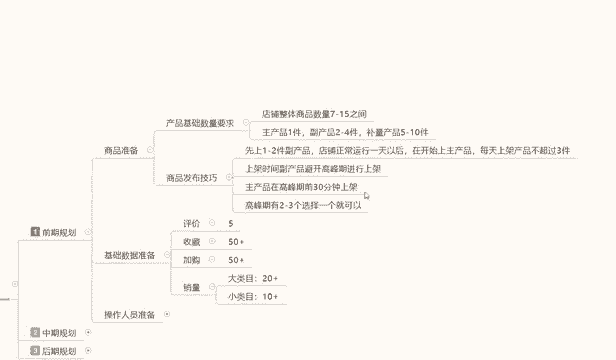

因为课程原因的话，我会把它分到下一下，一分享内容给大家的话进行分享啊，主要的话就是给大家讲解一下，我们操作人员的一些准备。

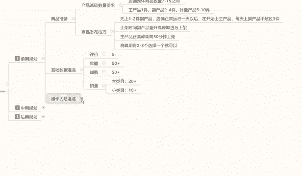

包括对店铺的一些分析，然后呃进行店铺的一个整体规划的一个操作。

