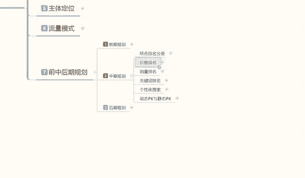
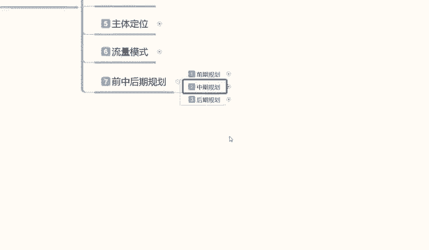

# 【2024版小红书体运营教程】全B站最良心的小红书开店运营高阶教程合集，从0开始做小红书体开店 ,起号真的快!!! - P28：P26、小红书开店-店铺前中后期规划 - 瑶瑶不拿蓝buff - BV1no87eXEva

大家好，这一节给大家分享的是小红书，三大主体操作模式的第七节内容啊。

也是我们最后一节的一个内容，前中后期的一个规划。

上一期呢给大家讲解了我们的一个商品准备。

和一个基础数据准备啊，这期的话是给大家讲解一下。

我们操作人员的一个准备，操作人员准备的话。

包括我们后期的一些规划，这里面的话其实操作人员准备的话，它有一个操作前提，操作前提的话就是说对标操作啊，这里呢对标操作它的一个是准备操作人员，我们需要在小红书里面，对店铺的一个人群进行划分。

还有对店铺人群，商品用户的一个划分，这里面的话对店铺用户，产品的话就是价格类型和时效性啊，这是商我们小红书店铺的产品的一个分析啊，价格类型时效性，之前的课程内容我也给大家讲过了，我们把这个结合一下。

然后呢再加上店铺分析，店铺的一个对应人群，就是用户啊，我们这些产品要卖给谁，卖给什么样的一个价格，卖给什么样一个类型的人群，然后呢他是在什么季节卖的，然后我们分析店铺的人群里面的性别，年龄。

购买习惯和价格类型，然后做对应的一个人群调整啊，这个呢就是对标签操作店铺的一个数据啊，就是对标人群的一个操作，我们在操作前面的基础数据的时候啊。

就是操作这些基础数据啊，我们要用这个去做啊。

基础数据准备的一个数据量啊，结合分析数据对店铺进行技术操作的同时啊，我们选择对应的人群特征，来进行店铺的一个优化数数据处理啊，根据我们产品进行人群划分以后啊，确认我们店铺的基础属性。

这个里面的话数据操作，最好是在店铺前期操作时时候做，所以说我把他这个对标操作的话，是放在这个地方啊，上面的话就是说技术数据准备，下面就直接用对标操作去操作了，因为直接用对标操作的话。

会省去我们中后期的一大部分的一个麻烦，如果说我们在前期对标操作没做好的话，我们整体的一个店铺人群是偏离的，因为它系统随机给我们的一个访客的话，他数据是不准确的，就说我们的呃进店访客，你就算进店再多。

他没有成交，没有转化的话，你包括中后期的数据你提升不起来，你只能在前期的时候小打小闹，一几天卖一单，十几天卖一单这一种啊，那样的话我们开这个店铺的也就失去了意义，对吧，所以我们在操作的时候。

一定要把他的前期基础数据准备好了以后，然后再去操作啊，这里呢其实我是那是已经把我要说的内容，大部分的给大家打打出来，只是说我怕大家不理解，然后给大家详细的跟大家解释一遍，对一个店铺前期的一个技术来说。

定位的话它是非常重要的，如果说我们定位不准确的话，中后期你活动都不能参与了，你把人群做准了以后，你中后期活动的话还是可以尽量参与一下，因为他那个流量提升空间还是非常大的啊，如果人群变化太大的话。

我们在中期嗯也可以用付费推广去调整，但是我觉得没有必要啊，我们前期能避免的事情没有必要再花钱去做了。

所以说这个呢就是我们操作人员，他有一个对标操作。

我们只要把这几个步骤把它做好啊，就是分析店铺的一个产品，分析店铺的一个人群。

然后再找这些人去做这个基础数据，你的前期基本上就可以平稳度过了，这个里面的话有一个时效性，大概7~15天就需要完成啊，这部分的一个内容，这个呢就是我们前期整体的一个规划的一个思，路和规划的一个执行标准。

我不是说别的，我只是说执行标准，我只给大家分享的这些内容的话，是需要大家自己去操作的，我不可能去说是把所有的细节全部，在这地方给大家展示啊，因为有些东西的话还是要靠我们自己去理解。

所以说我在这里呢给大家说的，就是你的前期基础数据准备，你必须要用对标人员去操作啊，必须要有对标人员去操作，因为其他人员操作也可以，只是后期后续的中期，我们对店铺的一个调整的话，它有很大的一个变化。

就说我们前面如果说我们有些朋友啊，你们做店铺已经把前期已经度过了，现在是中期，我想改变内部的一些情况，人员转化率啊。

啊包括我们店铺的一个提升或者瓶颈，其实都有办法啊，只是非常麻烦，对我们新手玩家来说的话啊，你刚接触小红书店铺不久的话。

说实话你按照这个模式去做，你可以避免你后期最少两到三个月的一个苦工，因为你后期你要把这些数据改回来的话，你最少要两到三个月啊，所以说一定要把基础数据做好，我们再去做后期的一个数据规划整理好吧。

这个呢就是前期规划呃，中期规划的话，说实话啊，我在这里呢就不给大家讲了，因为中期规划里面，就是我刚刚给大家说的这些综合性的一个调整。

它这个里面包括排名的一个分类啊，一个整体的一个数据分析，包括你的竞争对手店铺的一个分析，竞争对手店铺对手的一个对比，包括销量排名啊，关键词排名啊，价格排名啊，他这都是可以做的，都是在中期的时候进行操作。

前期只需要把这几个做完，就基本上前期就已经度过了，就平稳度过了，我们后续的话就包括综合排名这个里面的内容。

因为实在是太多了，我到时候呢会单独安排一个课啊，去给大家讲，我们光排名分类它就有16项，就是我们整体的综合排名分类他就有16项，你你还不看下面的价格排名。

销量排名，关键词排名，个性化搜索啊。

动态动态与静态pk，还有数据分析，关键词调整关键词的一个数据把控，店铺的数据把控，这里面内容确实是太多了，因为中期中期属性的话，它是非常多的一个整体的大致规划。

在这里我就不给大家做过多的讲解，我现在呢给大家规划一下。

我们后期的一个整体思路，为什么说直接跳过中期做后期呢，因为你要了解你店铺做到中期以后的话，你后期数据要提前准备，我们后期应该怎么去操作，你的店铺到底是往单店发展，单店多爆款发展，还是说单店单爆款发展。

你把这个模式确认下来以后，你的中期规划才好去做，懂我意思吧，就是你把中你把后期数据了解，你后期店铺的一个整体转型变化。

了解以后，你中期里面它它这个整整个数据链里面的话，它还有额单品单，不单店单爆款的一个整体调整方式，单点多爆款的一种一种整体调整方式，他们两种方式和操作方法模式都不一样的，所以说你我们在做电的时候。

你前中期规划你先不要着急去优化，我们先了解一下，你到底是要把这个店做成什么样，你才好去做整体的一个规划调整啊，所以说我为什么说先给大家讲前期再讲，后期不讲中期呢对吧，因为前期和后期说实话是比较简单的。

它只是一个形式方面的一个转变，但是中期规划的话，他就是整体小红书运营系统里面的一些细节，步骤和店铺的一些调整啊，如果说这些东西你不了解的话，你中期规划的话思路就已经错了，说实在这里呢给大家强调一下啊。

后期规划的一个整体思路，后期规划里面的话是说实话，就是我们的店铺的一个发展方向，什么为什么说是店铺的发展方向，店铺方向的方向的话，我在这个地方的话是给大家分为了两步，第一个是加大投入力度。

就是我在这个店铺里面的一个数据分析，店铺分析数据掌控店铺优化，数据维护，拼运突破，这几个点里面去进行数据的整体更改和优化啊，包括数据突破，为什么呢，因为我们在中期做完以后，面向后期的时候。

什么叫面向后期，你的店铺已经发展不动了，你每天不管笔记做的多好，你的产品宣传的有多好，你的折扣做的有多好，你的活动报名有多好，所有数据做完以后，你的店铺就是在原位，每天该卖多少就卖多少，咱该成交多少单。

成交多，那一点突破的痕迹都没有，这就已经到达了店铺的后期属性，我们在店铺后期属性里面的话，我就说他有两个选择方向，一个是开新店，第二个就是加大投入力度，这就是我刚刚跟大家说的啊。

前期和后期规划里面中间他的一个数据量，然后我们新店开新店就比较简单一点了，我说句实在话，开新店就比较简单一点，就是这个店铺我不管了，爱怎么样怎么样，他们能每天卖多少单就卖多少单，我这些人员的话。

我就不弄它了，我再重新找人员，重新去开一个新店，比方说我这个店每天还有个几千块钱的成交，对吧，我就请个客服，请个代运营，保证我店铺数据不掉，这就已经非常不错了，但是你如果说想把这个店铺做得更好。

那你就加大投推广的一个力度，这里面的话就一个数据分析，一个店铺分析，一个数据掌控店铺优化，把这几个包括瓶颈突破，它都是有技巧的，就看我们大家怎么去理解啊，当然了，这节课我只是说给大家说一下思路。

大家了解一下啊，包括后续的话，我会慢慢的给大家呃进行详细的划分和分解啊，让大家知道店铺怎么去做，所以说我分解这些东西吧，说实话啊，嗯理解的人就理解了，不理解的人，你慢慢的到后面，你如果说你接触多了。

没有坚持下去了，没有放弃的话，你也会慢慢理解的啊，懂意思吧，然后开心练，开心练的话，就是吸取之前的这种规划的一个教训，我们在前面的话可以少走很多弯路啊，第二个销第二个店铺，说实话你操作起来的话。

你肯定比第一个店铺有经验，你第一个店铺本来就是拿来做实验的，然后的话也保证自己的一个收支平衡吧，第二个店铺开始才去赚钱，就相当于你做单单店多爆款也是一样的，都是从第二个产品开始赚钱的。

因为你前面的话本来就是开阔新的思路，开阔新的渠道，去了解这个产品怎么去运营去操作的啊，在做好基础规划以后，再按照做类似商品，进行小范围的一个调整就可以了，基本上就没太大的变动。

这个呢就是后期的整体规划的一个方向，你就只有选对路了，你才能去做，你没选对路的话，你在中期规划的时候，你瞎胡闹做，你都没有后期了，你在中期就已经被卡死了，好吧，这个呢就是说我们后期规划的一个店铺。

发展方向啊，看大家怎么理解，包括我们前期的整个一个系统规划，下一期的话我会给大家出一个中期，就说我们小红书店铺在中期的话呃，我们需要注意什么呀，数据属性啊，数据优化，店铺人群属性等等一系列的东西。

我会慢慢的给大家进行分享，列出来，那这一期的一个课程。

就说我主要是给大家介绍了一下小红书，我们三家主体操作模式，它的一个运行方式和运行思维，包括我们整体的一个规划，我们把这些东西做好以后的话，我们再去做小红书的店铺啊，思路有了啊，节奏有了。

你对具都好操作了对吧。

