# 【2024版小红书体运营教程】全B站最良心的小红书开店运营高阶教程合集，从0开始做小红书体开店 ,起号真的快!!! - P2：01比刷剧还爽！！2024（全新）小红书运营网课，小红书运营大佬专为为学渣研制的小红书开店、小红书起号零基础保姆级教程，全程通俗易懂，纯干货无废话 - 瑶瑶不拿蓝buff - BV1no87eXEva

小红书无货源电商项目还能不能做，我想说这个项目仍然是个蓝海项目。

值得去尝试，小红书属于种草平台，种草的行为本身就自带成交属性。

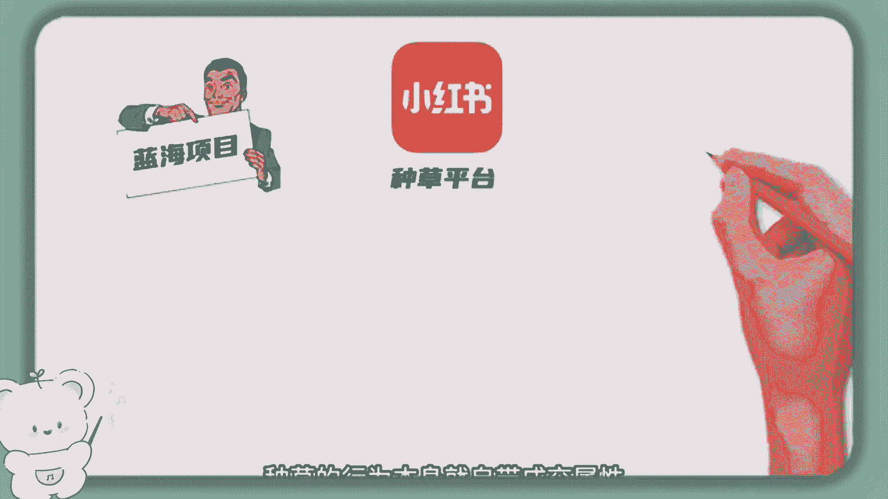

再加上去中心化的算法，只要笔记一报出单速度。

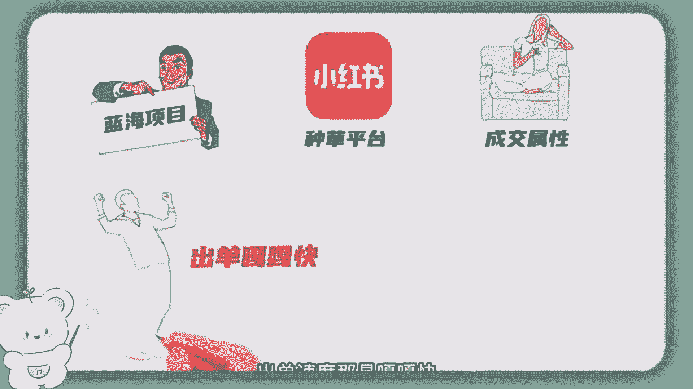

那是嘎嘎快，不需要补单，也不用投付费，主打的就是一个自然流玩法。

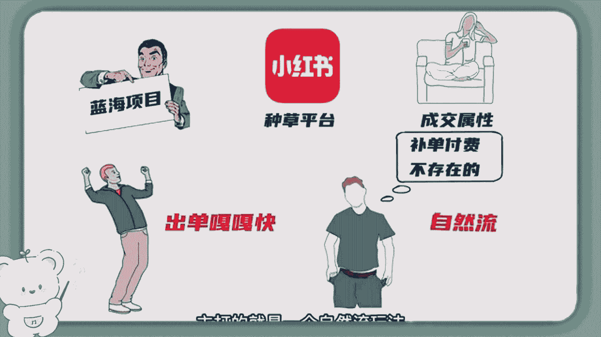

小红书用户中30岁以上，有消费能力的都市白领占比高达80%，市场精准开店成本低，还不用囤货，优势太多了。

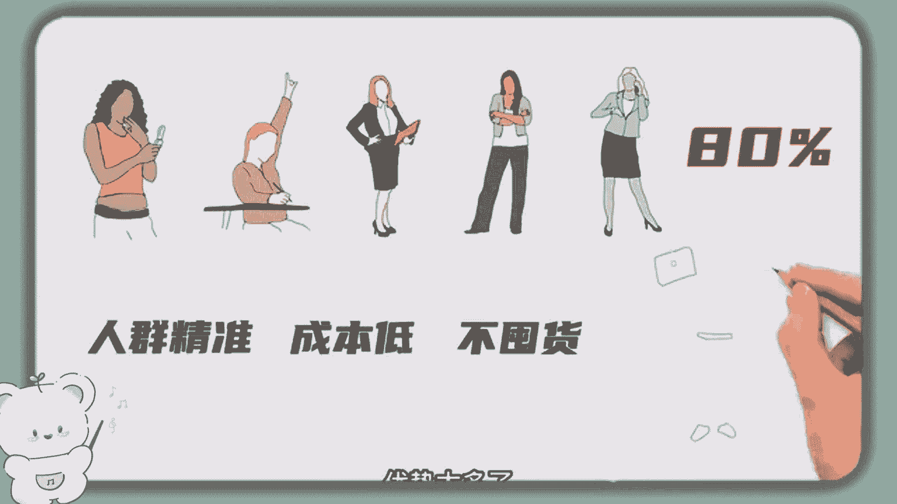

总之这事值得去做，关于小红书开店的流程，无非就是准备好手机，保证一机一号在账号主页的创作者中心，申请店铺，缴纳1000块的保证金，在设置店铺后台，考虑到新手不会操作，我整理了详细的开店流程资料。

我发在粉丝群，大家可以去学习，今天主要给大伙讲讲。

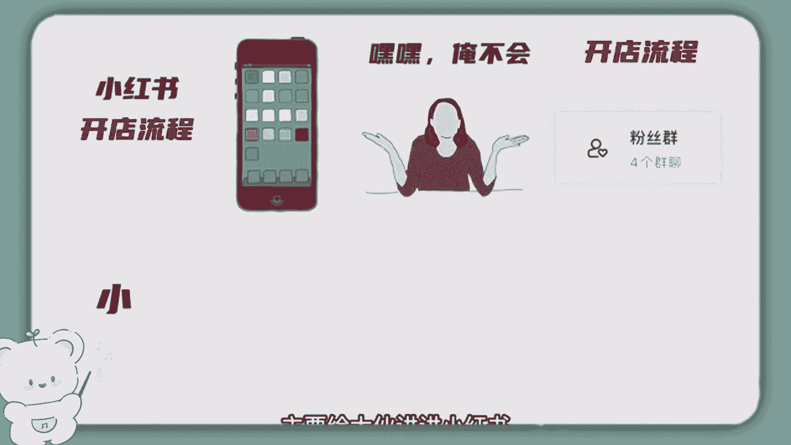

小红书无货源选品的一些思路，选品选不对，努力都白费。

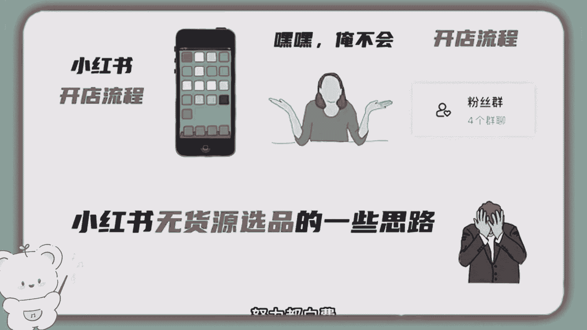

大部分人都觉得选品难，不知道到底要上架什么产品，小红书电商选品总结一句话，就是先分析受众人群，再列举热门赛道，最后在热门赛道里去选定锤类产品，怎么理解呢，往下看，我给大家举例，小红书是不是女性用户多。

那就确定女性群体人群就可以细分为偏胖的。

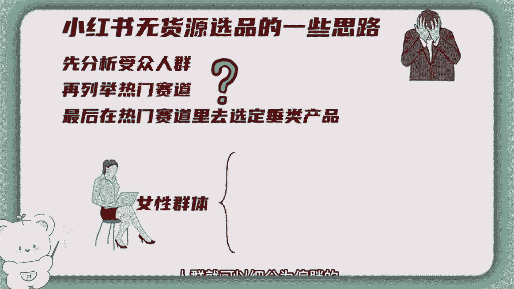

偏瘦的，高个子小个子，这样就更容易找到精准客户。

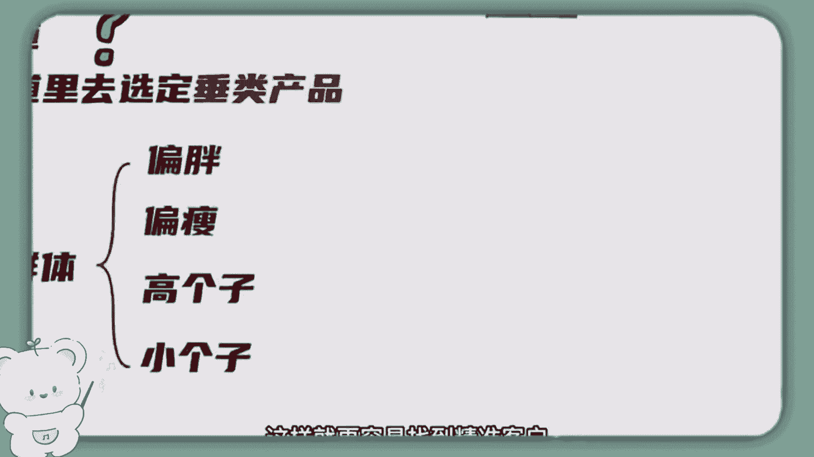

然后再列举热门赛道，热门赛道可分为穿搭类，养生类，家居类，运动类，旅游类，饰品类，这些可都是女孩最喜欢消费的领域。

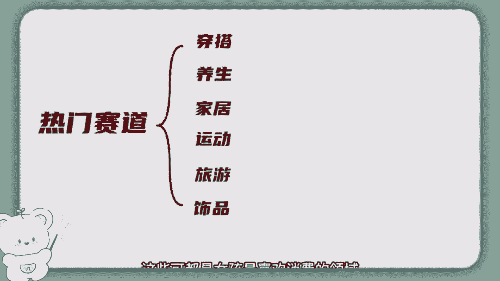

然后继续在这些热门赛道下做细分延伸，拿穿搭举例，那么产品又可以进一步细分为T恤裙子。

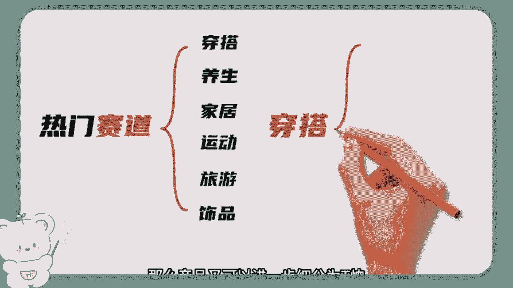

旗袍内衣鞋子裤子袜子等等。

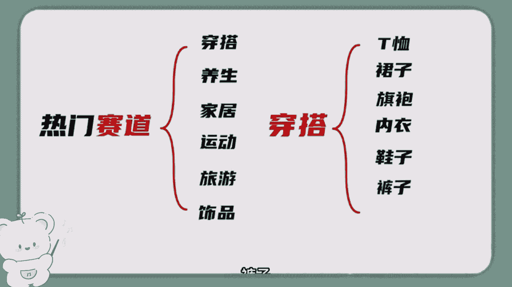

人群细分，加上产品细分就可以确定产品了，比如你可以做高个子女装，T恤或者偏瘦群体的平胸内衣，又或者胖女生的大码裙子等等。

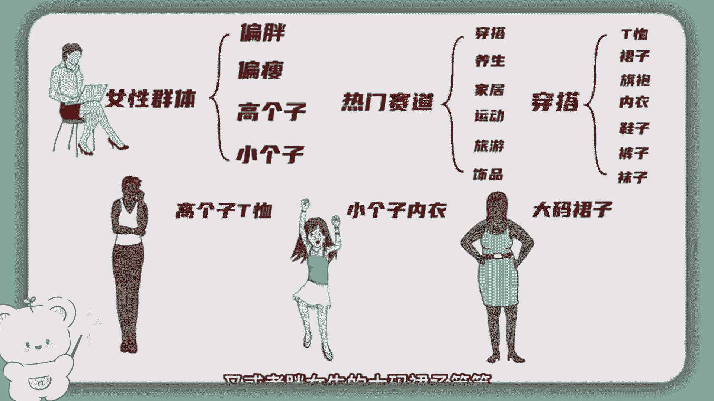

产品定位变精准了，选品也就变得容易了，尽量去做垂直产品，卖鞋就只卖鞋，卖内衣就只卖内衣，这样更容易出单，最后就是去找产品素材，去发笔记，这些类目的素材在抖音上同行，奈尔淘宝上都有大把素材可用。

而且小红书对于原创度并不严格，稍微美化一下，改一下素材的MD5值就可以去发笔记了，我只是拿穿搭这个领域举例子，最终希望大家能具备选品思维，能做到举一反三，夏天到了呀，又是一个赚钱的爆发季。

小红书无货源电商干就完了。

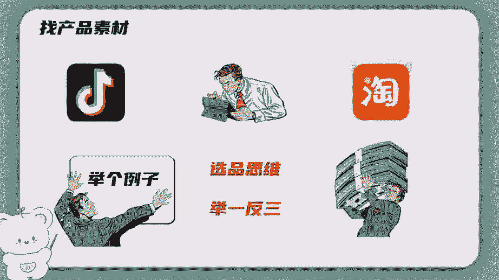

老规矩，我也整理了小红书电商无货源开店的操作文档，还有一些夏天的选品案例。

你可以在我的点个赞吧。