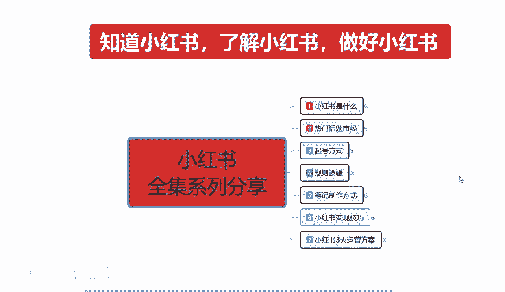
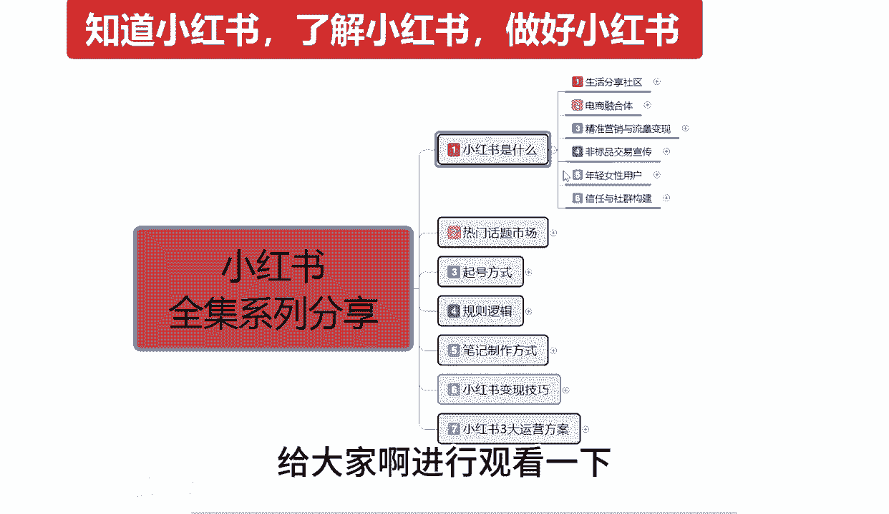
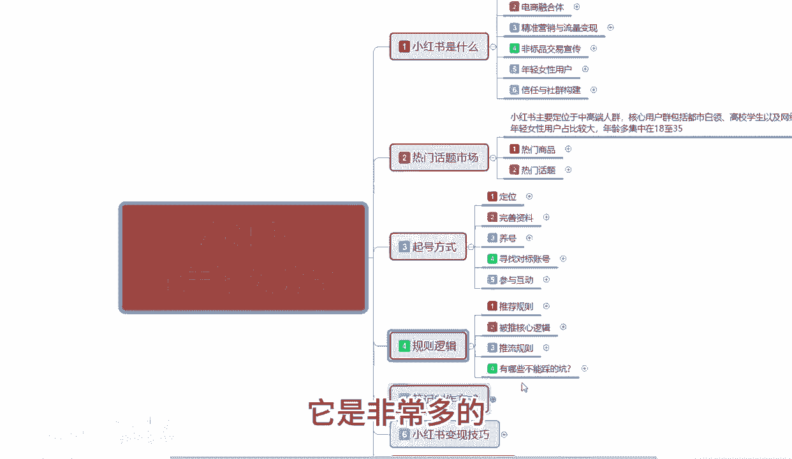
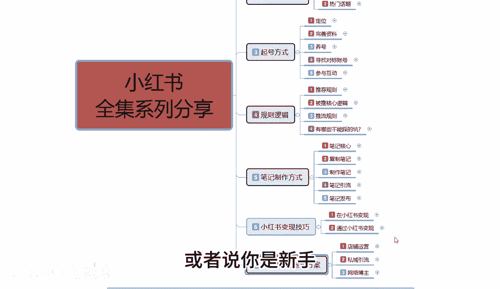
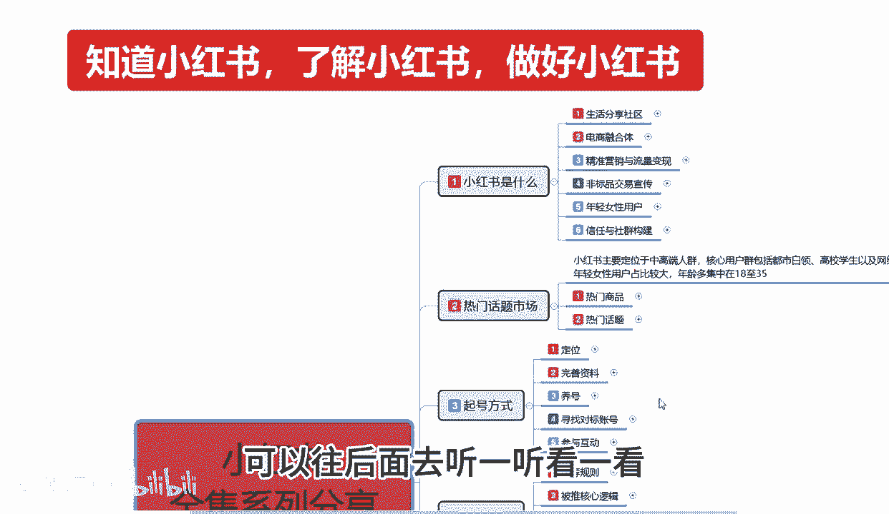
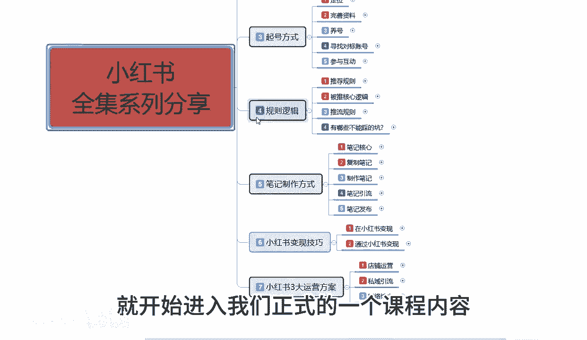
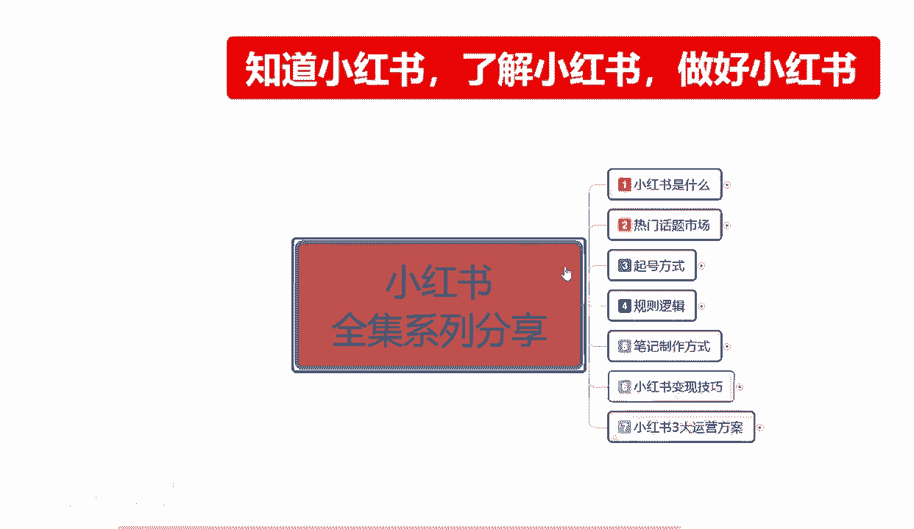

# 【2024版小红书体运营教程】全B站最良心的小红书开店运营高阶教程合集，从0开始做小红书体开店 ,起号真的快!!! - P2：小红书运营 - 念晚星河漫漫 - BV1wT421Y7FM

大家好，从今天开始呢，往后面呢我会给大家整体讲一期，小红书全系列的一个整体分享，这一个记忆列呢我给大家分为了七个大课时啊，从第一个课时到七个第七个课时，它整体讲解的内容呢，就是首先我们了解什么是小红书。

就是知道小红书，第二个呢是了解小红书，到最后一点呢是祝好小红书，因为我们如果说对小红书啊不清楚的话，我们后续的一些额怎么说呢，就是我们小红书你想去做网红啊，做博主啊，做店啊等等，你都做不了。

所以说我们首先要明白啊，第一个节点是什么，知道小红书第二个节点是什么呢，了解小红书，第三个节点才是我们最重要的，做好小红书呃，本系列的一个全集课程呢，我会给大家把它分成几十节课啊。

给大家进行一个整体的一个分享，第一节课呢，首先呢就是了解一下我们什么是小红书是什么，第二个呢是给大家讲解一下啊，小红书它整个市场里面它的一个热门话题，包括它的一个产品话题啊，在里面是什么样的产品。

它才属于热门，第三个呢是小红书起号的一个方式，小红书和其他的一些啊电商平台也好，网络网主播的一个平台也好啊，他整个方式它是不一样的，他的起号方式是非常重要的，因为你前期账号起号不好的话。

你要想在小红书上面打开四层的话，是非常困难的，第四个课时呢准备给大家讲解一下啊，小红书整个规则以及它的一个底层逻辑，什么意思呢，就是说小红书它是按照什么样的一个，规则方式去运行的，他的这个规程。

规则方式的一个运行模式，里面有什么样的一个逻辑啊，我们怎么通过操作我们账号的一个数据，来提升我们的一个整体权重，第五个呢是最重要的一个点，小红书的一个笔记制作方式，为什么说是第五个是最重要的一个点啊。

我们如果说把小红书你起账号，其实的话把方式方法掌握以后的话，其实都差不多，但是你的笔记做的方式，他关心到你后续发送笔记获得的一个展示，曝光和流量，这个点如果说我们把握不好的话，我们在后期整个店铺的话。

你想把它做起来是非常困难的，所以说我们一定要了解好啊，小红书笔记制作方式它分为哪些种类啊，通过什么样的方式去创作一个笔记，才是完美的一个笔记，第六个呢就是小红书变现的一个技巧啊，怎么从小红书上面啊赚钱。

最后一节课给大家讲解的呢，就是小红书三大运营模式的一个整体方案，这个呢就是我准备给大家本期啊进行分享的，一整套系列的课程，这套课程的话包括啊第一节到最后一节的话，预计的话是给大家讲40节到50节课啊。

进行一个整体的一个分享，今天呢只是给大家讲解一下，我们整个系列的一个大纲，从下一节开始呢，我们首先了解一下是什么是小红书啊，就开始我们正式的一个课程内容进行分享。

这里呢我会把那个后续课时的一个内容的话，给大家啊进行观看一下。

我们整个课程的一个实际内容，它是非常多的。

所以说我们在操作店铺数据的时候，或者说你是新手。

你想了解小红书啊，想知道小红书是做什么的，想了解小红书怎么做的和怎么去做好，小红书的朋友可以往后面去听一听。

看一看，那这节分享呢就给大家讲到这，下一节呢就开始进入我们正式的一个课程内容。

