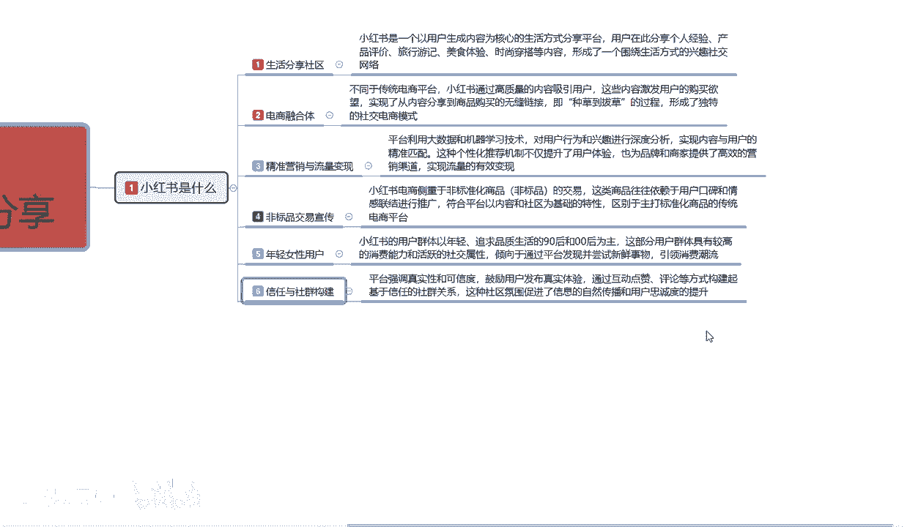

# 【2024版小红书体运营教程】全B站最良心的小红书开店运营高阶教程合集，从0开始做小红书体开店 ,起号真的快!!! - P4：p1.2小红书是什么 - 念晚星河漫漫 - BV1wT421Y7FM

大家好，今天给大家分享的是巧红书，拳击系列的第一大节课的小红书是什么，让我们了解小红书啊，第二课时额，其他的内容的话，因为它整体的话太大了，我暂时把它删除了，我后面给大家进行分享的时候。

是按照第一个课时，到第七个课时给大家进行了一个讲解，目前的话是暂时把它删除了，因为看见他以后的话。

我在这边的话没课件不好展示给大家看。

接啊接着我们上节课给大家讲解的一个内容，上节课的话是给大家讲解了生活社区啊，电商融合体和精准营销。

小红书他整个运营体系它是通过什么方式啊，创建出来的一个小红书，而且他怎么去定位我们用户的一个账号啊，做到他小红书整个运营系统的一个基准营销，这节课呢主要是给大家讲解，非标品交易的一个宣传啊。

和下面的一个内容，首先我们了解一下非标，非标品交易的一个宣传是什么意思呢，就是说小红书的话，它是靠电商侧重非标准化的一个商品，什么叫非标品呢，就是我们个人所制造的产品，这个产品的话是没有通过国家申请。

也可以制作啊，就是我们自己制造的一个产品，没有国家那种，就是我自己没有把它做成品牌效应的一个产品，它叫非标品，你要是把它做成李宁，阿迪安这样的啊大的一个品牌，它就是标品啊，就是有很多的一个广告宣传。

然后的话在非常全国各地的话，他都知道啊，这个产品是做什么的，那个叫标品，我们正常的话在小红书上面的话，其实是非标品，偏多，标品产品，你在小红书上面反而不好做啊，这一类的商品。

往往的话他就是依赖用户的口碑和情感啊，联合进行的一个推广，它通过的方式是什么呢，生活分享社区里面的女性用户，了解各自渠道进行推广的一个产品进行分享，分享了以后，小红书把这些分享的内容结合整理起来了以后。

做成了电商融合体，然后这帮人发现在电小红书上面做电商，其实也可以赚钱，然后就出现了第一个电商的一个运营模式，小红书通过这种方式的话，创创建了一个现在的话啊，就是啊有多久了，快一年了，他单独创建了一个。

我们现在以前小红书搜索的时候，他还没有商品栏目，现在他还创建了一个商品栏目，就是通过这种方式，因为它越来越完善了创建的这个商品栏目，做出来的电商融合体，他通过这种方式啊做出来了以后。

他的主要产品就是什么呢，18~35岁女性用户进行了一个非漂品，化妆品，服装衣服鞋帽，因为他们的一个产品质量的话，是通过用户实践出来以后进行宣传的，所以说他在这个里面的话，他的小红书整体的话。

非消费品交易宣传力度非常的高，而且他对比标品的话，在小红书上面更好做，因为他已经有了固定的用户和口碑，就是已经有很多人去用过这个产品了，所以说非标品在小红书上面是非常好做的，它整体的话就是符合了平台。

以内容社区为基础的一个特性啊，区别于主打标准化的一个商品，的一个传统性销售方式，他整个电商平台的话就是你做淘宝也好，做拼多多也好，你要么就是厂家，要么就是品牌方理财好做才好赚钱，那你不是品牌方。

不是厂家的话，你我们这种非标品的话，我们以前在做的时候，你就只能在当地啊，你一线城市也好，二线城市也好，三线城市也好啊，你包括其他的城市也好，他的销售渠道，你就只能固定在这一个市区范围以内。

你没办法去进行额外的一个宣传，第一个你不知道渠道，第二个你不知道方法，第三个别人不信任你的一个产品，那小红数据通过这种方式的话，他把非标品的一个交易宣传做到位了，因为这种方式的话，它是通过人传人。

通过分享分享生活的一个分享社区，进行人传人的一个方式，进行了一个大众型的一个交易，所以说小红书他整个平台的话，目前做到的是什么非标，非标品的一个交易宣传啊，已经做到非常好了，那我们看第五点啊。

年轻女性用户，那我们在小红书上面做非标品的时候啊。

小红书对用户群体的话，它是以整个年轻化为目标的，18~35岁，追求品质生活的九零后和零零后为主，这部分用户的话具有较高的一个消费能力，和活跃的一个社交属性，因为我喜欢分享我身边的一切事物。

现在很多人玩抖音也好，玩其他的也好，他们分享的话就是我觉得我比较上进，我有可能还可以当网红的一个浅字，他就会去在抖音上面去发布，我的一个日常生活啊，今天去哪里好玩，明天在哪里等等这些，但是小红书的话。

它更倾向于我们女性消费为主的一个群体，而且他这个所有的群体的话，他是大部分集中在一线城市和二线城市，他通过倾向于通过平台，发现并尝试新鲜的一个事物，引领消费的一个潮流，什么意思呢。

18~35岁的女性活跃度高，年轻漂亮有钱，结合这几个点以后，她往下面发展的是什么呢，诗旅游化妆对比，再说的不好听点，吊凯子对吧，因为他们已经无所事事，他们已经达到了，他们他们目前的话就是已经要达到什么。

追求生活的品质，追求生活的质量，追求自己的另一半啊，了解人文事物啊，服装穿搭场合的一些仪表，他通过这种方式来提高自身的一个，内在价值和外在价值，然后通过这种方式去了解外面的世界，这个就是小红书。

年轻女性用户目前普遍存在的一个状态，最后一个点啊，信任与社会的一个结构，为什么说是最后一个点呢。

平台强调的一个真实性和可信度，鼓励用户发布真实的一个体验，通过互动点赞，评论等方式构建起来，基于信任的一个社会群体关系。

它所有的核心都是围绕这个啊，生活和社区进行分享的。

而且他的人群是女性，我们从下往上面看啊，他能不能做到这个点年轻的女性用户啊，非标品的一个交易宣传，为什么，通过年轻女性用户宣传，她自身所使用过的一个非标品的一个交易宣传，做到了精准营销与流量，为什么。

因为这个产品我用过，我宣传给了我的朋友，我朋友也觉得用的好，他通过这种以人传人的方式，然后在小红书上面用笔记的形式，或者说是文案的一个形式展现给更多的人，达到了精准营销与流量变现，精准营营销与流量变现。

它又是通过什么方式做到的呢，小红书它整个运营系统，它通过用户收集的一个账号创建资料，我们所选择的一个兴趣爱好，兴趣偏好对吧，个人的一个年龄属性啊，喜爱的一个形式，通过我们在小红书上面观察笔记的内容。

营销的内容懂不懂，达到了一个精准营销与流量变现，如果说你不去做搜索，你只是观察小红书，就是不用那个放大镜去做搜索关键词，那他推给你的永远都是三个固定的一个属性，你比方说我喜欢吃的。

那他在里面推荐的什么啊，星期一是什么，星期二吃什么蛋糕啊，甜品怎么做啊，什么地方的小吃好吃，都是类似的一个内容，你喜欢穿搭啊，夏天穿什么，冬天穿什么，秋天穿什么对吧，女性穿什么出门得体大方。

女性穿什么时候出门，回头率百分之百等等，一系列的，他通过这种方式做到的，精准语音营销与流量变现，那他通过精准营营销与流量变现，怎么在网上返回做做电商融合体，对不对，他的人群有了目标，有了商品有了。

那我为什么不做一个电商平台，他通过这种方式反复的一个结构认证，做到了电商融合体，吸取了抖音的不足，吸取了他拼多多的不足，吸取了淘宝的不足，他专门做了一个非标品的交易平台出来，这就是小红书。

我们在再看最后一点生活分享社区，小红书上面你不做小红书笔记，你不去做分享，你的账号基本上就是一个陌生人，没人会在乎你，你如果说做了账号，小红书把你判定你是商家也好，网红也好，博主也好，你是开店也好。

或者说就是一个用户也好，他都有一个怎么说呢，范围就是你活动的范围在什么地方，这就是整个小红书它的一个运营体系的一个嗯，怎么说呢，最重要的一个点啊，知道小红书是做什么的。

他通过什么方式来得到他的一个盈利啊，他的人群是什么，我可以在上面做什么。

这个就是啊，我整个系列给大家讲的一个比较重要的核心。

它只能说是比较重要啊，他只说让我们制造第一点。

知道小红书是做什么的，我可以在上面做什么而已啊，他还没有扩展到我们后续的一个内容，包括他的一个整体好吧，那这节课呢就给大家分享到这，主要是给大家讲解了一下啊，小红书是什么。

下节课给大家进行分享的是小红书啊，整个市场的一个热门话题啊，和商品销售的一个热门。

