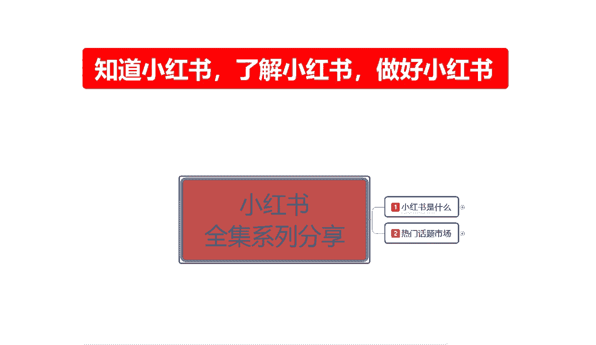
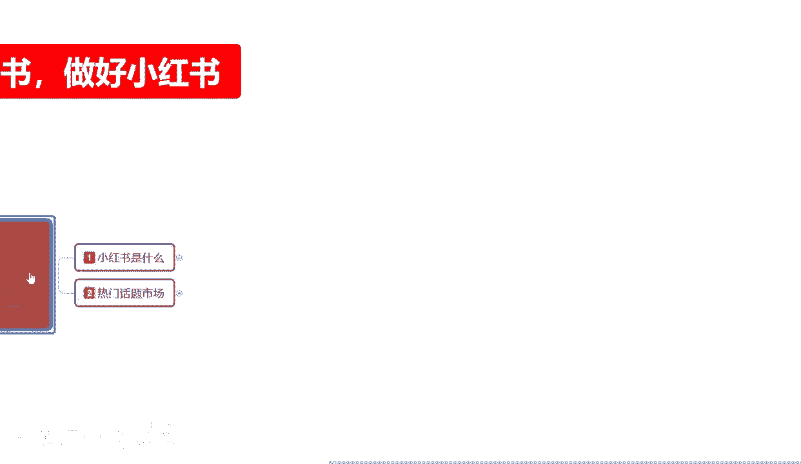
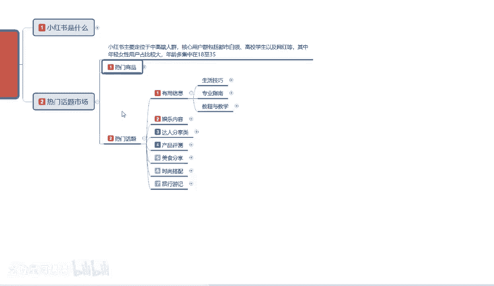
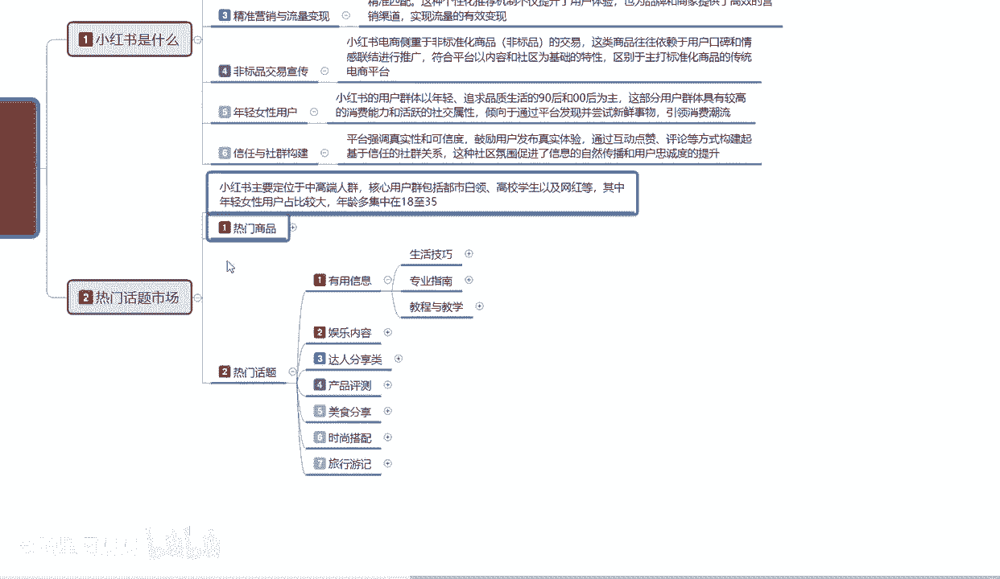
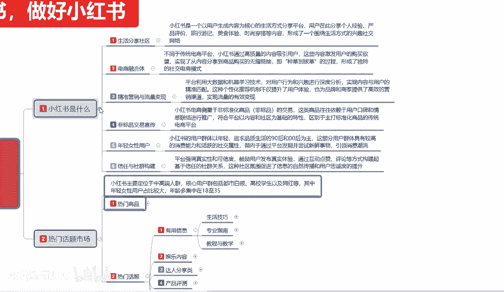
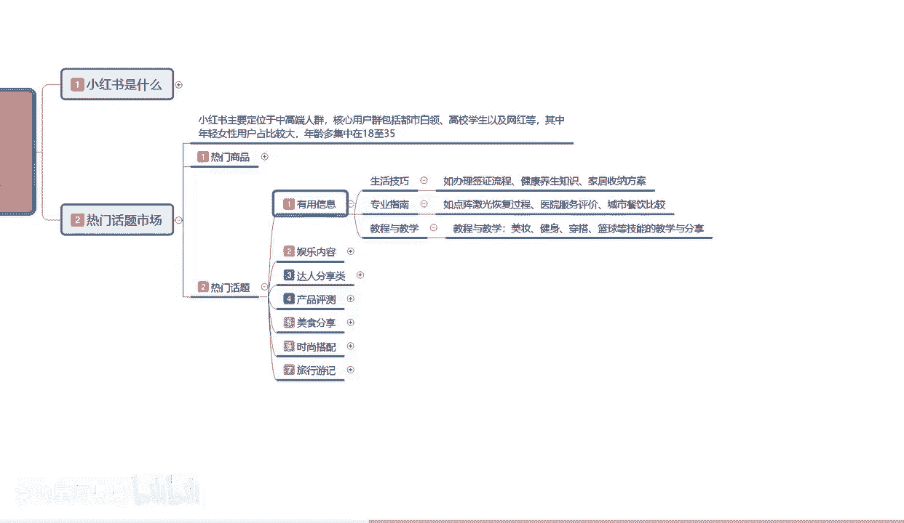

# 【2024版小红书体运营教程】全B站最良心的小红书开店运营高阶教程合集，从0开始做小红书体开店 ,起号真的快!!! - P5：p2.1热门话题 - 念晚星河漫漫 - BV1wT421Y7FM

大家好，今天给大家分享的是小红书全集系列，的第二大课时啊，热门话题与市场，这节课的话主要是给大家讲解一下啊，我们小红书，它整个平台运营系统里面的一个，热门话题和市场都有哪些内容。

废话不多说啊，进入我们这节课的一个真主体内容。

热门话题市场啊，小红书主要定位于中高端的一个人群，核心用户的话呃，他整个用户群体包括都市白领，高校学生以及网红等，其中的话年轻女性用户占比比较大，年龄的话，就是说他整体年龄集中在18~35岁。

那么我们从中的话，就可以把18~35岁里面去选择，我们所需要了解的一个热门话题，和一个热门商品，首先我们了解一下啊，在小红书上面，它热门商品分类都有什么地方，其实这个的话我内容的话是没有给大家做太多。

我只是说选了几个重点啊，给大家进行一下讲解，就是说热门商品在小红书上面，它比较偏向于什么美妆家居，旅行食品饰品，电子配饰和服饰装，为什么是我只给大家列这几个点啊，其他的都属于小众类目了，首先是美容。

18~35岁的一个85%比例，3亿的一个用户，那我们换算一下3亿用户，他85%的一个女性比例是多少，2。6亿，2。55亿，2。55亿的一个用户，18岁到35岁抛出，18岁以下，就是18岁以下。

往下面走的话，他从14岁，13岁基本上开始，小红书也有用户，只是这一部分用户的话太少，我们不计算在范围以内，18岁到35岁的话，他占主体，35岁以后也有一部分，但是也比较偏少啊，整体来说18~35岁。

2。55亿的一个女性用户里面的话，她整体占比可能在80%，15%的，5%的，18岁以下，百分之百分之五的，18岁以下，15%的35以上，那整体80%的一个比例，2。55亿又有多少用户啊，对不对。

你相当于有接近2亿的一个女性用户，2亿女性用户的话，他们选择的一个内容是什么，都是和自身息息相关的美容，这个不用多说了吧，所有女性都喜欢年轻的，中年的，老年的啊，时尚的他都有，你现在说句不好听的。

18岁以下的女孩子现在成熟的比较早，为什么说小红书他有18岁以下的用户，他就是成熟比较早的那一部分，但是这部分的话他没有什么消费能力的，可以不在我们考虑的一个范围以内，但是他可以帮你去做宣传。

他整体的一个人群还是非常不错的啊，那这部分人的话，18~35，他里面美容是不是比较重要的啊，你像往前面走，韩国整容啊，玻尿酸对不对等等，这一系列产品，也包括指甲油，指甲膏啊，眉笔眼线化妆品，洗面水啊。

它都包含在美容的这一个整体范围以内，美容第一选项，第二选项，家居为什么18~35岁，说实话家居这一块的话，18岁到24岁这个范围内，他用户不多，他基本上都是24往35~45之间，这这个方面去靠。

家具里面家用电器啊，按摩等等，它都有一个有效的范围市场，你再比方说厨房用品，厨房用具，桌椅板凳他都算家具，只是说大件和小件，然后你比方说夏天蚊帐对吧，资源版太阳伞，太阳伞不算了。

太阳伞的话它算旅行必备的里面去了，他就是通过这种方式啊，我们选的话热门的一个商品，其实就集中在这几个范围，然后是旅行，18~35刚毕业的啊，有点能力的，然后跟家里面走的女性用户吃喝玩乐，旅游聊八卦啊。

比美比谁有钱，比谁穿的好看，就这些方面，我们从这个方面去找的话，你就能找到小红书，他整个热门市场话题的人群最多的范围，在什么地方，还有什么呀，亲子类的，为什么要有亲子类，宝妈系列的。

宝妈系列里面是做什么食品比较多，服饰比较多，然后是汽车装饰品，小件的，在小小红书上面非常好卖，你大件的一个产品的话，说实话在小红书上面它只是热门搜索，但是你要在小红书上面去卖一大件啊，家居类的去卖大件。

你卖小件可以卖大件，你也卖不出去啊，这里提提提醒一下大家啊，你只能做宣传，做引流，你要是做，因为他是整个行业基本上都是非标品在引导，你要在小红书上面去做这些东西的话，尽量的话就是找小件目标去操作。

如果说你做引流啊，小红书上面我想做引流，那另当别论啊，引流的话，你做什么都可以，只要你能把流量引过去，把自己的产品宣传好，把自己的人设打造好都是可以的，这个就是小红书的一个啊，热门商品多的呢。

我就不给大家一一举例做解释了啊，因为这个讲起来的话，他会流外面料越来越多，第二个就是热门话题，热门话题啊，小红书的一个热门话题，我们来正常来换算的话，那其实是怎么说呢，是非常多的啊，热门话题有什么啊。

第一个有用的信息对我自身有一定的提升啊，人从老从小到老，他都是在不断的一个学习过程，那这一部分女性用户在小红书上面，她也是有一个学习过程的，只是说她学习的方面和重点的话不一样对吧。

你男性用户你喜欢什么学习游戏啊，学习知识啊啊女性用户学习什么美容美妆啊，穿搭等等，他都是学习，只是学习的内容和种类不一样而已，他学习的一个方式的话，是更提升自己的一个魅力。

吸引更多的一个异性用户来观察自己啊，然后你自己再从中去挑选好的一个啊是吧，他通过这种方式啊，就这个呢就是一个有用的信息，那有用信息里面的话，我们其实在可以把它分类这个里面啊，热门话题里面。

我在这里呢给大家强调一点，其实我们可以把它分为三个类类型的啊，你在小红书上面，你想做商品的话，你去了解一下热门商品比较好，你了解商品以后的话，你再去做整个小红书它的一个运营体系的话，其实是非常完美的。

第二个是热门话题，热门话题的话，你其实它包括了整个小红书，因为你只有把话题做好了，你的小红书后续才有后续，你话题做不好，你后续都没有的，你想光做热门商品，就是光做热门商品，然后的话不管话题。

那你这个小红书店你是做不起来的，你要先融入进来啊。

融入什么呢，融入生活分享社区这个前提，你才能去讨论热门话题，通过热门话题，然后再做热门商品。

就是我之前给大家讲课的时候，也给大家说过啊，从正从1~6，它是一个顺序，从6~1它又是一个顺序，从1~6是小红红书整个运营系统的一个顺序，从6~1是我们用户的一个顺序啊，你要弄清楚这个点。

你小红书就做得好了。

所以说在小红书上面我们去分享的话，首先分享的第一个点是什么，有用的信息，就是我想把小红书做起来，我分享的第一个点就是有用的信息，有用的信息我们怎么分划分呢，啊生活技巧专业指南教程与教学。

生活技巧方面包括什么办理签证流程，健康养生知识，家居收纳方案等等，他都算啊，美妆博主也是生活技巧的一个分享，怎么化妆怎么打扮的漂亮，对不对，穿搭也算啊，食品也算是今天做什么菜，这个菜怎么做。

它都算生活的一个技巧，专业指南是什么呢，如啊点阵激光恢复的一个过程，这个就是属于科技方面的，什么意思呢，小红书上面，它这里面的话不光包括了生活的一个技巧，它还包括了你学习的一个技巧。

医院的一个服务评价什么地，什么地方的一个医院啊，治疗什么什么病好对吧，什么地方的一个医院手术手术做得好，什么地方的医院，我在那不行，看病看不好啊，花钱花一大把啊，社保报不报不多等等，他都有。

然后城市的一个拆饮对比，这个城市吃什么菜，来什么城市吃什么东西啊，我这个湖北吃什么，北京吃什么，上海吃什么，四川吃什么，成都吃什么，然后广州吃什么，广东吃什么，它都是一种就是专业的一个指南。

你在小红书上面也可以考虑这个话题，就是说你在小红书上面，你不光可以做店做引流，做博主，这个是小红书三大的一个主体啊，你通过主体来后来定位自己，那我们就了解小红书我们自己到底在做什么。

第三个内容就是这教程与教学，什么叫教程，教程与教学的话，其实在这个里面很简单，美妆健身穿搭篮球等技能的一个技术指导，你包括我现在给大家进行分享，也可以在小红书上面去做，也属于教学的一种模式。

这个呢就是热门话题里面的一个有用信息，整个小红书系列里面的一个人人体热门话题啊，呃时间关系的原因，今天这一节呢就给大家分享到这，下一节的话。

