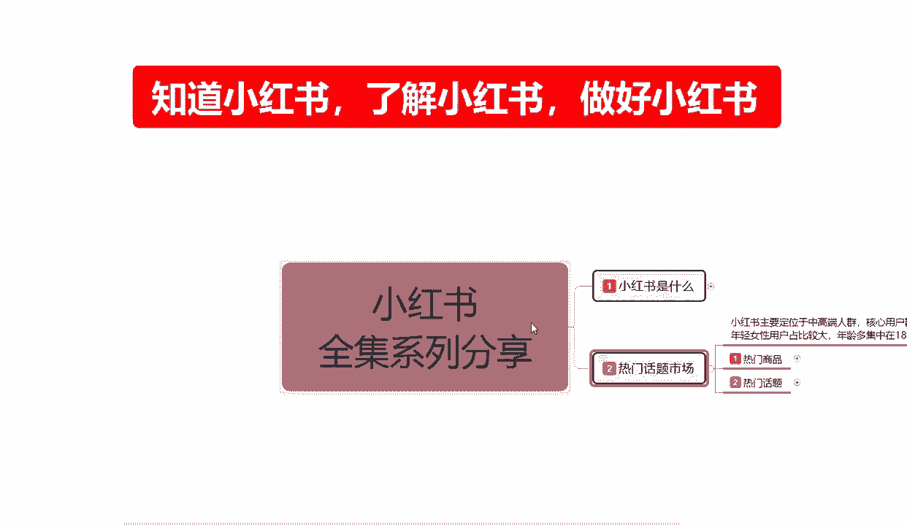
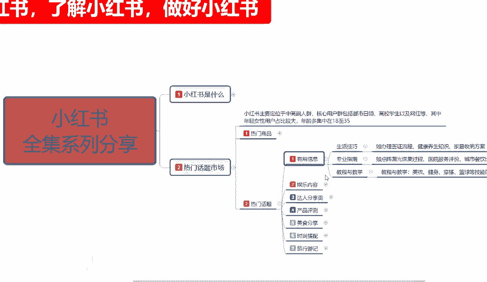
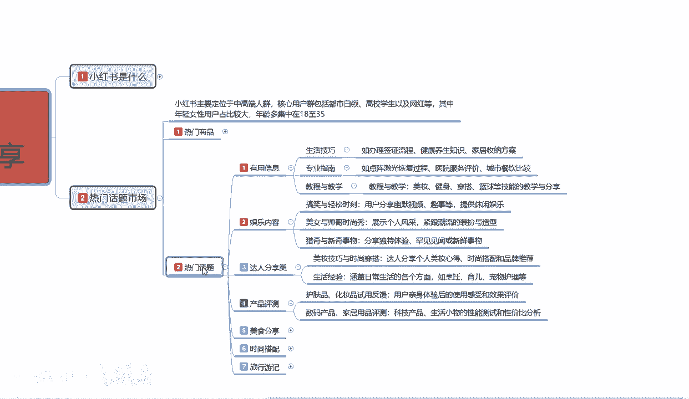
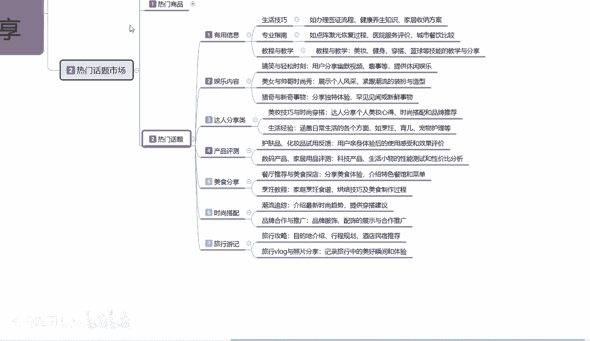
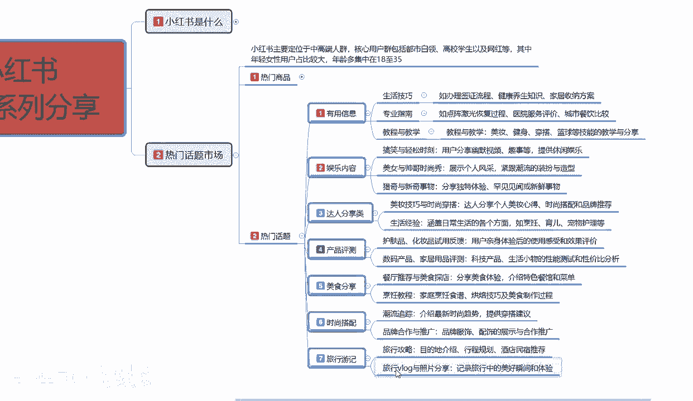
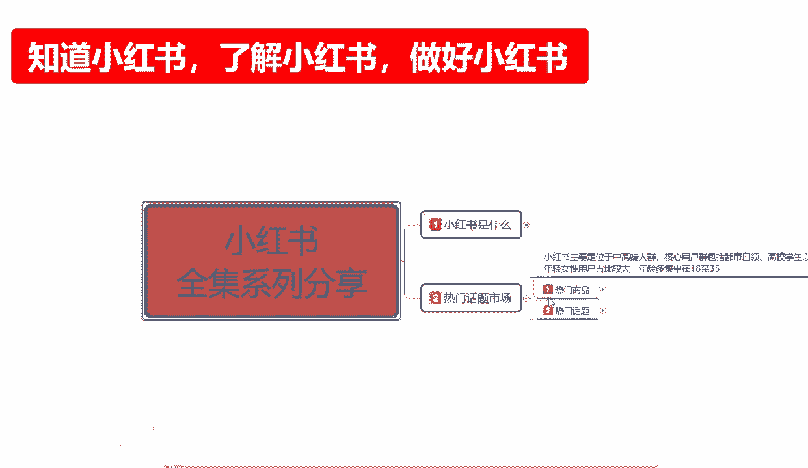
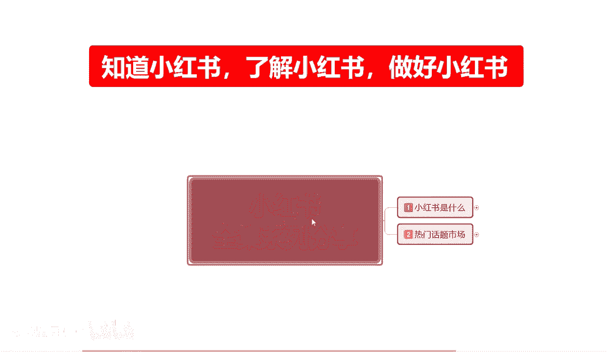

# 【2024版小红书体运营教程】全B站最良心的小红书开店运营高阶教程合集，从0开始做小红书体开店 ,起号真的快!!! - P6：p2.2热门话题 - 念晚星河漫漫 - BV1wT421Y7FM

大家好，今天给大家分享的是小红书全集系列，第二大课时热门话题的一个内容啊，啊也是热门话题的第二节小节课时，上节课的话是给大家讲解了一下啊，小红书它整个里面的一个热门商品。

在小红书上面比较好做的一些商品类型，这节课的话啊，结合上节我们没有讲完的内容，我接着往下面讲，上节课的话一直讲到了热门话题里面。

有用的一个信息的一个教程，再往后续的话就是说第二个大点啊，就是说我们刨除小红书，我在里面的话，我可能有用的信息，我自己做不了，你比方说生活技巧专业指南教程，我在小红书里面我没有办法进行分进行分享。

为什么我自己不懂，不会对吧，那我们选择第二个内容，娱乐内容，什么叫娱乐内容呢，搞笑与轻松时刻的一个分享，用户分享幽默视频趣事等等，提供休闲娱乐，你比方说你在抖音上面进行了一些视频，视频的一个描述。

你不会拍，你会做图文吧，对不对，你自己小时候看猫和老鼠啊，看奥特曼看等等一系列的动画片，你把里面的经典剪出来，做娱乐内容的分享也可以，对不对，这是一个方向，再往下面你做感情类的一个分享也可以啊。

美女与帅哥的一个时尚秀，展示个人风生产，紧跟时尚潮流的一个身装扮与类型也行，再往后你这个也做不了，那猎奇与新鲜事物的一个分享行不行，分享独特的一个体验，罕见见闻或者新鲜事物，你比方说我家里面比较远啊。

这里面长了个草，我不认识，大家帮我分析一下啊，这个动物变异了，帮我们分析一下啊，这是哪个地方有什么什么啊，出现了什么奇闻趋势，我们来聊一下，你都可以把它做成话题，这个就是娱乐性的一个内容，你在里面的话。

说实话做娱乐主播也好，你做有用的信息的一个，就是生活技巧的一个分享主播也行，小红书的一个整体思想的话怎么说呢，没有你做不到的，只有你不想做的，为什么要说你没有你做不到的，因为你在小红书上面。

总能找到自己适合的一个定位，它的包容性太强了，懂我意思吧，他整个包容性太强大了啊，他把所有的内容全部分成板块以后的话，推给对应的一个人群，所以说我们在做小红书的时候，包容性强，它的吸收能力就强。

那不管你是有优点也好，缺点也好，对不对，你就算是没有优点，没有缺点，你长得好不好看，你长得不好看也没关系，你懂不懂得怎么穿搭，对不对，除非你说是你不懂吃，不懂喝，不懂玩，不懂娱乐啊，你还没有没有技术。

没有学习，你没钱没势，没什么都没有，那你就是个废物，你了解小红书也没有用了，对不对，所以说小红书它整体的话只要你有一项特长，你在小红书上面你都能做起来，你一项特长都没有，说实话，你在小红书也能做。

你去模仿，会不会你去学习，会不会你去照搬，会不会他都可以在小红书上面达到，这就是整个小红书的一个包容性啊，有点偏题了啊，我们接着往下面讲，就说整个小红书它的一个内容的话，在这个里面啊。

其实我给大家分这么多点。

主要是给大家想让让大家了解一下啊，小红书一个全新的运营平台展现在你面前，你如果说把握不住机会，你再去做，这再往后面推，那么你就会和淘宝也好，拼多多也好，抖音也好，错过了时代的脚步，专属小红书。

往后续发展，它不可能成为主流，但是你能在副流里面找到一份属于自己的天地，也是很不容易的啊，这也是题外话，好吧，我们接着往下面小红书的整个热门话题的话，其实你把它分为这七个点就可以了啊。

有用的信息娱乐内容达人分享内测产品测评类，美食分享，时尚搭配旅行邮寄，这七个点基本上包括了你生活的方方面面，为什么生活技巧专业指南教程与教学，青春与搞笑，美女与帅哥，新猎趣与新鲜事物。

美妆的一个技巧与时尚的一个穿搭，护肤品，化妆品试用的一个整体反馈，就是你觉得这个产品看着不错啊，别人弄的效果也好，我觉得我自己不适合你，在想你自己做博主，你把这个产品买回来做宣传也是一样的，对不对。

数码产品，家居用品的一个测评对吧，餐厅推荐营美食探店，什么地方的美食好吃啊，不会玩啊，没有智力，没有学历，你还不会吃吗，吃了你还不会品吗，对不对，烹饪的教程，潮流追踪，品牌合作与推广，旅行攻略对吧。

旅行的途中的一种分享，它都属于就说小红书，他整个热门四法只有你想不到啊，没有你找不到的奇奇怪怪的事情，你在小红书上面都能找，为什么，因为小红书目前的话他有很多人入住了，以后的话，他2。

82点几亿的一个女性用户在这个里面，那他就有市场，有市场就有男性用户进入以前，他的女性用户占比95%以上，到现在只有85%，后续进来的基本上都是男性，男性看中看中这个市场以后。

你比方说我们我们看中这个市场了以后，他的一个整体前景非常不错，比较适合推广我的产品，推广的技术，或者说是推广我这个人，你都可以在这个里面找到啊，在小红书里面你只要去搜去找啊，你随便打几个字。

他都有对应匹配的一个内容展示给你，只是是不是你想要的，那就有待参考了啊，因为我也不知道你们自己会去说什么，奇葩内容对吧，你反正我是不会这样做的，我的目的是啊非常明确的啊。

这个呢就是整个小红书的一个热门话题，和一个热门市场，热门市场是什么，就是热门的一个商品，热门话题是什么，我们自己适合在小红书上做什么的一个内容，这个就是小红书第二大课时热门话题啊，整个的一个内容分享。

下一节课呢主要是给大家讲解一下，我们的一个小红书，它整体的一个起账号的一个方式啊，因为起账号的话。

你账号前期你没有做好的话，你后续小红书可以做，但是你想把它再做精就有点困难了，你如果说你平常玩儿啊，你去小红书上面聊个天儿对吧，看看别人的一个生活习惯啊，或者是说等当完全一个用户。

你不去管这个账号没关系，如果说你真想在小红书上面赚点钱，赚点外快，想把自己宣传出去，做点网红，做点博主，做点引流，一定要听一下这节课啊，小红书怎么起号，因为他的一个起号你没做好，你后续都做不了。

