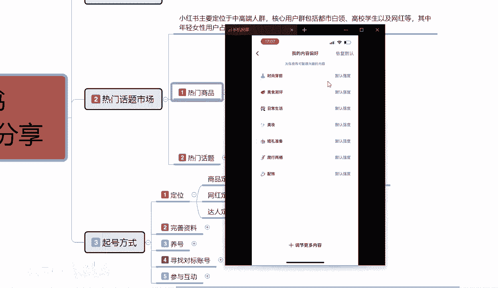

# 【2024版小红书体运营教程】全B站最良心的小红书开店运营高阶教程合集，从0开始做小红书体开店 ,起号真的快!!! - P7：p3.1起号方式 - 念晚星河漫漫 - BV1wT421Y7FM

大家好，今天给大家分享的是，小红书全集系列的起号方式啊，第三大课时，这一个课时呢主要是给大家讲解一下啊，小红书账号起号，如果说我们是想在小红书上面，你做运营也好，做引流也好，做店铺也好啊。

他的起号方式是非常重要的，它和我们正常的一个就是我们普通人进去观看，小红书起号他是不一样的，普通人起号的话，他是根据自己的一个兴趣爱好去进行选择的，他这种取号的话，额账号创建以后的话。

基本上就已经定型了，就说小红书他不会推荐给你，其他的一个类型的内容给你，他只会根据你账号创建的时候，所选的内容给你进行推荐，除非说是我们在创号创建以后，在后期进行额外的一个搜索。

他才会把额外的一些小红书笔记啊，内容啊，商品啊，或者是了解见解推荐给你，所以说我们商户啊，你可以称之为商户，也可以称之为网红，也可以称之为博主对吧，在起号的时候和正常起号，它有很大的一个区别啊。

额这几节课呢我就会把整个起号方式啊，分解给大家进行一个整体的讲解，那首先我们来了解一下啊，小红书它整体起号的一个方式，都包括哪些内容啊，额整体来算的话，小红书起号的话，他嘶分的话啊，其实都是一个点。

只说这一个点的话，我们要把它细分掉啊，首先第一个点是定位，第二个点是整个账号的资料完善，第三个就是养号，第四个的话就是说寻找对标的一个账号，第五个的话就是参与互动啊，它是一个整体的啊，不要把它分开来。

单独去判断了，这五个部位步骤我们都要做完，首先我们来了解一下定位啊，什么是定位，定位了，定位的话就是说我们在起号的同时，你要确认我自己在小红书上面我到底要做什么，第一个是商品定位，第二个是网红定位。

第三个是达人定位，首先了解一下下商品定位啊，商品定位的话就是商品选择的一个市场范围，人群年龄和消费能力，这个是就比较好了解了啊，商品定位你有商品也可以，没有商品也可以，没有商品的话。

当然你得自己去找产品，你在找完产品以后的话，你要去调研小红书这个市场适不适合额，热门话题的话，我其实之前给大家说过了啊，整个热门话题的话在这个里面去找，你在小红书上面好做一点。

你如果说超过这个范围也可以做，只是说他的啊需求量，对自身的要求就稍微会高一点，因为在整个小红书里面的话，这些内容它的一个整体的一个行业效果比较好，你做其他的一些行业的话，它的整体效果就会差很多啊。

就看我们自己怎么去选，所以说我们在这个里面的话，首先要选择商品定位，商品定位选择的话，就能确定我们后续这个账号你起号以后呃，所需要面临的一些选项，这个选项的话包括什么呢，它整个运营系统的话。

就是包括我们账号前期创建之初，所选择的一个兴趣爱好范围啊，这里的话我拿我的手机的一个，因为是创建了一个新号，主要是为大家进行讲课进行编辑的一个内容啊。

里面的话是没什么数据的，只主要的话是给大家进行一个展示。

这里面的话我们进入小红书以后啊，小红书在创建之初啊，这里呢我就不重复再重新创建一个账号了，因为重新创建账号的话额比较麻烦，和我们这节课的内容的话，其实啊不是很搭，我们在创建之初的话。

就是说我们在小红书里面它有一个内容选项啊，内容的一个偏好调节，这个内容偏好调节是我们账号创建完成以后，后续可以调整，但是它的一个整体规划的话啊，像大家看嗯，我这个手机给大家显示的这个内容啊。

时尚穿搭美食测评，日常生活美妆婚礼准备爬行，两栖和配饰，它是默认的强度，就是系统认为我可能会喜欢这一部分的内容。

这个就是账号的一个定位，那我们做商品的话，我们选择选择内容的话，基本上都是时尚穿搭美食。

日常生活美妆靠这几个方面去寻找，对不对。

我们如果说这个东西如果是调整不好，那我能搜到其他的一些东西吗，我能搜到家具，搜到旅行吗，我们在小红书里面我们是收不到的啊，就是我们整个小红书的话，你去弄，我在这个里面只能看到，我们刚刚所说到的一个内容。

他不会去给你推荐其他的一个东西，所以说前期的一个定位一定要做好，你定位做不好，你后续的一些操作的话，基本上都做不了啊，大家懂这个意思吧。

然后是网红定位啊，达人定位他基本上都是一样的，网红定位的话，你无非就是网红在这个小红书里面，你定位的一个整体的话就是搞笑，科学，文化情怀等等啊，达人定位的话就是食品穿搭变装等等，什么意思呢，网红定位。

你走的是把自己的账号等级权限提升起来啊。

有自己的一个，关注粉丝收藏与互转啊，这个属性你最少怎么说呢，破几千破几万，你就可以去约广告，接广告，通过广告的一种形式和方式的话，达到比一个变现，这个就是网红定位，但是你网红定位的话。

你也要去选择你自己的一个产品定位啊，他都是通用的，因为做网红的话，你在这个小红书上面，你做网红，你不做店，你不做电的话，你就会少30%，到50%的一个权重量啊，当然这个权重量的话。

后期还要去根据你去操作去更新，当然你如果说主要是想去做网红的话，这个店开和不开啊，就30%左右的一个流量上限的一个区别，你比方说你网红把一个笔记做爆了，本来就有1万的流量，你如果说没有这个店铺的话。

那么你可能只有7000左右的一个流量，如果说你有店铺的话，可能就会达到1万，就是他给你的一个曝光展示会高一点啊。

这是小红书整个系统，那我们在做小红书的时候，商品定位也好，网红定位也好，达人定位也好，这三个定位方面里面自己去选择自己的位置啊，确认位置以后，你才好去做后面的一个资料，完善养号和寻找对标账号。

就是你在前期起号的时候就一定要把定位做准，你要做商品就是商品的定位，做网红就是网红的定位，做达人就是达人的定位，为什么他们三个内容后续的话差别很大的，知道吧，你定位做错了，你后续你想你本来是做达人的。

你想去做商品，你做不了的，知道吧，因为你的定位的话，他推荐给你的人群和社会关系的话，他就不在商品定位里面啊，这个环节大家一定要弄清楚了啊，不过你这个说实话人定位的话，你前期起号的时候我们做可以。

中期可以进行修改，就是你比方说我前期定位是准备做达人的，但是达人的话效果不是太好，我想在上面有人给我推荐了一些商品，让我通过这种方式的话，在小红书上面卖商品，可不可以，可以在我刚刚设置的那个地方。

你们去把它调整一下人群定位，然后再重新去把这个起号方式的一个定位，再完善一下，但是时间的话可能会稍微长一点，大概的话需要七天到15天，你的账号定位就转换过来了啊，大家一定要记住这个点啊。

这个呢就是小红书起号方式的第一步，定位商品定位，网红定位，达人定位定位完成以后，进入第二步，资料完善完善个人的资料，包括主主页，包括背景简介，简介中简明扼要的介绍自己和内容的方向。

可以适当的体现个人的一个啊个人特色，或者说是人设，为什么说是呃这样呢，这里啊，我随便在那个小红书上面给大家进行一下搜索，你们看一下别人的个人主页是怎么完善的啊。

我这里也不做搜索，我们就随便找一个啊，找一个小眼睛，差不多的就是这个收藏点赞差不多的，就这个吧，食品类的对吧，我们食品内进来以后的话，他的关注是200分41万9，或者你收藏的话可以达到96万。

就是说他整个系统的一个产品，他有爆款秘籍在里面，所以说他整个的话呃了解还是非常的不错的，那我们来看一下它这个账号整体情况。

为什么说账号整体情况，首先完善个人的主页，主页头像，我们从头像开始啊，魔力阿狗符合它的名称，不动画片的一个形式，展示他的一个名称和自己的一个喜爱啊，喜欢动物小宠物狗类的魔力阿狗，听话的那种小红书账号。

他这个的话说实话他没有完全显示，这个账号的话，是他自己创建的时候，系统给他匹配的，他进行了一个修改，不然的话他是嗯小红书账号，他是一堆那种阿拉伯数字，带其他的啊，进行了一个账号设置。

他这个账号是进行修改过的，然后IP所属地四川，就是他是在四川这个地方发布的，在他的这些笔记内容，那我们再往下面你的一个位小红书成都网友啊，邮箱这个信件就是他的邮箱549507等等，往后面排序的。

这个就是他自己做引流的方式，你对我这发布的内容感兴趣的，你可以通过这种方式来联系我，这个就是要完善我们自己，小红书账号的一个信息啊，告诉你了，我喜爱什么对吧，我在小红书上面叫什么，我是做什么的，对不对。

我在什么地方给了用户一种信任感，这个就是我们基础资料的一个完善主页，包括背景图片简介，简介中简明扼要的介绍自己和内容的一个方向，它这个里面的话就是没有介绍自己的一个方向。

因为它下面的话笔记里面已经介绍了，对不对，体现当地的一个个人特色和人设。

他做到没有，他这整个账号的话啊，我这是只是随便进来，我也没关注他，我也没什么，我都是通过这种方式啊，进来搜索这一个账号的一个信息而已，这个就是小红书。

我们前面要做的整体内容资料完善，你只有定位完成以后，完善资料，资料完善以后的话，设置里面的一个主页，包括背景简介等等这些东西设置完了以后，我们才能进入下一步，第三步养号，这个就是前期起号方式的两步啊。

因为时间关系的一个原因呢啊，后续的内容我会在下一节给大家分开进行讲解，因为我这个给大家讲解的时候，视频时间不能太长，太长了，我这边发布不了啊，也是比较遗憾的，不然的话很多内容的话。

其实我是可以一节给大家进行讲解，分解完的好吧，那这一节呢给大家分享分享到这，下一节我接着养号开始。

