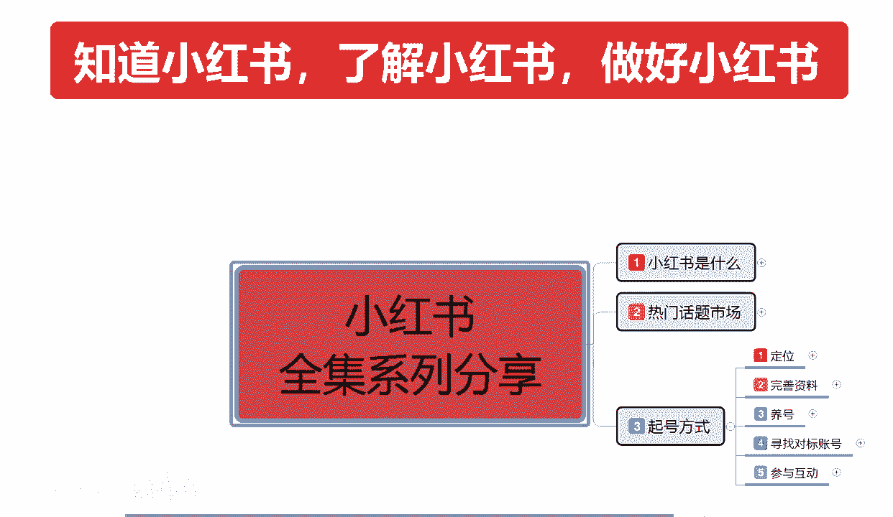
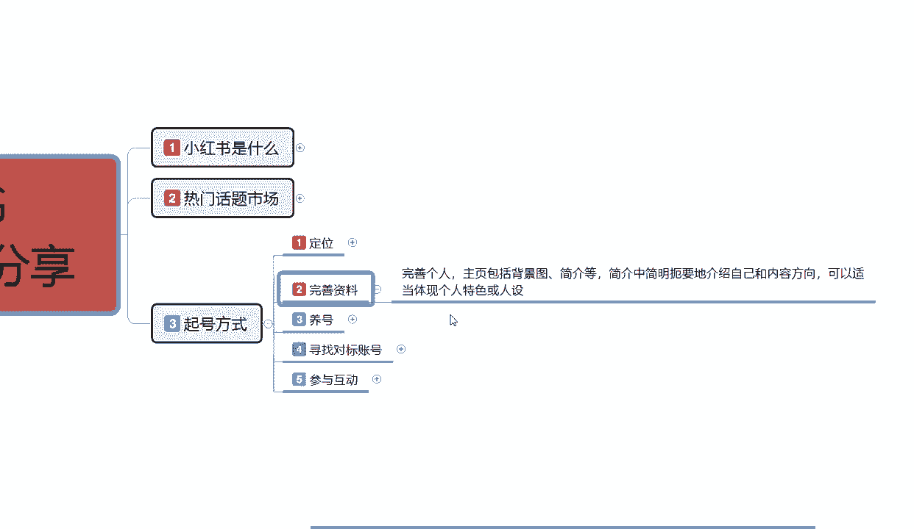
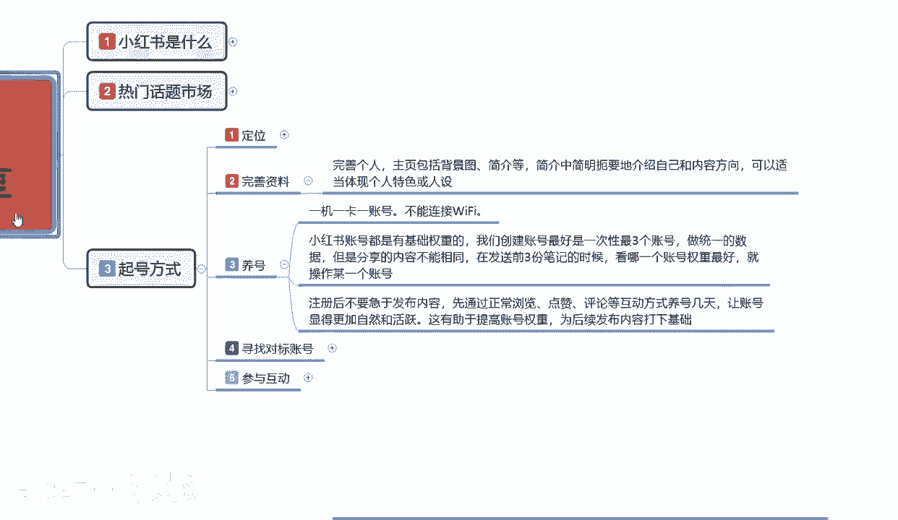
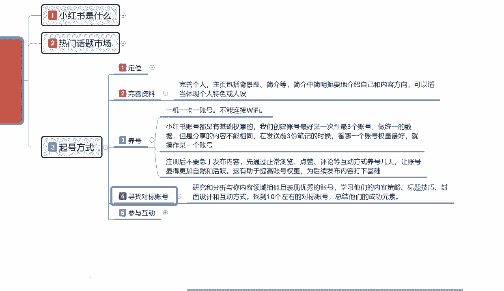
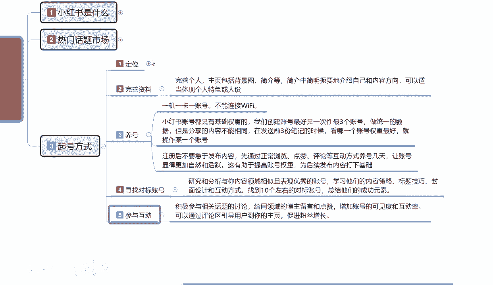
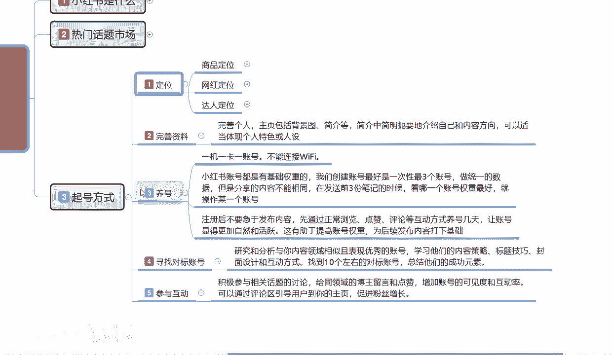
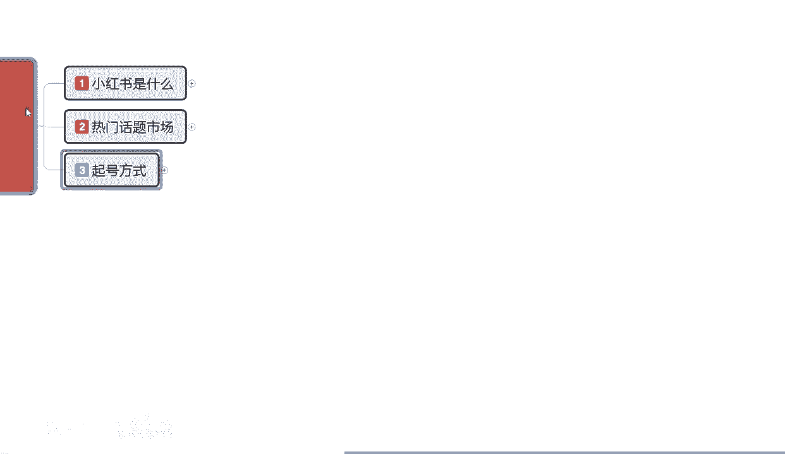
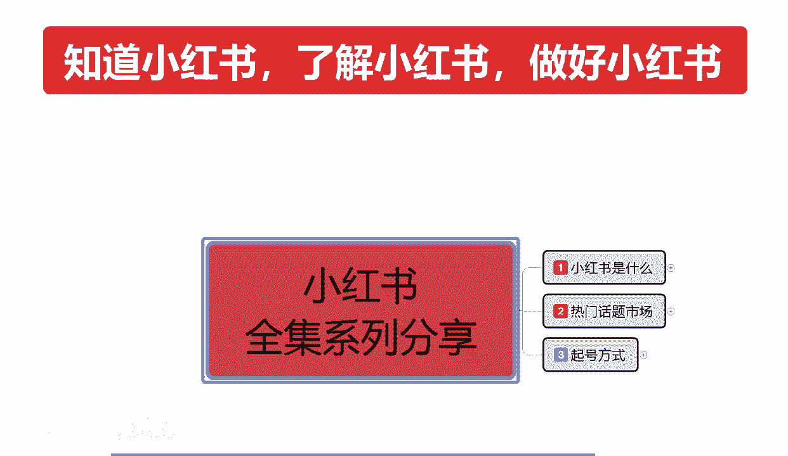

# 【2024版小红书体运营教程】全B站最良心的小红书开店运营高阶教程合集，从0开始做小红书体开店 ,起号真的快!!! - P8：p3.2起号方式 - 念晚星河漫漫 - BV1wT421Y7FM

大家好，这一节给大家分享的是小红书全集系列，的第三大考试旗号啊，呃接着上一节课的内容，我们接着往下面讲，主要是从养号开始了啊。

定位和资料完善呢，之前也已经给大家进行了一个讲解，整个内容的话就是说把定位做好以后的话，就是完善资料，资料完成以后的话，对我们自己是一种宣传啊，让用户的更好的了解我们。

同时呢也是加强他对我们的一个信任和认可。

第三步养号，小红书起号养号。

说实话要看我们自身的一个资本在什么地方，你资本很哎充足一点，那么你养号的话就可以抛洒一点对吧，因为小红书的话他有一个创建账号，他也有是有概率问题啊，如果说资本紧张一点，那你就是一机一卡一账号啊。

你就直接这么去操作就行，那养号里面我们所需要注意的是什么，第一个点就是一机一卡一账号不能连接WIFI，你就算是创建三个账号也好，创建五个账号也好，创建十个账号也好，用小红书的话嗯。

你们如果说了解小红书的话，其实很多人都他他在小红书里面，都是做矩阵的啊，我在这里呢我就先不教大家做矩阵了，因为举证的话你需要有一定的资本投入，你才能去做举证，你如果说没有一定的资本投入。

你去做举证的话啊，不是太怎么说呢，投入和前期前期的一个投入和收入不成正比，你后期做起来了还好，你做不起来的话，那你的这个投入的话就是白白付出好吧，不是说在这里面的话，我们需要注意一下养号的几个点啊。

首先第一个点是一机一卡，一账号不能连接WIFI啊，一定要记住这个点，就是我们一个手机里面只能有一个账号，小红书账号，当然你不开店，不做网红，不做分享类的话，那就无所谓，如果说你要开店做网红，做博主的话。

就是一机一卡账号，你这个账号，你你这个手机的话，就不能再登录其他的一个账号了，你来登录的话，他的那个属性会重复的好吧，小红书会判断你那个违规的，会降低整体店铺权重的啊，当然也有运气成分在里面。

但基本上都被查的出来，然后第二个点就是小红书，账号都是有基础权重的，我们创建账号的话，最好的话就是说一次性创建三个账号，做统一的数据，但是分享的内容不相同，在发送前三份笔记的时候，看哪个账号权重好。

就操作母哪个账号就行了啊，另外两个就淘汰了，当然了，这是有资本的朋友去玩的，没有资本的话，说实话你做一篇笔记，你笔记发出去以后，第一篇笔记如果说小眼睛在50到200，或者说是更高的话。

那照这个账号就没问题，如果说你的笔记第一篇发出去以后的话，嗯小眼睛在50第一篇笔记啊，50以下，那你就把这个账号注销，重新创建一下，重新去做一下规划，再去做就可以了啊，这是养号，第三点。

注册后不要急于发布内容，先通过正常的一个浏览，点赞评论等互动几天方式养号，让账号显得更加自然和活跃，这有助于帮助我们提升整个账号的一个权重，为后续发布内容打下基础，当然了。

我这一套的话就说对于你小红书不了解，不熟悉的人去用一下就可以了，你了解小红书的，你都明白这些规则，我也就不跟大家多多说好吧，养号其实还是比较简单的，但是他整个起号方式里面的话，其实还有很多重点。

我们有个没有详细的话，在这个地方给大家进行讲解，因为这个的话只是给大家做了一个起号方式，你如果说想要详细的了解整个养号方式的话，后续我会再单独给大家出一个啊视频啊，教大家我们要怎么去做好吧。

这边的这位一类资料，我这边都是有的，那小红书起号方式，第四个点啊，寻找对标账号，什么叫寻标对，什么叫寻找对标的一个账号呢，就是研究和分析与你内容相邻的一个领域，且表现优异的账号，学习他们的一个内容策略。

标题技巧，封面设计和互动的一个方式，找到十个左右的一个对标账号，中间他们的一个成功约束，就是我刚刚给大家那个嗯找了一个美食的，对不对，我们看了他的一个账号，接近80万的一个粉丝数量啊。

这种你拿他的一个单品去做，你或者说是去参考它的这个内容，你要做美食的，你就可以去参考它，他算一个，你然后再剩下的再找九个到十几个啊，基本上的话对标账号找十个左右，十个到20个之间。

基本上你的账号的一个标签，就是啊对号的一个标签就基本上已经定了，这个寻找对标账号，他的主要目的是什么，让小红书整个运营系统认定，我对于小红书这个美食方面，或者说是你不做美食对吧。

你做服装也是一样的操作模式啊，对服装方面非常感兴趣，然后小红书他的笔记，比方说穿搭呀啊，连衣裙，短袖T恤等等，他全部都可以推给你，那推给你，你是做什么的呢，你做T恤的。

那你就主动的去搜索T恤对标账号的话，它的一个属性越高，对你的权重影响也就越高，你搜的话大概的话就是收5000到2万左右，这个方向是最好的，再高的话说实话你就是给他打账号技术了啊，不过别人也不差你这一点。

基本上我们自己要做的话，就是早5000到2万，小眼睛的这个笔记去观察评论互动啊。

第六五点就是参与互动，就是在这个里面积极参与相关话题的一个讨论，给同领域的博主留言和点赞，增加账号的一个可见度和互动率，可以通过评论区的一个引导用户到你的主页，促进粉丝的一个增长，就通过这种方式。

这个就是起号整个的一个方式啊，先定位。

然后完善资料，其次养号，养完号以后选择对标账号，懂我意思吧，笔记第一篇测试笔记发出去以后，我这个账号没有问题没有问题，以后的话这个笔记我就不用管它了，我后续也不再发笔记了，然后寻找对标账号，研究。

分析我们相同类领域的一个表现，优异的账号情况啊，观察他的资料完善观，然后再进行我们的资料完善，进行修改，学习他们的一个内容策略，标题技巧，封面设计和互动方式，这些东西说实话，你如果说自己不懂。

你可以去学，你如果说实在是不了解，觉得学对我跟我的产品有差异啊，你也要去看，但是你按照自己的方式去做，你只要是主要是打标签，寻找对标账号，给我自己的账号打上标签，让系统认为我对这个方面很感兴趣。

我也了解这个方面，那么后续我发的笔记他就会推荐给，怎么说呢，相同兴趣爱好的人，这个就叫起好的一个打标签啊，起号方式，最后就是参与我所找到对标账号进行互动，互动的话，给博主留言，给博主点赞。

增加其他用户观察我笔记的一个第一印象，懂我意思吧，你在别的评论区里面进行评论以后，如果说回复你回复高了以后，别人也会去看啊，觉得你提的比较有见解对吧，比较有其他的看法，看法比较准确。

那么他就会对你感兴趣，他就觉得你也有比较了解这方面的知识，也可以对你的账号进行一部分的引流，增加你的一个粉丝权重，这个就是参与互动，几号把这五步做完以后，你的账号基本上就已经成型了。

那我们就可以接着往下面一步走好吧，那今天的这节课呢就给大家分享到这啊。

这个呢就是小红书整体的一个起号方式，下一节课的话给大家讲解小红书整个运行系统。

它的一个规则和逻辑。

