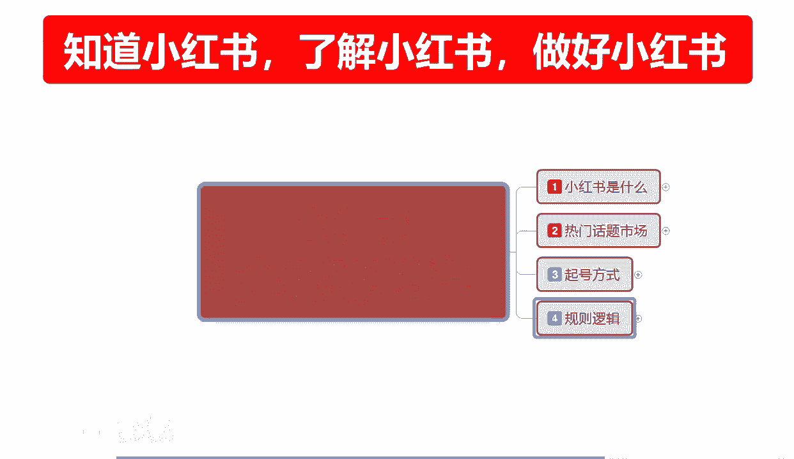
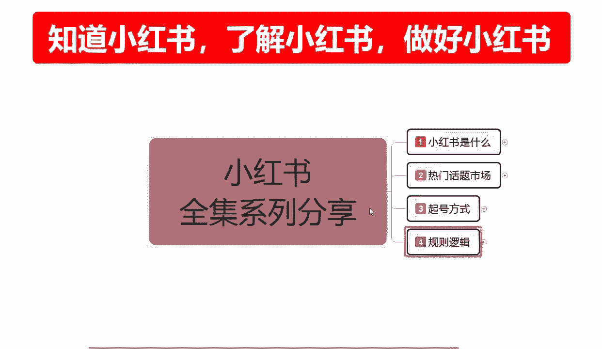
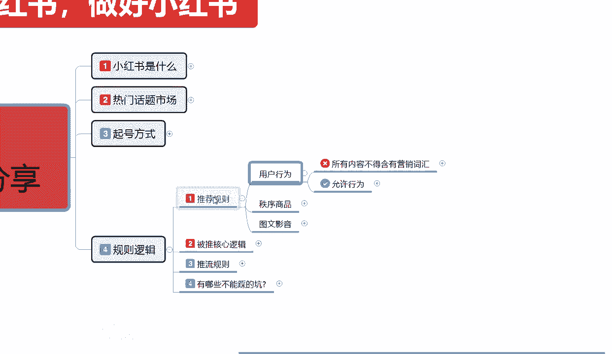
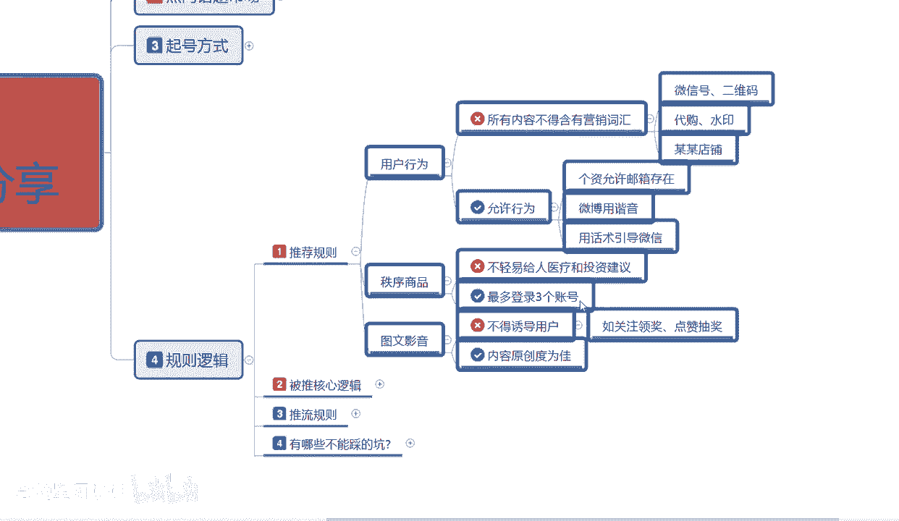
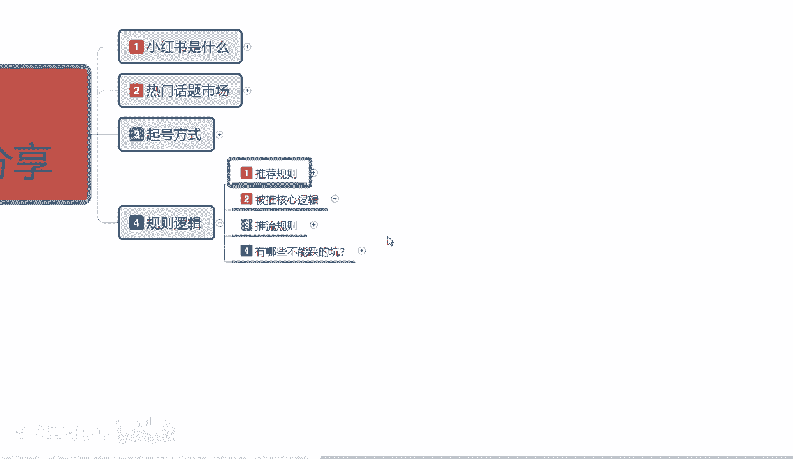

# 【2024版小红书体运营教程】全B站最良心的小红书开店运营高阶教程合集，从0开始做小红书体开店 ,起号真的快!!! - P9：p4.1推荐规则 - 念晚星河漫漫 - BV1wT421Y7FM

大家好，今天给大家分享的是小红书全集系列，的第四大课时啊，规则逻辑，这节课的话主要是给大家讲解一下啊，小红书他整个运营系统的一些规，则和运行方式啊，包括我们后续可以参考和使用的一些模式。

了解一下小红书整体的规则都有哪些。

整个课程的话是规则逻辑里面分为四个点啊，首先第一个是推荐规则，第二个是被推的核心逻辑，第三个是推流的规则，最后一个点给大家讲解一下啊，有哪些坑是不能踩的啊，你踩进去以后，整个账号权重基本上就掉没了好吧。

首先我们了解一下推荐规则，什么是推荐规则呢，推荐规则在这个里面的话，我们其实可以把它分为三步来进行讲解，第一个呢是用户的一个行为，第二个是秩序的一个商品啊，商品的一个秩序应该说是第四个是图文影音。

首先用户行为。

展开来给大家讲啊，用户行为分分为什么，首先是不能做的啊，我在前面给大家也标过他那这个信标了啊，用户行为不能做的所有内容不得含有营销词汇，什么营销词汇，小红书上面他有敏感词汇，微信号，二维码代购水印。

某某店铺不能直接出现的，就算你是开店的，你也不能直接出现这几个字的，知道吧，他会判定你为违规，如果说你在你的账号里面发现这些东西了啊，当然了，你用别别类的一些代名词啊，或者是呃其他方式进行推广。

我之前讲课给大家分享的时候，看别人的店铺里面啊，他那个发现一个信封，然后打上账号是吧，内置邮箱，通过这种方式的话是可以的，但是你不能直接出现微信号二维码代购水印，某某店啊，这是用户行为不能不能拥有的啊。

可以做的允许行为是什么呢，个人允许存在邮箱，微博用谐音，用话术引导微信可以，但是你不能直接出现，你可以引导啊，你会用谐音，你可以存在邮箱，但是现在没事，谁去发邮箱了，对不对，这种邮箱留言的话。

说实话都是像年龄偏大一点啊，年轻人现在基本上不用邮箱了，你现在用邮箱的基本上都是30岁以上，那小红书你个人用户的话，基本上都在18~35，所以说邮箱的话你能用是能用，但是实际引流效果的话做不好啊。

这个我们一定要了解一下，这个就是普通的用户行为的一个逻辑准则，知道吧，就是我个人创建账号，我不准备去做店，我做网红也好，做引流也好，你也不能出现这些东西啊，一定要了解这个情况啊。

包括你做矩阵的用户的一个小号啊，我准备用这个小号在里面的话，也不能出现这个小号，动不动给你封了，动不动给你封了，你哪来那么多时间去创建这个东西啊，对不对，虽然说小额，虽然说小红书可以无限制发账号是吧。

但是你也不能这么去弄啊，这样太费号了，而且你的引导效果不好啊，得不偿失，没必要，第二个就是咨询商品什么呢，就是说不要轻易给人医疗和投资的一个建议，在小红书上面我们不能出现的敏感词。

就是说哎你这个病已经在什么地方治疗对吧，他那边治疗的一个效果不错，然后我看见那边楼盘可以投资一下，你们感兴趣吗啊，我这边有个什么什么项目，投资建议不要出现这个懂我意思吧，不要出现这个出现的话。

就直接给你封号了啊，第二个点就是最多登录上三个账号，我之前给大家说的是一机一卡一，账号是我们用户的，懂我意思吧，说我们商家去操作可以，但是我们个人的话就无所谓了，但是你小红书上面就是一个。

一个是账号里面的话全中你做小号，一个手机里面的话，不要登录我三个账号过多，登录过多的话啧截流了，然后就是用电脑登录啊，很多我们操作做网络运营的，你基本上都给自己配了一台电脑，那么你在电脑里面的话。

你登录账号其实可以登录多个，但是也不要超过三个啊，这条主要的话就是给我们商家用的，最多在电脑上面不要登录超过三个账号，子账号也不行，主账号也不行，知道吗，因为你的电脑的话，他用的也是一根线啊。

你网线也好，无线网也好，他用的都是一根线，你如果说用电脑去操作，用雷电啊，用其他的一些软件做那种嗯，不懂定位修改的话，你说实话最好不要去多登账号啊，一个电脑上面登个三个账号，你如果说要登其他的。

就把账号下掉，然后再登，你超过三个以后的话，你的这几个账号都会被限流，好吧，这个就是商品的一个自学维护，小红书它整体的一个利益点，第三个大点就是图文影啊，投影音里面不能做的是什么，不得诱导用户。

比如关注领奖，点赞抽奖是吧啊，关注领红包啊，关注评论有奖等等都不行，然后原创内容是最为简最为适合的，但是我们前期的话不懂，你可以去复制别人的一个笔记，复制别人的一个内容，复制别人的文案。

你进行转发也可以，但是他原创内容，就是在小红书整个运营体系里面没有出现过的，权重是最高的，出现过的，有人发过的，那么他整体权重就会偏低啊，小红书系统你发发布那个笔记的时候，它有可能还不会录入啊。

你原创的话是百分之百录入的，你不是原创的话，录入的可能性就没那么高了，他需要去你学美工学剪辑啊，剪视频也好，剪文案也好，剪内容也好，要修改了以后才能去做好吧，这个就是推荐的一个规则。

你把这几个点啊不去触碰，那么他小红书就会给你额外的一个基础推荐，但是这个推荐的话是账号正常推荐啊，我们账号的话你基本上发第一篇笔记的时候，可以获得每50到200个的一个小眼睛，就第一篇笔记。

50到200的一个小眼睛的一个推荐笔记，那他的曝光的话可能就是1000到2000，你如果说触碰到这个里面的内容的话，那么他就不会有曝光给你了，知道吧，不触碰才会有这个基础的一个曝光数据。

这个就叫推荐规则，那么这一节呢就给大家分享到这，下一节呢给大家分享一下。

