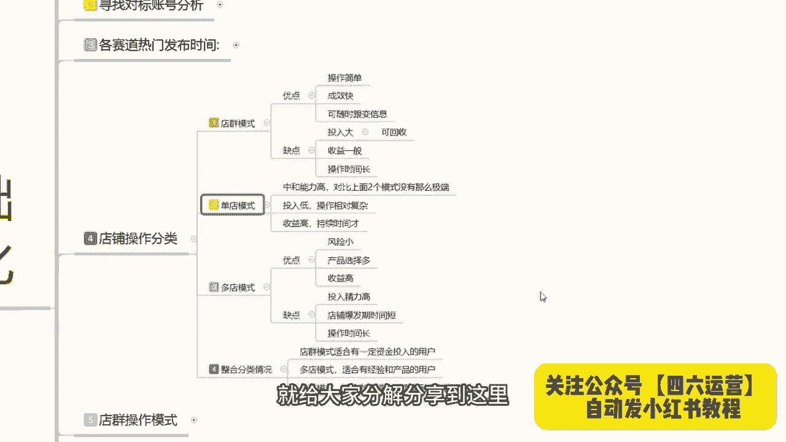

# 【2024版小红书体运营教程】全B站最良心的小红书开店运营高阶教程合集，小红书体开店 起号真的快 - P1 - 李宣美利维坦mY - BV18nbve7ECf

大家好，这期给大家分享的是小红书基础开店的一体化，整体操作，这一期课程的话是从我们个人账号的一个设定，账号对标的一个分析，然后各赛道的一个发布时间，一直到我们最后的一个店铺发展方向。

整个的话就是开店的一体化流程啊，从我们小红书上面，只要你是想在小红书上面做开店卖产品啊，都可以自从这个上面开始进行学习了解，那开始我们今天的一个课程，我们首先来了了解一下啊，我们如何打造个人账号。

小红书上面啊，我们在创建小红书的时候，就说我们小红书要去开店的时候，首先就是要打造自己的个人账号，个人账号怎么去操作啊，首先是分三个点，第一个是自我定位剖析，第二个是明确自我定位。

第三个呢是个人主页搭建，这三个点，我们先来了解一下自我定位的一个剖析啊，我们去做在小红书上面，你去做点，你首先要问自己四个问题啊，你想明白这四个点以后的话，你自己才好规划自己的一个小红书啊。

在这个自媒体平台上面的一个发展路径，首先是我的人设是什么，我能为用户提供什么，如何打造差异化，如何更好的明确赛道的一个方向，就说我这期课程的话，我还是和之前一样啊，我是不针对某一个产品给大家进行啊。

针对性的讲解，我只是说拿大概的一个介绍，让你们了解这小红书，我们做任何产品其实都是可以的啊，根据你们自己产品的定位去测，确定你自己的一个目标，首先我们要确认的是什么呢，你的人设你在小红书上面。

你去卖产品，卖商品啊，不管是衣服鞋帽食品，化妆品，车载装饰品，小饰品等等，你不管是在小红书上面，你去卖什么啊，你自己要给自己打造一个人设，根据产品啊去定位你自己的一个店铺状态。

第二个就是你能为用户提供什么，为什么说第二个是用为用户提供什么啊，你所提供的产品也好呃，内容也好，或者是其他的都可以啊，你给用户提供的他所需要的一个消费渠道，他为什么要到你这来消费。

你给用户提供的是什么样的一个保障，也就是你产品质量啊，包括你产品的一个后续服务啊之类的，你这个你要把自自己了解清楚，第三个就是打造差异化，因为小红书上面的话，目前的话商品还是非常多的。

你要和别人做的不同，你才能突出重点，如果说你做不到差异化的一个标准打造的话，那你就只能去给人家打价格战，打那个排名战，很难做到，就是嗯像做冷门呐，或者是做偏偏旁类的一个独立爆款出来。

就是你必须要去给别人打，要不就做排名，要不做销量，要不就做人气数据啊，点赞等等，要不就做那种矩阵，就说你要打，如果说你有方式打造差异化出来的话，你就可以避免很多的一个步骤，直接开始操作，第四个呢。

就是说，如何更好的明确我们自己的一个赛道方向，你往哪个方面去靠对吧，就是我刚刚打造差异化一样啊，你往哪个方向去靠，你离所选的目标竞争对手越少，人群越多，那么你所打造的一个商品爆款持续时间就更长。

而且卖爆的几率也就更高啊，想明白这四个点，你就可以更好的规划你自己的一个商品账号，店铺，它整体的一个后续路线，第二个就是明确自我定位，自我定位这个里面啊，我们把它分直播卖货，笔记卖货。

关键词搜索卖货和排名卖货这四个点，为什么，因为小红书上面的话，直播卖货是一个渠道，笔记卖货是一个渠道，关键词搜索卖货啊，也是一个渠道，然后就是一个排名卖货，排名卖货的话。

说实话这个的话是就是在那个小红书打开以后，他有一个商品渠道，商品渠道，如果说你的排名偏高以后呃，同类的用户搜索这个产品的话，你靠这种排名去增强这个属性点，就是增强用户的一个访客量进入量。

通过这四个方式来进行卖货，直播卖货就不用说了啊，你在小红书上面开直播，然后的话介绍自己的产品经营产品销售，第二个就是笔记卖货，发送商品笔记啊，记住了，是商品笔记，不是引流笔记啊。

这个商品笔记和引流笔记它是不一样的，你的商品笔记需要去电脑端啊，网页版的千帆上面去操作，从那个里面发送的才是商品笔记，它可以附带产品链接，但是这个商品笔记你发放的话，你前期如果说没有没有排名。

没有销量啊，你不好操作，第三个就是关键词，就是操作产品关键词，产品关键词有权重以后，用户去用那个放大镜搜索的时候，才能搜到你的产品，不然的话你光发笔记卖货的话，说实话你这个展示曝光不会很高啊。

所以说你首先要明白自己的自我定位，四个点啊，四个方向你要选哪个直播笔记，关键词排名四个点，你要往哪个方向靠，你后续店铺的一个操作才能整体操作起来，你不能说是你又做直播，又做笔记，又做关键词。

又做排名可以做啊，他们四个虽然说是一个综合题，四个都能做，但是你的精力和花费啊会成倍的一个提高，第三个点就是个人主页的一个搭建，个人主页搭建的话，这里呢就是说啊衬礼简介，头像封面这四个点。

你要完全符合你自己商品对应的一个，信息和状态属性，村里要有特色啊，能够让粉丝快速牢记，不要做生僻字啊，因为这因为昵称的话，说实话，如果说别人在其他地方给你的产品进行宣传，或者说呃进行了解以后。

如果说你打那个生僻字，别人搜索不出来，你会减少很多访客的简介，介绍自己是做什么的啊，卖什么产品的，有什么产品或者说有什么活动，有什么价格，做了多少年啊，对产品有时候多了解都可以，头像说实话头像的话。

你在这个里面的话就说辨识度要高，让别人信任你，认可你才可以，你不能说弄随便弄个卡通头像或者之类的，这种图像的话，说实话我不建议你在小红书上面去做啊，因为他获取用户的一个信任感的话不够。

最后呢就是封面小红书的一个主页封面，你自己把它那个美观设计感要调整出来，因为你只有把这些东西完善了以后，别人才会相信你是专业的啊，才会了解你这个人的一个专业性，然后通过你的头像判定你的性别啊。

当然你不能说你是男性或者女性，你如果说男性长的那个是吧，你就自己想想办法搞一个差不多的头像啊，符合你产品气质的头像，你不能说是什么头像都往上面放啊，这个还是要注意的，就说你的封面的话也是要配合你的头像。

简洁和成泥的，他做出了一个特色，当别人第一印象进入你的主页以后，就对你非常的信任，这个就是我们前期打造账号，我们所需要自己啊自我的一个定位啊，明确的一个目标，和个人一个主页搭建的一个创建。

这三个点做好以后的话，我们下一步呢就可以开始寻找对标账号，进行店铺的一个后续操作呃，寻找对标账号的话，其实他是给我们自己的一个小红书账号做群录，账号做权重，权重对标，找到以后的话。

他会变相的啊用我们的产品找到对标，那这节课呢就给大家讲解到这，下一节课呢给大家分享一下，寻找对标账号的一个分析特点。

我们怎么去操作，最后呢会给大家一个小福利。

整理了小红书运营实操资料，大家好，今天给大家分享的是小红书基础，开店一体化的第二课时啊，寻找对标的一个账号分析，这节课呢给大家分享的是对标账号分析，这个对标账号分析呢，它涉及到我们小红书开店前中期。

包括我们后期的一个人群定位，因为你只有把自己的账号啊，归纳到你所属商品的一个渠道里面啊，小红书他才会给你推推广对应的一个人群，你的转化率和访和那个展示率才高，展示率的话是看账号啊。

转化率的话就靠你的一个对标分析，自己能不能把它做好，我们先首先来了解一下，寻找对标账号的一个分析额，第一个呢就是说搜索同领域的关键词，第二个是对标模组的一个分类，第三个呢就是对标账号的一个拆解分析。

首先了解一下搜索同等玉的一个关键词，是什么意思呢，就是说，我们如果说你想要做母婴类的一个产品啊，只是说拿母婴打一个比方，你做服装也可以对吧，你做视频也可以，你车做车载也可以，都是可以的啊。

我们就可以去尝试搜索呃，就是说拿母婴做的话，就是说你尝试搜索早教知识，育儿干货，亲子游戏，亲子穿搭，孕期等关键词，就是说找你产品对应的啊，一定要找产品对应的，你比方说你做女装，你就要找穿搭啊。

找找你对应的女装T恤啊，美妆博主这种都是可以去找的，你只要找到你对应的一个领域了以后啊，小红书它整个系统，它就会把你的账号判定为喜爱的一个类型，他会把你放到同类型的一个喜爱里面去。

我们在这个喜爱里面的话，你自己后续去发放笔记也好，发放商品也好，包括你的关键词权重也好，你在这一个系统里面，就是小红书系统里面喜爱这一块板块里面，你去发放以后，他就会给你分享给对应板块的人，懂我意思吧。

小红书他这个人群呢千人千面，这一个人群可能的话呃，听过的朋友可能是听过，但是基本上现在所有做网络营销的，基本上都会了解千人千面这个词呃，淘宝拼多多，你只要说是做京东，只要说是你做商品卖货的。

你基本上都了解这个词，千人千面在小红书上面它显示的特别明显，它比其他三个平台啊，卖货的平台显示的还要明显，为什么，因为他是把你按照人群划分的，知道吧，他是按照你的兴趣去你所选的兴趣。

你所搜索的内容来进行的人群划分，你只有搜索过这些类产品，你发放的东西推广出去，才能给对应搜索的人群看，你不能说是我开母婴店对吧，我搜索服装啊，我比较喜欢把自己打扮的漂亮一点去看看。

但是你自己买母婴类产品的，那完了你的账号后续所发的所有产品出卷，就是发放的笔记也好，商品也好，他推给的全是母婴类的一个用户，就是说我们在自己在小红书上面，你寻找对标账号的话。

一定要做自己同领域的去观看他们的一个笔记，商品账号权重，然后去他们的评论区进行评论，这一步操作下来啊，第一是给用户给其他用户留下第一印象，评论的话是留下第一印象，观看是给Z给系统留下第一印象。

当你把这些印象全部留住以后，后续你发放的笔记也好，你上传的商品也好，他就会给你推广给对应的一个人群，那对应人群去搜索同类型的一个产品的时候，就有可能发现你的一个商品啊。

这个就是寻找对标账号的一个第一步啊，搜索同领域关键词一定要弄清楚了，千万不要去搜其他的，如果说你搜了其他的以后的话，他那个词汇非常不好改变，知道吧，尤其是新号，你刚创建的时候，你只要搜了其他词汇。

或者说是看不属于你对标账号的一个笔记内容，系统会给你推很多这种，你最少要花两到三天才能把它抹消掉，所以说一个一个其他领域的都不要看，你进小红书的目的就是卖货，卖货的目的，那你就需要去寻找同领域的关键词。

同领域的笔记，同领域的产品去反复的观看，这个时间段的话，最少要持续3~5天，小红书就会把你的标签，指定到同领域的一个范围之内，你后续所发放的一个笔记也好，推广内容也好，商品也好，他就都在同一领域了。

这个大家一定要把它牢记住啊，第二个就是对标博主类的一个分类，这个分类的话其实还是比较简单的啊，首先呢是挑选数据好的啊，封面风格你个人看着喜欢和擅长的就可以，然后呢你去关注他。

最少的话就是说关注20个同赛道的一个目标，然后呢对标博主分为四个大类，第一个呢就是同期目标，我们新人刚建号的时候，就是树能领到5000粉丝就可以了，你不要去找那种3000到2万，2万到20万啊。

大V1000000以上的这种粉丝，你不要去找啊，你的目标就是50~5000粉丝，因为我们是新号，刚撞创建的时候，除非说是你的号已经运营了一段时间，但是你的目标群体变化啊，有变化了以后。

你还没把他调整过来，那你就可以找下面三个对号入座，你的粉丝如果说超过300，那你可以找3000到2万，如果说你的粉丝超过3000，你就可以找2万到20万，如果说你的粉丝过万，那你直接去看终极目标就行。

懂意思吧，因为你的标签属性是会变的，所以说我们在找的时候，对标博主的一个分类，你一定要找同类的一个属性去做，而不是说找呃其他的那种，你比方说我新创的一个创建了一个账号。

我找3000到2万粉丝的行不行不行，为什么，因为你的账号全都不够，你去看了以后的话，你的对标数据就拉不起来，你直接去找0~5000粉丝的这一部分人，就可以了，因为他们的是他们所面对的用户群体。

和你所选择的用户群体是一样的，除非说是你一上来，你就想在小红书上面进行大投入，然后的话然后的话我想把店铺做大，然后商品卖起来，那你可以从第二个目标开始，第三个目标和第四个目标千万不要选啊。

第三个目标和第四个目标的话，那个远期和终极目标的话，说实话它是属于店铺里中后期碰到瓶颈以后，再自己再想办法调节店铺人群的时候，再去操作你其他两个目标，如果说你选了以后的话，他你后续操作不起来，知道吧。

因为他对你没有任何作用，你只有在第一个和第二个里面去选才有作用，如果说你前期你想慢慢做，那你就选0~5000，如果说你想步子跨大一点啊，直接从第一第二跃到第三第四，那你就选第二个。

3000到2000粉丝的一个目标群体，对应的一个博主，或者说对应的一个店铺去了解啊，同类赛道的，不管是博主也好，产品也好，关键词也好，笔记也好，都可以的，知道吧，这个是不分类的。

你只要把自己放到这个分类里面，大分类里面啊，就可以，之后呢我们要做的是什么呢，对标账号拆解分析，什么叫对标账号拆解分析呢，拆解我们选择的博主分类，或者我们同行的一个产品。

分析他的一个人设选题内容数据分析，还有他变现的一个方式，有些人的话他在这个小红书上面的话，他变现的话，他不一定是直接卖货，他有可能是带货直播接广告，你要聊，首先我们在小红书上面，你自己要做店的话。

你要先了解清楚他是带货的，直播的，接广告的还是做什么的，了解清楚了以后的话，然后去分析他的人设，成立头像简介背景图，第二个就是选题类型，关键词，还有他每天的一个笔记更新时间，第三个呢就是封面标题和文案。

他走的是什么路线，因为每个产品的话，他说实话嗯，你看着大大致的内线路线是一样的，但是他有很多细分的细分路线，分出来以后的话，它所对应的一个展示曝光量它是不一样的，然后根据你自己的一个产品，你自己在设定。

就是我之前上一节课给大家打呃，讲的如何打到个人账号里面，你自己要给自己设定一个目标去操作才可以，然后数据分析里面你要观察他的粉丝数，点赞数，收藏数和完播率，完播率你们如果说不会查的话，前期可以不用管。

因为完播率的话，只在乎在意自己账号的一个完播率，其他的完播率的话，他是后台小红书系统，后台自己操作的，我们可以不用去管它，你主要注意的是粉丝数，点赞数和收藏数对应目标的一个账号权重，在什么范围之内。

如果说你是新号，你就是领到5000，如果说你号有一定的权重，你就是3000到2万，再往上走的一个远期目标和终极目标，就和你没关系了，好吧，这个呢就是寻找对标账号的一个分析。

我们先把个人账号打打造清楚以后，然后分析对标账号，然后把账号自己的一个账号权重做起来以后，你才能往后面去了解，因为你这两步做不做不到位啊，你后续操作的话基本上都是白费，就是浪费时间好吧。

那这今天呢就给大家分享到这，下一节课呢给大家分享一下，那个各赛道的一个热门发货时间，让大家了解一下你自己的一个产品，所对应的一个，笔记也好，商品也好，发布的一个时间效应。

那这节课呢就给大家分解分享到这里。

最后呢会给大家一个小福利。

整理了小红书运营实操资料，可以评论区私信的方式领取。

通过之后会第一时间发给大家，注意领取资料，不收费不收费不收费。

重要的事情说三遍，大家好，这一节呢给大家分享一下，小红书基础开店的一体化操作，这节课呢是第三课时，给大家分享一下各赛道的一个热门发布时间，让大家了解一下你自己对应产品额，选择什么样的一个时间段去发放。

它是最好的一个，可以获得最好的一个曝光的一个数据量，这里面的话两个发布时间其实是一样的，只是说介绍不同，就是说你们知道那个不同的发布时间发布作品，他会有一个不同的效果啊，今天的话就是跟你们分享一下。

怎么能根据我们的一个不同时间段，发布合适的一个内容，就是说你只我们只要记住这五个大的，一个原则的话，其实都是差不多的，第一个呢就是七点到九点啊，早上这个时间段，七点到九点。

这个时间段的话基本上都是怎么说呢，刚起床吃早饭上班，所以的话他比较适合发一些碎片化的内容，比如每日分享咨询等，让大家在忙碌之余也能学习到一些有用的东西，其他的话你其实没必要发了啊，七点到九点。

这这个的话你逛小红书基本上人不多，在这个里面你去发的话，你就只能发发日常，你自己如果说想做博主之类的，可以在这个时间去发，你正常做商品的话，在这个时间段的话，你不用去发了，没有什么用。

除非说你是卖食品之类的，卖早餐之类的，可以往这个时间段去考虑一下，第二个就是九点到12点，这是一个大点的一个时间啊，这个时间的话基本上都是都在工作，然后呢工作的时候有些摸鱼的啊，或者说闲的无聊的啊。

他会去玩一会玩一会小红书，输了以后，书包的话他适合发布一些教育类的一个内容，比如美妆教程，工作技巧，然后11点以后的话，就可以发布一些关于美食类的一些服装推荐，为什么说11点以后的话可以发布美食呢。

要吃饭好，大家把这个点点了解清楚，12点倒数两点，他是休息时间，这个时间段的话说适合发布一些轻松的，搞笑的，娱乐的，或者说可爱类型的都可以去发啊，影视类的电影类的，但是这种类型的话。

你也只能适合博主去做，你正常卖货的话，你在这个时间段去发的话，效果不会太好，然后呢是三点到六点这个时间段，这个时间段的话基本上都在工作，也是和九点到12点是一样的啊，他们两个的时间点一个是上午。

一个是下午，只是说下午的一个数据量更好，然后是七点到12点之前，这个时间段啊，大幅部分的话就是说属于自己的一个独立时光，这个时间段可以发送任何内容，因为这个时间段的话，就说我们的一个活跃度的话，小红书。

于是尤其是小红书啊，夜生活开始了这个时间段，人们的活跃度远远高于前几个时间段，你了解这五个时间段分布以后啊，再对应自己产品去做一个大概的规划就可以，第二个发布时间呢是明确的。

各个赛道每个类型产品所对应的一个时间，美妆类的美食类家居穿搭健身学习护肤，萌宠探店，职场摄影娱乐情感养生旅游这几个点，它每个点的话就是说他都有自己独属的时间段，你把这些时间段了解以后的话，对号入座。

你自己是做什么商品的啊，去寻找对应的一个发布时间，去发放你自己的一个商品笔记就可以，你比方说美妆类的，你就比方比较适合在11点到一点，然后就晚上的七点到十点之间，因为这个时候的话，中午是女性出门时间啊。

这个你们要弄清楚，如果说不是上班族的女性，他基本上出门时间的话，基本上就是在11点到一点，要不就是晚上，而且绝大多数都是晚上七点到八点这个时间段，八点以后到十点以后的话，基本上都是已经化妆完了出去玩的。

你包括美食类的也是差不多的家居穿搭啊，这个我就一一不给你们讲解了，你们自己了解一下你自己做什么产品，做什么类目，我这个给大家划分的一个美妆也好，美食也好，他的一个商品也是这么发的，你要做引流也是这么发。

你要做网红做博主，他也是这么发，知道吧，就是把这个时间段把握好，提前5分钟发放你的商品笔记，发放你的产品内容啊，你会获得30%左右的一个曝光加成，因为他这个时候人群流量是最高的。

这个呢就是今天给大家分享的一个，各赛道的一个热门发布时间，大家了解一下就可以好吧，那这节分享呢就给大家分享到这，下一节课咱开始店铺操作，最后呢会给大家一个小福利，整理了小红书运营实操资料。

可以评论区私信的方式领取，通过之后会第一时间发给大家，注意领取资料，不收费不收费不收费，重要的事情说三遍，大家好，今天给大家分享的是小红小红书，基础开店一体化的第四课，店铺操作的一个分类。

我们首先了解一下什么是店铺操作的一个分类，我们在开店之前，你不要着急去开店啊，你把店铺的个人账号打好以后，标签做好以后，然后了解发布时间，再去了解店铺操作的一个分类，店铺操作分类的话。

其实我们在小红书上面你去做电的话，你其实可以把它分为店群多电单电啊，这三个模式，三个模式它是不一样的啊，店群的话他的一个店铺数量是越多越好，多电模式的话，就是每个店铺你自己准备只做一个单品爆款的。

单店模式的话，你就说你只准备在小红书上面开一个店的，它每个模式所面对的一个操作方式和方向，它都是不一样的，这节课的话主要是让你们大家自己确认一下，你在小红书上面你到底想去做哪个模式啊。

哪个模式比较适合你，因人而异，分类不同啊，我们先了解一下电局模式啊，优点就是说操作比较简单，成效快啊，可以随时变更的一个信息量额，缺点的话就是投入比较大，但是他这个投入的话是可以回收的。

缺点就是然后呢就是收益一般，最后呢就是操作时间比较长，他这个，如果说你真想在小红书上面去做店群的话，说实话啊缺点和优不，优点和缺点都是非常明确，优点就是小红书你做店群不需要动什么脑子啊。

成效快是什么意思呢，就是说你店铺成型以后的话，他基本上每天就保持这个数据量，你想让它变多，他也不可能，而且你自己的话不好操作过来，因为他的一个店铺数量开多了以后，你每个店重复操作这一个步骤下来的话。

怎么说呢，就是说你就没有其他时间做其他东西了啊，就是你整个人就绑在这一些这些店铺里面，然后呢他的一个可随时变更信息是什么意思呢，就是说你前面做店群，然后把数据粉丝累积一定的数量以后的话，你可以跟变信息。

然后去往多点或单点模式去靠，但是你这种个面信息的话啊，时间会稍微长一点，只是说你随时能更换而已，然后呢他的投入比较大，因为你做店群的话，你的店铺是越多越好，你十个以下你都不叫店群啊，你十个以上才叫电群。

那十个以上你光一个保证金，你就要需要一两万块钱准备，然后的话你的这个店铺里面你需要营业执照，不然的话你就需要去找十个身份证，每个身份证开一个个人店，那样的话太麻烦，如果说你不开个人店，你想开企业店。

或者说是有资质，有店铺的那种的话，一个身份证可以开三个店，开三个店的话，那还需要额外600块钱的一个店铺认证费用，一个店开下来的话，大概成本就在2000块钱左右，所以说它的一个投入还是比较大的。

但是他这个里面的话有一点，就是你如果说是用十个身份证的话，他的一个身份证保证金是可以回收的，如果说你是用企业的话，用身份证开三个店的话，这个里面除了600块钱不回，不能回收以外啊。

就是你开店时候用的一个资金不能回收以外，你的保证金也是可以回收，就是一个店的话还能回收接近3000块钱，但是你的一个投入的话还是比较大的，缺点就是说然后他这个收益比较一般。

因为你如果说在小红书上面去做店群的话，你的收益其实和你打工比打工强不了多少，只是说自己的话，可能人生人生心里面自由一点，一个月收益的话也就几千块钱，想破万很难，最后一个呢就是操作时间长啊。

只是只是说他比打工强一点，强在什么地方呢，没有老板逼逼你哈，就这一个点，然后是多电模式，优点的话就是说风险小，然后呢产品选择的话就比较多，收益比较高，这种多电模式就是什么呢，我这个店铺的话。

我把它开起来以后，我在小红书上面，我准备只做一个这个产这一个店铺，我只准备只做一个爆款起来，或者说我有几个店铺里面能报一款，到两款就可以了，懂意思吧，就是优化后的电驱模式，但它不是电驱模式。

它也是单电操作，只是他的一个操作模式不一样而已，缺点的话就是说投入精力的话要高一点，因为它整体的话需要精细化操作，你只能先开一到两个店起来以后再去开第三个，第四个，第五个点。

然后呢他的一个店铺爆发期时间比较短，就是这种多电模式的话，他一般的话产品爆发期嗯，你前期准备可能要花一个月，最后爆发的话，可能就半个月到一个月到两个月啊，不会超过三个月，这个时间段爆发的话。

你能赚多少钱，就取决于你自己产品的一个定价，和你自己商品的一个性价比，你自己能做到什么程度了啊，就是爆发期时间比较短，他没办法在小红书上面长久的一个运营，然后就是操作时间长。

为什么说他的一个操作时间也长呢，因为你是多电操作，它不是单电，单电操作，知道吧，你多点操作啊，你第一个店铺操作完，你还操作第二个，第三个，第四个呢，对不对，所以说他操作时间的话是非常长的。

而且是精细化操作，比较费脑子啊，这个就是多电模式，当然了，如果说你把他的一个，流程弄清楚以后的话还是比较简单的啊，然后呢是单电模式，单店模式啊，他的一个综合能力的话，相对于上面两个的话。

其实嗯就没那么极端了，他的一个投入比较低，操作相对复杂额收取收益的话也是比较高的，而且持续时间长，你多电模式的话，你产品可能只能推广半个月，一个月两个月，但是多电的话，你基本上不单电模式的话。

你基本上可以操作两年左右，但是他的一个爆发收益的话，就没有多电模式那么高啊，只是说他更持久一点啊，就是说整合分类里的话，就是说你不管是做店群也好，单店也好，多电也好，你这三个模式其实都差不多的。

各有优点啊，电群模式的话就比较适合你资金雄厚一点，但是对网络的话不怎么熟悉的人去操作，你建议的话，现在你做小红书做店群的话，收益不是太高，但是这点收益的话，你说实话没有太大必要，第二个呢就是多电模式。

它呢就比较适合那个有经验的，你之前如果说做过淘宝，做过拼多多，或者做过京东，或者是在其他地方还在做的，想在小红书上面发展的啊，对这种运营模式了解的，你可以去做多电，单店模式的话，就任何人都可以做了啊。

推荐的话就是新手，你就从单点模式开始操作啊，他主要的就是需要你有耐心和执行力就可以，其他的话没有那么过多的一个需求量好吧，这个呢就是店铺操作的一个分类，你要先了解清楚你自己在小红书上面。

你到底是要做什么，你后续才好去操作好吧，那这节课呢就给大家分解分享到这里。

最后呢会给大家一个小福利。

整理了小红书运营实操资料，可以评论区私信的方式领取，通过之后会第一时间发给大家。

注意领取资料，不收费不收费不收费。

重要的事情说三遍，大家好，今天给大家分享的是小红书，基础开店一体化的一个操作流程，这节课的话是给大家分享第五课啊，电群的一个操作模式，让大家了解一下电群它是怎么运作，怎么赚钱的，店群操作模式的话。

这里呢是给大家把它分了三个步骤，第一个是店铺规模，第二个是额操作模式，第三个是操作方式，先了解店群的一个规模，店群规模啊，他整个的话你在小红书上面做店群，你在其他地方做店群都是一样的，规模越大越好。

整体的话就说你规模越大，效果也就越好，基础规模的话你就说最少在十个点以上啊，越多越好，不限制上限，但是有下限最少十个啊，第二个呢就是收入来源，它是通过多电无线上传产品，然后进行产品展示，吸引人。

新用吸引新人，对网络不熟悉的人，就是那种啧嗯刚接触网络不久，比较新奇啊，看什么都比较是吧，这种人去进行成交，然后呢，通过大规模的一个产品关键词展示给用户，然后通过小红书。

或者说是通过小红书的一个笔记进行引流引导，然后让他们进行购买转化成交收入，计算方式的话就是说通过店铺的一个进行铺货，然后进行成交，这个方式成型以后的话，每天单店的话就是说大概有1000到2000个访客。

你成型的话，你最少要有500个往上的商品才叫成型啊，就是一个店铺里面你最少有500个商品，你才算成型，然后如果数据做好的话，就是说基本上有两到十单左右，运气好又两到十单，运气不好，一单都没有。

也是正常的，当然这个他也不是绝对的，就说你小红书的话，你做电群，你就只能靠运气，运气好，每天开个几单，运气不好，每天一单都没，就这个样，而且你店铺规模的话，你说实话一个店一一单没有十个店的对吧。

总会开那么个几单上十单，他就是靠这种累积合并起来以后的话，就是你小红书店群的一个，所以为什么说我之前给大家讲的时候，就给大家说过啊，电群体操作起来以后的话，它的一个整体收益其实不高的。

而且投入的话和你收益不是太成正比啊，然后呢是小红书的一个操作模式，操作模式的话其实是也是比较简单的，因为像电群操作，它就是一个一个模板套一个模板，你直接去操作就行了，你使用多个店铺进行统一操作。

店铺数量的话没有上限，但是不能低于10~15个，这个就是电池模式的一个基本要求，然后你后续操作的话，你每天上传产品，你用一件代发也好，呃，你觉得自己没有那么多数据属性，你把别的产品，你把拼多多。

把淘宝的，把那个阿里的或者京东的那种产品，你基本上都可以放到你节目，你去哪，只要是有一件事，一件代发，一键上传，你去把这种产品找到以后，就能往你店铺里面放，而且你不分类型，不分属性，什么都不用分。

你就是一个搬运工，你把别人的产品拿到这个地方，你然后做一定的差价出来，自己就可以卖卖了，也许就值钱，所以说他操作模式是非常简单的，就是一环套一环啊，复制第一个复制，第二个复制，第三个无限复制就行。

操作方式，使用采集软件进行大规模的一个产品上架啊，你自己一个一个上传肯定是不行的，你直接用采集软件啊，小红书上面系统也有有匹配的，然后呢每天一个店啊，记住了一个店每天只能上传50~100个产品。

再多的话就没用了啊，系统会判定你重复发布产品的，然后每个产品每天可以发两个笔记，每个产品每天可以发两个笔记啊，一个店铺每天最多不超过五篇笔记，它包括商品，笔记内容全是复制的，什么都不用你去管。

你也不需要操那么多心啊，如果没有那么多，那你每个店铺每天发个两到三天篇笔记，十个店铺每天发三四篇笔记，你就通过这种方式去做引流就行了，就是说但是呢这个里面每天笔记，你最少要发两个。

因为笔记它是有时间上限的，他的像做店群的话，他的笔记效应只有两天到三天左右，短的话可能只有一天啊，你要把这个了解清楚啊，就是每个笔记他都有时间效应的，就是引流的一个时间效应。

所以说你们每个店每天最少要发两天以上的，一个笔记量，这个就是整个店群的一个操作模式，它是非常简单的，它没有什么过多的一个技巧，无限搬运，就是把别人的复制过来，拿到自己这边店铺里面，拿自己的账号。

然后去做就行了，这个就是小红书的一个电讯，那这节课呢就给大家分享到这，下一节课的话，给大家讲解一下，那个单电模式的和多电模式的一个主体定位，最后呢会给大家一个小福利，整理了小红书运营实操资料。

可以评论区私信的方式领取，通过之后会第一时间发给大家。

注意领取资料，不收费不收费不收费。

重要的事情说三遍，大家好，今天给大家分享的是小红书，基础开店的一体化操作整体流程，第六课时，主体的一个定位，主体定位的话主要是给大家讲解一下，我们单店操作和多点操作里面，我们需要定位的三个重点。

第一个是店铺定位，第二个是人群定位，第三个呢是价值，价格定位，我们首先来了解一下什么是主体地位啊，就是确定我们整体店铺的一个发展方向，方向确定好以后呢，我们后续去操作店铺呢才好操作呃。

包括整个店铺的一个运营，而不是说我们再去做小红书或做其他的啊，基本上都是一样的，你不能说是做一步试一步，你只要只有把自己的一个小红书，店铺的整体运营规划做好了啊，我们有思路的去操作，你才能把它做大做强。

你不然的话你做一步试一步的话，说实话你这个就是纯碰运气，你没有自己的一个方向，没有自己的一个目标，你后续再做做再多的事情，你没有这些主体定位，你把它不明确的话，你后续你操作不了，就是没有后续发展啊。

你持久不了，所以说我们一定要确认自己啊，你整体店铺到底是往哪个方向靠的，额包括之前给大家分享的一些内容，也都给大家讲过了，主体定位就决定了你后续发展，你是做持久性的啊，间接性的还是说想体验一下好吧。

那开始进入我们的一个正题，我们这节呢先来了解一下店铺定位，什么是店铺定位呢，店铺定位的话说实话在这里面呢是分为三个点，第一个是模式，第二个是类目，第三个是产品，什么是模式呢。

就是需要确认我们店铺的一个发展规划，确认操作哪一种模式，只有确认主体以后才好进行下一步的操作，什么叫做操作模式呢，就是上一节给大家分享的店群的一个操作，分类额，不能说是店群啊，应该是店铺操作的一个分类。

分三个模式，店群模式，单电模式和多电模式三个模式，我们选一个你做店群的，你就说你自己有一部分资金，但是自己不知道去做什么，然后的话这部分钱你放在那里面的话也是浪费，就想去做店群试一下。

这个的话之前也给大家说过，你做店群平均的话，每个月收入也就几千块钱，过万的话可能性不大，而且你的投入的话大概是额在3万到5万左右，看你的店铺规模，你的规模越大，你投入越高，如果说你的店铺规模不大。

十个店20个店的话，那也就一两万块钱，当然你的收入呢也就没有那么高，如果说你是做20个店，往30个店靠的话，那你的收入的话大概可能是五千六千，七千八千九千啊，当然了还要看你的整体店群规模。

第二个呢就是单店模式，第三个呢就是多电模式，单电模式的话，我们去操作的时候，就说你做一个店铺，因为我自己的话本来产品就没有太多，只有一个突出重点可以去做，你去做单点模式，或者说你是新人。

你想了解小红书做点这一块，你也可以去做单店模式，因为单店模式的话，你不管是做一件代发也可以，你去自己线下找产品也可以，或者说你自己本身有一个主退款的一个产品，也可以，都可以做单店模式。

多电模式的话就不行，多电模式的话，你就只能去怎么说呢，你要有自己的一个呃出货厂商啊，为你提供多元化的一个店铺属性，你比方说你自己做家具啊，做服装啊，做装饰啊，做化妆啊，做面膜啊，做等等。

你要有多元化多方向的一个产品，你才能去做多DM模式，这个的话说实话它比较适合的话，就是厂家来去操作，为什么，因为厂家的话他的货源可以自己把控啊，你如果说个人想去做多电模式的话，说实话很难。

而且你不好操作，投入也比较大，嗯虽然说他的一个收益高，产品选择的话也比较多，而且风险小，但是他硬性要求比较高，这是三个选择模式，所以说我们在操作店铺定位的时候，你一定要把自己的一个模式给选清楚。

你选模选完模式以后，你不管是说电锯也好，单点也好，多电也好，模式选完以后选内幕，大类目，小类目，冷门类目，然后选完类目选产品，产品里面要选什么呢，价格类型，时效性这三个你都要选，要一一去针对。

内幕里面就是大类目，小类目，冷门内幕，三个里面就是根据你自己产品去定的，所以说我们在做主体定位的时候，你一定要把自己的店铺定位弄清楚，你不管是做多电也好，单电也好，单电的话，你就需要去怎么说呢。

大类目小类目，人类目，因为你自己本来就没有什么太好的，一个产品出入，那你无非就是网上一件代发，线下货源自己去找，那你找的话，你就只能从大类目，小类目，冷门内幕三个类目里面去选，这三个类目。

他们所面对的一个受众群体也是不一样的，冷门类目，起点低，爆发点高，但是他不好做，为什么，因为他的数据和格调的话，它把它做爆起来很难需要有一定的沉淀，而且对这一个产品非常了解。

知道这个产品的一个市场在什么地方才好去做，小类目就不一样了，小类目的话你啊基本上都可以做，但是你需要自己出产品，大类目就不一样，大类目和另外的一个小类目和内幕就不一样。

他的话就说没有那么多复杂的一个问题，直接16881件代发，你自己找不到产品，你去做大类目就行，你有自己的产品就做小类目，如果说自己的产品不好，你要去线下找，那就去做冷门类目，这三个点各有优势，各有优点。

你把这三内幕选择好以后呢，再去选择产品的一个价格类型和时效性，价格的话，那确定了我们产品所面对的一个用户群体，选择性啊，每个价格的折扣性它是不一样的，类型的话就是说你产品的类型，男性女性，实用性。

时效性都是不一样的啊，时效性的意思，就是说这个产品是在什么时候用的，你比方说季节性的产品对吧，温补性的产品对吧，美容类的产品啊，汽车装饰的产品它都是有时效性的，所以说我们在选定内幕的时候。

你首先要了解自己要做什么模式，模式，选完以后的话，然后选内幕，内幕选完以后选产品，比方说我如果说我是一个新人啊，我想在小红书上面坐垫，那我首先是选模式，电池模式我肯定不考虑多电模式，我没有资源。

我只能做单电模式，单电模式我选完以后的话，结合我自身的情况，大类目我只能做16881件代发，我会去考虑小类目，如果说我自己有工厂，我就会去考虑小类目的一个操作啊，推广自己的一个产品，产品数据。

如果说两者我都没有，而且我又不想做大类目，因为大类目的竞争压力非常大，那我就只能选冷门类目，冷门类目怎么做呢，去线下的周边市场啊，去选择当地的一个特色做冷门，然后宣传往全国各地商家赚钱，你也赚钱。

全国各地的用户也会喜，如果说喜欢这个产品，这个类型这个属性，那么你的产品就一定能卖爆，因为他的一个，入点很小，但是片面性很大，他只是没有推广出去，所以叫冷门内容，选完内幕内幕以后，我选筛选价格，选类型。

选时效性，把这三个点，然后结合我们自自己选的模式，选的类目就是我们店铺的一个整体定位，包括我前期中期，后期三个发展的一个方式和方向，我就已经全部确定好了，确定好以后的话。

我下面要选择我们的一个人群定位之后，再选择价格定位，这个就是主体的一个定位，好吧，因为时间的关系呢，这节课呢就给大家分享到这，下节课呢给大家分享一下啊，店铺定位做完以后，我们选人群定位怎么去选。

最后呢会给大家一个小福利，整理了小红书运营实操资料，可以评论区私信的方式领取，通过之后会第一时间发给大家。

注意领取资料，不收费不收费不收费。

重要的事情说三遍，大家好，今天给大家分享的是小红书，基础开店一体化操作的全套第六大课时，主体定位，这节课的话给大家讲解一下，我们的一个人群定位，上节课呢给大家讲过了店铺定位，我们了解自己的模式。

操作什么店铺模式，选择什么样的一个产品内幕，然后确定产品的一个价格类型和时效性以后，我们开始确定我们自己，因为我们已经把产品选择好了，那我们就开始选择人群，人群是什么呢，是选择我对应商品销售的一个人群。

我要把这些商品卖给什么样的人啊，他们有一个什么样的一个消费习惯，有什么样的一个消费能力，都是我们所需要考取的范围，你不能说是我们选完店铺定位以后，我的产品价格我把它定高一点。

然后的话我卖给低单价的那帮人，那样的话你的产品是卖不出去的，因为别人对你的产品它是没有消费能力的，但是如果说你做低端产品，你卖给高端的人，别人是看不上你的产品的，所以说我们需要把人群定位做准确。

你才好知道自己的产品适合卖给什么样的一个，人群范围，而这个人群范围的话是由我们自己去选择，但是需要我们自己用账号啊，我们自己的账号要去筛选这部分人出来，你才能说是把它把你自己所做的产品推广。

推广给对应的人群，而不是由系统判定去给你推广，因为那样系统给你判定推广的话，它是只能把你固定在某一个分类里面，分类里面他也是有人群，也是有消费习惯的，那你这个消费习惯就需要我们自己去操作了。

所以说我们在这里呢，需要先确定自己的一个人群定位，然后再去了解系统的一个分类，再把自己的账号做成类似的人群，那系统就会给我们推广对应的一个人群，你才能做起来，不然的话你盲目的选择，就像我刚刚说的。

以低端价格的一个产品卖给高端价格的一个人，别人不会接受你的产品，因为觉得你质量不行，产品不行，不值这个价对吧，你高端产品的一个价格，你去卖给低端产品的一个人，别人消费不起，对不对。

所以说你要把这些东西数据全部要考虑进去，你才能把人群定位做准，你才能把这个小红书的店铺做好，我们来了解一下人群定位啊，人群定位的话就说我们在操作店铺的同时，不要小红书他整体的一个搜索体系啊。

我们所了所有了解这些的话，都是针对我们店铺做定位基础的准备，所以了解这些以后呢，我们才知道我们后续店铺怎么去操作，你不了解的话，你后续店铺你是没办法操作的，这里面呢我是给大家分成了六个咳，五个点。

第一个是个人属性，消费能力，购买类型，购买地位和购买习惯这五个点，个人属性是什么呢，用户的个人属性包括性别，年龄范围和喜欢的一个内容，就是我们小红小红书对应的系统，给我们分辨的性别年龄。

喜欢的内容就是我们刚创建账号之初的时候，所选择的一个内容，第二个是消费能力，用户的消费能力的话，是根据用户每年总购买能力，分12个月来计算平均值的，当然这个是小红书后台系统，他自己判定的。

我们是没办法看他的数据的，但是我们可以自己给自己的店铺账号，设定数据啊，第三个呢是购买类型，系统分析用户的一个购买行为，基本上的话就是应用个人的原因，同时会给用户推广三个类型的一个产品。

我们可以把它分类为日用品，生活品，户外用品，家具玩具等等大类目，或者说小类目，或者说是冷门类目产品啊，每一个产品的类目不同，它所分配的属性不同，但是我们去过逛小红书啊，或者说是你去找产品做搜索啊。

他给你推的基本上都是你经常观看的，三个属性范围之内啊，不会有第四个，你比方说你看食品对吧，看化妆品，然后看服装，他不会给你出现家居啊，不会给你出现儿童玩具，不会给你出小说呃等等之类的。

其他的他基本上就是三个类型的一个产品，给你进行定位啊，你要了解这些东西就是用户的一个购买类型，第三个呢就是购买地域呃，购买地域的话，就是说分析用户的一个购买地域和特性，再通过整体的一个系统分配产品。

整体的一个展示情况，如果说我们产品在同一个地域购买地域，人数过多的话，那么我们相同的系统会把我们大部分的流量，固定在这个范围之内，这就是小红书系统，你比方说我在四川，你在湖北。

我四川的产品经常往你湖北那边去卖，那他会把我的地域，我的产品属性划分为湖北那边喜欢的一个类型，那在四川本地反而推广的比较少了啊，北京上海广州深圳那边也就比较少了，而湖北购买的人群比较多。

他的主要推广力度就是我所发的笔记也好，发发的商品也好，主推广的目的地就是湖北啊，他通过这种方式的话，提高他小红书的一个成交比例，当然这种的话你们大家自己要去了解一下啊，最后呢就是购买习惯。

用户的购买物品的一个购物习惯的话，比如比如说啊货比三家，长时间浏览以后再购买搜索性感兴趣的物品，但不是不购买，像咨询客服啊啊比较多的，或者说是直接搜索进行购买的系统，会根据用户购买的一个行为。

把这一类人群进行划分，然后推广给对应属性的店铺，来提高这个系统的一个成交，就是小红书，他通过这种行为方式的话，来提高他自己小红书的一个知名度和存在感，同时呢给对应的商户的话也提供了一即便利。

属于三以内的局面，就是用户他知道系统知道我喜欢什么，给我推荐的什么产品，系统用户喜欢购买的一个产品，我推荐给他购买的一个商品以后，他对我写小红书的信任度进一步提高，小红书我们卖货的就是通过操作这个渠道。

系统会推荐给我对应的一个人群，提高我店铺的一个转化率，三赢的一个方式，所以说小红书他就会有这种一个购买习惯，购买地域，购买类型，消费能力和个人属性的一个划分和区分，因为他不这么做的话，他的一个人群属性。

我本来是想买包包的对吧，他没事就喜欢给我推服装，一个包都不给我，你觉得我对小红书还有兴趣吗，对小红书购物还有兴趣吗，我没太大的的兴趣了，我在这个上面我看到这同类的一个产品的话，我可能会选择去淘宝去买。

拼多多去买京东去买啊，我去买正品，我也不会去小红书上面去画，虽然说你写的天花乱坠，但是我找不到产品，所以说系统小红书的话，它整个系统会为了避免这种情况发生，他就出现了这个个人属性，消费能力，购买习惯。

购买地域这几个属性的一个划分啊，所以说我们在操作小红书整体店店铺定位，确认完成以后，就确定人群定位，人群定位以后确认完，就最后的价格定位，这三个点缺一不可好吧，这一节呢就给大家把人群定位分享了一下。

下一节课呢给大家分享一下，我们的一个价格定位，就是我们店铺定完自己的发展思路，选定完自己所卖的一个人群，最后选我们的一个价格，价格对应的话就是我们产品的一个价格，所对应人群选择他有没有消费能力。

那这节呢就给大家分享到这里。

最后呢会给大家一个小福利。

整理了小红书运营实操资料，可以评论区私信的方式领取。

通过之后会第一时间发给大家，注意领取资料，不收费不收费不收费。

重要的事情说三遍，大家好，今天给大家分享的是小红书，基础开店一体化的整体操作流程，第六大课时主体定位里面的一个价格定位额，之前给大家说过了啊，店铺定位主体的一个定位，我们把店铺定位做完，人群定位做完。

最后却又是确认我们产品的一个价格定位，价格定位它也是有选择性的啊，他不是说我们直接你想卖多少卖多少啊，价格定位的话，他的选择性而且相对复杂，而且比较认真一点，如果说你在这里，你把它听不懂，不了解的话。

你自己后续去做的话，我们是没办法去做的啊，因为你对应的人群属性和你自己的一个产品，价格不符，你没办法去操作的，我们来看一下啊，价格定位，产品，价格定位，确定了我们所面对的用户是什么类型的。

我们需要做店铺人群系统，才会给予我们对应的一个搜索人群，就是说我们产品价格如果说你没有确认，你确认了店铺，确认了人群，你没有确定价格，后续系统给你排序的呃，推广的一个用户给你的话，他也是不准确的。

所以说我们在这里的话，一定要先把价格定位做完，然后去选定人群，懂我意思吧，价格选定完了，人群选定完了，你的店铺发展思路，有了后续就是我们操作整体店铺的一个方式，我们先来了解一下产品价格定位啊。

它是分三个阶级的呃，三个对应的属性，分属三个不同的一个店铺操作模式，第一个是分级低中高三个层次，第一次三折以下就是我们产品发布以后，你原价卖100，打三折卖30，这种的话也是一种促销活动。

以前很多人会用，但是现在也有，但是主要是出现在拼多多啊，小红书上面也有，但是这种的话说实话我不怎么提倡，因为他的话属于低端消费人群，但是小红书整体用户的话，他说实话他是属于中高端的一个消费人群。

你在小红书上面做低端消费的话，你说实话做不起来啊，很难，第二个呢就是综五折，包括四折，五折六折，他都属于中啊，就是小红书的一个程序划分，属于终端消费的一个人群，第三个呢就是高端消费人群，七折八折。

九折和不打折，但是基本上你在小红书做，你在其他任何地方做，你产品不打折的话，别人看都看不下去啊，你怎么都要有一个折扣，就算你是卖正品正版啊，你去操作以后，小红书他都要有折扣的，你没有折扣。

不别人看着你就不是诚心实意，你来你就是来忽悠傻子的，别人是不会去买的，那这三个折扣他是怎么区分的呢，三折以下他是小红书，就会直接把你的产品判定为低端产品，它所属对应的一个人群的话。

就是低端的消费购买能力，懂我意思吧，系统会根据他个人的一个属性分配，和消费能力的一个分配，那你选择三折以下，你就选定了这一部分人群，如果说你选择四折，五折六折，那你就选择了中单人群。

如果说你选择高七折以上，那就是高端人群，那小红书目前用的用户主打85%，90%甚至90%几的一个女性用户，25岁到35岁的一个主体，消费年龄范围之内，他居然都是高端用户，他对他自己的皮肤。

对他自己的穿着，对不对，对自己的一个美食培养视频，他都是有要求的，你做低端中端的话，你只能去做25岁到14岁这种小朋友，或者说是刚步入社会，没有多大消费能力的人去操作，就看你自己的人群去选。

不怎么选定啊，低中高三个档次都能选，只是说你对应的产品选择的话，所面对的人群和属性它是不一样的，就靠我们自己怎么去划分，怎么去了解，我们选定自己的折扣以后，然后呢是选定基础定价啊，就是说因为这个的话。

我建议大家的话是做中，或者是高低端也可以做啊，这个没有明确的，它只是我们对应的人群定位不一样而已啊，看大家自己怎么去操作，确定基础的一个折扣分类以后的话，然后是基础定价，基础定价是什么意思呢。

我产品我进货价三十五十八十，100几块几毛，他都有个基础定价，那你基础定价的话，我们再配合折扣低一中高三个折扣的范围，那就需要需要去设定我们的一个产品价格，对不对，产品价格设置的话。

一般呢就是在产品出厂价值的1~3倍左右，你去做这个价格就可以了啊，价格的话需要确认我们产品的一个基础价值，加运费加利润，就是我们最终所设定的产品的一个出厂价，你在小红书上面准备卖多少钱。

参加活动准备卖多少钱，你自己都要考虑进去，我们打个比方，基础价格50加运费十加利润50，那就是110，这是一倍左右的利润啊，一倍左右的利润，如果说你然后再打个折对吧，110的成本你打个八折。

那他就相当于是八十一八十二八十，88，一百一十八十八啊，一百一八折88，对不对，那你除去基础价格加运费的话，你再算一下你自己还能赚多少钱，这是一倍，女人两倍利润，三倍，女人都是这么算的，当然了。

你两倍利润，三倍利润，你就只能做低端和中端的一个产品，打三折打五折，这么去操作啊，每每一个基础定价，等于就说你把利润如果说定的太高，那你就只能把折扣压下来，因为你的产品和你的虚假，如果说相差太大的话。

你的产品是没办法卖出去的，现在人都不傻啊，你不要想着我拿个几十块钱的衣服，我准备卖个几百块钱可以卖，但你这店铺绝对做不到，而且卖个几天，这个店铺就废了，你的前期操作努力就白费了。

就看你自己能不能把他一次性卖报，多赚一笔啊，当然了，可能性很小，这个就是赌命赌运气了啊，然后呢基础定价就是说商品的价格越高，利润越低，这样的话可以提升我们产品的一个知名度，如果说你想做长久的话。

就是这个操作模式，商品价格越高，利润越低，这样的话提升我们产品的一个知名度，在第一件主推产品操作店铺数据的时候，就比较方便，你做单店多爆款的话，就可以按照这个模式去操作。

因为第二件爆款才是你赚钱的最终目的，第一件的话说实话不亏本，能保持生活，保证店铺的一个正常运营，等你账号的一个权重起来以后，你第二件爆款才是你赚钱的时候，而且持续时间非常好。

基本上都有在半年到两年左右之间的，一个时间段啊，比较适合全季节型的一个产品，你要做那种短期爆发的什么季节性产品的话，基本上就三个月，六个月之类的产品的话，这种方式就不不怎么适合了。

就说我整合了所有的一个数据经验，我们在操作的时候，最赚钱的时候就是在第二件主产品上架的时候，有一定店铺基础数据和讯与整体的利润的话，可以进行提高，我们正常基础定价的话，50+10，运费加50的利润。

我可以把它提高到1。5倍左右啊，技术第二件产品提高的1。5倍甚至是两倍，这当然了，这要看店铺的一个整体反馈，也不能说是我在这张嘴说上上上嘴巴皮一扑，下嘴巴皮一说，哎我定价我也初始就定两倍。

那你卖都卖不出去的啊，大家还想了解根据自己的账号，根据自己实际情况去了解去确认的，有时候你做三倍其实都可以的，就看你的产品符不符合了，有没有实在的前沿性啊和前瞻性，所以说我们店铺第一件产品的话。

他你正常去操作的话，如果说对产品自己没有太大信心，第一件产品的话就说价格不要定太高了啊，而且你的那个产品定位选完以后的话，基础定价确认，然后选择对应的折扣，对应折扣选完以后选择对应的人群，人群。

选完以后选，再按照店铺的一个思路，这就是整体我们小红书店铺的一个主体定位，把这三个点做好以后，你后期就只需要去做数据，做笔记，做分享，然后就等着店铺报，有时间多的，你就可以开第二个店，开机三个点。

第四个点都是按照这种操作模式，你要把整个操作模式流程熟悉了以后，你在小红书上面开店，你才能去持久，包括你做矩阵，小红书开店，你不光是创建一个店店铺就可以了，你还要去做矩阵的，只是说这个矩阵的话。

不包括我在给大家讲，开店这个主体里面范围之内，好吧，那这节课呢就给大家分享到这里，下节课呢给大家讲解的是啊，小红书整体它的一个流量运行模式，让我们了解一下你小红书店铺的一个流量，到底是通过什么方式来的。

包括我们店铺的一个转化率。

那这节课呢就给大家分享到这里，最后呢会给大家一个小福利。

整理了小红书运营实操资料，可以评论区私信的方式领取，通过之后会第一时间发给大家，注意领取资料，不收费不收费不收费，重要的事情说三遍，大家好，今天给大家讲小红书基础开店一体化额。

这节课呢给大家讲第七课时流量模式，这个流量模式是什么呢，是小红书我们自己的一个属性啊，就说我们小红书你在开店的时候，你发笔记所获得的一个流量渠道，或者说是我们关键词获得的一个流量渠道。

我们在小红书上面你去做店，虽然说小红书上面有3亿的一个用户基础属性，在这个地方，但是我们其实呢能获得的啊是少之又少的，而且我们还需要去争抢这个流量的一个权重啊，那我们首先要了解一下小红书。

他的一个流量模式是什么样的，只有了解他的模式了以后，我们才知道小红书我们做店以后，要怎么去操作流量模式这一块呢，我是给大家把它分为了两个点，第一个呢是笔记引流，第二个是搜索推荐引流。

笔记引流的话就比较好了解了，就是小红书坐垫，我们去把产品上传以后的话，他是没有任何宣传的，它不像淘宝拼多多，你搜索产品的关键词，你就能把产品搜出来，在小红书上面，你搜索产品关键词，用搜索去做。

你也找不到产品，它里面的产品的话只占35%，也就是十个小红书搜索笔记里面可能只有三个，或者说是四个啊，附带商品笔记的一个引流流量，所以说我们做小红书的时候，有两个引流方式，就是笔记引流和搜索引流额。

笔记引流呢它占小红书整体流量的80%，就是小红书，他的流量按100来算，就是3亿80%，也就是2。4，2。4亿，基本上都是在这个小，小红书的正常推荐流量里面，其他的一个流量就在搜索推荐引流里面。

20%就是这20%才是小红书，在是额商品里面做搜索流量的20%，算下来的话，其实也就6000万，6000万算下来又有35%才是小红书，做商品搜索的，我们按30%或者40%来计算。

6000万里面30%可能的话就不到1000万，也就是800万左右的一个用户，会在小红书上面去进行产品搜索，那再刨除小红书，他在这个小红书上面做店的这个用户群体，那你能分配到多少流量就很少了。

所以说他这个里面其实也有排排名的一个，流量机制，那我们在操作小红书的时候，他这整个流量模式的话，我们如果说不把它弄清楚，那你在里面你是抢占不到流量的，我们首先来了解一下什么是笔记引流啊。

笔记引流就是我们正常发送的笔记，就是小红书账号创建以后发送的笔记，那个就叫笔记引流，商品引流的话，你需要去用电脑端操作，然后用电脑端登录网页，在网页上面做什么呢，打开千帆，千帆里面有系统。

系统里面的话去以自己的商品上面发布笔记，那个才叫商品笔记，才能做到推荐流量里面的35%的流量，正常的引流笔记里面的话，他虽然说有附带的大概20个左右的话，附带一个商品笔记，但是这种笔记的数据量太低了。

而且那些是排名比较高，推荐量比较好的，他才会有，如果说大家不是很懂的话，你们把小红书打开，就是打开小红书以后，把第一页小红书推荐给你的那个页面关掉以后，你直接在里面去翻，你看20个到30个里面。

可能就会出现一篇引流笔记，而且这一篇引流笔记的一个呃曝光量，展示率和点击率还是比较高的，那是因为他已经把排名做起来了，他才有权做在基础的一个引流，推荐笔记里面进行曝光，我们新店你刚开始去做的话。

你这部分流量你是抢不到的啊，因为你的账号是没有基础的，小红书全程他不会给你去推，所以说我们自己要去操作，而且这个笔记的话就说小红书上面，我们不光要发商品笔记，我们也要发自己的自然笔记，也就是推荐流量。

这80%的一个比例的笔记啊，去宣传自己的产品，这就相当于呃你在电视上面看个广告对吧，或者说是你在玩抖音的时候啊，玩其他东西的时候，玩游戏的时候，做宣传用的，所以说我们在做小红书开店的时候。

你也要做笔记引流，笔记引流你也要做自然搜索也要做搜索，流量就是两个点你都要去做，不然的话你的流量是根本起不来的，那笔记引流的话，他这个笔记它又分为了呃新笔记，大型笔记，好的笔记三个步骤，为什么。

因为他笔记的话它是有时效性的，这里我也给大家列出来，就是我们新账号创建以后的话，小的笔记你正常发不出去的笔记，他引流的话是给你引流三天，大型笔记的一个引流效果的话，是七天最好的一个笔记引流。

就是那些网红博主之类的发的那种，几10万上百万那种点赞的那个笔记，也就15天，15天过后，他这一篇笔记相当于已经被系统录入了，你不主动去搜索的话，他不会展示给你，懂我意思吧。

就是我们新上新的一个小红书账号的话，他最多的持续引流时间其实就只有三天时间，你做好了以后的话可能会达到七天，但是你基本上你的一个流量，点击数据要破千上万，最少也要在3000~5000左右。

不然后续的话他是没有流量访客进来的啊，就是看你的笔记都没有人通过你，你然后通过你的笔记再去宣传你的产品才可以，不然的话你连机会都没有，那你在小红书上面做点就纯属是一个笑话。

你只光去做了我们账号的接触店铺的技术，那你的笔记引流你只做了商品笔记，你没有做引流笔记的话，那你在小红书上面，你把这个店铺开不起来啊，就算开起来你也赚不到钱，所以说笔记引流我们也需要去做。

那这里呢主要就是让大家了解一下啊，比基引流它也是分趋势的，三天七天四五天，三个笔记引流，三天过后的话，这篇笔记基本上就相当于没用了，所以说我们在小红书上面坐店，你每天笔记的话基本上都是发两篇左右。

一个账号每天是发五篇笔记，但是我们给我通过各种实验和了解啊，显示的初级最好的，只有第一篇和第二篇的一个笔记，第345篇笔记的话也有访客啊，也有用户进来进行观看，但是这种笔记的话，他没有什么权重。

他只会拉低你整个账号的权重啊，就是你每天五篇五篇五篇五篇五篇的去发，这样会导致你的账号权重下降，而不会增加两篇笔记，第一篇权重最高，第二篇次字，这样的话它会让你的账号权重慢慢的上升，让系统认可你。

这是最好的一个结果，而且这个笔记的话，大家想一下，你一篇笔记的话，基本上可以引流三天，三天就是六篇，六篇的话你每天引流，你就算是一个新号，一篇笔记出去的话，大概是50到200个小眼睛。

你如果说坚持半个月以后的话，基本上就可以到达100左右到150左右，或者说是一接近300左右，不会超过500的一个比额，展示曝光量就是小眼睛数量持续时间越长，你的引流效果越好。

但是基本上的话你到第500左右的话，就要看你自己产品的质量了啊，笔记的质量你自己怎么宣传，怎么操作的，如果说你操作不好的话，你的笔记后续引流效果你也跟不上啊，基本上就没有太大的作用。

所以说我们在了解他的一个流量模式的时候，你也一定要知道啊，小红书笔记你不管怎么去做新账号，基本上就只有三天，而且每天你必须得发两篇笔记，了解这个节点以后，你才能去操作笔记引流，这80%的流量。

这80的流量做完以后的话，他才会去引流到你的账呃，小红书店铺里面去观看你的产品去进行咨询，你如果说不做这个，我们直接做下面这个搜索引流的话，你做不起来好吧，额，那这节课能用时间代购关系就给大家分享到这。

下一节课呢给大家讲解一下，我们搜索推荐的一个流量，他是怎么进行分配的，我们要怎么去操作，那这节呢就给大家分享到这里，大家好，今天给大家讲解小红书基础，开店一体化的一个操作。

额第七课时流量模式的第二个内容，搜索推荐引流，上节课呢给大家分享的是我们的一个笔记引流，就是我们基础的一个小红书系统推荐流量，它占比整个流量比例的80%，包括你笔记发送以后。

每天能获得的一个大概流量比例，还有笔记引流所持续的一个时间，第二个呢就是搜索，今天主要给大家讲的就是说搜索推荐应用，他虽然说整体占比，流量的话是小红书流量比例的20%啊，就是系统正常分配的话。

搜索流量比例的话大概有20%左右，而且这个数据的话它还在持续增加，同样的小红书，这个20%的搜索流量比例里面的话，它不是百分之百都是商品啊，他有65%以上都是正常的，一个引流笔记。

只是你搜索关键词以后的话，它系统推荐，把有同样关键词的一个笔记推荐给你了，因为小红书机系统它不是纯卖货的一个平台，知道吧，所以说他这个里面的话掺杂的所有流量的话，基本上都是推荐流量。

我们如果说去做搜索的话，它里面只有35%，接近35%，还不到接近35%的一个商品流量，就是我们在正常的发布商品以后的话，它里面有一个商品笔记，我们发布这个笔记以后的话，只能争取20%里面的30%。

之前也给大家算过，可能的话就是800万到900万之间，这帮用户的话，他会去购买商品，那这800到900万之间，他是靠什么来进行排名的呢，就是关键词引流排名，引流和付费引流这三个点。

这35这35%的流量的话，就是按照这个比例去分配分配的，35%里面付费流量占比15%，排兵引流占比30%，关键词引流占比30%，排名引流是你的销量排名啊，交易排名，关键词引流是你的主关键词。

就是你产品的别称名称啊，你比方说短袖T恤，化妆品，美容美妆对吧，理发工具，汽车装饰等等，这些主关键词边用户进行搜索的词汇，它占比啊，付费引流是15，排名引流是接近30，其他的都是关键词引流。

这35里面他还给你这么划分了啊，关键词引流55排名你留35哦，关键词排名50%，排名引流是35%，付费引流15%，这是占了35%的概率里面，也就是说我们做关键词的话，你只能在这个800万里面。

截取50%的流量，就是400万，这是关键词排名，如果说你的商品销量比较好，成交金额比较高，那你可以占比35%，如果说你在小红书上面去付费，让小红书系统去给你啊，抢排名就类似于呃怎么说呢，淘宝的直通车。

钻子等等之类的东西，他去做的话占比15%，当然这个是花钱的，你正常，如果说你在小红书上面去做那个付费引流的话，你只有做到中后期了才会去做这个前中期的话，你这个碰都不要碰，一碰就死，因为你把数据一停。

你的店铺就死掉了啊，基本上是都是中后期中后期去操作，所以我们正常抢抢占的话，就是85%的一个流量啊，就是800万里面85%的一个流量，你换算下来的话，基本上也就只有700万左右，700万左右。

关键词占多少呢，对不对，占一半，一大半，接近70%，你的一个排名引流占30%，也就是你的销量成交金额，关键词的话就是你的主关键词进行搜索以后，别人对在你这成交的一个数据反馈啊，收藏加购成交比例。

转化比例，这都是由系统去分配的，而不是说某个人去确认，我只能说是把大概的一个数据给你们进行分享，让你们了解我们自己在做小红书的时候，他的一个引流模式，你不能说小红书3亿用户进来以后的话。

就每天就几个访客，有时候连访客都没有对吧，我笔记也发了，数据也做了，什么都起不来，那是你自己的方向，目标定位都没有找准，懂我意思吧，所以说我们在做小红书的时候，你一定要先了解他的流量模式。

了解我上面给大家讲的啊，确定自己的店铺定位，确定自己的主体，确定自己做什么，你只有有思路了以后，你后续才能去做，你思路都没有的话，你盲目的去操作，你在小屋上面做不起来好吧，这个呢。

就是小红书整个流量模式的一个运行方式啊，当然了，大家也会说，他这里面还有一个关注页的一个流量，那个流量的话不计算在承重范围以内啊，关注页的流量跟你没有任何关系，然后现在小红书上面还有一个商品渠道。

那个商品渠道他是额外出来的一个排名系统，你在里面的话，你自己虽然说那个排名系统出来了，但是它的一个整个数据的话，它还是按照排名引流去做的，那是都是卖的好的才能上去，你卖的不好，你根本上不去。

我们前期开新店的时候，你就不要去考虑在那个里面去做了啊，看在那个面里面去做，你最少要把店铺做一个小爆款出来，你才能卖，不然的话你那里面的排名你抢不到，所以说那些都跟我们没有关系，我们把握现实一点。

你就只能抢到那80%和20%，流量里面的一个数据，80%是做引流的，而且它转化率特别低，基本上不到1%，高的话也就0。5，正常的话就0。3左右，就是1000个访客里面可能成交三单还算多的。

但是这个搜索引流20%的一个流量的话，这个里面的一个转化率可以达到6%，到10%，就是在小红书做搜索引擎，只要他是去搜商品的，他的转化率都很高，大家一定要把这个点弄清楚啊，所以说我们做的时候。

你不光要做引流笔记，你也要做搜索推荐引流，去抢占关键词排名的一个引流，去抢他们排名啊，去琴行关键词搜索付费暂时就不要管了，因为你在小红书上面前期做付费，你把握不住啊，你也操作不了好吧。

那这一节课呢就给大家分享到这，下一节课的话给大家啊讲解一下，我们店铺前期的一个规划，就是店铺你前期基础要怎么做，你的商品才能卖出去，你如果说没有这个规划的话，你前期的一个啧呃店铺。

你居然小红书账号开了以后的话，你销量零属性，零账号没有权重，你产品都卖不出去的，那这节呢就给大家分享到这里，大家好，这一节给大家分享的是小红书，基础开店的一体化流程，额，这节课的话给大家讲解一下。

我们小红书开店以后的话，一个整体的前期规划，前期的话就说我们小红书，你要把技术前开始做好，以后的话，我们店铺的一个产品才能开始正常的一个售卖，我们先来了解一下啊，呃我们单电或者多电操作的。

前期的一个基础规划，如果说你做店群的话，你就不需要考虑这个了，因为你店群就是无限铺货啊，都不需要去做基础，小红书我们开店的时候，前期规划的话其实是三步，第一步是商品准备，第二步的话是基础数据准备。

第三步呢是操作人员准备，你要把这三个点把它准备好以后，你然后去把数据做起来，你的店铺所发的笔记才能给你引流带来转化，你如果说没有这些基础做数据量的话，你的整个店铺你就算是把产品发出去了，笔记发出去了。

但是他是没有任何转化量的，好吧，我们先来看一下什么是小红书的一个前期规划，里面的商品准备，双兵准备啊，在这个里面的话，其实商品准备的话，就是我们小红书账号账号里面创建嗯，小红书店铺。

小红书店铺里面需要包含商品，那我们在小红书上面做商品的话，它的一个基础数量他是有需求量的啊，虽然说小红书上面你开店铺以后的话，你放一个产品也是放，放两个产品也是放，放100个，放1000个也是放。

里面包含了啊动效率，转化率，你产品你账号的一个活跃度，店铺的一个活跃度，你产品的一个活跃度，这几个属性全部包含在里面了，所以说我们要去操作的时候，你要先了解呃，产品基础数量在什么阶段。

是对我们账号提升最大的一个方式，我们先了解一下啊，小红书产品基础要求的数量的话，就是说整体店铺商品数量之间呢，是在7~15个主产品，一件副产品，两到四件不亮的一个产品的话就是凑数的啊，5~10件。

一件主产品，两到四件副产品，5~10件的一个不量产品，这次整体合并起来的话是15件产品数量，但是我们正常去操作的话，你做单店模式啊，就是一个店铺你要去操作第一个爆款，第二个爆款，第三个爆款。

第四个爆款你才会达到15件商品，正常来操作，如果说你做单电的话，你其实只要七个方面就够了，大家一定要了解这个点啊，这是分两个步骤的，单电，操作四五件产品，而且是中后期发展的，你前面多店操作。

就是一个店铺里面七件商品就够了，这七件商品怎么分配呢，一件主产品，两件副产品啊，四件不亮的一个产品，或者说是一件主产品，一件副产品，五件不亮的产品，就是七个七个产品里面一个是主卖的。

第二个的话就是装饰一下，能卖就卖，不能卖就算了，另外五个产品的话，你就没打算去卖它的啊，这是一个点，你单店和多电前期都是这么操作，只是说多额单店的话，你后续的话出第二个主产品。

把这个副产品做成主产品以后的话，你在后面你就需要去加量对等的啊，你每加一个主产品上去，你后面的副产品就减少一个不量产品的话，你就要多加几个，前期的话就是一个主产品，一件副产品。

四个不量产品或者是五个补量产品，达到了七件左右的一个主属性产品，那你要上第二件产品，第二个主产品的时候就是两件主产品，两件副产品啊，八个补量的产品，你合并起来的话就基本上是12个产品，对不对。

你当上第三件主产品的时候，那你就需要三件主产品，两件副产品或者是一件副产品，或者是一个副产品都不要补量产品，12个你就是没有副产品，就是主产品和补量的一个产品，控制在15间之间，那你后续出第四件爆款。

第五件爆款，第六件爆款，你就把补量产品里面的一个商品进行下架，然后去重新上传一个新的，你想把它做起来的产品，那就是你后续的一个爆款，也就是说不量产品数量或多或少无所谓。

但是你要保证你的店铺产品数量不能低于七件，不能超过四五件，因为在这个范围之内，我的店铺账号的活跃度我能把握啊，店铺的一个成交，我能把握店铺的数据，我能把握，如果说超过这个数据量以后的整个店铺里面。

你产品过多以后，你的动销率跟不上啊，你的产品基础属性跟不上你的账号权重的维护，跟不上你的转化维护跟不上，会导致整个单店就是崩溃掉的啊，本来是本来那是一个完完善的，额层层叠加的一个权重升级。

如果说有一项从里面崩溃，你比方说今天来了500个访客，我们正常的转化的话，如果说你是做那个啊，搜索转化的基本上都在6%到10%，今天给你了500个访客，你的转化率啪一下掉到2%，第三天2。5。

第四天又是二，就是你的转化率提升不上去了，它会导致你整个环节崩盘，导致你店铺的话直接崩溃掉，就是你没办法再维护，再持续进行下去，它就不能增长了，他就只能维护在2%，而且持续到一到两个月以后的话。

这个店铺数据还会下降，他这个下降就不是转化率下降了，他就是访客下降了，之前每天是500，访客之后的话可能是450，四百三百两百二百一百，基本上到你自己这个店，你自己维护不下去，不想开了，自己都不想做了。

你放弃了这个店就死掉了啊，所以我们基本上在做这个商品准备的时候，都是这样的，就说你小红书上面你去开店的话，整体的一个商品数量就是七个到15个之间，你单品一件爆款的话就七个产品，你做第二件爆款的时候。

你基本上就是店铺到十个产品，12个产品左右，第三个爆款出来的数最高的话也就是15件，产品，再多的话，他对你店铺只有负面影响，没有正面影响，大家一定要把握这个点，但是也不能低于七个以下。

因为用户进入你店铺以后的话，他可能会去观看你其他的一个产品，他觉得你这个店铺里面没有什么好可挑选的，只有这一件产品，你肯定是从别的地方呃，什么一件代发呀，或者说什么从其他什么地方借用过来的，一个产品。

不是自己做的，自己对他，你只说做一个宣传，做一个二道贩子，你就算是二道贩子，你也不能让用户判定你是二道贩子，懂这个意思吧，就是说你要给用户建立一定的信任感，所以说你店铺里面的产品。

基本上都要在7000左右往上走15件以内，这个就是产品基础数量的一个需求，然后这里面呢还有一个额商品发布技巧，产品发布技巧的话，因时间的关系啊，因为我们每一节课的话可能就在10分钟左右呃。

我就留到下一节课再给大家进行分享，好吧，下一节课的话给大家讲解一下，这个商品发布的一个技巧，就说你这些产品7~15件产品，它不是一次性上传的，他都是有时间节点和安排的。

如果说你把这个时间节点把握不好的话，你会损失很多的一个数据权重，那这节课呢就给大家分享到这里，大家好，今天给大家分享的是小红书，基础开店一体化流程的一个第八课时，前期规划，第二个内容。

上节课呢给大家讲的是，我们的一个商品的准备啊，店铺整体的一个数量，这节课的话主要是给大家讲解一下啊，这个我们把数量准备好以后，他还有一个发布技巧啊，我们只有把这个数量你准备好了，你发布技巧掌握了。

你去发送产品，去组额，怎么说呢，就是说你去发布这些产品以后，你才能获得更高的一个曝光和基础的一个权重，你如果说不把握这个技巧的话，你基本上就是基础曝光权重的话，大概会降低30%左右啊。

就是平白无故损失了30%的技术权重，虽然说这个前权重的话，前期它显示的不是特别高，你技术权重可能技术展示曝光量，你刚开店的话，可能也就1000到2000，那你损失30%的话。

你其实就本来只有2000的一个曝光量，获得个200个左右的一个点击，你再损失30%的话，那你就1400，1400的话，你大概的话也就能获得10%，左右的一个点击量，就140个小眼睛。

140个小眼睛里面百分之，0。3，啊就是百分比后面还不是1%，0。3%的一个引流转化率，和6%的一个搜索转化率，而且你搜索的话是没排名的，你基本上前期就做不了排名啊。

就是说你如果说按照这种技巧去操作的话，你店铺想把它做起来是很困难的，我们先来了解一下什么是商品的一个发布技巧，商品的发布技技巧的话，其实说就就是我们小红书开店以后的话，你的商品不要直接上传。

他是有技巧性的，首先第一个就是先上传一到两件副产品，或者说是一件副产品，然后其他的放一件额那个不亮的产品，主产品先不要上啊，店铺正常运行一天以后，开始商家主产品，就只是说在你的店铺被小红书系统录入以后。

他知道你在小红书上面开店了，而且也开始上架铺货了，后驱就是要开始做数据了，但是他不知道你哪个数字组产品，他暂时不会给你额外的去推流量，你只有开始有数据以后，他才会去给你推流。

所以说我们第一天上架的产品的话，其实是给小红书系统做录入用的，他后续每天就会更新你店铺的一个数据，更新你店铺数据以后呢，你再去上传主产品，那你的主产品上传上去，直接就排名，有排名。

你就能去做他的一个基础权重属性，如果说你没有这些的话，你直接把主产品第一天发布上去，小红书是现场录入，那你的排名不会太高的啊，有点偏低，所以说我们要在正店铺正常运行一天以后，再开始上传主产品。

然后呢每天大家一定要记住啊，你的账号店铺每天上架产品不得超过三件，你不是做店群的，店群的话，每天50~100件无所谓，你的店铺每天不能超过三件商品，就说这七件产品也好，十件产品也好，你要分三天四天。

五天六天七天才做，你一天上传一个产品都可以，但是绝对不能超过三件啊，然后是上架时间，上架时间的话，副产品必避开高峰期进行上架，就说任何时间段都可以发放啊，什么时候上都可以，但是绝对不能在高峰期时去上。

之前我也给大家说过了啊，那个每个产品每个内幕，每一个小红书的用户群体，他都有一个产品的一个上架高峰期，你的副产品把这个高峰期避开就可以，然后呢组产品在高峰期前30分钟中上架啊，记住了。

主产品要在前面30分钟上架，它和笔记不一样，笔记提前5分钟就可以，但产品要提前半个小时，因为你要去抢排名，知道吧，你在半个小高峰期，前半个小时里面只要成交一单，那你后续在半个小时以后，高峰期来临的时候。

你会获得更多的曝光，展示和点击，就是概率更大啊，概率学问题概率更大，之前可能给你1%，你有转化以后的话，可能给你1。5%，不要小瞧这0。5%，这0。5%可能会让你的一个整体收益。

数据的话就是基础展示曝光量增加1/3，就是主产品要在高峰期前30分钟上架，当然了，前30分钟上架，还要看你有没有自己有没有转化，有转化的话才有那个加成，如果说没有转化的话，说实话你就没有加成。

你去高峰期上传的话，你就需要去跟别人做关键词排名的一个抢占，数据排名的一个抢占，就看你的笔记优化做的到不到位，你笔记优化做的不到位的话，你这个数据量发出去以后，也没什么太大的一个作用啊。

然后呢高峰期有两到三个选择一个就行了啊，就比方说你正常卖服装的话，我个人建议的话呃，你卖服装类的，就是下午五点到七点到八点钟，你在这个时间段前半个小时，04：30左右把商品上传，然后开始发放笔记。

商品上传以后的话，你花25分钟整理笔记绝对够，就是第一件主推产品上传以后，花25分钟整理笔记，让系统多给你推荐一些自然流量，让你的第一篇笔记获得的流量曝光会更高一点，然后你再通过自己的方式去操作。

它的一个基础数据，就可以把这一套流程做下来的话，那你前期可能给你1000的基础曝光，可能会到达1300，本来你只能获得50个小眼睛，80个小眼睛，你到后面做的话，可以获得一百一百一。

那对于你后期的一个成长的话，他都是质的一个飞跃，因为小红书的数据量的话，他都是根据你账号权重来定的，你前前期账号权重，你每做完善一个点，你的账号权重越高，你每少做一个点，你权重越低，那大家可以想象一下。

你本来就是一个竞争环境，下面，你只有越做得好的产品，小红书系统才会去越推荐你做的越差的产品，你资料越不完善，那么小红书他对你的一个额推荐，流量的话就会越少，所以大家一定要明白这个点，就说商品准备的时候。

你不光要准备基础数量的一个需求，你还要了解商品发布的一个技巧才可以啊，那个不量的产品就无所谓了，你高峰期高峰期也可以发，其他时间，任何时间都可以发，因为你不指望他去给你做流量引流的好吧。

主要的话是针对主产品，让大家了解一下，这个呢就是商品准备，那下一节课呢给大家讲解一下啊，商品准备完成以后，我们需要做的是基础数据，基础数据就是我们主产品所需要附带的一个，基础数据，达到这个量以后。

系统给我们推荐进来，访客以后，你的产品才可能成交，不然的话你连成交目的都达不到，好吧，那这节课呢就给大家分享到这里，大家好，今天给大家分享的是小红书基础，开店一体化的整套流程。

第八课时前期的一个店铺规划，之前的一个分享呢已经给大家说过了啊，我们的一个商品，准备自己店铺所需要准备的一个商品数量，和我们商品发布的时候一些技巧啊，可以避免我们前期很多的一些操作。

而且提升我们的一个曝光和展示量，这节课呢给大家分享的是基础数据的准备，这个基础数据的准备呢是做我们组产品啊，就是你在小红书上面开店，做主产品所需要准备的一个技术销量，因为你只有拥有了这些基础向量以后呃。

小红书的用户进入小红书，搜寻到你店铺进行观察的时候，你只只能说是你有销量以后才能去卖，如果说你是零销量的话，别人在小红书上面也不会去卖你的产品，不管你的产品做的再好啊，宣传的再多。

他也不会在小红书上面直接成交，他只会问你你的产品什么地方的价格怎么样啊，然后会去其他地方搜索，因为他不信任你，因为你的小红书上面一个评价，没有一个销量都没有，别人是不会认可你在小红书上面坐店的。

这种行为的，也就是不会产生自然交易成交，所以说有些数据的话，我们在小红书前期的话，有些东西是我们必须自己去操作的，这里面呢就主要包括了，我们的一个基础数据准备，那小红书主产品的一个基础数据准备有哪些呢。

评价收藏加购和销量啊，这四个点，你足产品上架以后，我们需要保证在一周以内出现五个评价，收藏加购50个以上销量啊，大类目的话就是说你的大类目比较广泛的话，销量是最少是20个往上走，如果说你是小类目的话。

就是十个往上走，那么内幕那就要看怎么说呢，看你是做批发的，还是说做单卖的，单卖的话就销量少一点，破个十来个就行了，如果说你是做批发的那个销量的话，就得几十上百啊，因为冷门内幕的话。

他说实话他这个靠销量排名，靠数据的话，说说话的话比较严重，大类目和小类目的话反而相对会好一点，大类目的话，你只要基本上有20个以上的销量，你在小红书上面你的产品就能正常出售，就会有人咨询来购买啊。

只要你宣传的到位，笔记做的好一流，做的到位，账号没有降权啊，很容易做成交，小类目的话十个以上就行，这个就是小红书它的一个基础数据，准备收藏架构，50以上的话，这个是做你那个店铺展示的。

也就是抢牌民用的啊，越多越好，但是你低于50个以下也能做，只是说效果就没有那么不好了，评价呢是必须要有的，你的评价的话，前期有个两三个三五个其实就够用了，后续的案例我们都是在小红书上面去操作的话。

基本上都是靠资产成交的啊，没有必要做太多的一个繁琐，只需要前期把基础数据做好以后的话，后续就是呃维护店铺的一个数据，然后发笔记优化自己的一个笔记内容，然后的话用小号进行评论，做反复的一个交互啊。

来优化我们整个店铺的一个属性，店铺属性优化以后的话会增加你账号属性，你后续发小红书的一个笔记的话，他的权重就会累加，往上面走就可以，当然了，我这个基础数据准备的话，大家不用多想啊，他只做第一件产品。

副产品的话，你把按照这个基础数据，如果说你想把副产品也附带一定的，增值空间的话啊，按照他的1/3操作就行了，就是有两个评价啊，销量有个几个就够了，他就基本上都能正常的操作去售卖啊。

其他的那种嗯不亮的一个产品，我们就不要去操作了，那个跟我们就没有什么太大关系，那只是放着好看的，你店铺里面一个主产品，两个副产品或者一个主产品，一个副产品就够了，其实你整体的话评价做到个九个到十个。

就是三件产品加起来，产品自己自己去操作，自己找人去弄的话，你的一个评价大概在九个到十个，基本上就差不多了，一个销量的话大概就是在30个到40个，这些数据的话，你其实我们前期去操作小红书的话。

都是非常好解决的，为什么说小红书它的一个基础，销量和基础数据评价的话，不需要像其他的那种呃，直接做电的要这么高，每天要去维护数据，因为小红书你的流量来源不是主要靠啊，商品的排名去争取的。

那个争取的排名转化率是高，但是我们前期的话你去做做一个排名的话，你肯定是抢不过别人，已经开始动手做小红书的人，所以说你要抢的是什么呢，是笔记正常引流的80%流量，去博了0。3%的一个数据量。

把你的笔记引爆以后的话，你的销量慢慢的就起来了，你就有排名了啊，你后续的话你这些数据你也不用去更新，也不用去做什么，你一个月或者说有有个几天，偶尔有那么一单两单三交四单成交，你的这个数据它就自然上升了。

当你的笔记做报以后的话，那你的单数的话，基本上就是半个月到一个月就突然间爆发，然后就卖一波，用小红书的话，他就是靠笔记去做引流的，你的笔记做得好，那你的销量，产品销量就能跟得上去，你的笔记做不好。

你的产品做的再好，规划做得再好，你能把它做上去，但是你需要投入大量的资金啊，对我们前期你不了解小红书来说的话，你这么操作是呃必要性没有那么大啊，就是你直接去花自己的资金，然后去小红书上面抢排名。

这个资金需求量是非常大的，所以说我们前期新手你去操作的话，你其实把基础数据做完以后的话，我们在正常去操作店铺的话，他整个流程下来的话就非常容易了啊，就没有那么多复杂的一个模式，需要我们去跟进啊。

包括店铺账号的一个数据整理啊，每天要保证多少转化多少销量那些，其实的话嗯影响都不是太大，你只需要保证每天两篇笔记，然后把数据做好就行啊，他对于其他的平台来说是非常温和的，因为你每一篇数据的话。

他都会给你引流，只是说你引流的一个人群群体啊是非常重要的，这个呢就是小红书前期的一个基础数据准备呃，下节课呢给大家分享一下啊，就是操作人员准备，操作人员准备的话，他是为了做我们店铺。

你想把自然流量做起来啊，你得想在小红书上面有自己的操作，那你就得把人群选定好，人群选定好，那他对所对应的，就需要我们操作人员的一个准备，操作人员准备是做什么呢，做基础数据的。

基础数据就靠这帮操作人员去准备去操作，你把他操作好了，你的店铺后续起来就快，你如果说操作不好，人群是杂乱的，那你最少要多花一个星期到半个月的时间，去把店铺的人群拉回来，新店啊，老店还不一定拉的回来。

好吧，那这节分享呢就给大家分享到这里，下节的话给大家讲解一下操作人员的一个准备，大家好，今天给大家分享的是小红书，基础开店一体化流程的额前期规划内容，这节的话主要是给大家讲解一下，操作人员的一个准备。

特殊人员准备的话，其实就是招呼你自己心身边的亲朋好友，提前帮你做一下规划，如果说你自己有资源的话，那么你就是自己安排啊，自己多找几个手机，做几个账号数据，然后的话就把这些操作准备准备一下就可以呃。

如果说你的觉得资源找朋友很麻烦，他不愿意做啊，你只需要找到人员，然后的话让他们稍微去做一下搜索，做一下对标就可以，就是说操作人员准备的话，其实就看我们个人自身的一个资源分配，你能不能做到位。

如果说你能把资源分配做到位的话，你可以节约半个月的时间，如果说你做不到位的话，那那你就需要多花半个月的时间去，整理你的笔记，先把店铺和账号的人群拉回来，然后再去做，不然的话你这整个店铺的话。

额说实话你操作起来的话难度就比较大了，好吧，这个操作人员准备的话，只是说降低你的难度，可有可无啊，就看你自己怎么去选，有最好，没有的话也是无可厚非，因为某些人的话，他的一个社交设计。

交往圈子本来就没有那么广，然后找这些人来帮忙操作的话，他们本来就不熟悉你，然后要一个一个去教他，你本来的话是吧，人一多，人一砸，别人也能帮你就不错了，然后你还有这么多要求的话，说实话很难。

所以说对标操作的话，还是要看个人自身对周围啊，人群的一个能力把控怎么样，如果说你对周围人群把控比较差的话啊，能找到人就不错了啊，别人能帮你操作也就很不错了，当然了，如果说你个人有资源。

或者说有什么其他的渠道，或者自己有方式去弄的话，那就另当别论啊，那你就可以节约这个七天到15天的一个呃，时间段啊，让你的店铺快速报起来，我们先来了解一下对标操作，我们首先需要了解三个点。

第一个是对分析店铺的一个产品，第二个是分析店铺人群，第三个呢是对边对标签操作，我们的一个店铺数据，其实这几个点的话，其实就是我之前给大家分享的时候啊，也说过的，分析店铺产品，就是我们自己的价格类型。

实际效性，第三个定点选择的一个属性内容，首先是价格，你自己产品的一个价格范围选定好，然后选择你自己的产品一个类型，然后选择你产品的一个时效性，提前半个月到一个月去准备这些账号。

因为你的店铺开开始创作的时候，你的这些准备工作就已经要开始了，如果说时间你觉得比较长，那么你可以提前三天，就是提前三天去浏览你同类型的一个产品，同价格制定方位的一个产品，时效性在同一时间段的一个产品。

这个是对店铺的分析啊，浏览在这三个属性点，然后是对店铺的一个人群分析，性别年龄，购买习惯，性格和类，价格和类型，性别是什么呢，男性女性LINDY是什么呢，14~45或者是55之间的女性。

你从中截取了哪一个部分的年龄，准备来做你自己的产品宣传，截取一到两个就可以了，不要过多，一到两个，以四个，以4年就是四岁为划分，14~18，18~22，22~26，26~30，30~30，34~38。

这么去划分选两个年龄阶段，也就是8年的一个范围来操作你的产品年龄，然后购买习惯的话，我们暂时可以不用管，因为你所找的人员的话，他对小红书可能不熟悉，而且也没有购买习惯，那你这个操作的话说实话可有可无。

你只需要把前面几个点做好就可以，如果说你前面几个点做不好，那你一定要做购买习惯，就是这个人经常逛小红书，他没有前面这几个类型，你可以把它单独划分购买吸管里面去，我把颜色给大家标个重点啊。

因为这个的话说实话分类的话还是比比较呃，准确的，就是说如果说你所找的人，他也经常自己在小红书上面逛，但不是你所商品所对应的一个属性，那你就把控他的消费习惯，懂我意思吧啊就是你不需要跟他去看价格类型。

时效性，性别年龄，你只看他的消费习惯，他经常购买的是不是你同类型，同消费层次的一个产品，或者说偶尔购买他消费习惯没有问题，那就可以直接做啊，有这个消费习惯的人就可以直接做，其他的就不用考虑。

然后就是价格和类型，价格和类型包括性别和年龄的话，其实都是在消费习惯里面的，他们四个综合起来就是购买习惯行为，如果说你所找的老用户，他已经有购买习惯行为，那你就不用去找限制他的性别年龄，价格和类型。

如果说他会呃没有购买习有习惯的一个行为，那你就需要限制他的性别，年龄价格和购买的一个类型啊，就这几个点，然后的话对应的啊，分析店铺的一个产品实效性啊，把这几个属性点全部结综合起来。

就是你所需要寻找的对标账号啊，当然了，之前也说过，你实在是没有办法找的话，那你能找到这些人，帮你去做一下基础的成交评价的话，其实后续的话我们自己再想办法去操作，也是可以的啊，就是说结合分析的数据的话。

呃对怎么说呢，对店铺进行基础操作的同时啊，我们选择对应人群的一个特征，来进行店铺优化啊，根据我们产品进行店铺的一个人群优化，这个的话主要是保证我们中后期小红书系统，它所推荐的对应人群是准确的。

提高我们整体的一个转化和喜爱啊，把自己打造成稍微有品的一个姿势，一个卖家啊，稍微有品的一个卖家，而不是说无名小卒，任何人的话，店铺都比我好，你要给自己树立信心，给自己做宣传，就从小红书上面开始。

这个才是小红书坐垫的一个核心，当你在小红书上面把自己宣传出去以后的话，你后续的所有操作都会比较好做一点啊，而不是说盲目的额去操作，去整理我们综合这个数据啊之类的好吧，这个呢就是小红书的一个操作人员。

准备让大家了解啊，你自己这个对标操作能做到的，最好做不到的，那我们就只能从笔记方面下手，花个七天到半个月把店铺人群拉回来，把自己账号全程做起来啊，然后再找人去做你的基础数据，数据做完以后的话。

你的店就已经开始正常运转，然后你每天要做的就是更新你的笔记，更新你店铺的一个数据啊，随时观察店铺的一个动向，完成自己的一个任务，就能把自己的店铺做好好吧，那这节课呢就给大家分享到这里。

下节课的话是本来呢是准备给大家讲解一下，中期规划的，但是下节课的话，我会当最后一节课给大家进行分享，因为中期规划的话，它整体内容太大了，你们现在如果说是新手，你去操作中期规划的话。

你只需要了解一下他的大纲就可以，如果说你是在这个阶段卡着不好动弹的，说实话你们了解一下数据，你们自己去做规划，因为中期规划的话，有些东西可以讲，有些东西不能讲，你明白的自然明白，不明白的啊。

我也不是太好跟你们说好吧。

