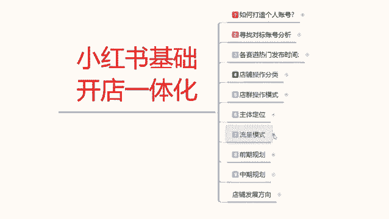
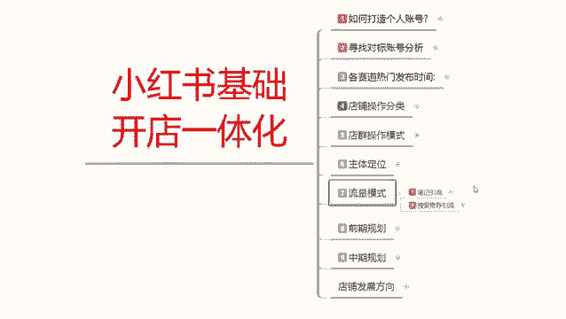
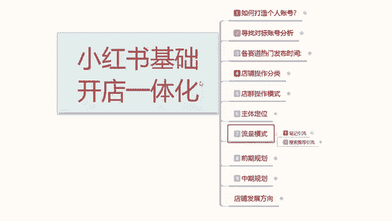
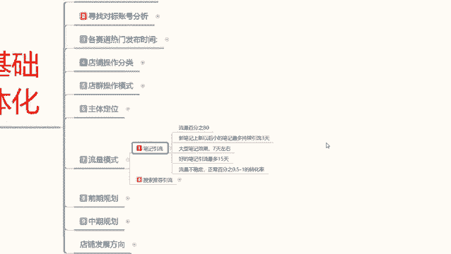
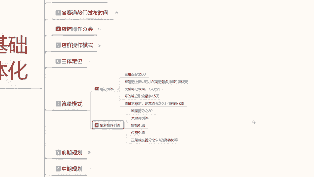
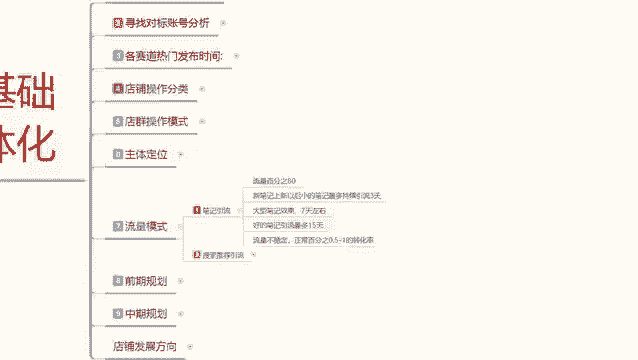

# 【2024版小红书体运营教程】全B站最良心的小红书开店运营高阶教程合集，小红书体开店 起号真的快 - P10：09、小红书开店-笔记引流方法详解 - 煤球很皮实 - BV1Q444eWEP5

大家好，今天给大家讲小红书基础开店一体化呃，这节课呢给大家讲第七课时流量模式，这个流量模式是什么呢，是小红书我们自己的一个属性呃。

就说我们小红书你在开店的时候，你发笔记所获得的一个流量渠道，或者说是我们关键词获得的一个流量渠道，我们在小红书上面你去做店，虽然说小红书上面有3亿的一个用户基础属性，在这个地方。

但是我们其实呢能获得的啊是少之又少的，而且我们还需要去争抢这个流量的一个权重啊，那我们首先要了解一下小红书，它的一个流量模式是什么样的，只有了解它的模式了以后，我们才知道小红书我们做店以后要怎么去操作。

流量模式这一块呢，我是给大家把它分为了两个点。

第一个呢是笔记引流，第二个是搜索推荐引流，笔记引流的话就比较好了解了，就是小红书坐垫，我们去把产品上传以后的话，他是没有任何宣传的，它不像淘宝拼多多，你搜索产品的关键词，你就能把产品搜出来。

在小红书上面，你搜索产品关键词用搜索去做，你也找不到产品，它里面的产品的话只占35%，也就是十个小红书搜索笔记里面可能只有三个，或者说是四个啊，附带商品笔记的一个引流流量。

所以说我们做小红书的时候有两个引流方式，就是笔记引流和搜索引流呃，笔记引流呢它占小红书整体流量的80%，就是小红书，他的流量按100来算，就是3亿80%，也就是2。4，2。4亿，基本上都是在这个小。

小红书的正常推荐流量里面。

其他的一个流量就在搜索推荐引流里面，20%就是这20%才是小红书，在是额商品里面做搜索流量的20%，算下来的话，其实也就6000万，6000万算下来又有35%才是小红书，做商品搜索的。

我们按30%或者40%来计算，6000万里面30%可能的话就不到1000万，也就是800万左右的一个月，用户会在小红书上面去进行产品搜索，那在刨除小红书，他在这个小红书上面做店的这个用户群体。

那你能分配到多少流量就很少了，所以说他这个里面其实也有排排名的一个，流量机制，那我们在操作小红书的时候，他这整个流量模式的话，我们如果说不把它弄清楚，那你在里面你是抢占不到流量的。

我们首先来了解一下什么是笔记引流啊，笔记引流就是我们正常发送的笔记，就是小红书账号创建以后发送的笔记，那个就叫笔记引流，商品引流的话，你需要去用电脑端操作，然后用电脑端登录网页，在网页上面做什么呢。

打开千帆，千帆里面有系统，系统里面的话去你自己的商品上面发布笔记，那个才叫商品笔记，才能做到推荐流量里面的35%的流量，正常的引流笔记里面的话，他虽然说有附带的大概20个左右的话，附带一个商品笔记。

但是这种笔记的数据量太低了，而且那些是排名比较高，推荐量比较好的，他才会有，如果说大家不是很懂的话，你们把小红书打开，就是打开小红书以后，把第一页小红书推荐给你的那个页面关掉以后，你直接在里面去翻。

你看20个到30个里面，可能就会出现一篇引流笔记，而且这一篇引流笔记的一个呃曝光量，展示率和点击率还是比较高的，那是因为他已经把排名做起来了，他才有权重在基础的一个引流，推荐笔记里面进行曝光。

我们新店你刚开始去做的话，你这部分流量你是抢不到的啊，因为你的账号是没有基础的，小红书全程他不会给你去推，所以说我们自己要去操作，而且这个笔记的话就说小红书上面，我们不光要发商品笔记。

我们也要发自己的自然笔记，也就是推荐流量，这80%的一个比例的笔记啊，去宣传自己的产品，这就相当于呃你在电视上面看个广告对吧，或者说是你在玩抖音的时候啊，玩其他东西的时候，玩游戏的时候，做宣传用的。

所以说我们在做小红书开店的时候，你也要做笔记引流，笔记引流你也要做自然搜索也要做搜索，流量就是两个点你都要去做，不然的话你的流量是根本起不来的，那笔记引流的话，他这个笔记它又分为了呃新笔记，大型笔记。

好的笔记三个步骤，为什么，因为他笔记的话它是有时效性的，这里我也给大家列出来，就是我们新账号创建以后的话，小的笔记你正常发不出去的笔记，他引流的话是给你引流三天。

大型笔记的一个引流效果的话，是七天最好的一个笔记引流，就是那些网红博主之类的发的那种，几10万上百万那种点赞的那个笔记，也就15天，15天过后，他这一篇笔记相当于已经被系统录入了，你不主动去搜索的话。

他不会展示给你，懂我意思吧，就是我们新上新的一个小红书账号的话，他最多的持续引流时间其实就只有三天时间，你做好了以后的话可能会达到七天，但是你基本上你的一个流量，点击数据要破千上万。

最少也要在3000~5000左右，不然后续的话他是没有流量访客进来的啊，就是看你的笔记都没有人通过你，你然后通过你的笔记再去宣传你的产品才可以，不然的话你连机会都没有。

那你在小红书上面做点就纯属是一个笑话，你只光去做了我们账号的接触店铺的技术，那你的笔记引流你只做了商品笔记，你没有做引流笔记的话，那你在小红书上面，你把这个店铺开不起来啊，就算开起来你也赚不到钱。

所以说笔记引流我们也需要去做，那这里呢主要就是让大家了解一下啊，笔记引流它也是分趋势的，三天七天四五天，三个笔记引流，三天过后的话，这篇笔记基本上就相当于没用了，所以说我们在小红书上面做店。

你每天笔记的话基本上都是发两篇左右，一个账号每天是发五篇笔记，但是我们给我通过各种实验和了解啊，显示的数据最好的，只有第一篇和第二篇的一个笔记，第345篇笔记的话也有访客啊，也有用户进来进行观看。

但是这种笔记的话，他没有什么权重，他只会拉低你整个账号的权重啊，就是你每天五篇五篇五篇五篇五篇的去发，这样会导致你的账号权重下降，而不会增加两篇笔记，第一篇权重最高，第二篇次字。

这样的话它会让你的账号权重慢慢的上升，让系统认可你，这是最好的一个结果，而且这个笔记的话，大家想一下，你一篇笔记的话，基本上可以引流三天，三天就是六篇，六篇的话你每天引流，你就算是一个新号。

一篇笔记出去的话，大概是50到200个小眼睛，你如果说坚持半个月以后的话，基本上就可以到达100左右到150左右，或者说是一接近300左右，不会超过500的一个比额。

展示曝光量就是小眼睛数量持续时间越长，你的引流效果越好，但是基本上的话你到第500左右的话，就要看你自己产品的质量了啊，笔记的质量你自己怎么宣传，怎么操作的，如果说你操作不好的话。

你的笔记后续引流效果你也跟不上啊，基本上就没有太大的作用，所以说我们在了解他的一个流量模式的时候，你也一定要知道啊，小红书笔记你不管怎么去做新账号，基本上就只有三天，而且每天你必须得发两篇笔记。

了解这个节点以后，你才能去操作笔记引流，这80%的流量，这80的流量做完以后的话，他才会去引流到你的账呃，小红书店铺里面去观看你的产品去进行咨询，你如果说不做这个，我们直接做下面这个搜索引流的话。

你做不起来好吧，额，那这节可能用时间内构关系就给大家分享到这，下一节课呢给大家讲解一下，我们搜索推荐的一个流量，他是怎么进行分配的，我们要怎么去操作。

