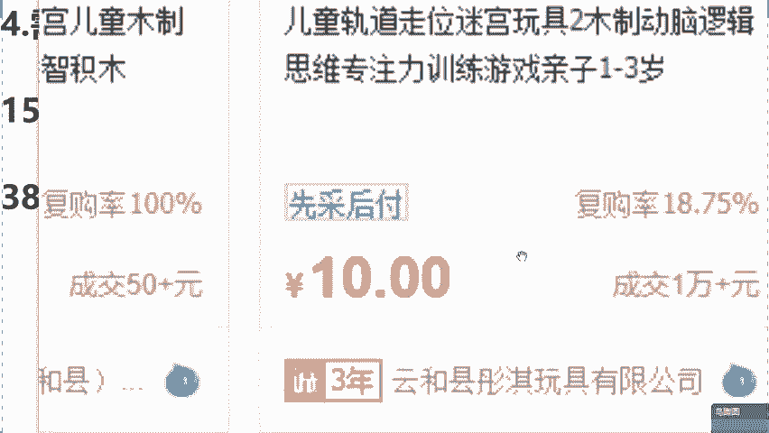
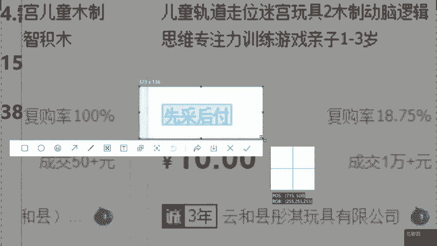
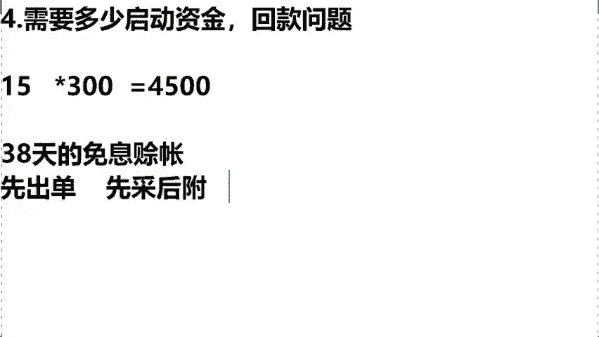

# 【2024版小红书体运营教程】全B站最良心的小红书开店运营高阶教程合集，小红书体开店 起号真的快 - P10：8.新手需要多少启动资金 - 轻轻换一声卿卿 - BV15M48ePEA5

那么在这的话呢我打开我的一个后台数据，咱们也去看一下怎么去提现，好吧，来这是我的一个后台，你们可以看到这是我的一个叫做云朵内衣的，后台，是卖内衣的，这个里边提现金额都在这个上面啊，它上面是有三个板块。

一个叫做银行卡板块，还有我们的微信和支付宝，你当时想提现的时候输入金额啊，把你这个密码输入过后，提现到你的银行卡里边儿，那么在这我说一下，我刚才所反复强调，小红书是在鼓励新手去卖货赚钱。

所以他给我们的扶持是非常高的，你作为新手，你在提现的时候，他不会收取你任何一分钱的佣金，明白了吗，你今天咱赚多少钱，这个钱直接到咱们的口袋里，明白了吧，这就是我们今天所讲到的小红书店铺啊。

我们今天客服问题，售后问题，回款问题，来各位这三个点，大家听明白没，有明白的话，把明白两个字给老师，我打在公屏上面，有人说老师我今天做你的1/3就行了，我今天教给你们的玩法。

是完全copy了我自己一比一复刻的玩法，你能做我1/3吗，你怎么得做我一半啊，是不是啊，那么如果说这个位置大家都听懂理解的话呢，接下来来讲到今天的第四个问题，就是我们说这个小红书啊。

很多人可能去担心老师，我作为这个小白同学啊，就担今天做店铺需要这个拿出多少启动资金呢，对吧，包括回款的问题啊，我没有钱该怎么来做呢，同学们，前面我也说到过了啊，嗯你今天哪怕你是零启动资金。

我能让你们去照样的去开店，照样去拿货，你照样去赚钱，来同学们，我问一下这个方法想不想学，零启动资金怎么去开店，怎么去赚钱，如果说来想学的话，公屏飘花，我去看一下。

我来告诉各位这个方法到底应该来如何去学习，到底应该来如何去做，对不对，都想学，是不是啊对啊，那你就要认真听课，不要走神，竖起耳朵给我好好的听啊，嗯我在这儿去举个例子。

你比如说我们今天啊咱们这个爱在同学是吧，你今天去拿货了，你的拿货成本价是15元一单啊，如果今天你去店铺里去卖了一单，你是不是要拿出15元去垫付货款，同学们，你要知道。

小红书官方给我们的流量扶持是非常多的，你是非常容易去报单的，什么叫报单，你比如说咱今天我们这个无奈同学，你今天可能说只有一单，但对不起，明天流量激增，直接100单，后天直接1000单，你突然爆单了。

把这个流量增长了怎么办呢，我直接可以去拿一个同学的后台，你去看一下啊，什么叫做爆发式增长，来我哥们去点开去看一下这个学生，他的第一个月啊，同学们店铺数据只有一个单子，您看到了没有。

那么第二个月直接去报了多少个订单，报了5000多个订单啊，同学们直接是做了一个8万7销售额，那这个时候怎么办呢，你比如说你今天你跟他一样对吧，你也报单了，你拿货成本价，同学们15元钱。

咱们今天这个你就算少一点，你就报了300个单子，对不对，你是不是需要这个时候让你拿出4500，去垫付货款呀，所以同学们我想问一问大家，就如果说你去做小红书的时候，你去报单了。

需要你拿出4500去垫付货款的话，大家能拿的出来吗，如果说你能够拿得出来的话，你在这儿给我打上个能字，如果说老师啊，我今天我拿不出来的来，你在直播间把不能两个字给我敲好了，我去看一下，有说能的啊。

有说不能的，是不是啊，我看到了啊，很多人都说不能是不是啊，那么同学们我来告诉大家，有敲能有敲不能的，这两个方式分别应该如何去做呢，其实同学们我知道啊，对于我们今天普通人来讲的话，肯定四五千块钱是有的。

那如果说你现在连四五千都拿不出来的话，我们就需要你静下来想一想了，在做小红书之前，你当下的这个行业做的到底对不对呀，能不能够让大家去赚到钱呀，对不对，所以如果说你今天能够去拿出货款的时候。

你这个时候拿着自己的一个流量的启动资金，你去垫付货款就可以了，我们在小红书赚钱呀，他是最晚十天啊，去到账的老师，我是从小白去过来的，所以说今天公屏上打不响，同学啊，我真的没想到是什么老师。

我不是拿不是拿不出来，我是不想拿出来，我非常懂你们，那么像这样的同学怎么办呢，听好了，如果说你不想拿的话，我们今天直接选择选择平台的，叫做38天的免息赊账，意思是说我们去先拿货啊，你不要付钱。

等到这个货你卖出去之后，把钱还上就可以了，领启动资金就可，OK不需要你去压货，咱们就卖的出去，你卖了你就赚钱，你没卖，OK咱没有任何的损耗啊，包括这个商铺的成本呢，这跟咱们没关系，这是商家的事。

明白了吗，那今天具体来怎么去做呢，我在这现场的啊，去演示一遍，跟住了我，你比如说我们今天还是老师啊，我想去卖这个拼图，对不对，那我今天去找厂家去拿货了，我现在拿不出来这么多钱怎么办呢。

来你会发现在拼图下方它有四个字，同学们先踩后富来。

同学们啊，能够看到这四个字，先踩后富同学公屏上打上，看到两个字。

能看到是不是，其实的话同学们这个先踩后富，不用我去讲对吧，字面意思啊啊都能够去理解，这个是1688，给到我们的一个新手卖家的扶持，最开始叫什么叫38天的免息赊账，意思就是说先拿货啊，不要付钱。

等你这个回款过后，把钱还给平台就OK了，这是1688在鼓励新手来做生意，给的一个政策，明白了吗，那么在这同学们先载后富的流程，听好了，我来去捋一捋啊，首先啊咱们今天第一步的话，你得干嘛，你得先出单。

同学们，你出单过后，为什么这个时候省掉了咱们的一个，你压货的一个钱啊，包括来讲老师我这个囤完货之后，这个商品损耗的问题，第一个点不用你去压货了，明白没有，你先去卖掉它，第二个一定记住了。

当你去卖完过后啊，选择先财后富，不要先把他个前驱，我们先赊他的货，把厂家给他发出去，你赚钱过后，他是最晚十天去结算的，我们只需要在38天之内把这个钱给他还掉，就OK了，现在借花呗是一样的对吧。

你比如说你设置的是20号还啊，你在15号发工资了，这个时间对于咱们来讲是绰绰有余，完全足够的，明白了吗，所以不管说今天你是不想拿出来的对吧，还是说你现在是没有钱，同学都可以选择这个免息赊账。

来我问一下大家呃，就如果说你们接下来用这个方法去来做，小红书平台的话，你们觉得可以吗，这个模式如果说能够去接受同学，你在直播间啊，把可以两个字给我打在公屏上，能接受，是不是这个我们是去讲到的。

就是如果说你一下子出单太多啊，怎么办，是不是我讲的也很清晰了，选择我们的一个先踩后富，那么如果说都听清学会的话，同学们来讲一下今天的第五个问题，我看到说老师这个非常可以，是不是。

这对于新手来讲真的太好了。

