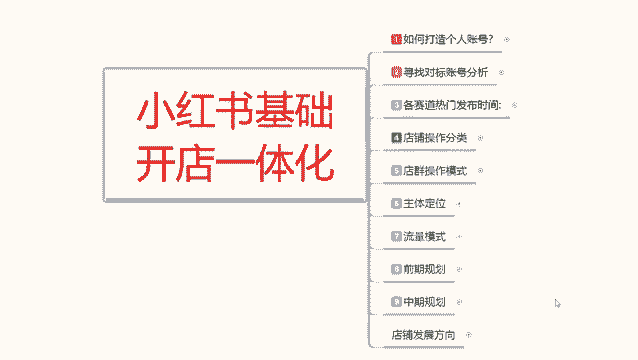
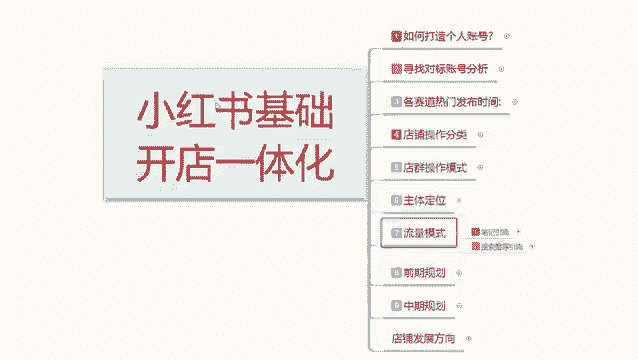
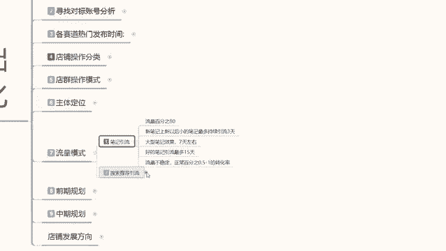
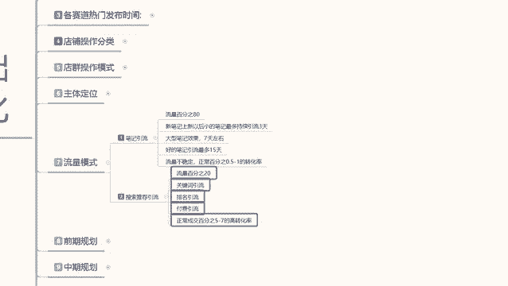

# 【2024版小红书体运营教程】全B站最良心的小红书开店运营高阶教程合集，小红书体开店 起号真的快 - P11：10、小红书开店-搜索推荐引流方法详解 - 煤球很皮实 - BV1Q444eWEP5

大家好，今天给大家讲解小红书基础，开店一体化的一个操作呃。

第七课时流量模式的第二个内容，搜索推荐引流。

上节课呢给大家分享的是我们的一个笔记引流，就是我们基础的一个小红书系统推荐流量。

它占比整个流量比例的80%，包括你笔记发送以后，每天能获得的一个大概流量比例，还有笔记引流所持续的一个时间，第二个呢就是搜索，今天主要给大家讲的就是说搜索推荐引流，他虽然说整体占比。

流量的话是小红书流量比例的20%啊，就是系统正常分配的话，搜索流量比例的话大概有20%左右，而且这个数据的话它还在持续增加，同样的小红书，这个20%的搜索流量比例里面的话，它不是百分之百都是商品啊。

他有65%以上都是正常的，一个引流笔记，只是你搜索关键词以后的话，它系统推荐把有同样关键词的一个笔记，推荐给你了，因为小红书机系统它不是纯卖货的一个平台，知道吧，所以说他这个里面的话掺杂的所有流量的话。

基本上都是推荐流量，我们如果说去做搜索的话，它里面只有35%，接近35%，还不到接近35%的一个商品流量，就是我们在正常的发布商品以后的话，它里面有一个商品笔记，我们发布这个笔记以后的话。

只能争取20%里面的30%，之前也给大家算过，可能的话就是800万到900万之间，这帮用户的话，他会去购买商品，那这800到900万之间，他是靠什么来进行排名的呢，就是关键词引流排名。

引流和付费引流这三个点，这35这35%的流量的话，就是按照这个比例去分配分配的，35%里面付费流量占比15%，排兵引流占比30%，关键词引流占比30%，排名引流是你的销量排名啊，交易排名。

关键词引流是你的主关键词，就是你产品的别称名称啊，你比方说短袖T恤，化妆品，美容美妆对吧，理发工具，汽车装饰等等，这些主关键词边用户进行搜索的词汇，它占比啊，付费引流是15，排名引流是接近30。

其他的都是关键词引流，这35里面他还给你这么划分了啊，关键词义你就55，排名你就35哦，关键词排名50%，排名引流是35%，付费引流15%，这是占了35%的概率里面，也就是说我们做关键词的话。

你只能在这个800万里面，截取50%的流量，就是400万，这是关键词排名，如果说你的商品销量比较好，成交金额比较高，那你可以占比35%，如果说你在小红书上面去付费，让小红书系统去给你啊。

抢排名就类似于呃怎么说呢，淘宝的直通车，钻子等等之类的东西，他去做的话占比15%，当然这个是花钱的，你正常，如果说你在小红书上面去做那个付费引流的话，你只有做到中后期了才会去做这个前中期的话。

你这个碰都不要碰，一碰就死，因为你把数据一停，你的店铺就死掉了啊，基本上是都是中后期中后期去操作，所以我们正常抢抢占的话，就是85%的一个流量啊，就是800万里面85%的一个流量，你换算下来的话。

基本上也就只有700万左右，700万左右，关键词占多少呢，对不对，占一半，一大半，接近70%，你的一个排名引流占30%，也就是你的销量成交金额，关键词的话就是你的主关键词进行搜索以后。

别人对在你这成交的一个数据反馈啊，收藏加购成交比例，转化比例，这都是由系统去分配的，而不是说某个人去确认，我只能说是把大概的一个数据给你们进行分享，让你们了解我们自己在做小红书的时候，他的一个引流模式。

你不能说小红书3亿用户进来以后的话，就每天就几个访客，有时候连访客都没有对吧，我笔记也发了，数据也做了，什么都起不来，那是你自己的方向，目标定位都没有找准，懂我意思吧，所以说我们在做小红书的时候。

你一定要先了解他的流量模式，了解我上面给大家讲的啊，确定自己的店铺定位，确定自己的主体，确定自己做什么，你只有有思路了以后，你后续才能去做，你思路都没有的话，你盲目的去操作，你在小屋上面做不起来好吧。

这个呢，就是小红书整个流量模式的一个运行方式啊，当然了，大家也会说，他这里面还有一个关注页的一个流量，那个流量的话不计算在承重范围以内啊，关注页的流量跟你没有任何关系。

然后现在小红书上面还有一个商品渠道，那个商品渠道他是额外出来的一个排名系统，你在里面的话，你自己虽然说那个排名系统出来了，但是它的一个整个数据的话，它还是按照排名引流去做的，那是都是卖的好的才能上去。

你卖的不好，你根本上不去，我们前期开新店的时候，你就不要去考虑在那个里面去做了啊，看在那个面里面去做，你最少要把店铺做一个小爆款出来，你才能卖，不然的话你那里面的排名你抢不到。

所以说那些都跟我们没有关系，我们把握现实一点，你就只能抢到那80%和20%，流量里面的一个数据，80%是做引流的，而且它转化率特别低，基本上不到1%，高的话也就0。5，正常的话就0。3左右。

就是1000个访客里面可能成交三单还算多的，但是这个搜索引流20%的一个流量的话，这个里面的一个转化率可以达到6%，到10%，就是在小红书做搜索引擎，只要他是去搜商品的，他的转化率都很高。

大家一定要把这个点弄清楚啊，所以说我们做的时候，你不光要做引流笔记，你也要做搜索推荐引流，去抢占关键词排名的一个引流，去抢他们排名啊，去琴行关键词搜索付费暂时就不要管了，因为你在小红书上面前期做付费。

你把握不住啊，你也操作不了好吧，那这一节课呢就给大家分享到这，下一节课的话给大家啊讲解一下，我们店铺前期的一个规划，就是店铺你前期基础要怎么做，你的商品才能卖出去，你如果说没有这个规划的话。

你前期的一个啧呃店铺，你居然小红书账号开了以后的话，你销量零属性，零账号没有权重，你产品都卖不出去的。

