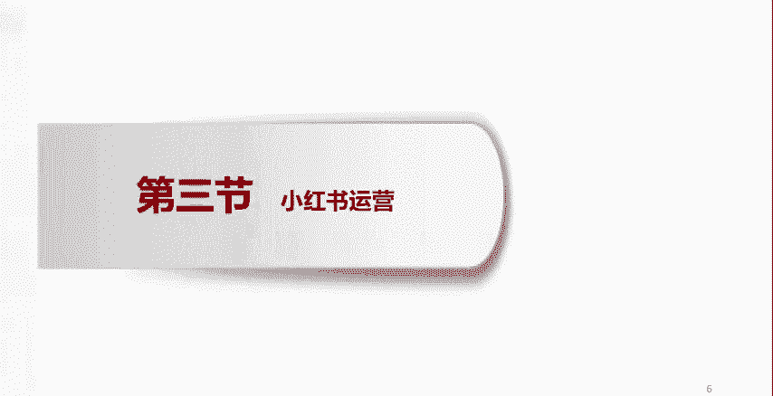
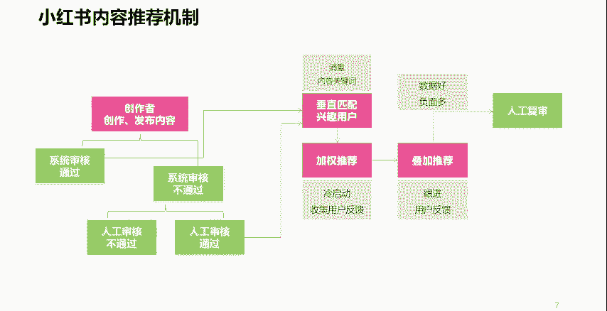

# 【2024版小红书体运营教程】全B站最良心的小红书开店运营高阶教程合集，小红书体开店 起号真的快 - P11：3.揭秘小红书内容推荐机制 - 红书开店教程 - BV1MVWDe6EAp

好接下来呢我们看，那么小红书既然是这样一个平台，那我们应该怎么样去运营它呢，是我们写点笔记，流量就会来吗是吧，这个时候呢我们就要不得不考虑，小红书最根本的一个点，就是小红书的一个什么呢，流量机制。

小红书的流量机制，小红书的内容是怎么样让用户看到的呢，它的流量是怎么来的呢，那么讲到这儿呢，我们呢先跟大家说一下，小红书这个平台呢是一个去中心化的平台，或者说呢也有人把它叫做什么呢，是有一个什么呢。

智能算法在里头的，它有一套算法机制在里头啊，我们跟着这个例子往下走啊，比如说，在座的各位，你们是创作者，你们创作发布了一个什么呢，小红书的笔记内容哎，通过小红书发布出来，发出来之后呢。

哎小红书的这个算法系统呢先进行一个审核，如果系统审核哎，你没有违反相关的法律法规啊，没有违反小红书的一个社区公约啊，就是它的内容的一个规范，没有违反这些就会进入到下一步，如果说你的内容做出来之后。

系统审核之后发现有问题，有违规问题啊，那么他就不会给你通过，那么因为这是系统审核，我们都知道系统再智能化，它也智能不过人的大脑对吧，所以呢系统审核不过之后呢，会有一个什么呢人工审核的环节啊。

这也是这这这种平台呢对我们每一个创作者呢，可以说是很大的一个尊重，而不能说系统不过就不过了是吧，它会启动一个人工审核，那么如果人工审核还是不通过，那你这个内容到此为止，你不会再有任何的流量了啊。

好接下来如果说人工审核通过了，人工审核通过，人工审核通过了呢，跟系统审核通过一样，会进入到下一步，那么进入到下一步呢，系统呢还会进来进入下一次，下一轮人的这样一个什么呢，审核什么呢，消重，什么叫消除呢。

就是大家想一下，任何一个平台，都不希望自己的用户看到的是重复或者，高度近似或雷同的内容，对不对，所以说呢这个算法系统呢，会先对我们每一位创作者创作的内容呢，进行一个什么呢，消重就是重复度方面的。

相似度方面的雷同度这些方面的一个检查，看看我们做的这些内容，是不是跟小红书平台上，之前某个用户创作的内容很像，高度近似或者是雷同或者一模一样，那么如果有这种情况，它的系统呢就认为你这个内容呢。

触发了这样一个消除的条件，那么你这个内容呢就会被系统消除，那么被系统消除会怎么样呢，没有流量，你的内容基本也就到此为止啊，除非说你的账号有点粉丝，那也就粉丝能看得到，看一看就可以了，那有的人说。

那我的内容要是消重也通过了呢，我没有被系统消除，我的这个内容是我自己的真情实感，我自己原创的，那下一步会怎么着呢，下一步呢小红书的系统呢会基于你的内容，比如说你写的标题呀，哎你做的图片呀，你拍的视频啊。

你写的笔记的那个文字内容啊，那篇文章啊啊或者那几句话呀，它会通过这个内容来识别你的内容，是属于什么样的定位，属于什么样的分类，当它识别到你的这个内容是属于什么分类，什么类别的时候呢。

他就开始什么呢去检索唉，在我整个小红书的用户当中，有哪些人是对这类内容感兴趣的啊，他呢先找到这样一些人，先找到小部分的这样一些人，先把你的笔记的内容呢展现给这些人看，看这些人啊刷小红书的时候。

看到你的内容会不会认真地阅读，会不会给你点赞，会不会评论，会不会收藏，或者说会不会成为你的粉丝，他要看这样一个用户的行为啊，如果说用户的行为说哎大家刷到了你的内容，好多人在看是吧，而且会有人评论。

会有人点赞啊，会有人收藏，会有人关注你成为你的粉丝，那么它的系统就认为你的内容是一篇好内容，既然是好内容，那么它的系统就会给你往下接着推，推给更多的匹配兴趣匹配的用户去看，但是如果说你的这个内容。

小红书这个系统给你小批量的推给了一些人，这些人刷到你的内容呢，并没有去什么呢，并没有去看，或者是进去刷了一下，闪了一眼人就跳出了，没有评论，也没有多少点赞啊，或者是也没有什么人关注你。

那么小红书的系统呢，就会认为你的这个笔记内容呢，质量呢一般或者是质量不好，不不受用户的喜爱，那么像这样不受用户喜爱的内容，那小红书的系统当然也知道，它不可能让你这个内容给更多的人去看，对不对。

唉所以说你的用你的内容，只要用户愿意看，愿意给你评论点赞，愿意跟你互动，愿意关注你，达到了他的一个衡量标准，那么就会进入到下一步，以此类推，那么在这样一个不断的给你叠加推荐，这样一个过程当中呢。

如果有人哎觉得你这个内容有问题，给你举报了，或者是投诉你了是吧，向平台投诉你了啊，或者是什么呢，在评论区里头爆你的一些黑料负面，那你想想任何一个平台的运营方，肯定他要考虑这样的内容被用户举报了。

被用户投诉了，或者是给用户带来了一些不舒服的体验了，那么像这样的内容，平台是不是要再去认真地定夺一下呀对吧，所以平台呢就会再次启动一个人工复审，他要去判断你的内容，是不是真的能给用户带来不舒服的体验。

你的内容是不是真如那些投诉举报里所说的，存在那样的一些问题，如果有你的内容也就到此为止了，不会再有新的流量增长了，如果人工复审说唉你不存在是吧，没有他们反映的那些问题啊，没有那些问题。

那么你的这个内容呢，就会根据实际的效果反馈啊，接着往下推荐啊，接着往下推荐，所以说大家听完这样一个流量机制啊，听完这样一个流量机制呢，也就明白了，这就是为什么大家在用小红书的时候。

发现你看什么样的内容越多，你就会收到什么样的内容啊，越来越多的收到什么样的内容，因为它识别到了每一个用户的兴趣兴趣标签，它也能读取到每一篇笔记内容的什么呢，标签定位，甚至是每一个账号的标签定位。

从而呢它的系统呢做了一个匹配性的一个推荐，对吧。