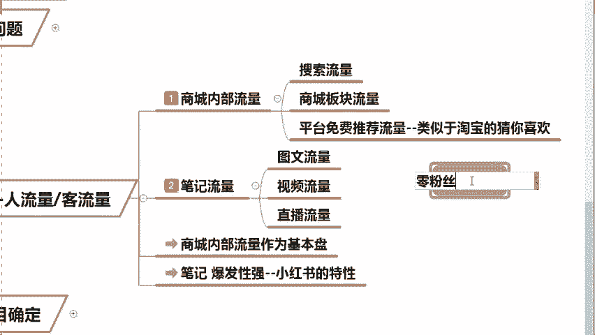
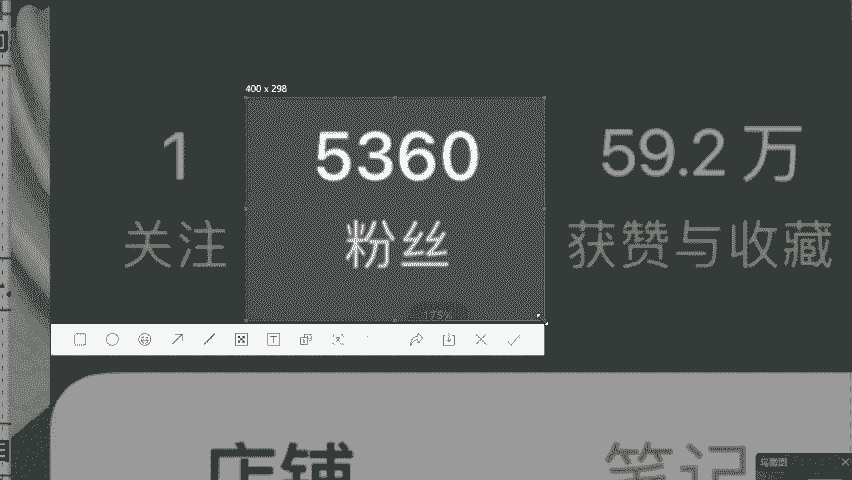
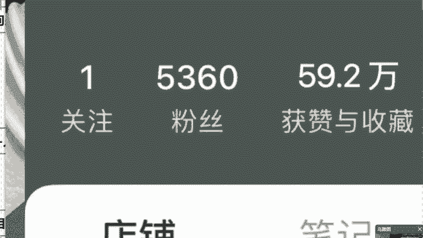

# 【2024版小红书体运营教程】全B站最良心的小红书开店运营高阶教程合集，小红书体开店 起号真的快 - P11：9.流量来源—商城内部流量 - 轻轻换一声卿卿 - BV15M48ePEA5

那么我再来讲一下，咱们今天第五个非常关键的啊，就是说老师我今天把店铺开完之后，那么流量的问题怎么来呢，对不对，同学们，我们要知道啊，你无论是做小红书也好，还是做其他平台也好，流量肯定是最关键的。

就如果今天你们说店铺没有流量的话，你没人去进店的话，你产品再好也是卖不出去的，对不对，所以说小红书怎么去获取流量，我在这儿去具体的去讲一下第一个啊，小红书平台它的流量主要是分为了两个板块，哪两个呢。

首先第一个就是我们的一个内部流量，叫做商城的自带流量，那么第二个呢，内部流量又分为叫做搜索流量和，平台的免费推荐流量，第二个叫做笔记流量，笔记的话就是我们今天这个图文唉，视频直播的流量。

今天的话我会把这六个板块讲的非常的清晰，那么第一个什么叫做搜索流量呢，流量从哪来呢，很好理解，就比如我们平时你在小红书上啊，我们说想去买一件睡衣，是不是你去搜索睡衣过后。

你会发现这个上面会有很多很多的关键词，这些关键词在小红书上热度都是比较高的，我在写标题的时候，在写笔记的时候，这些词语我全都加上，因为流量是非常大的，那么当我们今天搜索完睡衣过后。

你会发现它会出现非常多的关于睡衣的产品，你就可以点击它来进行购买了，跟淘宝是一模一样的，只不过是换了个平台，这个呢叫做搜索流量，那么第二个我们说叫做内商城的内部流量，什么叫做商城内部流量。

当你进入小红书过后啊，我们可以说在他首页的旁边，它会有一个叫做购物的板块啊，跟淘宝是一样的，但是不一样的是，这个是小红书单独的一个商城，你点击过世之后的话，你会发现这里边有很多不同的细分类目啊。

比如说手纸啊，围脖啊，对不对，包括这个纸巾呀，想买什么，点击对应购买就OK了，当这个时候说，我们今天这是商城的一个独立的一个流量，同学们，这是第二个内部流量，那么第三个呢叫做平台的。

猜你喜欢这个是什么意思呢，就是平时啊小红书会根据你平时浏览的习惯，根据你搜索的一个习惯去猜你喜欢的用品，比如说我呢我老是我自己的话，我是女生嘛对吧，我特别喜欢买口红，我的小红书猜你喜欢这一块全都是口红。

当我想买的时候，你连搜都不用搜了，同学们他去省掉这个过程，想买是不是推荐放在这里，然后你点击购买就行了，这是我们今天小红书商城的内部的三个板块，那么讲到这儿的话，直播间同学们肯定有会有疑问。

说老师我今天的话我是零粉丝呀，我怎么去获取这些流量呢，我是零粉丝，怎么出单，怎么去赚钱呢，在这儿我们就要提到小红书的一个特性了，咱们今天你店铺的粉丝量，跟你的出单量是没有任何关系的，什么意思啊。

你今天哪怕是我们的零粉丝，你也可以去出单赚钱。

明白了吗，你像我有个学生，我举个例子啊，他是这个卖袜子的，这个袜子到现在为止的话，卖的是这个冰凉鱼骨袜，夏天的销量特别的高，同学们在一个夏天是卖了9。8万个订单，同学们肯定会说，老师你这个学生卖的多。

肯定是粉丝特别高啊，来我给你证明一下，他虽然已经卖了9。8万个订单，可是粉丝数量才只有5360，而且来讲，这里边还有一大半是他发布完作品之后，它有销量了才涨的，明白了吗。

所以说你的这个卖的销量，跟你的这个出单量是没有任何关系的，零粉即可开店赚钱，这就是我们今天小白为什么可以去，这么容易做起来的原因。

