# 【2024版小红书体运营教程】全B站最良心的小红书开店运营高阶教程合集，小红书体开店 起号真的快 - P12：10.流量来源—笔记流量 - 轻轻换一声卿卿 - BV15M48ePEA5

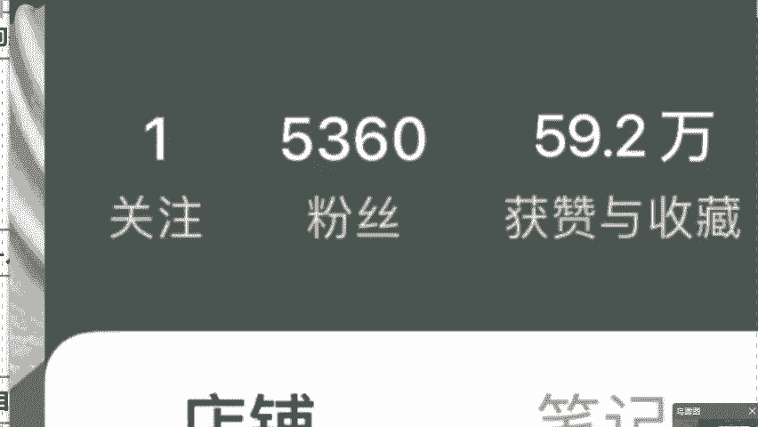

那么我再说一下，咱们今天第二个板块叫做咱们的一个笔记流量，笔记这一块啊，我一定要去重点去说一下呃，因为说小红书，笔记流量是爆发性最强的一个板块，咱们所提到的这个商城流量，可能说是一个小红书的基本盘。

同学们每个人都是可以去有的，但如果今天你想让店铺去报单，想去把它打造成爆款店铺的话，一定要去学会了利用笔记接商单赚钱，同时的话呢利用这个笔记来给店铺去引流，同时打造咱们的一个爆款店铺。

让小红书达到一个1+1大于二的效果，老师我最擅长的就是这个板块，我强调一下，笔记的话分为三种吧，第一个叫图文，什么叫图文啊，啊很简单，你拿你发一个图片对吧，然后呢下方你去挂上一个文字内容，同学们。

这就叫做我们的一个笔记了，那我去说一下啊，刚才我所提到过一个词叫商单，对不对，我举个例子，比如说咱们之前这个国产品牌完美日记，来，我问一下听过完美日记的同学，公屏上打上一个一字。

咱们之前这个完美日记对吧，都听过，是不是销量不高，哎知名度不高，那么品牌方想把这个知名度销量做上去，只能干嘛呀，打广告，对不对，你像你平时啊这个电视剧里边儿啊，这个什么。

还有各大平台里边找明星去代言的话，他花销是巨大的，动不动就是几10万上百万往里去砸，但是咱们今年啊，给我们证明一个道理，叫做农村包围城市都听过，是不是，所以后来的话完美日记改变了商业策略。

与其花大笔的资金，几10万上百万去打广告，请明星代言，我为什么不把这个钱拆开呢，我找无数个自媒体人，找博主给我去打广告，去做推广啊，这个费用省下来不说，铺天盖地的宣传也达到了，对不对。

而且我们去讲到的小红书官方定义，它是一个购物分享的平台，你想一下一个购物分享的平台，消费者带着购物欲望来的，我再做一个宣传，这个是不是直接一个对症下药，一打一个准儿啊对吧。

所以说小红书官方推出了一个计划，叫做蒲公英计划，很好理解吧，蒲公英这个花一吹是吧，种子撒向了大江南北，能不能理解这个是蒲公英计划，我刚才提到的商单这两个字，而且我强调一下，咱们不是在说老师啊。

我今天没有粉丝怎么办，我能参加这个商单吗，对吧，我给你看一看，我这个学生他只有1000多个粉丝，但是你看一下官方评估他的笔记，同学们多少钱对吧，你来看一下同学们啊，咱们这个啊同学们1000多的一个粉丝。

官方估价笔记350块钱，他平台不看你浏览点赞多少，只要你发了它规定的内容，挂上固定的商品链接，只要你发了钱打到我们的账户上，就这么简单，同时的话小红书作为一个这个购物分享的平台。

它最不缺的就是我们那个品牌方，所以你不用担心说这个接不到商单，你只会接不完，明白了吗，没有接不到，你像我这个学生粉丝只有这个1000多是吧，但是你看一下他的这个待接商单，还有65个单。

那么在这我们去算一笔账，我算你懒一点对吧，老师我没那么多时间想给小红书做个副业的，是不是你今天一个商单350吧，你每天的话你只接一个是吧，一个月的话咱就发他30条多少钱，一个月是不是1万多块钱。

我这个还不算咱们今天产品的销量呢，我再给你算少一点，哪怕说咱今天产品利润就20一个月，利润不能太高，就卖100单，你今天加在一起是不是轻轻松松，我们说能够达到一个1万多的一个纯利润呢，对不对。

来讲到这的话，直播间各位对这个商单模式能够去听懂，理解的啊，同学们对这个收益是满意的，同学你给我打上满意两个字，对吧，那么今天同学们啊，如果说对商单满意的话，一会我会来教给大家商单笔记该怎么来做。

包括来讲今天这个图文问题呀，图片问题啊，原创笔记怎么去做，不要着急，一步步去来，那么这个商单笔记什么意思呢，很好理解，就是像我们今天在小红书平台，你去发几张图片对吧，然后呢在这个图片的下方。

我们去挂上一些这个商品的一个链接对吧，使用心得，同学们，这就是一个简单图文去做好了，那我们在做这个图文啊笔记的时候，你重点在哪呢，首先就是咱们的一个首图啊，你门面是最重要的呀，我们今天做作品。

首图一定是会直接影响点击率的，是非常重要的，那我也说过了，老师，我今年的话带着我团队测评了10万多，这个款的爆款商品，所以你做图文首图的话，我来替你去提供海量的原创素材库，图片问题不用担心了。

那么这个点我替你去解决了，其次就是大家头痛的文案的问题了，很多人那可能会问老师，我来做这个图文笔记，今天我文案也不会写呀，对不对，同学们，我咋来做一个原创的文案呢，我今天会教给你，同学们，作为小白。

这种图文笔记不会做的话，唉我来教给你一下，你是不是三天憋不住七个字的呀，那么听没听过这几个词叫做人工智能AI生成呀，来听过的话，公屏飘花啊，没听过的话，公屏扣一，咱们去学一下，是不是不会咱就学。

对不对对，最近比较火那个梗，你天生就比别人笨呐，对不对，不会就学嘛，是不是。

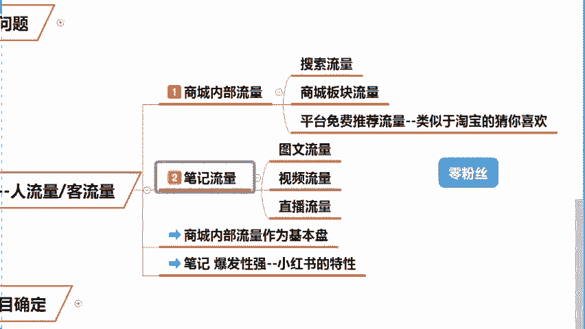

那咱们今天这个图文笔记就是利用AI去做的啊，直接利用按钮，不需要你有这个基础，拿出两根手指即可变现赚钱，同学们，而且我强调一下，不论对于这个小红书也好，还是说其他平台也好啊。

咱要吃就要吃流量池里边第一批的流量，因为我说过了小白啊，新手卖家他这个流量是有扶持的，一篇原创笔记，他可以有几万甚至是几10万的曝光，但如果说你是伪原创啊，对不起，平台的话，会严重会限流啊，直接会封号。

这个是平台对于原创作者的一种保护，那么AI怎么去生成文案呢，来在这儿啊，我给你看一下我团队研发的一款软件，这个呢是一个综合性的软件，我今天就单单拿这个小红书来做一个举例好吧。

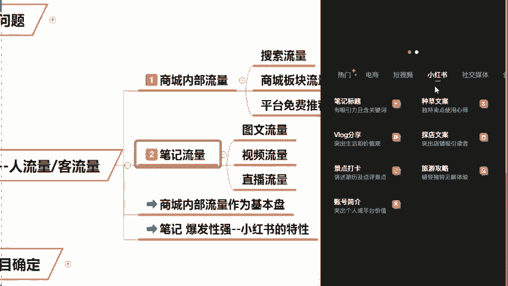

咱们点击进入小红书板块，你可以看到这里边啊，针对这个不同的板块都进行了细分，比如说笔记标题呀，这个VLOG分享啊，探店打卡呀，包括来讲我们说这个旅游啊，是不是这些种草文案的话板块都全了。

我今天拿这个种草文案来举个例子，是不是种草的文案啊。

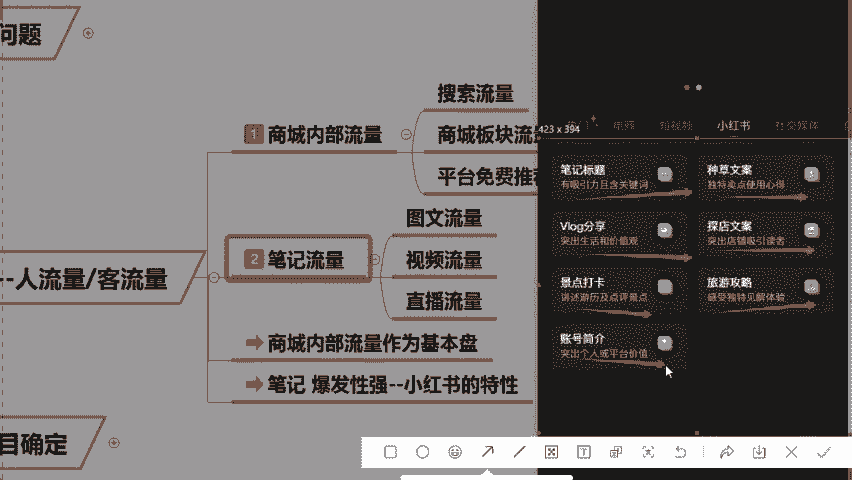

我们今天种类有很多，比如说这个美妆啊。

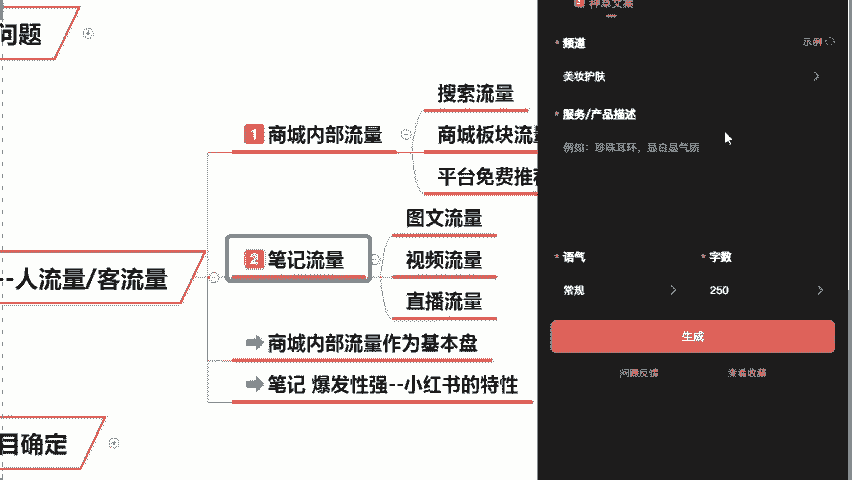

啊比如说我们这个健身减脂啊对吧，淘宝呀这个啊珠宝配饰啊，家居呀，心理啊，美食啊，这些什么都有，我今天想写一篇关于这个配饰的笔记啊，那我们今天选择诶珠宝配饰，点击它。

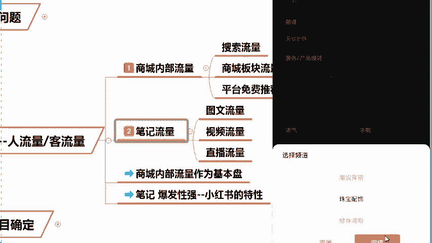

那么同学们，我今天的话呢我本人啊脸比较圆，那么我作为一个女生，我想买一个耳饰，是不是，那么我今天要求就是诶圆脸显瘦，对不对，那么显瘦过后，同学们在下面语气的话。

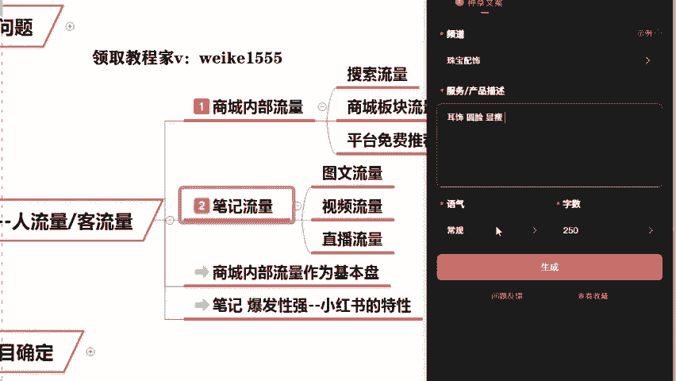

你可以进行去这个筛选，比如说常规一点的对吧，比如说友好一点的，高大上一点，奢华一点的，写的轻松一点，对不对，专业一点的呀，你都可以进行去选择，选择好过后，在这我强调一下啊，这个字数方面。

本款软件我设计的是250字以上，叫做测评类笔记，250字以下它叫做什么呢，叫做我们的一个正常的一个笔记，明白了吗，应该说这个测评类笔记呃。

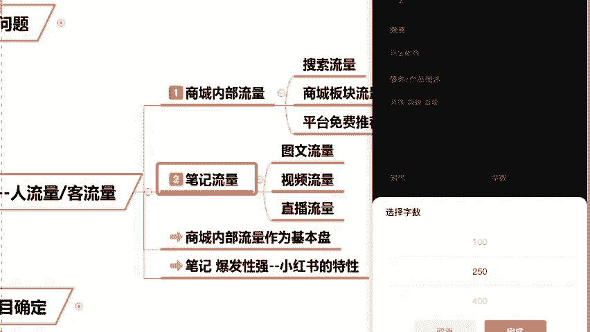

流量是非常大的，同学们，您只要今天点击完成之后，点击生成来，我们今天等待个几秒钟的时间，同学们，那么在等待的过程当中啊。

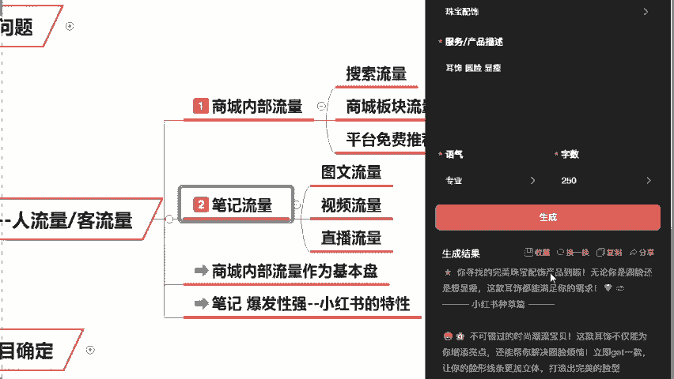

我问一下，如果今天这款软件可以让你去解放双手的话，同学们，你觉得说这个软件可以还是不可以啊，可以的话，来随便往这个呃公屏上扔点什么就可以了，来生成了吧，同学们生成完成之后。

你会发现在这个我们AI软件的下方，它还有一个叫做耳饰，圆脸显瘦配饰个性风采，这些叫做爆款词条，由AI自动替你去生成了，明白了吗，所以说啊刚才说老师啊，我今天不会写文案的老师，我今天我懒。

我就不爱写文案的话，对这个AI生成的话，你满不满意，对不对，能不能让我们今天用简单的方法，赚取最多收益的，同学们来满意的话，你给我打上可以两个字，对不对，那么我来说一下啊，呃你们今天如果说去满意的话呢。

对于这个软件也没有必要去这个花钱去购买，因为大一老师我的话，我的学生这些文案工具，我可以去免费的给到大家啊，如果说你今天呃你得保证认真听课啊，同学们，你得听完课，今天是想要的。

想要这个软件来帮助我们去快速变现的话，你现在啊在公屏上给我敲上一个响字，那么老师来截图帮我记录一下，敲了响字的同学啊，课后啊加上我的微信啊，进行去领取就可以了，还是那句话，能够去帮大家的啊。

我来去尽量的去帮助大家，这都是没有任何问题的，同学们手速要快啊，但是不要反复去打啊，同学们这个嗯太占那个名额了，是不是嗯包括同学们在问到的老师，这个视频笔记是什么呢，我来说一下这个视频笔记啊。

你比如说我在这儿给大家通过一个视频，直观的去看一下啊。

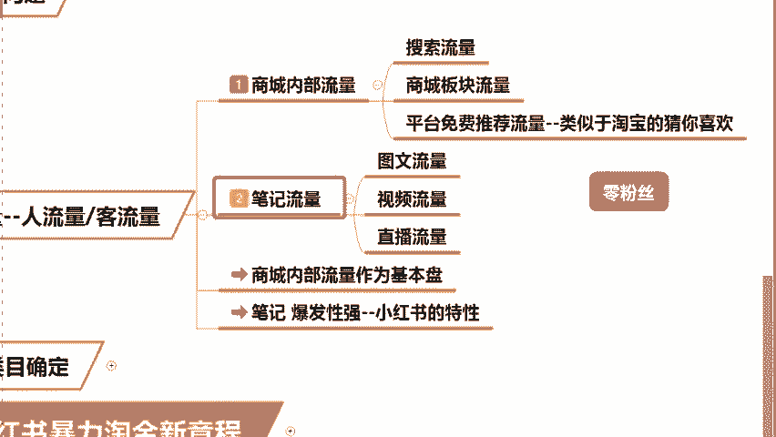

你看你平时啊我们在这个刷视频的时候，你可以看到这是一个头绳，这是一个头绳的视频，是不是他会在这个商品的下方，给你去挂上一个商品链接头绳吧，这个例子我举的不太贴切，来同学们。

我问一下有没有说平时老师我上厕所的时候，我随便拿出手机，我一刷啊，我这个卖手机壳，他卖三块八啊，五毛五的对吧，我封我，然后我点击下单，同学们，这就叫做我们的一个视频笔记来，你买过的话，你公屏扣一。

我去看一下对吧，我经常干这个事儿，手机壳啦，香薰啦，对不对，包括来讲这个手纸啦啊，各种各样的东西，我啥我都买，同学们，所以你会发现，这个视频笔记的流量也是非常重要的啊。

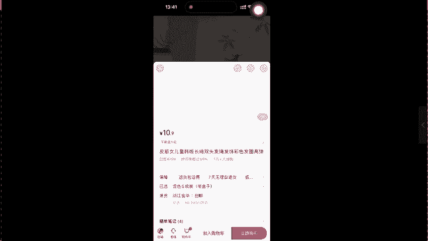

同学们能够去理解吗，这叫做什么叫软性营销对吧，在你不知不觉的时候，钱掏给别人了，对不对，所以说在我们刷视频过程当中的话呢，这个视频流量也是不可或缺的，那么再来讲一下，我们叫做一个直播流量。

我相信同学们很多人可能会看到过，在刷小红书的时候，你会发现这个小红书的里边会有一个三条杠，对不对，这个三条杠的话呢，同学们就是在代表他是正在直播的，你进入过后啊，你会发现这个主播他在讲什么。

这里边就卖什么对吧，你想买的话，OK点击进行购买就可以了，跟淘宝是一样的，我在这里说一下啊，小红书目前来讲这个直播带货是非常火的，同学们，所以说待会的话，我会教给咱们怎么来做这个直播带货。

包括来讲同学们啊，我来问一下老师啊，我今天是想做这个带货，但是我不想出镜，老师我不想这个真人出镜的话，这个问题怎么办呢，同学们，我来问一下，有没有说不想出镜，同学还想做带货的，如果有的话。

公屏上打上一个有字，嗯都说有是不是包括逆者呀，LIZ同学呀，是不是包括这个哄哄啊，银河同学是不是如果有的话呢，我去告诉大家，今年哎无人直播的玩法研究好了，同学们待会的话会全部教给咱们。

我们今天去讲到过的这几个板块的话，我说的也很清晰了，所以我还是那句话，想做小红书要趁早要趁快去做，因为人的话可能一辈子你想抓住风口的话，呃只有那么几个，对不对，你像老实话的，我的话，在今年做小红书。

我是第一个通过大家去一周去变现了，所以说我的方法的话，今年小红书官方已经整理好成册了，发给我的学生了，今年的话呢我也是带大家去全部的安排好了，这只是其中的一部分，包括来讲这个小红书关键词。

小红书的引流词，小红书的首图爆款笔记啊，这些热搜词啊，关键词啊，基础东西整理成册了，你包括来讲你可以看到在今年前几个月啊，小红书官方也是把这个24年最新的一些，小红书的运营方法。

全部都发给咱们的一个优质服务商了，你直接可以去了解到小红书，今年我们应该来怎么去做对吧，跟开卷考试是一样的，对不对，官方都把这个答案给咱们了，你就照着抄对吧，你还赚不到钱吗，是不是，所以我来说一下啊。

今天的话既然是受到邀请去讲课的话，肯定是要给大家送福利的，同学们啊，我今天的话呢，这些内部资料我全部都会免费的送给你们啊，如果说你今天是需要的话，来在直播间把需要两个字给我敲好了。

那么说所有说学了需要的话，待会在课程啊，你认真听完啊，啊听完之后来添加我这个微信，我会直接去发给你们，明白了没有，同学们要求就那一个啊。

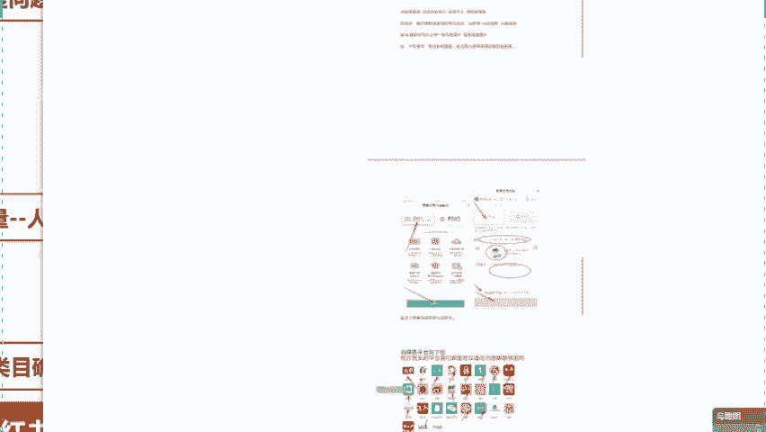

认真听课。