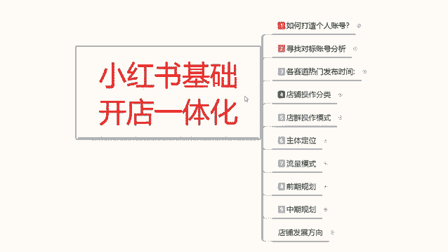
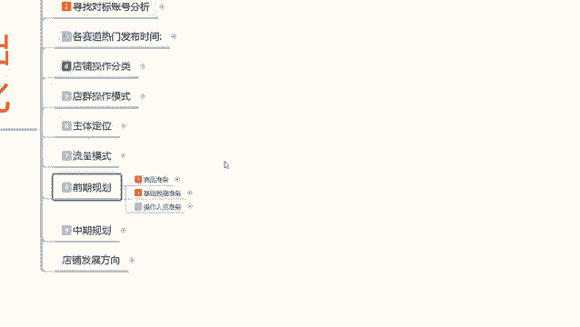
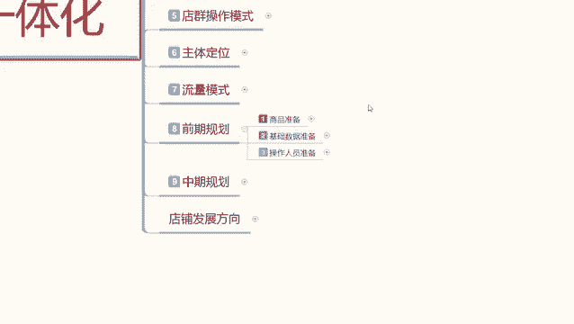
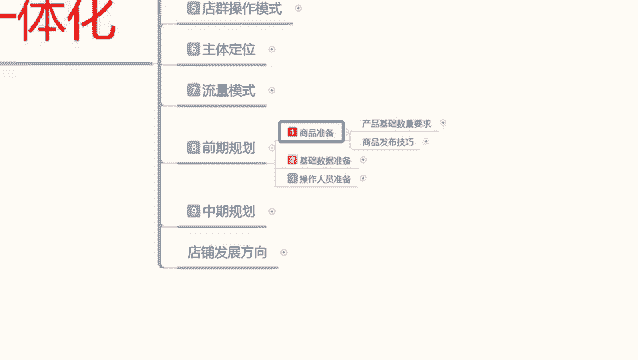
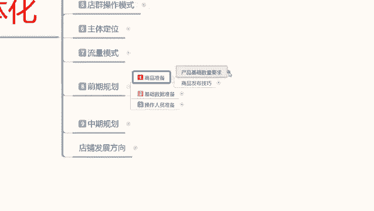
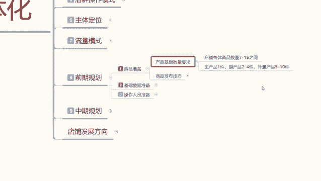
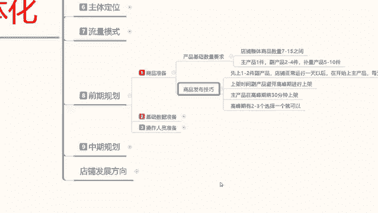
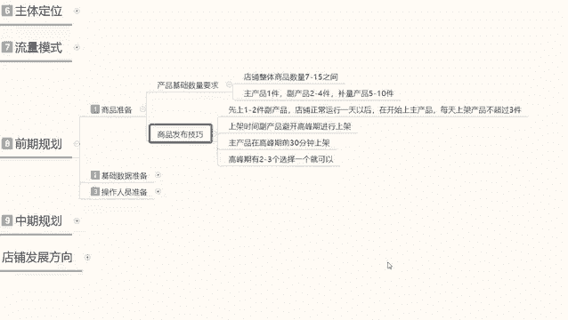
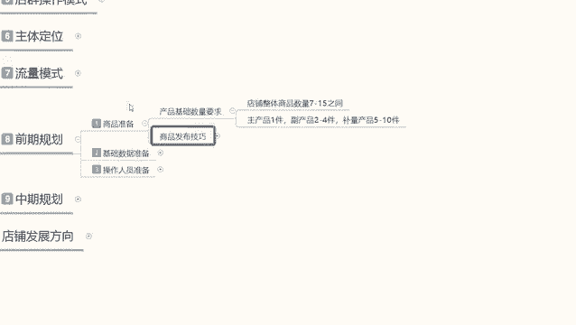

# 【2024版小红书体运营教程】全B站最良心的小红书开店运营高阶教程合集，小红书体开店 起号真的快 - P12：11、小红书开店-前期商品准备 - 煤球很皮实 - BV1Q444eWEP5

大家好，这一节给大家分享的是小红书，基础开店的一体化流程，额，这节课的话给大家讲解一下，我们小红书开店以后的话，一个整体的前期规划，前期的话就说我们小红书，你要把技术前开始做好，以后的话。

我们店铺的一个产品才能开始正常的一个售卖，我们先来了解一下呃，我们单电或者多电操作的前期的一个基础规划，如果说你做店群的话，你就不需要考虑这个了，因为你店群就是无限铺货啊，都不需要去做基础。

小红书我们开店的时候，前期规划的话其实是三步，第一步是商品准备，第二步的话是基础数据准备，第三步呢是操作人员准备，你要把这三个点把它准备好以后，你然后去把数据做起来。

你的店铺所发的笔记才能给你引流带来转化，你如果说没有这些基础做数据量的话，你的整个店铺你就算是把产品发出去了，笔记发出去了，但是他是没有任何转化量的，好吧，我们先来看一下什么是小红书的一个前期规划。

里面的商品准备。

双兵准备啊。

在这个里面的话，其实商品准备的话，就是我们小红书账号账号里面创建嗯，小红书店铺，小红书店铺里面需要包含商品，那我们在小红书上面做商品的话，它的一个基础数量他是有需求量的啊。

虽然说小红书上面你开店铺以后的话，你放一个产品也是放，放两个产品也是放，放100个，放1000个也是放，里面包含了啊动效率，转化率，你产品你账号的一个活跃度，店铺的一个活跃度，你产品的一个活跃度。

这几个属性全部包含在里面了，所以说我们要去操作的时候，你要先了解呃，产品基础数量在什么阶段，是对我们账号提升最大的一个方式，我们先了解一下啊，小红书产品基础要求的数量的话。

就是说整体店铺商品数量之间呢，是在7~15个主产品，一件副产品，两到四件不亮的一个产品的话就是凑数的啊，5~10件，一件主产品，两到四件副产品，5~10件的一个不量产品。

这是整体合并起来的话是15件产品数量，但是我们正常去操作的话，你做单店模式啊，就是一个店铺你要去操作第一个爆款，第二个爆款，第三个爆款，第四个爆款你才会达到15件商品，正常来操作，如果说你做单店的话。

你其实只要七个商品就够了，大家一定要了解这个点啊，这是分两个步骤的，单电操作四五件产品，而且是中后期发展的，你前面多店操作，就是一个店铺里面七件商品就够了，这七件商品怎么分配呢，一件主产品。

两件副产品啊，四件不亮的一个产品，或者说是一件主产品，一件副产品，五件不亮的产品，就是七个七个产品里面一个是主卖的，第二个的话就是装饰一下，能卖就卖，不能卖就算了，另外五个产品的话。

你就没打算去卖他的啊，这是一个点，你单店和多店前期都是这么操作，只是说多额单店的话，你后续的话出第二个主产品，把这个副产品做成主产品以后的话，你在后面你就需要去加量对等的啊，你每加一个主产品上去。

你后面的副产品就减少一个不量产品的话，你就要多加几个，前期的话就是一个主产品，一件副产品，四个不量产品或者是五个不量产品，达到了七件左右的一个主属性产品，那你要上第二件产品。

第二个主产品的时候就是两件主产品，两件副产品啊，八个补量的产品，你合并起来的话，就基本上是12个产品，对不对，你当上第三件主产品的时候，那你就需要三件主产品，两件副产品或者是一件副产品。

或者是一个副产品，都不要补量产品，12个你就是没有副产品，就是主产品和补量的一个产品，控制在15间之间，那你后续出第四件爆款，第五件爆款，第六件爆款，你就把补量产品里面的一个商品进行下降。

然后去重新上传一个新的，你想把它做起来的产品，那就是你后续的一个爆款，也就是说不量产品数量或多或少无所谓，但是你要保证你的店铺产品数量不能低于七件，不能超过四五件，因为在这个范围之内。

我的店铺账号的活跃度我能把握啊，店铺的一个成交，我能把握店铺的数据我能把握，如果说超过这个数据量以后的整个店铺里面，你产品过多以后，你的动销率跟不上啊，你的产品基础属性跟不上你的账号权重的维护。

跟不上你的转化维护跟不上，会导致整个单店就是崩溃掉的啊，本来是本来那是一个完完善的，额层层叠加的一个权重升级，如果说有一项从里面崩溃，你比方说今天来了500个访客，我们正常的转化的话。

如果说你是做那个呃搜索转化的，基本上都在6%到10%，今天给你了500个访客，你的转化率啪一下掉到2%，第三天2。5，第四天又是二，就是你的转化率提升不上去了，它会导致你整个环节崩盘。

导致你店铺的话直接崩溃掉，就是你没办法再维护，再持续进行下去，它就不能增长了，他就只能维护在2%，而且持续到一到两个月以后的话，这个店铺数据还会下降，他这个下降就不是转化率下降了，他就是访客下降了。

之前每天是500，访客之后的话可能是450，四百三百，两百二百一百，基本上到你自己这个店，你自己维护不下去，不想开了，自己都不想做了，你放弃了这个店就死掉了啊，所以我们基本上在做这个商品准备的时候。

都是这样的，就说你小红书上面，你去开店的话，整体的一个商品数量就是七个到15个之间，你单品一件爆款的话就七个产品，你做第二件爆款的时候，你基本上就是店铺到十个产品，12个产品左右，第三爆款出来的时候。

最高的话也就是15件产品，再多的话，他对你店铺只有负面影响，没有正面影响，大家一定要把握这个点，但是也不能低于七个以下，因为用户进入你店铺以后的话，他可能会去观看你其他的一个产品。

他觉得你这个店铺里面没有什么好可挑选的，只有这一件产品，你肯定是从别的地方呃，什么一件代发呀，或者说什么从其他什么地方借用过来的，一个产品，不是自己做的，自己对他，你只说做一个宣传，做一个二道贩子。

你就算是二道贩子，你也不能让用户判定你是二道贩子，懂这个意思吧，就是说你要给用户建立一定的信任感，所以说你店铺里面的产品，基本上都要在7000左右往上走15件以内，这个就是产品基础数量的一个需求。

然后这里面呢还有一个额商品发布技巧。

商品发布技巧的话，因时间的关系啊，因为我们每一节课的话可能就在10分钟左右呃，我就留到下一节课再给大家进行分享好吧。

下一节课的话给大家讲解一下，这个商品发布的一个技巧，就说你这些产品7~15件产品，它不是一次性上传的，他都是有时间节点和安排的，如果说你把这个时间节点把握不好的话，你会损失很多的一个数据权重。

