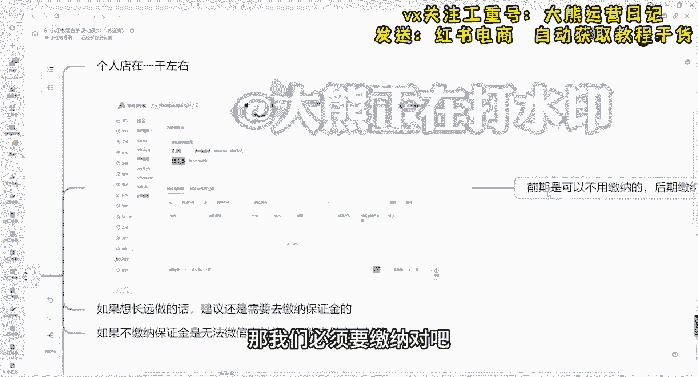
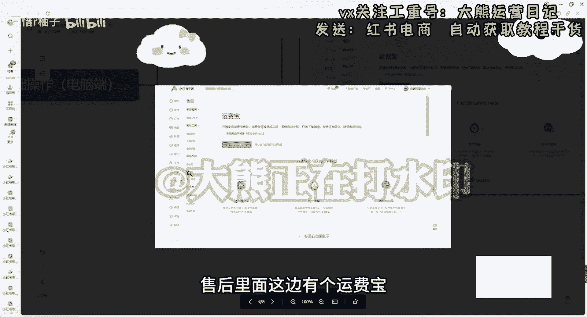

# 【2024版小红书体运营教程】全B站最良心的小红书开店运营高阶教程合集，小红书体开店 起号真的快 - P12：第14节.小红书后台的基础操作（电脑端）(1) - 夏惜r柚子 - BV1B1bceAEWL

大家好，今天来跟大家来讲一讲我们的第六堂课，小红书后台的一些技术操作呃，我们如何通过电脑端来操作的好吧，我们从几个几个方面来跟大家讲，第一个保证金方面，开通方式，运费保的设置以及地址设置。

这几个方面都会跟大家具体来聊一聊，先来讲一下保证金，保证金的话，其实我前面也跟大家讲了，我们前期的话是可以不用缴纳的。

个人店的保证金在1000块钱左右，额在1000块钱左右，根据不同的类目啊，他的保证金不同啊，我们来看一下，这个是我们的小红书千帆系统。

我们打开小红书千帆系统，我们搜索小红书千帆，这里面有个资金，看到了吗，打开我们的首页，这有个资金资金，这边有一个保店铺保证金管理，店铺保证金，我们这边可以充值我们的保证金，而带待补缴的。

这是因为我选的类目比较多，选择的不同类目他保证金不一样，我们只需要选择你自己类目，然后缴纳相应的保证金就可以了，好吧，这边有我们缴纳已经缴纳玩呐，或者说保证金退款，这个保证金大家放心。

跟抖音其他平台也一样，他的保证金，如果说咱们后期如果这个店铺啊不做了，他这个不管多少保证金，他是可以退的，但是这个保证金他也是会扣款的，他是会为了保证咱们店铺的一些客户，他们的一些权益。

就比如说呃答应人家这个退款了，但是我们实际上没有退款，他呃以及实际上没有去操作一些他会扣取的。

但是正常我们只要在不违规的情况下，他的保证金是不会扣的，以及不会扣太多的，好吧，那我们跟也前期也跟大家讲了，前期是可以不用缴纳的，但是我们后期如果说想要店铺做大的话。

或者说我们想要开通一些其他的一些方式，支付宝方式的话，想想要开通微信的话，那我们必须要缴纳对吧。

如果说想要长远做的话，建议还是要去缴纳这个保证金的，就在我们这个入口去缴纳就可以了。

呃如果不缴纳的话，保证金是无法微信支付的，现在有很多年轻人都是使用微信支付呃，所以说呃你想要开通这个微信支付的入口的话，我建议大家还是需要去缴纳一下，缴纳完之后。

支付宝跟微信都可以支付了，这个是我们的一些保证金，大家可以看到，如果说我们个体店的话，基本上在1000块钱左右对吧，但是有很多类目，比如说二奢啊这些全新奢侈品啊，珠宝玉石呀，家用电器啊。

这些是我们个体店无法无法开通的啊，个人店无法开通的，我们个体店可以开通，你可以去开通个体店。

我们正常类目的话，你看个人店的个体店的话也在1000块钱左右，企业店的话也就在2000块钱到1万块钱，2万块钱不等，好吧，呃，大部分的个人个人店的保证金，以及个体店的保证金都在1000块钱左右。

呃一些特殊的类目除外，我刚刚也跟大家展示了对吧，你如果说想要了解自己的店铺的保证金，你直接去选择相应的类目，就可以了，我们选择相应的内幕，可以这边可以查询一下对吧，里面都是有的对吧。

以及我们的开通方式，开通我们的支付方式，刚才也讲了一个微信支付，一个支付宝支付，那我们在哪在哪设置呢，其实也是一样，给大家放大看一下。

我们打开我们的首页之后，这边有个资金对吧，也是刚刚的资金，有个贷贷款，贷款资金这边有个支付宝，是支付宝以及微信对吧，我们去开通就可以了对吧，开通方式其实很简单好吧，支付宝的话，微信的话。

支付宝当天我们就可以直接去注册了，微信需要去微信的话，是第二天他才能去设置的好吧，第二天我们需要去缴纳保证金，提现金额是到法人的账户里面去，我们注册这个是小店啊，支持住注册这个小店的身份证的法人里面去。

他的微信以及支付宝，都是我们去按照他的要求里面去进行绑，定就行了，只要填写身份证以及呃，如果说你开个店的话，需要有营业执照好吧，这是关于呃开通支付方式的两种方式，大家去开通一下就可以了。

运费保设置运费保呢，推荐大家开通运费保是什么呢，运费保其实就是啊防止别人说退款啊，退货退款，我们这个运费他能有一个保障，也是后期别人就是人家七天无理由退货嘛，这种差不多跟抖音的七天无理由退货。

淘宝天猫的一样，我们可以开通一下，别人退款的话，就不需要去考虑到一个运费的原因，推荐开通可能会影响到转化率的问题。

来给大家看一下啊，开通全店运费保服务来放大给大家看一下。

开通全店运费保服务，消费者退货退换货成功后，系统自动补贴，打消下单顾虑对吧。

提升订单的转化率，降低纠纷率对吧，这个也是好的对吧，大家点击开通就可以了好吧，这是这个也是在售后里面的，售后里面这边有个运费保好吧。

地址设置的话，前面也跟大家讲，刚讲过了，那个叫手机手机的啊，手机端的对吧，七天无理由退货，自动可以自动同意退款的对吧，退货地址的话最好填写一些偏远地区，后面加上联系客服对吧，正确正确地址对吧。

我们刚刚跟大家讲了对吧，我们一定要去添加联系客服啊，因为我们这个是一件代发的嘛，地址也在订单物流工具放大给大家看一下，订单物流工具，这里面有个新建地址对吧，物流板块，运费板块。

我前面一节课手机端也讲的很清楚了，怎么设计设置相应的地址对吧，我们地址填写填写我们这个相应的地址就行了，我们可以填写一个新疆的对吧，额这边的话物流模块对吧，如果说是无货源的同步的商家，如果说是有货源的。

正常就填写就可以了对吧，我们这边可以填写我们的运费板块，如果说是无货源的商家同步商家就可以了，如果说有货源的，我们正常去填写好吧，这个就是简单的跟大家讲一讲，我们的一些地址的设置，运费保的设置好吧。

然后这个就是今天的课程好吧。

