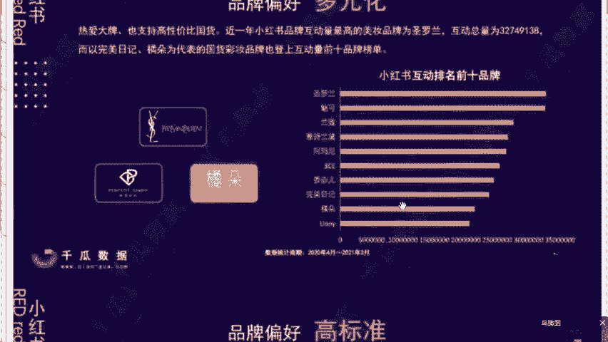

# 【2024版小红书体运营教程】全B站最良心的小红书开店运营高阶教程合集，小红书体开店 起号真的快 - P13：11.如何选品才能快速爆单 - 轻轻换一声卿卿 - BV15M48ePEA5

那么今天最关键的就是第六个，我们的一个小红书店铺怎么去选品，才能够去报单呢，选品的话是我最擅长的，咱们今天的话呢做电商，同学们，你电商人电商魂，我们有一句话叫做什么，七分靠选品，那么三分靠运营。

来各位听过没有，做电商选品一定是最重要的，因为说在电商界有一句话说的特别好啊，大家不知道听没听说过，同学们对吧，选品是至关重要的，所以说今天我会教给大家一个新手小白。

我们到底应该去卖什么样的类目才能够赚到钱，一会儿我会带你们找到咱们的一个需求，包括第二个啊，老师啊，我今天作为新手，我卖什么款式能够去赚钱呢，刚才的话呢，让你们去打造了一个，属于咱们的一个爆款的店铺。

对不对，那么今天爆款选品的话，同学们听清了啊，在任何人那里是听不到的，很多同学说老师选品啊，这个眼光我有时候可能没有啊，同学们，你们要记住了，选品要根据咱们的用户画像去来，刚才我说过呃。

小红书目前来讲是以80%的女性为主，对不对，其中有一些都是一二线的女性，那么这些女性她们的购买能力是非常强的，首先她们喜欢去尝试去创新对吧，消费能力也是非常的强，那么针对于这些女性用户。

我们去卖一些什么样的产品呢，同学们这些人，比如说我们卖一些中高端的服装鞋包，母婴大类的玩具大类的对吧，包括美食百货呀，美妆呀这些产品的话，在小红书卖的是非常好的，而且来讲我不是说老师，我说是就是啊。

我为什么说知道这些产品卖的好呢，因为说小红书，它的官方每个月会给我发一个报表。

这个报表叫什么，叫做重点的内部稀缺报表。

他会告诉我们啊什么产品好卖，每个月什么销量最高。

什么样的产品利润最高对吧，利用我们的数据表格帮你去统计清楚过后，你去抄答案就可以了，你比如说我这个月啊，老师我发现这个袜子特别好卖对吧，那我的学生你去卖袜子对吧，咱今天一打一个准啊。

这个报表的话内容非常细致到什么程度呢。

你比如说用户画像都给你画明白了。

这些内容是全部都有去整理的，包括来讲，上个月你会发现小红书人群。

他最关注的什么板块呢，就是我们这个啊护肤穿搭这个板块占比特别高。

你包括来讲说老师我想去卖这个美妆对吧，那么你像这个美妆的品牌哪个销量最好，他还给你去统计去完成了，你按照这个数据报表，直接去找到用户最有需求的商品，咱们就主打四个字，对症下药，对不对，所以说你看一下啊。

这有一个学生，他之前的话叫什么，叫陈海鸥同学啊，对对吧，她是个宝妈，当时跟我跟我学的时候呢，也不知道去卖什么，我把报表就给她了，然后自己去选的商品，她怎么说的，老师蓝海报表真的太有用了。

到现在为止不到七个月，通过报表选品，直接做了20多万的一个销售额，明白了吗，用工具就几个字，省时省力，效率高，他说老师啊，我现在的话都恨不得把我的学，把这个我的师弟师妹们叫在一起。

去分享一下怎么去做这个店铺对吧，最开始同学们一个宝妈什么都不懂，什么都不会，当时的话我跟她沟通，就一句话说的我特别的有感触，因为我也是一个女生嘛对吧，她说老师社会上面没有什么五险一金。

五险一金的全职太太，只有没有话语权的家庭主妇，所以说他下定决心的话呢，想要去靠自己去赚钱，你们可以看到啊，包括这个陈海鸥同学，他当时在做店铺的时候，第一个月其实做的不是特别的多，只有1000多块钱。

那么同学们你来看一下什么叫报单，第一个月来各位1000多块钱，是不是，第二个月直接是做了一个1万多块钱，同学们，那么第三个月直接达到了同学们4万多块钱，咱们来乘一下啊，我们掏出计算器。

你去看一下这个数字，咱们用这个4万3611，我们乘以一下最低利润点40%的话呢，他在这个11月份，直接一个月赚了1万7444块钱，所以当时的话我印象特别深刻啊，当时这个数据出完之后。

晚上给我打电话特别兴奋，老师我现在在家里边，我老公我婆婆不敢跟我大声说话，因为各位同学这个社会谁赚钱谁腰杆硬气对吧，谁有底气，对不对，所以说在下个月的话，可能会帮他去开第二家店铺，因为我说过了额。

做店铺的话，咱们最后还是要往矩阵上去走，所以为什么说我的学生能够去快速出单呢对吧，我每个月会去帮他去对接这些内部的稀缺报表，而且来讲这个报表的话，会每个月进行实事去更新，来我问一下，想要这个报表。

同学你在直播间敲上一个响字啊，那么我说一下啊，在直播间去认真听课的同学，你把课得听完，对不对，你这个东西不能说我给你之后，你不知道该怎么去用啊对吧，认真听完之后，同学们让你拿这个报表。

咱们达到一个事半功倍的效果，找准有需求的商品对吧，当然了，还是那句话啊，不是任何人我都给的，我会给到的是那些认真听课的同学啊，想通过店铺去赚钱的同学，我会给你们明白了吗，因为说这个报表的话。

外面买你也是买不到的。

同学们只有说你想通过这个店铺认真去做的话，才会去给到你们嗯。

包括来讲同学们在问到的说，老师我今天想做这个母婴大类可以吗，啊那么我在这强调一下啊，想做呃母婴大类的话呢，我建议你们去做这个玩具这个板块啊，什么意思呢，你看我这个学生啊，他是去卖什么的。

他是卖这个网红泡泡机的，同学们，我相信很多人是看过这个泡泡机对吧，但是很多人你有一个误区，你千万记住了，泡泡机不是说小孩子会去玩的啊，数据表明80%都是女性，为什么每年啊我们的寒暑假期。

包括这个什么迪士尼开始啊，包括说这个各大的游乐园啊，网红泡泡机都是卖的非常非常火的啊，那么来看到这个我们泡泡机，它的售卖价格是106块钱，对不对，那么我在这个拼多多帮他找一个非常好的货源，还包邮。

同学们成本价才28，所以你算一算售卖价格，同学们，我们是多少钱，106，对不对，我们减掉一个28块钱，你纯利卖一个就78了，同学们，你看一下在这个夏天他赚了多少个订单啊，在我们的一个夏天。

直接是售卖了1947个订单，我们去算一算，用78乘以这个1947，你会发现一个夏天，光这一个单品就卖了15万多，所以同学们啊，只要说选对了产品，你在小红书的钱真的是赚不完的，就不单单是小红书。

选对了行业，你的钱都是赚不完的，所以我说过了，小红书一定是我们今年最好的一个选择，包括前面我也说到过啊，今天的话呢是一堂免费的公开课，我线下课是五位数起步的，所以说今天教给咱们的都是小红书啊。

4年最新最火的玩法，而且你可以看到在这个今年，我也是获得了小红书矩阵这个高级讲师，所以我说句嗯不是特别谦虚的话啊，你们今天能够听到我讲课，咱们纯纯就是缘分了，运气好，明白了吗。

所以我就介绍一下这几个类目的话，你们可以尝试去考虑一下对吧，我不可能给你指错了这道对吧，包括第二个我去讲一下，教你们卖什么款式能够去赚钱，因为我说过了啊，我带你们会去打造爆款。

刚才的话咱们一直是强调爆款这两个词对吧，我刚才所有学生，他们都是通过一个单品去卖爆了，带动了整个店铺，这个叫做什么叫做联动销售对吧，打造爆款是我最擅长的，我们今天作为一个新手来讲的话呢，我教会给你们啊。

咱们的一个最好的方法，学习方式是什么，来听清了它叫做根脉，同学们一定记住了啊，叫做跟卖，我举个例子，比如说咱今天这个xx xx点同学对吧，你想今天是去卖这个卖睡衣对吧，那么今天这个睡衣有春天的。

有夏天的，有秋天的，有冬天的，有碎花的是吧，什么款式，你不知道，你说老师，我今天这个位置我去靠踩点靠去蒙吗，这个位置大家不要去闭门造车了，不要说自己去盲目去研究去，我们今天要怎么去卖呢。

最好的方式就是跟卖，那么跟谁卖呢，咱们今天做生意啊，你记好了，最好的老师一定是我们的谁同行啊，同学们对不对，电商界有一句话说的特别好，叫什么叫做先模仿，在超越，咱们今天先把它抄，你抄明白了，对不对。

我告诉你们这个不叫抄，叫复制成功，你比如说你之前在上学的时候，你考试对吧，一道题你也不会做，但是隔壁那个人他考试能超100分对吧，他能考100分，你点儿真正是吧，你今天抄他一部分，他考100。

我抄60分行不行，而且大讲我今天老师啊，我不知道卖什么产品，人家卖鞋子卖了100万，OK我抄他的，他卖100万，我卖他10万行不行，来各位这个问题大家认不认可。

如果说认可的话，来你在直播间把认可两个字给我。