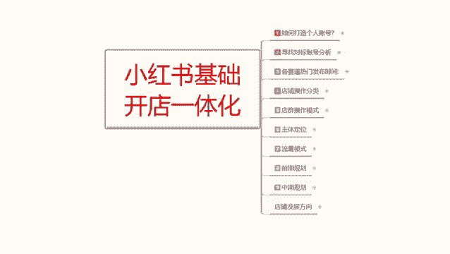
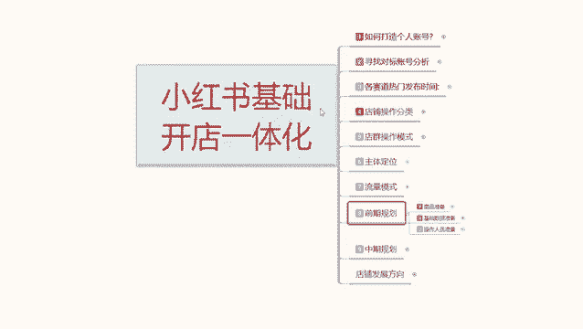
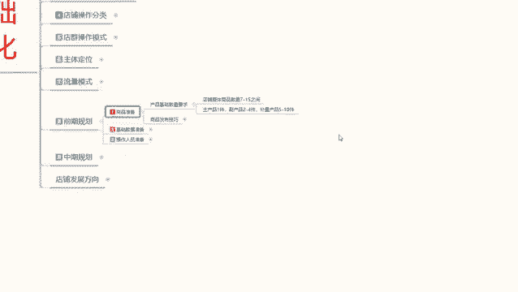
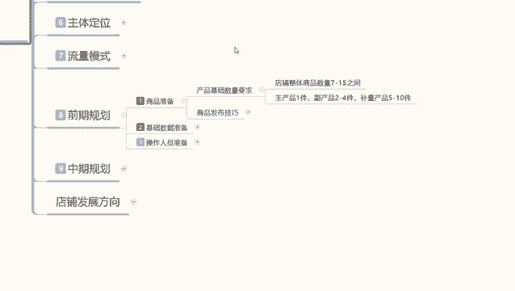
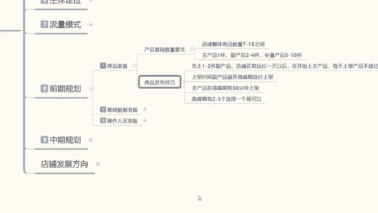
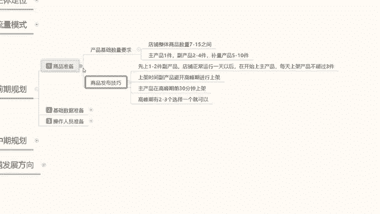

# 【2024版小红书体运营教程】全B站最良心的小红书开店运营高阶教程合集，小红书体开店 起号真的快 - P13：12、小红书开店-商品发布技巧 - 煤球很皮实 - BV1Q444eWEP5

大家好，今天给大家分享的是小红书，基础开店一体化流程的一个第八课时。

前期规划，第二个内容，上节课呢给大家讲的是。

我们的一个商品的准备啊，店铺整体的一个数量。

这节课的话主要是给大家讲解一下啊，这个我们把数量准备好以后，他还有一个发布技巧啊，我们只有把这个数量你准备好了，你发布技巧掌握了，你去发送产品去组呃，怎么说呢，就是说你去发布这些产品以后。

你才能获得更高的一个曝光和基础的一个权重，你如果说不把握这个技巧的话，你基本上就是基础曝光权重的话，大概会降低30%左右啊，就是平白无故损失了30%的基础权重，虽然说这个前权重的话。

前期它显示的不是特别高，你技术权重可能技术展示曝光量，你刚开店的话，可能也就1000到2000，那你损失30%的话，你其实就本来只有2000的一个曝光量，获得个200个左右的一个点击。

你再损失30%的话，那你就1400，1400的话，你大概的话也就能获得10%，左右的一个点击量，就140个小眼睛，140个小眼睛里面百分之，0。3，啊就是百分比后面还不是1%，0。3%的一个引流转化率。

和6%的一个搜索转化率，而且你搜索的话是没排名的，你基本上前期就做不了排名啊，就是说你如果说按照这种技巧去操作的话，你店铺想把它做起来是很困难的。

我们先来了解一下什么是商品的一个发布技巧。

商品的发布技技巧的话，其实说就就是我们小红书开店以后的话，你的商品不要直接上传，他是有技巧性的，首先第一个就是先上传一到两件副产品，或者说是一件副产品，然后其他的放一件额那个不亮的产品。

主产品先不要上啊，店铺正常运行一天以后，开始商家主产品，就比如说在你的店铺被小红书系统录入以后，他知道你在小红书上面开店了，而且也开始上架铺货了，后驱就是要开始做数据了，但是他不知道你哪个数字组产品。

他暂时不会给你额外的去推流量，你只有开始有数据以后，他才会去给你推流，所以说我们第一天上架的产品的话，其实是给小红书系统做录入用的，他后续每天就会更新你店铺的一个数据，更新你店铺数据以后呢。

你再去上传主产品，那你的主产品上传上去，直接就排名，有排名，你就能去做他的一个基础权重属性，如果说你没有这些的话，你直接把主产品第一天发布上去，小红书是现场录入，那你的排名不会太高的啊，有点偏低。

所以说我们要在正店铺正常运行一天以后，再开始上传主产品，然后呢每天大家一定要记住啊，你的账号店铺每天上架产品不得超过三件，你不是做店群的，店群的话，每天50~100件无所谓。

你的店铺每天不能超过三件产品，就说这七件产品也好，十件产品也好，你要分三天四天，五天六天七天才做，你一天上传一个产品都可以，但是绝对不能超过三件啊，然后是上架时间，上架时间的话。

副产品必避开高峰期进行上架，就说任何时间段都可以发放啊，什么时候上都可以，但是绝对不能在高峰期时去上，之前我也给大家说过了啊，那个每个产品每个内幕，每一个小红书的用户群体。

他都有一个产品的一个上架高峰期，你的副产品把这个高峰期避开就可以，然后呢组产品在高峰期前30分钟中上架啊，记住了，主产品要在前面30分钟上架，它和笔记不一样，笔记提前5分钟就可以，但产品要提前半个小时。

因为你要去抢排名，知道吧，你在半个小高峰期，前半个小时里面只要成交一单，那你后续在半个小时以后，高峰期来临的时候，你会获得更多的曝光，展示和点击，就是概率更大啊，概率学问题概率更大，之前可能给你1%。

你有转化以后的话，可能给你1。5%，不要小瞧这0。5%，这0。5%可能会让你的一个整体收益，数据的话就是基础展示报告量增加1/3，就是主产品要在高峰期前30分钟上架，当然了，前30分钟上架。

还要看你有没有自己有没有转化，有转化的话才有那个加成，如果说没有转化的话，说实话你就没有加成，你去高峰期上传的话，你就需要去跟别人做关键词排名的一个抢占，数据排名的一个抢占。

就看你的笔记优化做的到不到位，你笔记优化做的不到位的话，你这个数据量发出去以后，也没什么太大的一个作用啊，然后呢高峰期有两到三个选择一个就行了啊，就比方说你正常卖服装的话，我个人建议的话。

额你卖服装类的，就是下午五点到七点到八点钟，你在这个时间段前半个小时，04：30左右把商品上传，然后开始发放笔记，商品上传以后的话，你花25分钟整理笔记绝对够，就是第一件主推产品上传以后。

花25分钟整理笔记，让系统多给你推荐一些自然流量，让你的第一篇笔记获得的流量曝光会更高一点，然后你再通过自己的方式去操作，它的一个基础数据，就可以把这一套流程做下来的话。

那你前期可能给你1000的基础曝光，可能会到达1300，本来你只能获得50个小眼睛，80个小眼睛，你到后面做的话，可以获得一百一百一，那对于你后期的一个成长的话，他都是质的一个飞跃。

因为小红书的数据量的话，他都是根据你账号权重来定的，你前前期账号权重，你每做完善一个点，你的账号权重越高，你每少做一个点，你权重越低，那大家可以想象一下，你本来就是一个竞争环境，下面。

你只有越做得好的产品，小红书系统才会去越推荐你做的越差的产品，你资料越不完善，那么小红书他对你的一个额推荐，流量的话就会越少，所以大家一定要明白这个点，就说商品准备的时候。

你不光要准备基础数量的一个需求，你还要了解商品发布的一个技巧才可以啊，那个不量的产品就无所谓了，你高峰期高峰期也可以发，其他时间，任何时间都可以发，因为你不指望他去给你做流量引流的好吧。

主要的话是针对主产品，让大家了解一下，这个呢就是商品准备，那下一节课呢给大家讲解一下啊，商品准备完成以后，我们需要做的是基础数据，基础数据就是我们主产品所需要附带的一个，基础数据，达到这个量以后。

系统给我们推荐进来，访客以后，你的产品才可能成交，不然的话你连成交目的都达不到，好吧。

