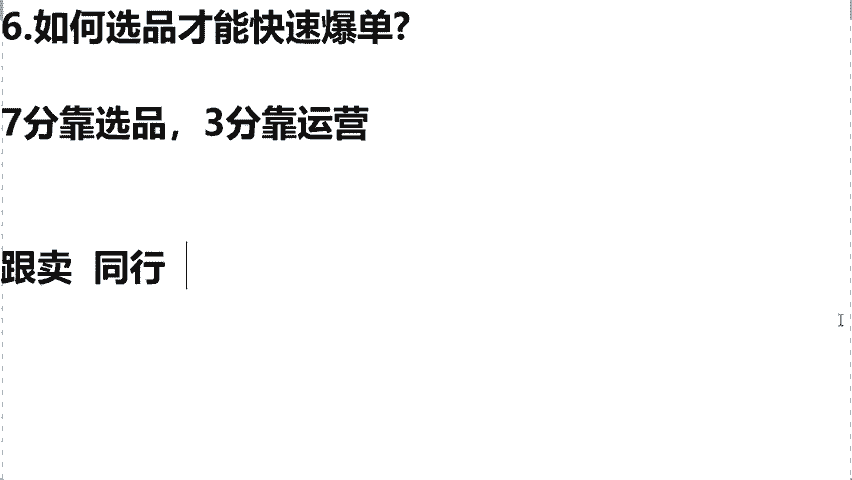
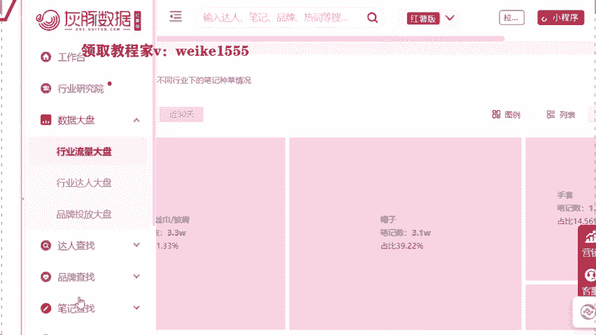
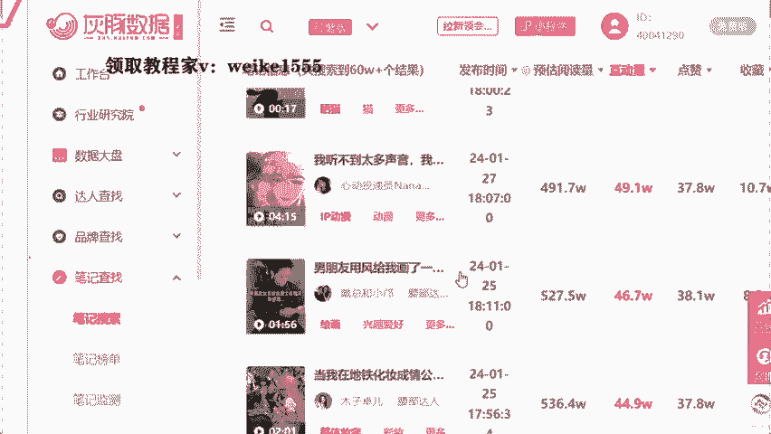
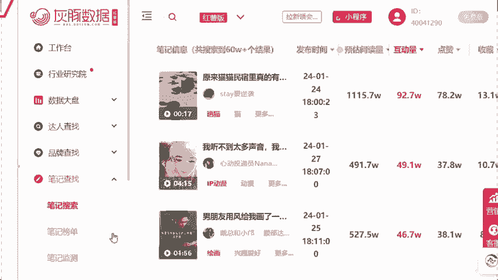
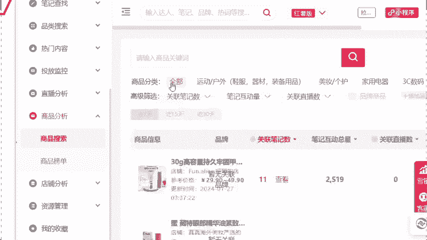
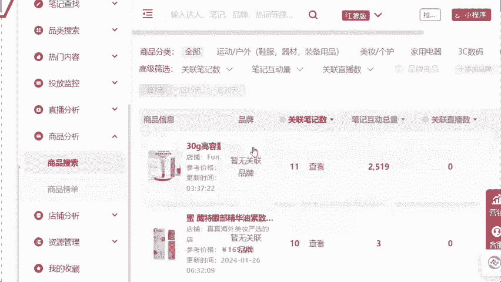
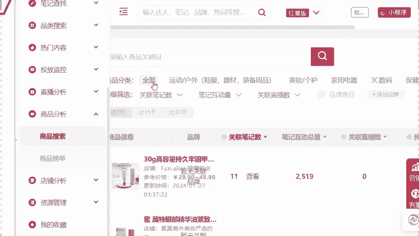
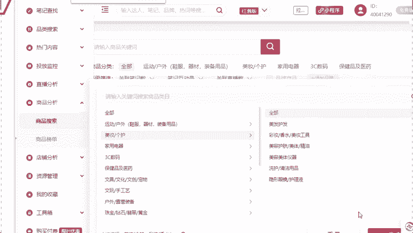
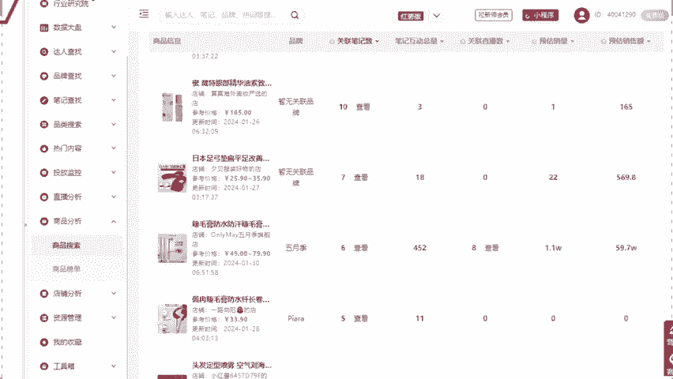
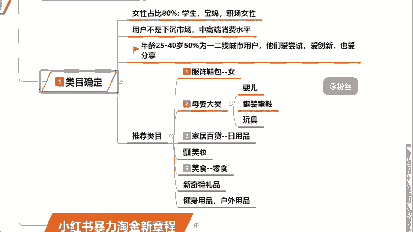

# 【2024版小红书体运营教程】全B站最良心的小红书开店运营高阶教程合集，小红书体开店 起号真的快 - P14：12.小红书数据大盘分析 - 轻轻换一声卿卿 - BV15M48ePEA5

就如果说你是认可的话呢，接下来啊我来告诉大家怎么去模仿对手，怎么去超越对手啊，同学们一定要去听好了，这个位置的话呢给到大家一个数据，叫什么叫做灰豚数据。

他的话可以直接帮我们去分析出，最热这个近期热卖的一个商品。

你仅拿它去更新爆款就可以了，你比如说对吧，我们这个惠存数据它呢是一个官方的数据啊，如果说你今天想去这个官方去购买的话，你至少得花5000块钱，而且你只能花只能用一年，今天的话大一老师，我的学生。

你听好了，我是不需要你们去花钱的，而且的话会直接每天天给你们去更新数据，帮你们去看到小红书的一个大盘数据，给你去用到的话呢，同学们能帮的话，我会尽量去帮助大家，所以在这我要去教给咱们灰豚数据软件。

我们到底应该来如何去使用呢，在这咱们打开灰豚，你可以看到流量的大盘，比如说老师，我今天这个什么好卖呀，现在天气比较凉对吧，那么毕竟是小件哎，围巾啦，丝巾披肩呀，帽子啊对吧。

这些东西他的一个售卖一定销量都是特别高的，而且来讲咱们还可以干嘛呀。

我们去查抄这些笔记，你比如说我今天想卖一个服装，想卖一个美妆。

我看一下别人的笔记是怎么去写的对吧，如果说他的流量是在持续往上去增长的话，OK我今天拿这个作品，我来教你们，咱们拿这个主题过来，去生成一个咱们的一个原创的文案，对不对，那么同学们。

第三个它还会有一个叫做商品的一个分析。

什么概念，我在这给你们去选一下。

比如说咱们来选一个美妆，对不对啊，这个美妆的话呢来我去点一下这个美妆啊。

同学们诶拉不动这个稍等啊，我拉下这个网页嗯。

打这个美妆，OK点确定来点击美妆过后。

你可以发现啊，同学们这个上面比如说啊，我想去卖一些这个啊美妆的护肤的东西，他会给你预估出销售额啊，他会告诉你这个东西到底销量好不好，你比如说这一对比不就看出来了吗，这个里边现在这款睫毛膏卖的是最火的。

我们就去卖它就可以了，所以说你去拿到了这个这个软件的话，就相当于是我们今天是开卷去考试了，什么活，我们卖什么，绝对是一打一个准儿，咱们今天就是去模仿，是不是包括我的学生最近都在报单。

为什么我帮他们选了一个两个产品，第一个同学们啊叫连体袜，第二个叫光腿神器，我告诉你们，这两个单品都是零退换货率，它的利润可以达到甚至是60%以上，我的学生现在最近都是靠这样的品，给他去报单了。

而且来讲前几天我又选了一个最牛的，他叫什么呢，叫做泡脚凝珠，来，各位听过泡脚凝珠吗，听过的话，公屏飘花，我去看一下啊，啊我不知道各位说听没听过这个东西啊，就很多同学，现在他刮起了一个叫做养生潮流对吧。

养生最近特别火，那么这个泡脚包它比如说它可能只有一个呃，30块钱对吧，可能他只有15块钱，但是泡脚凝珠能卖到30甚至是45往上，但成本它的利润是特别特别高的，所以说我的学生啊。

就是今天选品的眼光是特别独到的，那么你想一想，今天你加上我的眼光，包括来讲我们的灰豚数据，我们今天是绝对能够去用得到的，对不对，这个灰豚能够让我们今天了解整个行业的大盘，知己知彼百战百胜。

所以如果今天你们是需要灰存数据的话呢，你们自己去买啊，官方一年5000块钱，但是我的学生你记住了，我直接把数据给到咱们帮你们去分析，我来帮你直接去更新，所以说软件的话，如果你是需要同学数据的话。

是需要的话，来直播间打上需要两个字，刚才我也看到说老师啊，我今天这个东西，你说这些我也在买，是不是，那么今天你既然如果你买过的话，我们现在不就是需要你去转变思维，让你去把它变过来对吧。

同学们让你去知道我们今天变成卖家呀，对不对，我们今天是消费者，你现在不是了，我们是商家，对不对，明白了吗，所以说啊我们今天老师啊，我想通过小红书平台去报单的话，但是我担心我做不起来，我学不好的。

同学们一定要记住一句话啊。

就任何人他都是从不懂不会做起来的，哪有人说天生什么都会呢，对不对，包括前面去讲到的，刚才我那个学生叫李娜的，是不是人家李娜四无人员，最开始啥也不会，到现在开始，这个月开始要做第二个店铺了。

他是在不断的去学习去赚钱的，所以咱们一定记住了啊，任何人都是从不懂不会做起来的，你像老师，我我也不是说生下来会做什么小红书，会做什么跨境做淘宝啊。

我也是摸索出来的，包括来讲啊，虽然说现在的话我这个嗯做的也比较不错了，但是我每个月还会去向比较优秀的人去学习，因为我觉得人嘛活到老学到老，所以我希望大家要有一个学习的观念。

