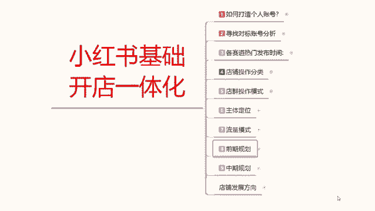
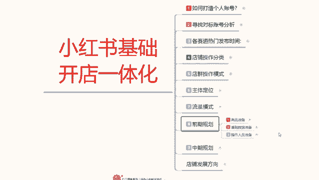
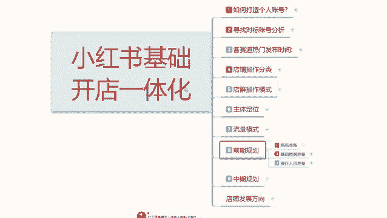
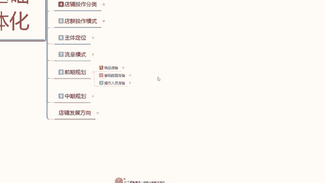
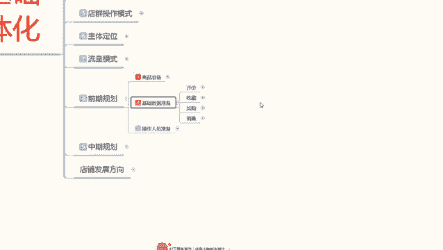
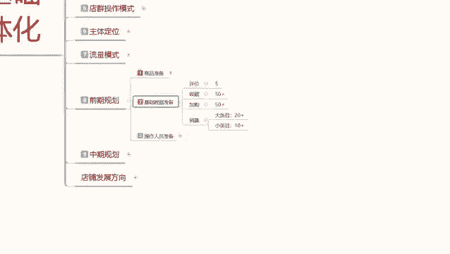

# 【2024版小红书体运营教程】全B站最良心的小红书开店运营高阶教程合集，小红书体开店 起号真的快 - P14：13、小红书开店-新品发布后怎么做基础数据 - 煤球很皮实 - BV1Q444eWEP5

大家好，今天给大家分享的是小红书基础，开店一体化的整套流程，第八课时前期的一个店铺规划，之前的一个分享呢已经给大家说过了啊。

我们的一个商品，准备自己店铺所需要准备的一个商品数量，和我们商品发布的时候一些技巧啊。

可以避免我们前期很多的一些操作。

而且提升我们的一个曝光和展示量，这节课呢给大家分享的是基础数据的准备，这个基础数据的准备呢是做我们组产品啊，就是你在小红书上面开店，做主产品所需要准备的一个技术销量，因为你只有拥有了这些基础向量以后呃。

小红书的用户进入小红书，搜寻到你店铺进行观察的时候，你只只能说是你有销量以后才能去卖，如果说你是零销量的话，别人在小红书上面也不会去卖你的产品，不管你的产品做的再好啊，宣传的再多。

他也不会在小红书上面直接成交，他只会问你你的产品什么地方的价格怎么样啊，然后会去其他地方搜索，因为他不信任你，因为你的小红书上面一个评价，没有一个销量都没有，别人是不会认可你在小红书上面坐垫的。

这种行为的，也就是不会产生自然交易成交，所以说有些数据的话，我们在小红书前期的话，有些东西是我们必须自己去操作的，这里面呢就主要包括了，我们的一个基础数据准备，那小红书主产品的一个基础数据准备有哪些呢。

评价收藏加购和销量啊。

这四个点，你足产品上架以后，我们需要保证在一周以内出现五个评价，收藏加购50个以上销量啊，大类目的话就是说你的大类目比较广泛的话，销量是最少是20个往上走，如果说你是小类目的话，就是十个往上走。

那么内幕那就要看怎么说呢，看你是做批发的，还是说做单卖的，单卖的话就销量少一点，破个十来个就行了，如果说你是做批发的那个销量的话，就得几十上百啊，因为冷门内幕的话，他说实话他这个靠销量排名，靠数据的话。

说说话的话比较严重，大类目和小类目的话反而相对会好一点，大类目的话，你只要基本上有20个以上的销量，你在小红上面你的产品就能正常出售，就会有人咨询来购买啊，只要你宣传的到位，笔记做的好一流，做的到位。

账号没有降权啊，很容易做成交，小类目的话十个以上就行，这个就是小红书它的一个基础数据，准备收藏架构，50以上的话，这个是做你那个店铺展示的，也就是抢排名用的啊，越多越好，但是你低于50个以下也能做。

只是说效果就没有那么不好了，评价呢是必须要有的，你的评价的话，前期有个两三个三五个其实就够用了，后续的案例我们都是在小红书上面去操作的话，基本上都是靠资产成交的啊，没有必要做太多的一个繁琐。

只需要前期把基础数据做好以后的话，后续就是呃维护店铺的一个数据，然后发笔记优化自己的一个笔记内容，然后的话用小号进行评论，做反复的一个交互啊，来优化我们整个店铺的一个属性。

店铺属性优化以后的话会增加你账号属性，你后续发小红书的一个笔记的话，他的权重就会累加，往上面走就可以，当然了，我这个基础数据准备的话，大家不用多想啊，他只做第一件产品，副产品的话，你把按照这个基础数据。

如果说你想把副产品也附带一定的，增值空间的话啊，按照他的1/3操作就行了，就是有两个评价啊，销量有个几个就够了，他就基本上都能正常的操作去售卖啊，其他的那种嗯不亮的一个产品，我们就不要去操作了。

那个跟我们就没有什么太大关系，那只是放着好看的，你店铺里面一个主产品，两个副产品或者一个主产品，一个副产品就够了，其实你整体的话评价做到个九个到十个，就是三件产品加起来，产品自己自己去操作。

自己找人去弄的话，你的一个评价大概在九个到十个，基本上就差不多了，一个销量的话大概就是在30个到40个，这些数据的话，你其实我们前期去操作小红书的话，都是非常好解决的，为什么说小红书它的一个基础。

销量和基础数据评价的话，不需要像其他的那种呃，直接做电的要这么高，每天要去维护数据，因为小红书你的流量来源不是主要靠啊，商品的排名去争取的，那个争取的排名转化率是高。

但是我们前期的话你去做做一个排名的话，你肯定是抢不过别人，已经开始动手做小红书的人，所以说你要抢的是什么呢，是笔记正常引流的80%流量，去博了0。3%的一个数据量，把你的笔记引爆以后的话。

你的销量慢慢的就起来了，你就有排名了啊，你后续的话你这些数据你也不用去更新，也不用去做什么，你一个月或者说有有个几天，偶尔有那么一单两单三交四单成交，你的这个数据它就自然上升了，当你的笔记做报以后的话。

那你的单数的话，基本上就是半个月到一个月就突然间爆发，然后就卖一波，用小红书的话，他就是靠笔记去做引流的，你的笔记做得好，那你的销量，产品销量就能跟得上去，你的笔记做不好，你的产品做的再好。

规划做得再好，你能把它做上去，但是你需要投入大量的资金啊，对我们前期你不了解小红书来说的话，你这么操作是呃必要性没有那么大啊，就是你直接去花自己的资金，然后去小红书上面抢排名，这个资金需求量是非常大的。

所以说我们前期新手你去操作的话，你其实把基础数据做完以后的话，我们在正常去操作店铺的话，他整个流程下来的话就非常容易了啊，就没有那么多复杂的一个模式，需要我们去跟进啊，包括店铺账号的一个数据整理啊。

每天要保证多少转化多少销量那些，其实的话嗯影响都不是太大，你只需要保证每天两篇笔记，然后把数据做好就行啊，他对于其他的平台来说是非常温和的，因为你每一篇数据的话，他都会给你引流。

只是说你引流的一个人群群体啊是非常重要的，这个呢就是小红书前期的一个基础数据准备呃，下节课呢给大家分享一下啊，就是操作人员准备，操作人员准备的话，他是为了做我们店铺，你想把自然流量做起来啊。

你得想在小红书上面有自己的操作，那你就得把人群选定好，人群选定好，那他对所对应的，就需要我们操作人员的一个准备，操作人员准备是做什么呢，做基础数据的，基础数据就靠这帮操作人员去准备去操作。

你把他操作好了，你的店铺后续起来就快，你如果说操作不好，人群是杂乱的，那你最少要多花一个星期到半个月的时间，去把店铺的人群拉回来，新店啊，老店还不一定拉的回来，好吧，那这节分享呢就给大家分享到这里。

