# 【2024版小红书体运营教程】全B站最良心的小红书开店运营高阶教程合集，小红书体开店 起号真的快 - P15：14、小红书开店-账号店铺数据优化分析 - 煤球很皮实 - BV1Q444eWEP5

大家好，今天给大家分享的是小红书，基础开店一体化流程的额前期规划内容。

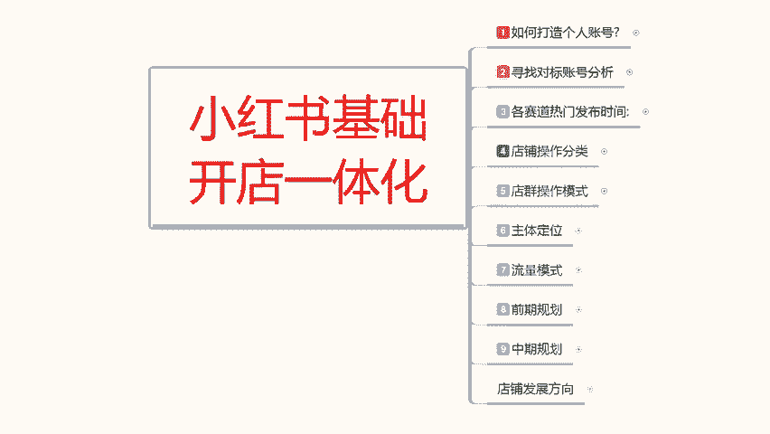

这节的话主要是给大家讲解一下。

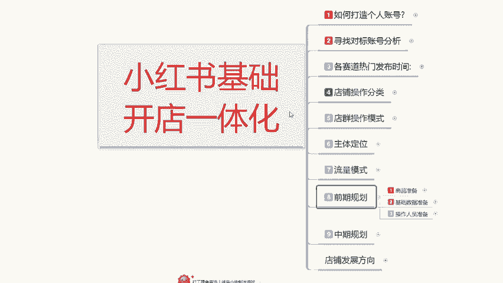

操作人员的一个准备，特殊人员准备的话，其实就是招呼你自己心身边的亲朋好友，提前帮你做一下规划，如果说你自己有资源的话，那么你就是自己安排啊，自己多找几个手机，做几个账号数据。

然后的话就把这些操作准备准备一下就可以呃，如果说你的觉得资源找朋友很麻烦。

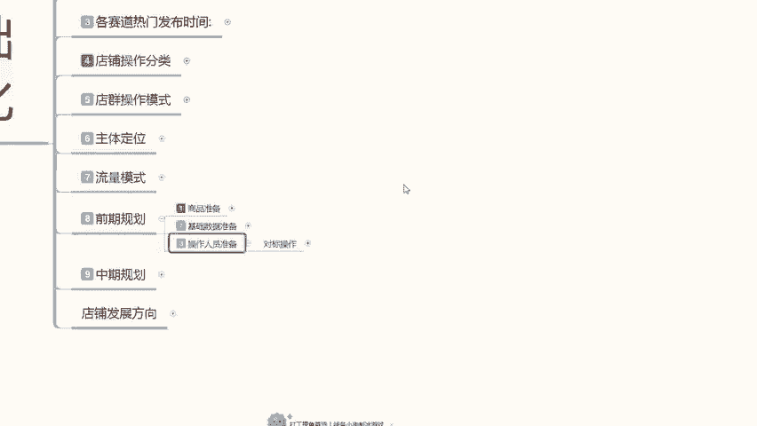

他不愿意做啊，你只需要找到人员，然后的话让他们稍微去做一下搜索，做一下对标就可以，就是说操作人员准备的话，其实就看我们个人自身的一个资源分配，你能不能做到位，如果说你能把资源分配做到位的话。

你可以节约半个月的时间，如果说你做不到位的话，那那你就需要多花半个月的时间去，整理你的笔记，先把店铺和账号的人群拉回来，然后再去做，不然的话你这整个店铺的话，额说实话你操作起来的话难度就比较大了，好吧。

这个操作人员准备的话，只是说降低你的难度，可有可无啊，就看你自己怎么去选，有最好。

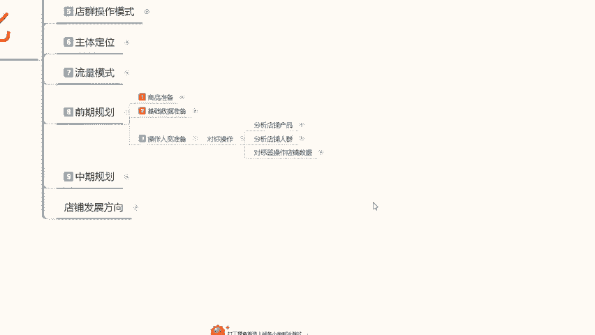

没有的话也是无可厚非，因为某些人的话，他的一个社交设计，交往圈子本来就没有那么广，然后找这些人来帮忙操作的话，他们本来就不熟悉你，然后要一个一个去教他，你本来的话是吧，人一多，人一砸。

别人也能帮你就不错了，然后你还有这么多要求的话，说实话很难，所以说对标操作的话，还是要看个人自身对周围啊，人群的一个能力把控怎么样，如果说你对周围人群把控比较差的话啊，能找到人就不错了啊。

别人能帮你操作也就很不错了，当然了，如果说你个人有资源，或者说有什么其他的渠道，或者自己有方式去弄的话，那就另当别论啊，那你就可以节约这个七天到15天的一个呃，时间段啊，让你的店铺快速爆起来。

我们先来了解一下对标操作，我们首先需要了解三个点，第一个是对分析店铺的一个产品，第二个是分析店铺人群，第三个呢是对边对标签操作，我们的一个店铺数据，其实这几个点的话，其实就是我之前给大家分享的时候啊。

也说过的。

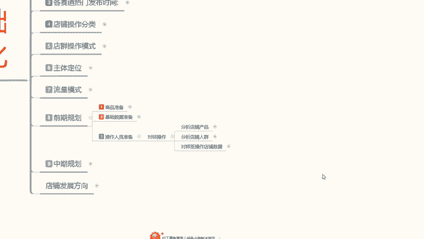

分析店铺产品，就是我们自己的价格类型，实际效性，第三个定点选择的一个属性内容，首先是价格，你自己产品的一个价格范围选定好，然后选择你自己的产品一个类型，然后选择你产品的一个时效性。

提前半个月到一个月去准备这些账号，因为你的店铺开开始创作的时候，你的这些准备工作就已经要开始了，如果说时间你觉得比较长，那么你可以提前三天，就是提前三天去浏览你同类型的一个产品。

同价格制定方位的一个产品，时效性在同一时间段的一个产品，这个是对店铺的分析啊。

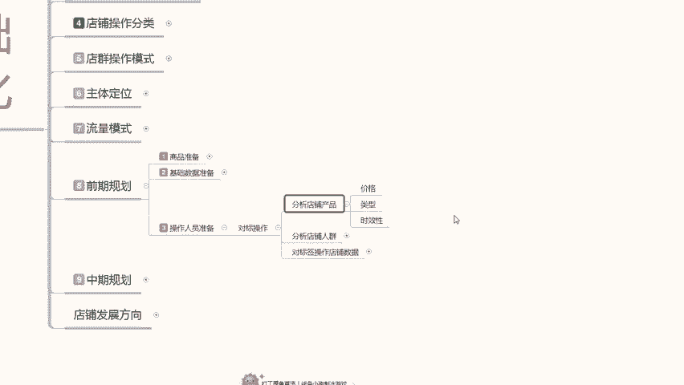

浏览在这三个属性点，然后是对店铺的一个人群分析，性别，年龄，购买习惯，性格和类，价格和类型，性别是什么呢，男性女性LINDING是什么呢，14~45或者是55之间的女性，你从中截取了哪一个部分的年龄。

准备来做你自己的产品宣传，截取一到两个就可以了，不要过多，一到两个，以四以4年就是四岁为划分，14~18，18~22，22~26，26~30，30~30，34~38，这么去划分选两个年龄阶段。

也就是8年的一个范围来操作你的产品年龄，然后购买习惯的话，我们暂时可以不用管，因为你所找的人员的话，他对小红书可能不熟悉，而且也没有购买习惯，那你这个操作的话说实话可有可无。

你只需要把前面几个点做好就可以，如果说你前面几个点做不好，那你一定要做购买习惯，就是这个人经常逛小红书，他没有前面这几个类型。

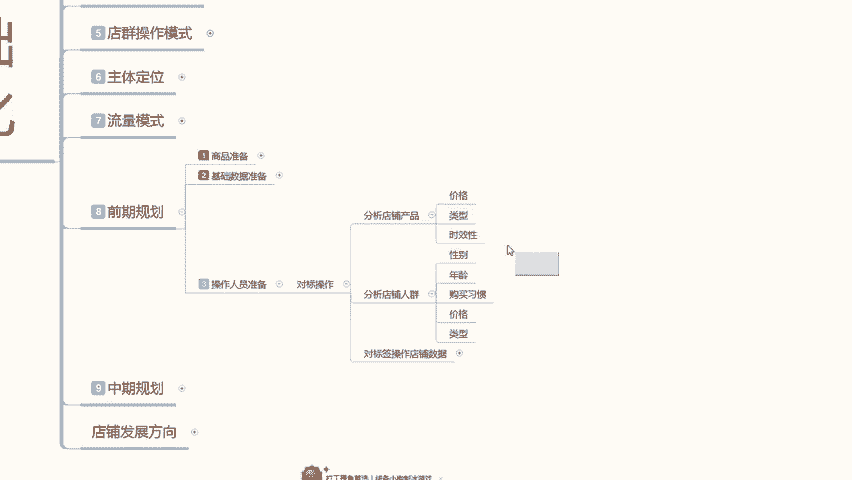

你可以把它单独划分购买吸管里面去，我把颜色给大家标个重点啊，因为这个的话说实话分类的话还是比比较呃。

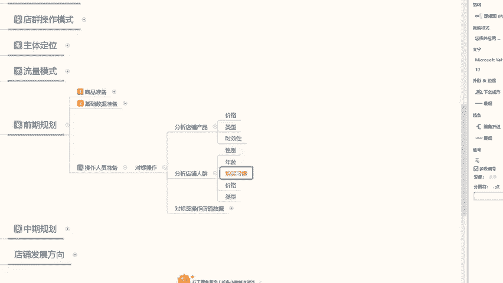

准确的，就是说如果说你所找的人，他也经常自己在小红书上面逛，但不是你所商品所对应的一个属性，那你就把控他的消费习惯，懂我意思吧啊就是你不需要跟他去看价格类型，时效性，性别年龄，你只看他的消费习惯。

他经常购买的是不是你同类型，同消费层次的一个产品，或者说偶尔购买他消费习惯没有问题，那就可以直接做啊，有这个消费习惯的人就可以直接做，其他的就不用考虑，然后就是价格和类型，价格和类型包括性别和年龄的话。

其实都是在消费习惯里面的，他们四个综合起来就是购买习惯行为，如果说你所找的老用户，他已经有购买习惯行为，那你就不用去找限制他的性别年龄，价格和类型，如果说他会呃没有购买习有习惯的一个行为。

那你就需要限制他的性别，年龄价格和购买的一个类型啊，就这几个点，然后的话对应的啊，分析店铺的一个产品实效性啊，把这几个属性点全部集综合起来，就是你所需要寻找的对标账号啊。

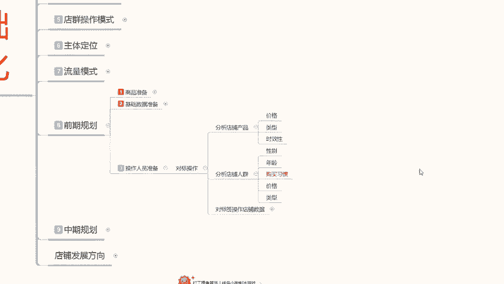

当然了，之前也说过，你实在是没有办法找的话，那你能找到这些人。

帮你去做一下基础的成交评价的话，其实后续的话我们自己再想办法去操作，也是可以的啊，就是说结合分析的数据的话，呃对怎么说呢，对店铺进行基础操作的同时啊，我们选择对应人群的一个特征，来进行店铺优化啊。

根据我们产品进行店铺的一个人群优化，这个的话主要是保证我们中后期小红书系统，它所推荐的对应人群是准确的，提高我们整体的一个转化和喜爱啊，把自己打造成稍微有品的一个姿势，一个卖家啊，稍微有品的一个卖家。

而不是说无名小卒，任何人的话，店铺都比我好，你要给自己树立信心，给自己做宣传，就从小红书上面开始，这个才是小红书坐垫的一个核心，当你在小红书上面把自己宣传出去以后的话。

你后续的所有操作都会比较好做一点啊，而不是说盲目的额去操作，去整理我们综合这个数据啊之类的好吧，这个呢就是小红书的一个操作人员，准备让大家了解啊，你自己这个对标操作能做到的，最好做不到的。

那我们就只能从笔记方面下手，花个七天到半个月把店铺人群拉回来，把自己账号全程做起来啊，然后再找人去做你的基础数据，数据做完以后的话，你的店就已经开始正常运转，然后你每天要做的就是更新你的笔记。

更新你店铺的一个数据啊，随时观察店铺的一个动向，完成自己的一个任务，就能把自己的店铺做好好吧，那这节课呢就给大家分享到这里，下节课的话是本来呢是准备给大家讲解一下。

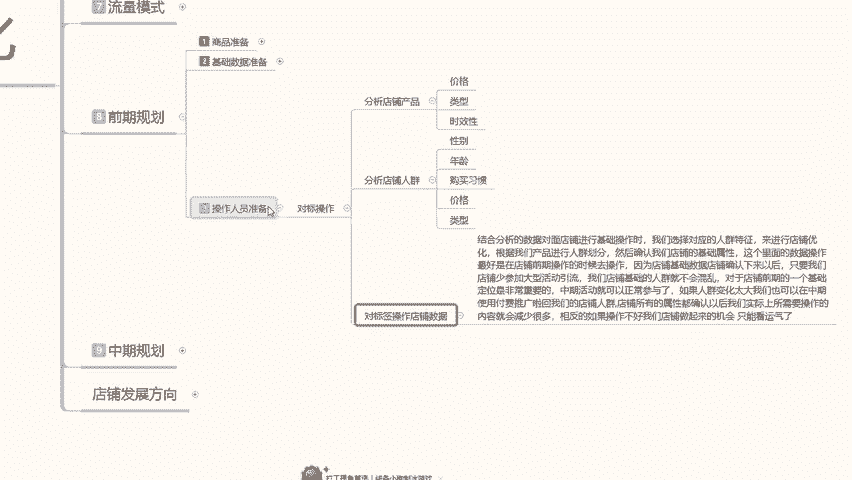

中期规划，但是下节课的话，我会当最后一节课给大家进行分享，因为中期规划的话，它整体内容太大了，你们现在如果说是新手，你去操作中期规划的话，你只需要了解一下他的大纲就可以。

如果说你是在这个阶段卡着不好动弹的，说实话你们了解一下数据，你们自己去做规划，因为中期规划的话，有些东西可以讲，有些东西不能讲，你明白的自然明白不明白的啊，我也不是太好跟你们说好吧。

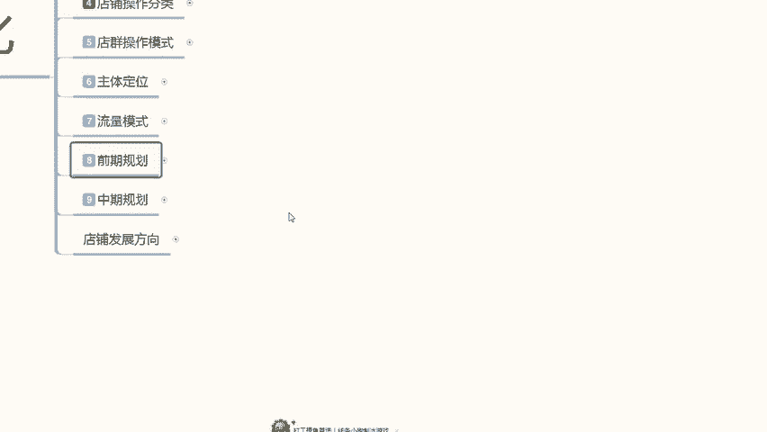