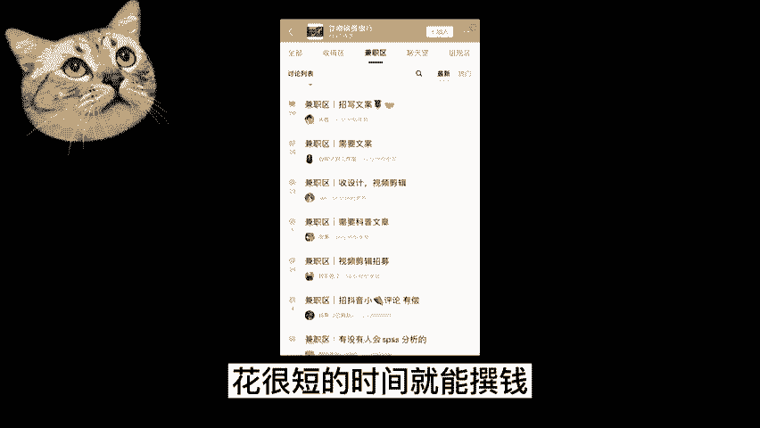
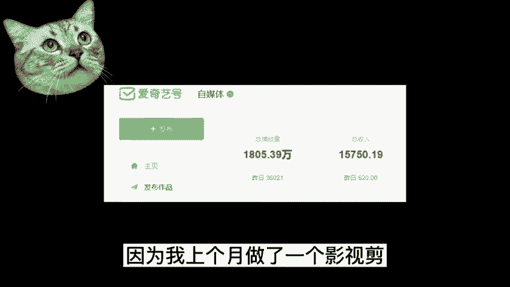

# 【2024版小红书体运营教程】全B站最良心的小红书开店运营高阶教程合集，小红书体开店 起号真的快 - P15：副业 - 轻轻换一声卿卿 - BV15M48ePEA5

大家好。

今天又给大家来分享副业赚钱的方法，很多人在网上找副业，但是又总担心被骗踩坑。

今天给大家整理了八个，不用交押金就能挣钱的平台，最后一个是最推荐的。

感兴趣的话就往下一起看吧，第一个时间财富网，国内的任务网站的代表之一，门槛比较低，只要有一技之长，就可以在上面找到让你赚钱的任务，比如说海报设计，修图，写软文，文案软件编程等等，类似的还有猪八戒网。

第二个豆瓣稿费银行，他那是全网人气最高的征稿约稿平台，门槛低，而且范围很广阔，里面有很多的公众号，报刊杂志和约稿函，新手小白呢也可以花一些时间，去接一些简单的任务，花很短的时间就能赚钱。

第三个拆书稿，可以边读书边赚钱，大概的任务就是，把一本书按照主题分为几个模块，然后提炼出精华的部分，一般一本书可以分为十个文章左右，一般稿费在1000到1万之间，不过这个的话花的时间要多一些。

因为你要花时间和精力去构思出稿件，投稿平台，有语人读书，十点读书。

静雅书院等等，第四个问卷调查类，这一类呢无门槛任务轻松，只需要点点鼠标就能完成网站上的调查，问卷或者是调查任务，就可以获得相对应的报酬，平台有第一调查网，第五个，百度知道合伙人。

相比一些没有后期保证的平台做副业，百度知道合伙人不仅可以答题赚钱，而且非常安全，按照回答赚钱，而且每次答题审核通过都是当场结算的，一个回答的收入大概是1。8元到三元不等。

熟练以后每天答题赚个几十块钱还是很简单的，第六个自由人写作平台，网上页面清晰，任务比较多，几乎各种技能都在这个平台上都能派上用场，例如设计修图拍照文案策划运营等等，第七个云客服，一个是阿里巴巴的云客服。

一个是蚂蚁云客服，这两个都是阿里旗下提供的副业岗位，每个月都会招几百个人，一个小时10~15元不等，根据自己的时间来选择工作时间段，申请方法也很简单，只需要关注他们的微博账号，在线申请就可以了。

第八个自媒体有头条号，大鱼号，百家号，企鹅号等等，这也是我正在做的自媒体平台。

赚钱方式有很多，平台也有很多，你可以先去了解各个平台，选择一至两个适合自己的去做，开始之前要把平台规则熟悉好，然后再创作，像这类兼职，我也是非常推荐你们去做的，因为我上个月做了个影视剪辑的账号。

收益就有1万多，你的视频只要有播放量就会有收益，这种兼职是不是很香。

想要开始，但不知道怎么做的小可爱们不要慌，给up3连，并在下方评论学习，我会给你们上一节自媒体新手直播课，来教你们怎么做，最后总结一下。

有人在哪里花钱，就有人在哪里挣钱，这是我们找兼职的王道。

