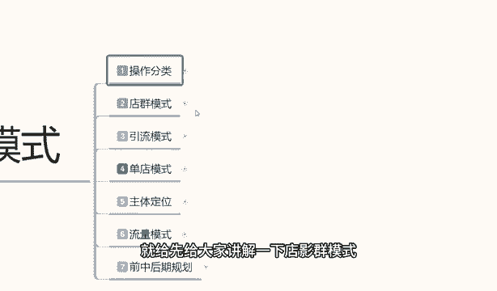
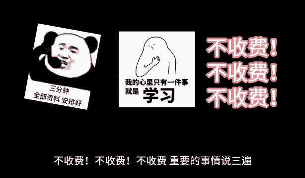

# 【2024版小红书体运营教程】全B站最良心的小红书开店运营高阶教程合集，小红书体开店 起号真的快 - P17：16、小红书开店3大主体操作分类 - 煤球很皮实 - BV1Q444eWEP5

大家好，今天给大家分享一个小红书，三大主体的一个操作模式，这三个主体操作模式的话，电驱模式，引流模式和单电模式，这三大主体的一个操作模式，包括我们的一个后三节课啊，主体定位流量模式和前中期。

包括后期的一个整体店铺的一个规划，因为整个课程的话他的一个内容是非常多的，我呢会在这里呢给大家把它分成小节，分享给大家，这节课的话先教大家一个第一节的一个内容，操作的一个分类。

就是我们小红书三大主体操作模式的一个分类，他这个的话是给大家讲解一下啊，我们个人用户适合做哪些结合自身啊，适合做哪些店铺的一个整体数据规划好了，废话不多说，直接开始我们今天的一个课程额。

第一课时呢操作的一个分类，整体的话啊，后面几个的话我会在其他时间呢给大家讲解，这一节课的话，主要就是给大家讲解，我们一下整个课程的一个分类，课程分类里面的话，我其实把它打成操作分类的。

是让大家整体的了解一下啊，就是整个小红书，他一个操作模式里面都有哪些分类，第一个是电驱模式，第二个是引流模式，第三个呢是单电模式，然后呢我再总和整体的一个分类情况，结合大家自身的一个实际情况去分析。

我们适合做小红书里面的哪一套流量模式系统，第一个是电驱模式啊，它的优点呢，就是说呃整体的话操作是非常简单的，就是说他不需要我们去了解太多的一个网络，运营，电商的一些系统规则，它只是重复简单的一些操作啊。

它的优点的话就是说操作简单啊，成效快，为什么要说成效快呢，我们如果说是去做其他的数据，你不管是引流模式也好，或者说是单电模式也好，它的成效的话肯定是没有这种电池模式快的，但是电池模式的话。

它操作简单是简单啊，包括他的一个信息也是可以随便更换的，就是说他整个店铺的话，店铺权重不重要啊，重要的是产品数量，缺点呢就是什么投入大啊，投入大是为什么呢，每个店铺他要交1000块钱保证金。

这千千块钱保证金，我们在前期的，如如果说你这个店铺没有成交，或者成交金额在5000块钱以下的话，是可以不考虑的，但是整体的话，我们还是要去交这1000块钱保证金，那么电池模式的话。

顾名思义的就是说没有一个店铺，你的收益的话就增加一分，所以说最少的话要有10~20个店铺，你才能称之为店群，不然的话你基本上都是单店操作，只是说单点操作多品而已，所以说它的缺点的话也是比较明显的。

前期的话投入可能大一点啊，但是有一点就是我们大家不做了以后的话，这个保证金之类的是可以回收的啊，就是说前期的投入它是可以完全回收回来的，它包括里面的一个税收的话，那个也用不了几块钱对吧，一个店的话。

你整体额手续费交进去，提出来一个店铺的话也就十几块钱，你十个店铺也就是140块钱，所以说他的一个投入大只是固定模式，我们前期的话，一个店铺大概可能会投1500块钱左右进去，那么你十个店就是要投1万5啊。

整体缺点的话就是在这个地方投入稍微大一点，然后第二个缺点呢就是收益一般，为什么收益收益一般呢，因为他不像精品店铺或者是引流店铺，引流店铺的话，我们是引流到其他的地方去做了对吧。

但是精品店铺的话就是长时间的可以发展，但是店群模式的话，它的缺点收益就是收益一般，因为他的话做不大啊，他就只能说是一个店铺或者几个店铺，一天卖个一单到两单左右，你十个店铺的话也就六七单，差不多。

你20个店铺一天也就十来单，那你我们想一下你的一个投入的话，对他收益的话其实不是太成正比，你一单的话大金额的还好，小金额的话你其实赚不了多少钱，只能说是比打工稍微强一点啊，第三个点呢就是操作时间长啊。

这个操作时间长的话，可能和其他的一个操作时间长不同，他的操作时间长的话是我们在电脑前面，就是整个店店群运营的一个模式，因为我们每天要上架和下架很多的一个产品，所以说他的操作时间就稍微长一点啊。

包括我们的一个小红书的一个笔记发放，你每个店铺每天最少要保证有两个笔记以上啊，发送数据根据产品关联的，那么整体算下来的话，你十个店铺你每天就要准备20个笔记对吧，所以说他的操作时间的话是稍微会长一点。

额收益的话其实和只说整个人轻松一点吧，做做店群模式的话，这是整个电池模式的一个优点和缺点，那什么是引流模式呢，引流模式的话啊，它相对于电驱模式的话，它是完全不是一个系统的引流模式。

我们就是说你不管是有没有主体的一个产品啊，有主体产品和没有主体产品，它的一个引流模式操作也是不一样的啊，嗯你是做引流模式，你就是需要把小红书的用户，引导到自己的一个交流群里面，然后去宣传自己的产品。

引流模式的话，它的一个优点是什么呢，第一个投入一般啊，比如说我们做小红书系统，你在这个里面的话，我们不管是分享笔记，分享自己的经验，或者说是分享自己的嗯搭配方式，服装搭配方式也好，食品搭配方式也好。

婴儿保障也好啊等等，你不管去分配什么东西，我们做引流模式的话，优点就是说他前面的话投入100，因为他不需要太多的一个嗯店铺权重啊，你的整个店铺的话说实话啊可有可无，你店铺开在这个地方放几个产品卖就卖。

不卖就不卖，这个都无所谓的，因为你主要的是把流量，引到自己的一个群里面啊，就看我们自己想做多大了，他的一个整体投入的话不会太高，嗯无非就是一个设备投入，无非就是一个设备投入，和我们的一个人工成本而已。

所以说他投入一般啊，这是他的优点，第二个优点呢就是收入高，为什么说引流模式的收入高，客户进入你的群体以后的话，他会是帮你去进行持续的扩散和发展，如果说你在引流模式把它做好以后，客户引进来了。

就是对你不熟悉的，但是你把他引进来了以后，他对这个内容感兴趣以后，他会慢慢的帮你扩大你的一个范围，所以说他的收入是非常高的，因为客户都进你的群了对吧，你想怎么引流，就是我们自己的一个啧啊，你去卖什么呀。

或者做什么都是可以的啊，就是说他的一个整体收入是非常高的，然后呢第三个就是后期维护简单，为什么，因为引流模式做通了以后的话，你的整体客户的话，你在小红书上面有一定的名气，或者说是有一定的人群以后。

人群进你群了以后，他的维护是非常简单的，他不用像我们嗯坐垫啊，做店的话，你还要有产品，还要有售后，还要退换货服，像你们这像这种做引流的话，他面对这种情况的话，一般都是咨询啊，很少有退换货的那种情况出现。

除非说你的产品有问题，那就看你自己怎么解决了啊，当然他的缺点也是比较明显的，缺点的话就是说整体在小红书上面，小红书虽然说有2亿的用户啊，但是他的用户的话是偏女性化的，90%到95%的人群。

都是女性化的啊，5%到10%，这个范围的话是男性，所以说他人群范围是非常小的，你要从这个里面的话，专门找到对应相关的人群，人群的话，你就要做你的小红书等额店铺人群，和你自己的那个怎么说呢。

就是小红书这么耗人群啊，你要把这两个做点做了，你才可以去引流，如果说你把这两个人群范围做不好的话，你引流引流进来的流量他都是不稳定的，所以说我们的一个缺点的话也是非常大的啊，他的人群范围非常小。

你要针对人群，包括我们要了解一些小红书引流的一些技巧，你才能去做这个呃，人群范围，第二个就是规模小红书引流，你的规模店铺的话，因为它是没有实体数据的，你就算是有实体数据，你也数量不大，知道吧。

你不好操作起来，也就是说引流的话，你只能说是以多电的形式去引流，或者说是以精品的店去引流，通过这种引流模式做完以后，你在做活动的时候，再把那你的商品啊放到小红书上面。

让你群里面的用户去小红书里面进行购买，但是这种权重的话不是太高，所以说你整体的一个发展的话，就会受到一定的阻阻力啊，就是规模的话规模有一定的限制，想把它变大啊，有一定的难度，第三个呢就是成交慢。

为什么说成交慢，因为我们做如果说小红书做引流模式的话，你最少前面要做一个月，到一个半月的一个精品笔记，精品笔记分享你自己的一个整体节奏，内容的话，你最少有一个半月你才能吸引到足够的粉丝。

不是说成效比较慢，你吸引到粉丝以后还只是进群呢，你进群以后的话，你包括你给呃用户做介绍，做产品规划，做人生规划等等这些东西的话，就说成效稍微慢一点，因为你要吸取别人的信任，他才会长久的一个嗯。

给你带来高高的一个收益啊，这个呢就是说小红书第二个的操作模式，引流模式他不是看整体店铺的，但是他需要店铺去帮你做引流，第三个呢就是单电模式啊，单电模式相对于上面两个的话，它嗯只能说是综合了一下。

他是在小红书上面直接进行我们的产品售卖呃，综合能力的话会对比上面两个模式的话，没有那么极端啊，第一个电池模式我们懒比较，就是对自己就说不是太信任的话啊，比方说电信模式我们去操作的话，就是说嫌嫌弃它麻烦。

我们不想那么操作啊，就可以做电信模式，做引流模式的话，你想做大赚钱，你去做引流模式好一点，第三个单店模式的话，那就是没有两个那么极端啊，它整体的话就是说我们要有一定的操作了解，对电商有一定的操作了解。

或者说是我们后期也可以去学啊，包括我给大家分享，也是往这个方面，想让大家多了解一下，我们整个系统的一个网络运营，所以说他综合能力的话会比较高啊，对比上面两个模式的话，就没有那么极端。

我们操作学习的话都是有进步空间，慢慢的就可以做起来，第二个呢就是说它的整体投入低啊，相对操作相对的话就是没有嗯，没有前面那两个那么简单，就是稍微会复杂一点啊，相对操作的话嗯，你引流模式也好。

引流模式的话，只是说你的小红书案例做得好就行，你店群模式的话就是每天操作的时间长一点，但是单电模式的话，它的一个操作的话就相对复杂一点了啊，但是他对比两个上面的系统的话。

他就是说我们的一个整体收益高一点，持续时间长一点，这个呢就是我们三个店群啊，也不是说三个电学啊，就是三个模式系统，下面我们结合自身的一个优点或者缺点，我们做对应的一个产品的话。

就会在小红书上面的话非常好做，你像如果说做引流模式的话，你在其他的一个电商平台的话，你还做不了，知道吧，但是小红书的话他没有这么多的一个嗯限制，你包括你去做抖音，或者说是淘宝啊，拼多多等等。

这些他都做不了引流模式，但是小红书他可以因为它的整体的话，后台系统它限制没有那么高，就说整合我们分类情况来看的话啊，电池模式它比较适合呢，拥有一定资金投入的用户啊，比方说宝妈之类做店群时间长一点。

在里面可以消化消化一下，去做一做男性用户的话，我们去做店群模式的话，说实话你有这个精力的话，我建议你去做单店模式，因为他的收益高一点，第二个就是引流模式，引流模式的话，这个的话就客观条件比较高一点。

你要有自己的一个产品试用经验，他对经验的要求非常高的，而且你后面需要有一个产业链的嗯，你就算说是个人没有产业链的话，你也要有对应引流的一个商品去做的，这种的话比较适合团队去做的啊，个人去做也可以做。

只是说他稍微麻烦一点啊，稍微麻烦一点，推广自己的一个产品，但是产品你也要自己做出来啊对吧，或者你怎么去做推广呢，最后呢就是单店模式，它的话就比较适合我们对于网络运营上面嗯，新人的一个操作。

但是他需要有一个耐心和执行力，如果说你没有耐心和执行力的话，我建议你做电驱模式，那样的话难一点啊，虽然说收益不高，懒一点，但是人轻松一点，如果说你有一定的耐心和执行能力，我建议大家的话。

就说我们不管你怎么去操作，做单电模式是最适合的好吧，那么这节课分享课呢就到这里，就是给大家整体介绍了一下，我们的一个操作分类嗯，小红书的三大整体运营模式，后面呢我会给大家陆续的讲解我们的店群模式。

怎么具体的一个操作步骤，包括引流模式和单店模式啊，下节课呢就给先给大家讲解一下电群模式。

我们应该怎么去操作，最后呢会给大家一个小福利，整理了小红书运营实操资料，可以评论区私信的方式领取，通过之后会第一时间发给大家，注意领取资料，不收费不收费不收费。

