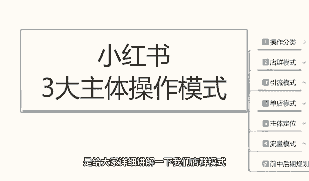
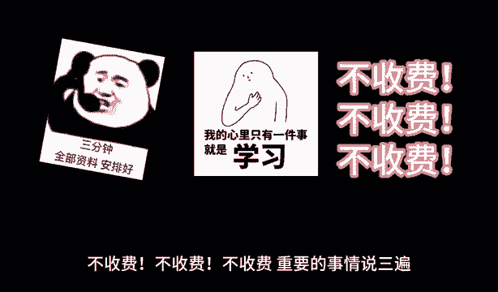

# 【2024版小红书体运营教程】全B站最良心的小红书开店运营高阶教程合集，小红书体开店 起号真的快 - P18：17、小红书开店-店群模式详细玩法 - 煤球很皮实 - BV1Q444eWEP5

大家好，今天给大家分享的是小红书，三大主体操作模式啊，第二课时的一个内容就是我们店群的一个模式，包括上节课给大家主要讲解的，就是说我们一个电圈模式，一个引流模式和一个单点模式，他们的一个优点和缺点。

结合我们自身的情况，我们是比较适合做什么，后面呢我会给大家持续的讲解，那这节课的内容呢是给大家详细讲解一下，我们店群模式啊。

这小红书应该怎么去操作，这里呢我就不多说，我就直接开始我们进入我们的一个内容好吧，人体电驱模式的话，其实小红书的电讯模式的话，它其实和其他平台的一个电锯模式，整体效应的话是差不多的啊。

没有太大的一个区别，它唯一多的一个区别的话，就是我们那个商品笔记和一个流量来源，可能会有一定的区分，那这里呢我就先给大家讲解一下，我们电池模式整体的一个操作，如果说大家想了解这呃。

整个系统的一个流量模式和流量来源，包括我们店群模式，做到后期的一个发展规划的话，可以去往后面啊，稍微等一等，我们的整个系统的话，店群模式啊，我在这里给大家是分为了三个步骤，第一个呢是店铺的一个规模。

第二个是操作方式啊，好第二个是操作模式，第三个是操作方式啊，这几个点的话是不一样的啊，首先店铺的一个规模，就说我们去做店群模式的话，店群模式它的规模是越大越好，整体效果也就越好。

基础规模的话就是说最好我们要有十个店以上，才能交接电群模式，你十个店铺都没有的话，你在小红书里面的，你包括在其他平台，你就不算电竞模式了，你那叫小打小闹，就是玩一玩啊，而且收益还不怎么高的。

你要做店群模式的话，最少有十个以上的一个店铺去操作，它的整体的一个收入来源的话，是通过多电无线上传产品啊，就是无限制重复的一个产品发布，这个里面的话就是说电池模式的话，它嗯比较简单的原因。

在什么地方不需要有自己的产品，这是第一点，不需要有自己的产品，第二点它的整体前期的一个固定投入的话，我们是可以回收的，你像其他的一个超模式的话，它的一个整体固定收益的话，就是固定投入的话，他回收不了。

知道吧，他有可能会亏本，但是这个电池模式的话，他绝对不会亏本，他只是说赚多赚少，看你能不能做起来的事，而且它整体效益的话，说实话收益也是比较一般的啊，他收益率来源呢是通过多电无线上传的产品。

进行产品展示，吸引吸引人，对网络不熟悉的人啊，对网络熟悉的人的话，他很少有人去会去店群里面去购买产品啊，进行成交，通过大规模的一个产品关键词展示给用户，这个先是关键词展示，然后是小红书笔记展示，为什么。

因为你的关键词比你的小红书的笔记，内容要多得多啊，这里给大家提醒一个点，你的店铺的关键词展示的，会比你的小红书玉那个笔记的话要多得多，然后通过小红书的笔记进行引流，关键词只是展示引流的话。

你还是要靠小红书的小红书的一个笔记的好吧，收入计算方式呢也是比较简单的，它是通过店铺进行铺货，就是我比方说我有十个店啊进行成交，十个店的话，每两个店每天成交一单，十个店下来一天就是五单，五单的话。

你看你每天每一单里面能赚多少利润，就是你的一个纯收益，就是网络搬运工啊，名次的话你就只你在这个里面的话，在整个小红书系统里面的话，你就是网络搬运工，为什么叫网络搬运工呢，因为你是没有产品的。

你的产品来源无非都是拼多多，淘宝的1688或者说是京东，但是京东的话产品太贵，你在小红书小红书上面去做的话，做不起来，那么无非你就是在网络上面去寻找这类似，一件代发的产品来做，让别人把图片给你。

或者说是你直接批量去下载别人的一个产品，上传到小红书来做，不是说他操作是非常简单的，但是他每天的内容都是比较重复的啊，他这种收入的一个计算方式的话，就是店铺进行突破，刚刚被打扰了一下啊。

我们继续就说进行成交的话，他是每天每个店大概有多少啊，然后进行成交的，然后单店的话，如果说我们整个店铺的话，我们拿单店来做比较啊，他整个店铺额规模形成以后的话，你就是产品大概到达了500以上的话。

每天可以给你带来1000到2000个访客啊，如果说数据好的话，做得好的话，你的整体店铺规划做得好的话，那么他每天可能有两到十单左右的一个成交，当然这个这个数据呢它不是绝对的啊，只是一个概率问题而已。

就看嗯就看你的一个整体的产品选的好不好，产品选的好的话，这种概念还是非常大的，但是基本上差不多的话，你两个店铺的话，每天最少都有个一到两轮的一个成交，那十个店铺的话，你整体下来的话额收益也还算是可以。

一个月的话赚个一两万块钱，但是它整体的话前期的一个投入比较大，而且操作的话嗯会比较繁琐，前期有可能会你自己啊做时间长了以后，会感觉投入和收入有点不成正比啊，就是这个模式里面的话咳，缺点就在这个地方。

然后店群模式盈利方式呢啊我也给大家讲过了，他的话就是说通过大量的商品来提升访客，进行成交的，它整体一个操作模式的话，我们就说可以使用多电进行统一的一个操作，当然这种统一的操作是店铺数量没有上限啊。

什么叫统一操作呢，就像我刚刚给大家说的，我们有十个店铺，这十个店铺的操作都是一模一样的啊，不需要其他的，你比方说你把这十个店铺里面的产品，全部弄完以后的话，你然后再用一键转发的一个数据量。

转到其他40个产十个店铺里面，然后去进行分发就行了，但是整体的一个店铺的话，就是说最少不能低于十个到15个之间，这种小红书店群模式的，它没有下限，它只有不他没有没有上限，只有下限啊，你上线你开50个店。

开100个店，开1000个店都可以，只要你有这个能力，只要你能投入这么多东西，当然你开开1000个点，你太夸张了啊，我目前的话就说我接触了啊这么多类似的嗯，学员也好啊，或者说我们同行也好，做这种数据的。

就说操作店群的，也还是在几年前在淘宝上面，他做的一个店群模式，店铺单店数量达到了98个啊，不过他不是一个人操作，一个人操作，他做不过来，他是找了六个人做的，98个点，一个人管十几个点，一点问题都没有的。

所以说看你们自己怎么去理解这种啊，就是说你最低店铺不能低于十个，你想把它稍微做大一点的话，就是无线铺垫，铺垫铺的一个数据就可以了啊，操作方式呢也是比较简单的，使用采集软件就行，那种采集软件的话。

你它系统小红书系统里面的话，它自动就有呃，包括小红书前两年他的一个店群模式，它铺货数量，包括他的一个系统收入，整体来说的话啊，他都是有操作规模的，但是如果说再过个一两年，这种电池模式就不适用了。

因为它系统成熟了以后，他就不会录入那么多产品啊，还是要想其他的方式去赚这个钱，所有采集软件进行大规模的一个产品上架，然后呢每天每个店铺上架50~100件产品啊，最多100，最少50，控制在这个范围以内。

如果说你上架产品太多的话，他小红书里面的话，恶意铺货啊，会把你的店铺屏蔽掉的，你在这个范围以内就行好吧，然后每个产品的话，每个产品啊大家听清楚，每个产品每天可以发两个笔记啊，但是我们基本上是没有那么多。

没有那么多笔记去做的，因为笔记的话比上传产品还麻烦，你笔记得自己去编辑内容，或者是去啊抖音啊，或者说其他地方你把人家的文字文案呐，相对应的一个信息复制下来，然后再进行修改，然后再去上传，你十个店的话。

每天就是20个笔记，你如果说用AAI机器人去做的话，可能会好一点，但是那个投入就变大了，没有必要啊，自己做的话嗯其实也比较简单，就看自己怎么复制了，然后这个里面的话其实我们没有那么多内容啊。

因为你相当于一个店五十五十到100个产品，你一天得发200个笔记了，没有必要啊，每个店铺每天最少发两个笔记就可以了，两到手最少两个笔记啊，然后的话你把它产品分开去做，就是每个产品你不能发三个。

你比方说你今天这个单点想想发五个笔记，你因为你笔记越多的话，他对你的引流效果也就越好，那就说单品的话啊，这里面为什么跟着大家说的，是每天每个产品可以发两个，不是店铺啊，店铺的话你发个五个十个都没关系。

但是每个单品最多发两个，就说你你今天想发五个的话，你在这两选两到三个单品去做啊，不要在一个产品上面去做，因为那样的话，小红书的一个系统，它会把你屏蔽掉的啊，这个呢就是整个电池模式啊。

包括他的一个店铺规模，一个操作模式和一个操作方法啊，都分享给大家了，但是他这个里面的话其实还是有很多细节的嗯，后续吧我再找个时间给大家详细的讲解一下，我们这里面的一些细节操作好吧，但是他整体来说的话。

基本上没有太大的一个细节构成，它就是重复重复再重复，就看我们自己有多少时间啊，能坐坐垫，自己能不能操作过来，能不能聊过来的事情好吧，那么这一节课分享呢就到这里，下一节呢给大家讲一下引流模式啊。

引流模式的话，它的一个赚钱方式的话会比电池模式要稳定，但是他的一个操作的话会复杂一点，好吧，那么这节课呢就到这里，最后呢会给大家一个小福利。

整理了小红书运营实操资料，可以评论区私信的方式领取，通过之后会第一时间发给大家，注意领取资料，不收费不收费不收费。

