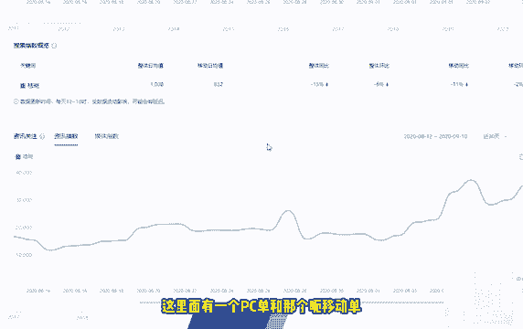
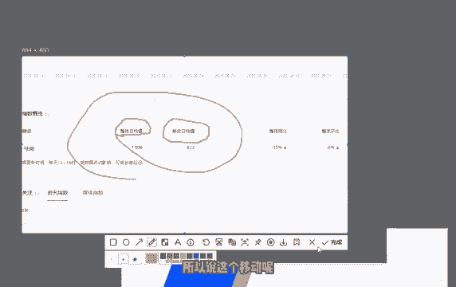
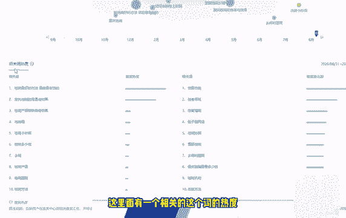
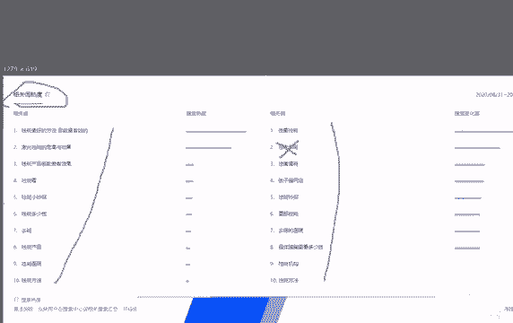
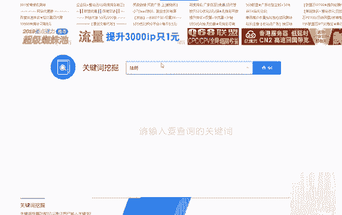
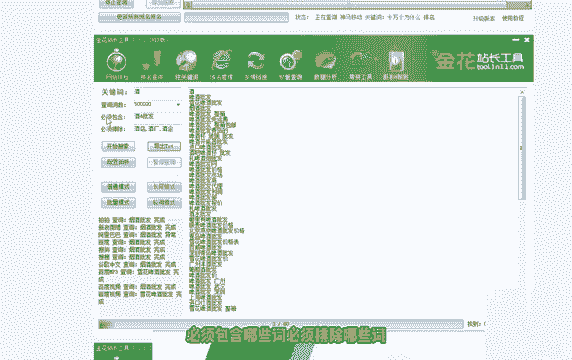
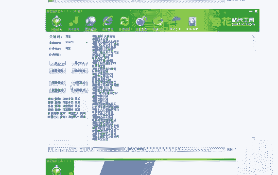
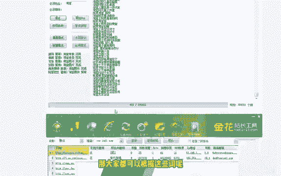

# 【2024版小红书体运营教程】全B站最良心的小红书开店运营高阶教程合集，小红书体开店 起号真的快 - P20：P19第19节：小红书笔记关键词挖掘技巧，线上线下行业关键词挖掘方法分享！ - 遥远的她fa - BV1xX3PeVEaS

我们今天这节课呢，第16课来和大家讲解一下，这个小红书里面的关键词挖掘的这么一节课，呃相信做很多的这个小红书的朋友呢，都是冲着一些行业的热门词都过去的对吧，那么我们怎么样去找到自己所在的这个。

行业里面的一些热门词呢，呃今天这节课呢，我们就结合线上和线下的这些相关行业呢，进行一个关键词的挖掘，那么我们首先说一下这个线上的关键词挖掘，线上的关键词挖掘呢也就是这些呃，我给大家推荐了五个工具。

也就是五个渠道，大家都可以去仔细的去研究一下，下面呢我来给大家去实地的演示一下呃，首先我第一个推荐的呢就是这个百度指数，百度指数这个网站呢是百度官方的啊，我们在那个百度里面搜索出来百度指数之后。

登录好你的这个百度的账号，然后呢我们点击进去，就会来到这样一个网站啊，他是这个百度官方的啊，我们这个时候假如说搜祛斑这两个字对吧，假如说我是做祛斑的好，大家可以看到祛斑的这个关键词弹出来之后呢。

它这里面会自动的弹出来一些，这个跟祛斑一些相关的一些个这个关键词，我们可以呢去直接点击这个祛斑，也可以呢直接点击这个有一些，比如说像这个祛斑最好的方法，目前最有效的我们可以点击这个啊。

我们点击可以开始搜索，大家就可以看到这个关键词呢，在这个百度里面它有一个这个搜索量，每天的这个搜索量是多少，像比如说祛斑这个词，每天的搜索量就是将近有1000啊，将近有1000，然后这里面有一个这个。

这里面有一个PC端和那个呃移动端。

这里大家注意一下，就是在这里，啊这个为什么叫移动日均值呢，这个移动的意思呢，就是说我们在手机上搜索的这个频率啊，大家都知道现在的人呢用手机的这个时间呢，肯定是比电脑时间要长的，所以说他的这个呃。

这个移动搜索端的这个搜索量呢，是占到了很大的一个比重，占到了80%，我们可以看到它一共整体的日均值，就是说这个词一天所有渠道的搜索，搜索量才1000多个，1008个，但是他的这个手机端呢就占到了80%。

看到了吧，有八有800多个就降，降低到了这个80%啊，有800多个，所以说这个移动端呢它的数据呢是非常大的。

就比如说呃打个比方，我现在做的是祛斑的这个产品对吧，我想主攻这个祛斑，那么我们可以去主动的去搜索哪些关键词呢，我们可以在这里面看到有一个需求图谱，我们点击这个需求图谱之后呢，就可以看到有一些的这个。

相应的一些这个关键词，我们一起来看一下呃，大家为什么，大家知道为什么要跟看这些关键词吗，因为搜那些搜这个祛斑的人呢，他肯定是会搜这些词的，这些词呢，搜索量在百度里面占有占比呢是非常大的。

那同样的话呢在小红书里面，他的这个占比呢也是非常大的，所以说我们就可以去投其所好，比如说我们直接去做这些关键词，那同样的话呢在小红书里面，它的这个搜索搜索的这个指数呢也是非常大的。

就比如说我们可以看到如何去除脸上的斑，去祛痘，哪个产品好啊，痘和斑也差不多的对吧，如何如何淡斑小妙招，重庆去搬，南京去搬啊，这两个地区祛斑的需求量是比较大的，看到了吗，然后我要去搬去搬多少钱对吧。

激光祛斑的危害与效果，那这种这种这种标题呢，这种关键词呢，我们可以就写成那个小红书的种草文章，去发布一下，对吧好了，这里面呢就是一些大家呃就是我们的用户啊，常说的一些词。

我们可以去根据这个东西呢仔细的去看一下啊，包括呢这里面有一个相关的这个词的热度。

这百度的这个工具呢还是非常不错的，它这里面呢有一个相关词的热度，大家可以看到前一名到前十名，基本上这些词呢都是非搜的非常多的，那我们做这个小红书关键词的时候呢，比如说我们可以去写一些这个相关的一些。

小红书的文，小红书的文章就可以以这个东西作为标题，我们去写，包括一些相关词，看到了吗，跟祛斑有关系的，去老年斑，祛斑祛斑，面部祛斑，祛斑机构祛斑方法，那比如说你是专门做祛斑的人，这你就不是做老年祛斑的。

那这个词就可以不去做对吧，因为他是做老年人祛斑的好的。

这个呢就是我们百度指数的这么一个，工具的使用，那么我们第二个呢得给大家推荐的，就是百度的相关搜索，百度的相关搜索呢也非常有意思，也非常呃值得大家去研究一下，比如说我在这里面搜索的是这个祛斑这两个字。

对吧，当我点击这个，啊大家可以看，当我点击这个搜索框之后呢，它就会出来很多跟雀斑有关系的一些关键词，那百度给你推荐的这个下拉框，里面的这个关键词呢，我说的这个东西就叫下拉框啊。

这里面所有的词呢也都是比较热门的，也都是比较热门的，大家搜索的这个渠道呢也是非常多的，我们可以把这里面的词呢都做一下，做成小红书的这个相关的笔记好，然后呢我们接着往下拉，拉到最底下，大家可以看到。

这里面呢有一个百度的相关搜索啊，他这里面呢就非常详细了，雀斑淡化的最有效的办法，目前最安全的祛斑方法，八种祛斑小偏方，看到了吗啊，比如说我这时候点击雀斑淡化最有效的方法，大家可以看到呢。

这个时候呢你再拉到最底下的时候，它这里面全都是跟雀斑有关系的一些关键词啊，这些关键词呢同样是的，为什么百度会把把它放在，这么显眼的一个位置啊，就是最底下的这个位置，因为这里面呢也是大家常说的一些词。

那我们比如说我是做祛斑的这个词的，我不知道想做哪些领域，或者说我不知道该写哪些，这个小红书的一些标题的文章，我们就可以根据这个方法呢，去写出我们自己的这个小红书，关键词的一些文章了。

那这个方法呢也是比较有效的啊，但是呢就比较麻烦，你要不停的点，才能够获取到很多的这个相关的一些，这个相关搜索的一些关键词啊，这是第二个就是啊就是百度的相关搜索，那么第三个我给大家推荐的呢。

是这个5188的网站，5188的网站呢还是的，我们直接点击这个5188，然后呢搜索一下，这里面呢有一个啊5188点com，大家也可以直接打这个网址进去啊，我们点击进去之后呢。

但他的这个首页大家可以看一下，这里面有一个别的我们就不看了，别的我们就不看了，啊我们直接在这个关键词里面搜索去斑，或者说在这个移动移动流量词里面去搜索，去斑啊，相关关键相关关键词，相关词的一些挖掘呢。

也可以在里面进行搜索，这三个工具呢都是非常有用的，我们就给大家去演示一下，这个关键词挖掘里面的这个用法呃，大家可以看到这个里面呢它其它是非常详细的，找到相关的这个长尾词呢，一共是这么多个啊。

多少个我就不念了，有记录的是900多个，没有记录的，这应该是这应该是七位数，应该是100万个，应该是100万个，大家可以看到这些关键词呢，我们也可以去做，看到了吗，也可以去做。

但是5188有个不好的地方是什么呢，就是说他是收费的，如果说你不想去升级这个SUVIP的话呢，可以直接在淘宝上租一个账号，出一个账号呢，然后去查看他所有的数据，包括可以去生成这个词云啊。

导出这里面的一些数据啊，选择这个时间点啊，呃包括疑问词啊，高频词啊，需求图谱啊，这里面反正他的这个呃，他的这个功能呢是比那个百度指数，包括我刚才说的百度搜索功能，都都要更加强大一点的。

这个里面的功能大家可以去试一下，然后想要开通VIP的话呢，要么你直接充值一个，要么你直接去淘宝上租一个这个账号都可以呃，我们下面说的一个网站呢，就是这个爱战网，爱战网的话呢。

也可以进行相关的这个关键词的一个分析，我们打开这个爱战网这个官网，再搜索一下I站网，I战网，看到了吗，就这个I站网，我们点击这个爱战网的官网之后呢，就会来到一个这个。

啊或者说你直接点这里面有一个关键词挖掘，也可以在这个地方关键词挖掘，在这个地方有个关键词挖掘，这个呢就是爱战网的关键词挖掘，我们点开之后呢，他就会来到相应的这个相应的一个关键词，搜索界面。

比如说我们还是搜去斑。

好大家可以看到祛斑的，它这个词呢就会也是的搜索了，搜索出来有很多大概有100个，一面的话是100个，然后我们可以去下载爱战网的这个相关的一个，软件去挖掘，也可以的，包括这里面词词词的一个指数呢。

它没有那个5188那么花里胡哨的，但是它呢这个也是比较实用的，比如说激光祛斑的危害与效果啊，PC端就是电脑端每天有120一个人搜，手机端呢每天有1000多个人搜长尾，长尾词数量呢。

就是一个收录数量呢是5000万个对吧，然后第一位是什么，第二位是什么，它的优化难度，大家可以看到这是橙色的还是比较难的啊，比如说像这个词去做的话就比较简单了，祛斑最有效的八个偏方。

它的搜索量呢其实也不低，100多个的800多个对吧，然后呢你可以去根据这个东西去判断，你的这个关键词到底能不能去，那更好的适合你做，我记得我建议新手呢，就是说可以去做一些稍微冷一点的词。

比如说从第15个开始对吧，逐步逐步的去往上呃，下面我给大家推荐的这个工具呢，就叫金花站长工具，大家直接搜索这个金花站长工具呢，在第一个它这地方有个官网，我们点击这个官网之后呢。

就会来到金华站场工具这个官网，他这个官网呢其实跟那个5188，包括那个爱电网的软件用起来是差不多的，我们一起来看一下啊，在这个地方它有一个啊这个软件啊，大家可以自己去下载一下，下载一下。

比如说他在这里面有一个挖关键词填写哈，我们的这个相关的一些关键词，然后呢进行挖掘，必须包含哪些词。

必须排除哪些词，然后呢可以去相应的这个生成一些关键词，大家可以看到，比如说淘宝这个词对吧，淘宝关于淘宝上面的这些词呢有个长尾模式啊。

普通模式批量模式，这个人选的是长尾模式，能导出这么多词，那大家都可以根据这些这些词呢。

去布局我们的这个小红书的一些这个关键词，好了，这个是我们以上呢，就是说我们线上的这个关键词的一些安全方法，那么我们线下的行业呢就比较简单了，就我建议大家是怎么做呢，就是说地区加上行业。

比如说你是在上海做美甲的对吧，你就可以写上海美甲，上海美甲哪家最好，上下上海美甲哪家最漂亮，上海美甲哪家最便宜，哪家最实惠，哪家款式最好对吧，同样的比如说我们还可以打个比方，比如说苏州婚纱对吧。

苏州婚纱哪家最最最实惠，外景最多啊等等等等等等，对不对，你就可以去布局这样的一些相关的关键词，去做啊，这个是线上和线上，关线上和线下的这个关键词的一个挖掘，好的，那我们今天这节课呢。

教大家这个挖掘关键词的这个课程呢。