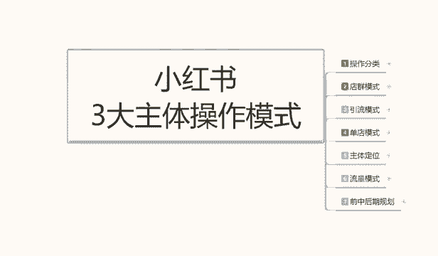
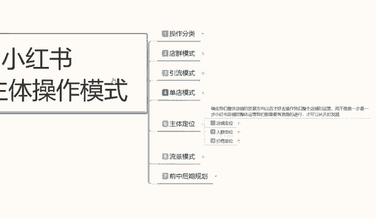
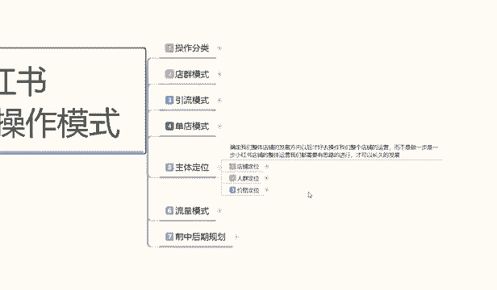
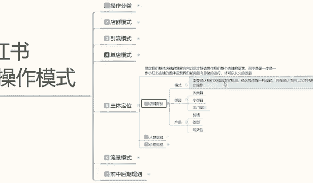
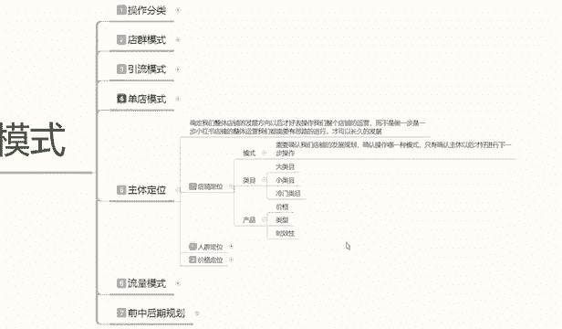

# 【2024版小红书体运营教程】全B站最良心的小红书开店运营高阶教程合集，小红书体开店 起号真的快 - P21：20、小红书开店-店铺主体定位 - 煤球很皮实 - BV1Q444eWEP5

大家好，今天给大家分享的是小红书三叉主体操作模式，里面的啊，第五个小节课程啊，主体定位模式之前给大家也讲过了啊，我之前给大家说的是呃店铺的一个模式操作，现在呢是讲啊，呃应该说是之前给大家讲解的是。

小红书整体运营模式的一个操作，三大运营模式嘛，店群模式，引流模式和单店模式，你不管是在小红书上面，你是做引流也好，做店群也好，做单店也好，它的三大整体模式的一个效应，我都已经给大家说了。

这节课是教大家啊。

小红书里面我们确认整体店铺的一个发展方向。

为什么你在三个模式里面，你不管是了解电讯也好啊，了解引流模式也好，了解单点模式也好啊，你都是要选择一个模式的一个方向去操作的，那你的方向操作的，说实话，电竞模式你基本上固定形态。

在这个地方你没什么好了解的，引流模式的话，你前期本来就做的主要是笔记，店铺是可有可无的，说实话正常我们来讲的话，只是说单店模式里面啊，选择一个重点突出的去给大家讲解一下，因为其他两个的话。

它的一个整体的话和店铺分类啊，就是和我们主体的话，三大操作模式的一个课程的话会有一定的冲突，所以说在这里的话，我会单独拿单电模式，或者说是多点模式的一个爆款形式，给大家去做一个主体定位。

大家了解这个模式以后的话，说实话你再反过来去操作电群也可以，操作引流模式也可以啊，他基本上都是互通的，只是看我们带大家对于这个类型的东西，怎么去了解，而且我给大家讲的主体定位，为什么是讲主体定位。

讲单电模式里面不讲引流和电群的，因为你主体定位里面的单电模式，它的数据量是最多的啊，大家记住一个点，单店模式的主体数据量是最多的，它要优化的数据和我们对整个小红书系统，包括网络运营系统，他整个一个了解。

你把他了解透彻了以后，你再去做任何店铺，他都好做，如果说你不了解的话，直接去碰店群或者是引流的话，你不好操作了，所以说我们先了解整体的一个单店模式，就是整个小红书运营系统。

它是靠什么样的一个后台系统来运行的，我们才往后才好往后面去发展啊，如果今天的话，主要是给大家介绍一下啊，主体定位，主体定位这个里面的话他有店铺人群，店铺定位，人群定位和价格定位三个定位啊。

说实话这是一节课，他是讲不完的，我是给大家准备分三节课，到四节课来给大家讲解好吧，那直接开始我们呃这节课的主体内容，店铺的一个定位啊，确定整体店铺的话，就说店铺定位是什么。

它是确定我们整个小红书运营系统，整体的一个发展方向，我们只有确认了方向以后，我们后续才好去操作我们整个店铺的一个运营，而不是说做一步想一步想一步做一步，看做到什么地方是什么地方，那样的话，你小铺店铺。

你在整体运营上你没有规划的话，你做不好的，你怎么可能去和别人有经验的人去做对比呢，对不对，你虽然说你也是想去里面抢流量，但是你这一个流量啊，这一个用户你能抢到多少，就看你操作了，你抢一个也是抢。

抢100个也是抢，那你何必不再多抢一点呢，对不对，蛋糕就这么大啊，你有能力你就多分一点，你没有能力你就少分一点，说实话你再也没有能力了，回家躺着就行了对吧，没变好，所以说我们既然是想做小红书开店的。

那你一定是为了赚钱来的，所以说我们一定要先把基础了解清楚，基础了解清楚后，再去做运营模式的一些整体调整就行啊。

那这里呢主要给给大家讲解一下店铺定位，什么叫店铺定位呢。

小胡子的店铺定位啊，首先第一个是模式，第二个是内幕，第三个是产品模式是什么，首先确认我们店铺的发展规划，确认操出哪一操作哪一种模式，只有在确认主体以后才好运行下一步啊，如果说你的主体模式没有操作好的话。

那你的下一步他的所有内容都是不一样的，一般说我之前给大家讲的单店模式里面，它还分单爆款和多爆款，你单爆款前期好操作一点，你本来就拿第一款做产品利润的，你多爆款的话，你只拿第二款产品做利润的。

第一款的话只是平价去买啊，保证店铺不亏本就行对吧，那你在这个里面的话，他操作的目标和方向都是不一样的，所以说他的模式你一定要确认好，因为模式一旦出错，你后面的操作的话，会影响你整个店铺的一个数据的。

你比方说你拿，你拿单电模式的一个操作去玩定额，单爆款的模式去做多爆款的话，你整个店铺说实话，你第一步起步阶段你就做不起来，因为你整体竞争的话，你产品价格偏高，你去和同和同行竞争的话，你就做不动，知道吧。

别人卖50，你卖80，别人卖100，你卖120，你怎么去卖呢，对不对，你没有自己稳定的一个粉丝流量，别人看都不带看你的，你的图片做的再好都不都不带进来瞅一眼的，知道吧，不是说看看你自己的话。

要看我们自己怎么去调整啊，所以说模式一定要确认好，你模式确认不好，你后期操作都白费了，第二个是类模啊，类目的话，这里面可以分为大类目，小类目和冷门冷门类目三个类目的一个分类，说实话啊。

这里面的话其实内容是太多了，我只是说给大家简单的做一个一个介绍而已，内幕里面大类目是什么，大部分人实用性的一个产品啊，服装食品啊，呃婴儿用品，玩具等等，这些都算大类目，包括你的化妆品也好，装饰品也好。

它都属于大的类目，小类目是什么小众内幕嗯，手机手表这种只说搜索的多，但是他做的少，他就属于小众内容，你再比方说成人品，说是纯种用品，然后的话就是保健品，药品，药品的话也算小类目里面的，它不算大类目。

大类目的话，这是你整个生活日常，虽然说药药品里面也属于生活日常，但是药品的话它属于特殊特殊的一个类目啊，因为你需要认证的，你没有认证，你在小红书上面做不了的，然后的话就是冷门内膜，什么叫冷门内膜啊。

就是电子类产品啊，包括你的手写画板啊对吧，素描之类的，他都属于冷门内膜，他这种是属于特定的固有产品呃，网络讯包括那个虚拟虚拟产品啊，就是你比方说买游戏啊，充点卡啊之类的啊，买装备啊。

他都属于这种话属于冷门类目，你要做店铺之前先确定模式，再确定内幕，你要做大类目，小类目和冷门门类目里面的哪个产品，那它这三个类目产品的话，它都是不一样的啊，区别非常大，大类目小类目冷门内幕。

他的操作方式也是非常大的，你要确认你做哪一个啊，先选模式再选内幕，最后呢是选择产品，产品里面选选产品的话，你要注意里面的一个价格，一个类型和一个时效性，时效性我给大家讲过了啊，你做单店单爆款的话。

实效性最好的话是一个季度三个月以上，最好是三个月以上，你如果说你做一个季度的话，你做你比方说现在的话啊，按4月份5月份来算，4月底5月初你按照这种时效性去做的话，那你整个的一个产品的话。

你要选择在76789这四个月去做，还可以做，也就是说5月份你必须开始操作了，你过了这个时间段的话，你678它发展不起来，因为你的整个店铺主体你操作起来的话，你前期你最少花半个月去做。

整体店铺的一个基础属性，你做完接触属性以后，你才有后面的一个时间段啊，同学一定要把这些额内部的一个时效性给选好，然后是价格和类型，为什么这个类型和价格的话，价格是你产品的价格。

你做单点模式的一个价格也好，做多爆款店里的一个价格模式也好，你要把价格先确认出来，第二个呢就是说呃类型选择大类目里面，它是分很多小类目的啊，大类目里面你比方说服装，服装里面有男装女装，这都属于大类。

女装里面有半身裙，连衣裙嗯，等等一系列短裙啊，短裤啊之类的内衣啊，它都属于服装里面的这一个大类里面，分类的一个小类，所以说你要把类型选好，你的产品类型的话，是根据你店铺的人群定位来做的啊。

比如整体整体来说的话，你要把这几个先选三个点，不能说先选三个点啊，先选模式内幕，这两个是一个点，这边的话产品里面的话，你包括价格类型和时效性，这是五个点啊，你要把这五个点选清楚了，你才好去做好吧。

这个呢就是我们整体店铺定位的一个基础要求，你选完这五个以后，你才能开始下一步，你这五个都没选完，你下一步就做，你也做不了好吧，那么下一节课呢给大家去讲解一下人群定位啊。

