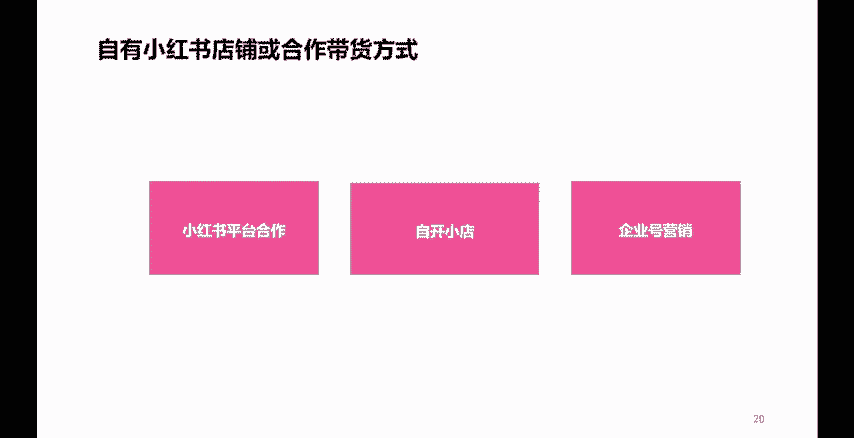
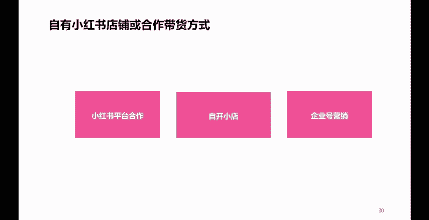
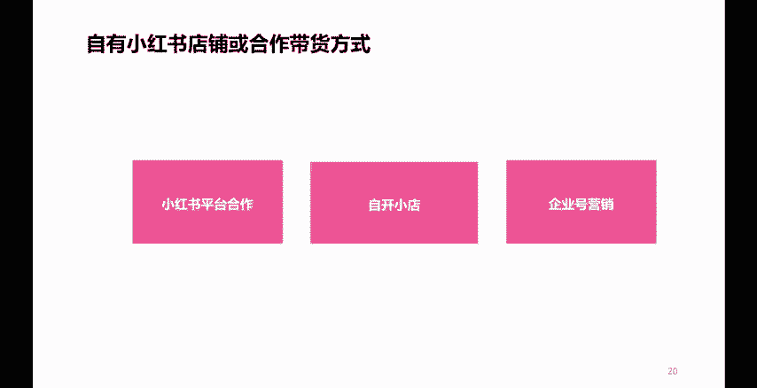
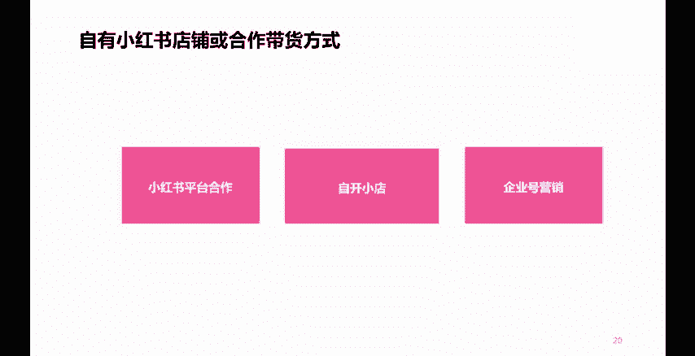
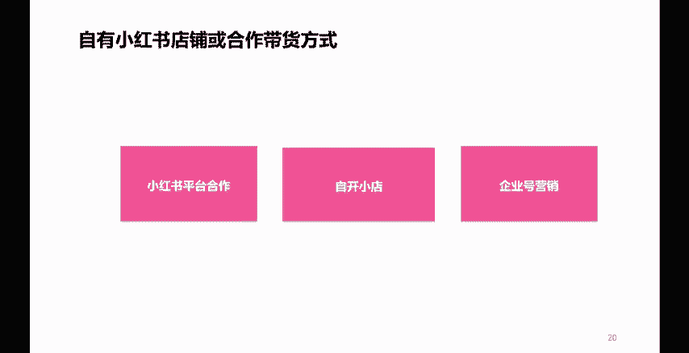
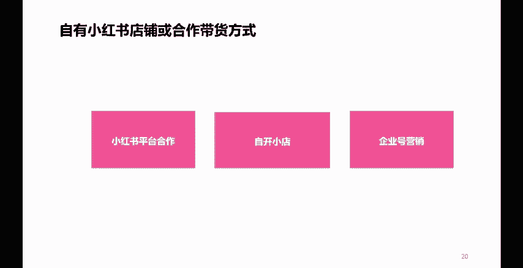
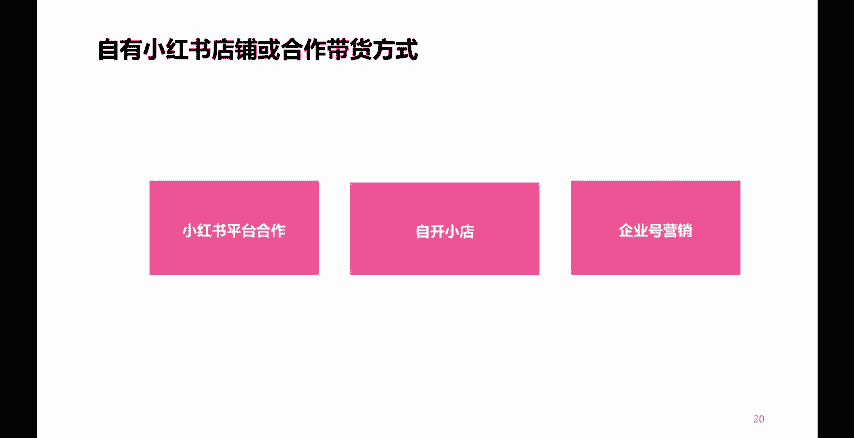
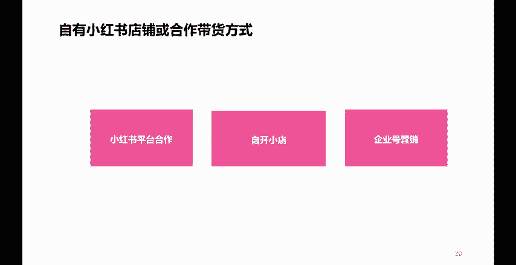
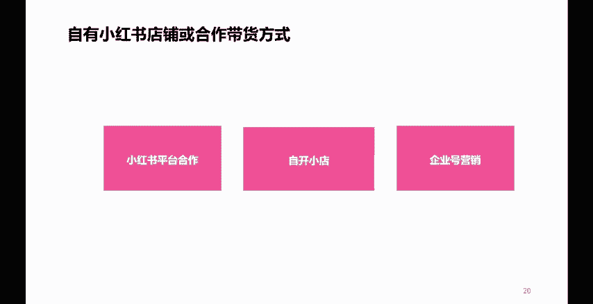

# 【2024版小红书体运营教程】全B站最良心的小红书开店运营高阶教程合集，小红书体开店 起号真的快 - P23：15.小红书市场现状 - 红书开店教程 - BV1MVWDe6EAp

第二种方式呢叫做小红书啊，店铺啊。

比如说你自己有啊，自有小红书店铺啊。

或者是要去谈一些合作啊，或者要去谈一些合作，那么这个怎么做呢。

首先呢这里头也有三种方式，比如说第一种。

第一种，第一种的话呢就是小红书的平台合作，这个呢需要大家呢登录小红书的电脑端，登录小红书的电脑端。

在登录小红书电脑端之后呢，啊大家就可以看到啊。

小红书在电脑端里头有一个创作者服务是吧。

哎在创作者那个服务那呢就能看到啊，有一个小红书的一个什么呢。

哎这样一个小红书的一个合作啊，如果你是一个账号。

你想要为别人带货进行一个什么引流变啊。

流量变现的话呢，你就可以通过那个渠道去实现一个变现。

因为小红书的官方平台呢，它提供了一个很好的平台。

这个平台里头呢它既有内容创作者，也有一些专业的一些什么呢。

小红书账号的一些运营的机构啊。

比如说像一些MCN机构对吧，当然了肯定也少不了大量的什么呢，商家在里头。

也就是你加入了小红书的这样一个平台的话呢，相当于这个平台里头有专业的MCN机构。

就是小红书账号。

专门运营这种账号的一些专业机构啊，还有什么呢，商家啊需要别人来给他带货的，还有就是像你这样的一些什么呢创作者。

那么你来到这个平台之后呢，你想想商家可能会跟你合作。

哎M3也可能会跟你合作。

为什么呢，他们主要就是什么呢，做这种账号孵化账号运营的。

如果你的账号做得好，你很有可能进入到他们的一个什么呢孵化阵营。

那你的账号一定将来，而且或者说很大程度上将来会成为一个什么呢。

头部账号，这个呢大家可以登录小红书电脑端啊，去查看一下。

第二种呢叫做自开小店。

自己呢可以通过小红书呢开一个小店，哎，无论你是个人还是商家还是企业。

无论你是否有营业执照对吧，都可以，大家呢可以在你的手机上哎，打开小红书的什么呢。

那三道杠啊，点进去之后呢，有一个创作者服务中心进去之后呢。

你就会发现哎开通啊，或者是叫什么成为专业号啊。

成为专业号，在成为专业号，那里头呢有一部就是开通小店是吧。

个人也可以开小店。

商家企业也可以开小店啊，大家呢可以打开手机app啊。

小红书的app呢去操作一下，那么你开了小店之后呢，你就可以自己上线啊。

上架自己的一些商品，企业可以上架自己的一些什么呢，所生产或者所经营的一些什么呢商品啊。

那么也可以实现一个什么呢，带货变现好。

最后一点呢叫做企业号营销啊，企业号营销啊，企业号营销呢说实话我们都知道，如果你是一个企业，你是一个商家的话呢。

你也可以直接跟小红书的商城进行合作啊。

你可以把你的货啊供应给小红书，二成为这个小红书的自营啊。

你只需要负责供货就行，然后你通过自己的小红书账号呢，为你的这个商品呢进行引流，那么这个呢就叫做企业号的营销。

企业号为自己商品，为自己的这样一个店铺，或者是为小红书给你的这样一个经营的。

这样一个商品去进行一个引流啊。

那么这些呢，就是我们如果说自己有了小红书的店铺，或者是跟别人专业性的去合作进行变现。

流量变现的一种方式啊。

进行流量变现的一种方式好。

那么讲到这了，那么肯定有的人就问了，那么我在带货的时候。

我应该怎么带货呢是吧，尤其是我自己要有店铺的话。

我自己要店铺的话，我这个店铺里我写小红书笔记的时候。

我带我店铺里这些商品有没有什么技巧，有没有什么讲究呢。

啊当然有啊。