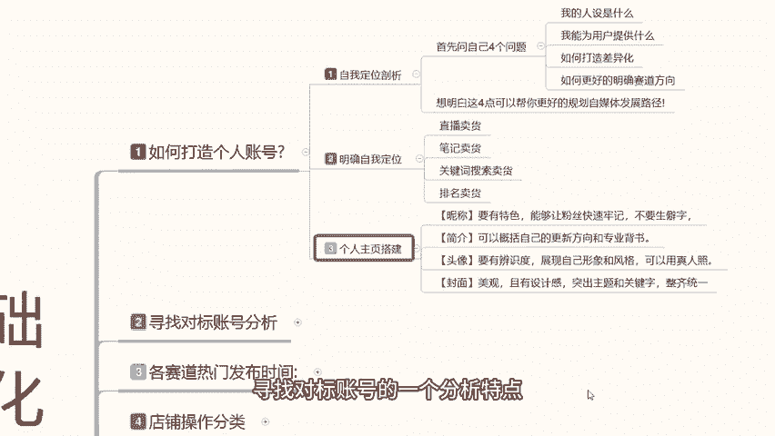
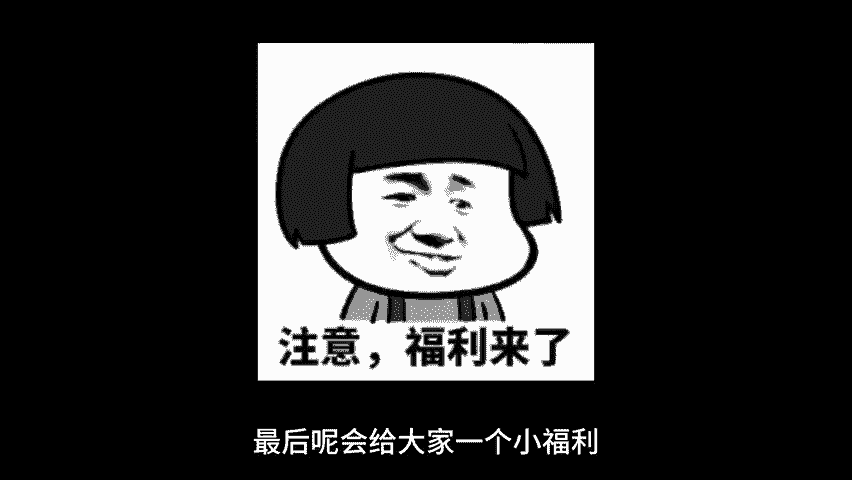

# 【2024版小红书体运营教程】全B站最良心的小红书开店运营高阶教程合集，小红书体开店 起号真的快 - P2：1.小红书运营 - 煤球很皮实 - BV1Q444eWEP5

大家好，这期给大家分享的是小红书基础开店的一体化，整体操作，这一期课程的话是从我们个人账号的一个设定，账号对标的一个分析，然后各赛道的一个发布时间，一直到我们最后的一个店铺发展方向。

整个的话就是开店的一体化流程啊，从我们小红书上面，只要你是想在小红书上面做开店卖产品啊，都可以自从这个上面开始进行学习了解，那开始我们今天的一个课程，我们首先来了了解一下啊，我们如何打造个人账号。

小红书上面啊，我们在创建小红书的时候，就说我们小红书要去开店的时候，首先就是要打造自己的个人账号，个人账号怎么去操作啊，首先是分三个点，第一个是自我定位剖析，第二个是明确自我定位。

第三个呢是个人主页搭建，这三个点，我们先来了解一下自我定位的一个剖析啊，我们去做在小红书上面，你去做点，你首先要问自己四个问题啊，你想明白这四个点以后的话，你自己才好规划自己的一个小红书啊。

在这个自媒体平台上面的一个发展路径，首先是我的人设是什么，我能为用户提供什么，如何打造差异化，如何更好的明确赛道的一个方向，就说我这期课程的话，我还是和之前一样啊，我是不针对某一个产品给大家进行啊。

针对性的讲解，我只是说拿大概的一个介绍，让你们了解这小红书，我们做任何产品其实都是可以的啊，根据你们自己产品的定位去测，确定你自己的一个目标，首先我们要确认的是什么呢，你的人设你在小红书上面。

你去卖产品，卖商品啊，不管是衣服鞋帽食品，化妆品，车载装饰品，小饰品等等，你不管是在小红书上面，你去卖什么啊，你自己要给自己打造一个人设，根据产品啊去定位你自己的一个店铺状态。

第二个就是你能为用户提供什么，为什么说第二个是用为用户提供什么啊，你所提供的产品也好呃，内容也好，或者是其他的都可以啊，你给用户提供的他所需要的一个消费渠道，他为什么要到你这来消费。

你给用户提供的是什么样的一个保障，也就是你产品质量啊，包括你产品的一个后续服务啊之类的，你这个你要把自自己了解清楚，第三个就是打造差异化，因为小红书上面的话，目前的话商品还是非常多的。

你要和别人做的不同，你才能突出重点，如果说你做不到差异化的一个标准打造的话，那你就只能去给人家打价格战，打那个排名战，很难做到，就是嗯像做冷门呐，或者是做偏偏旁类的一个独立爆款出来。

就是你必须要去给别人打，要不就做排名，要不做销量，要不就做人气数据啊，点赞等等，要不就做那种矩阵，就说你要打，如果说你有方式打造差异化出来的话，你就可以避免很多的一个步骤，直接开始操作，第四个呢。

就是说，如何更好的明确我们自己的一个赛道方向，你往哪个方面去靠对吧，就是我刚刚打造差异化一样啊，你往哪个方向去靠，你离所选的目标竞争对手越少，人群越多，那么你所打造的一个商品爆款持续时间就更长。

而且卖爆的几率也就更高啊，想明白这四个点，你就可以更好的规划你自己的一个商品账号，店铺，它整体的一个后续路线，第二个就是明确自我定位，自我定位这个里面啊，我们把它分直播卖货，笔记卖货。

关键词搜索卖货和排名卖货这四个点，为什么，因为小红书上面的话，直播卖货是一个渠道，笔记卖货是一个渠道，关键词搜索卖货啊，也是一个渠道，然后就是一个排名卖货，排名卖货的话。

说实话这个的话是就是在那个小红书打开以后，他有一个商品渠道，商品渠道，如果说你的排名偏高以后呃，同类的用户搜索这个产品的话，你靠这种排名去增强这个属性点，就是增强用户的一个访客量进入量。

通过这四个方式来进行卖货，直播卖货就不用说了啊，你在小红书上面开直播，然后的话介绍自己的产品经营产品销售，第二个就是笔记卖货，发送商品笔记啊，记住了，是商品笔记，不是引流笔记啊。

这个商品笔记和引流笔记它是不一样的，你的商品笔记需要去电脑端啊，网页版的千帆上面去操作，从那个里面发送的才是商品笔记，它可以附带产品链接，但是这个商品笔记你发放的话，你前期如果说没有没有排名。

没有销量啊，你不好操作，第三个就是关键词，就是操作产品关键词，产品关键词有权重以后，用户去用那个放大镜搜索的时候，才能搜到你的产品，不然的话你光发笔记卖货的话，说实话你这个展示曝光不会很高啊。

所以说你首先要明白自己的自我定位，四个点啊，四个方向你要选哪个直播笔记，关键词排名四个点，你要往哪个方向靠，你后续店铺的一个操作才能整体操作起来，你不能说是你又做直播，又做笔记，又做关键词。

又做排名可以做啊，他们四个虽然说是一个综合题，四个都能做，但是你的精力和花费啊会成倍的一个提高，第三个点就是个人主页的一个搭建，个人主页搭建的话，这里呢就是说啊衬礼简介，头像封面这四个点。

你要完全符合你自己商品对应的一个，信息和状态属性，村里要有特色啊，能够让粉丝快速牢记，不要做生僻字啊，因为这因为昵称的话，说实话，如果说别人在其他地方给你的产品进行宣传，或者说呃进行了解以后。

如果说你打那个生僻字，别人搜索不出来，你会减少很多访客的简介，介绍自己是做什么的啊，卖什么产品的，有什么产品或者说有什么活动，有什么价格，做了多少年啊，对产品有时候多了解都可以，头像说实话头像的话。

你在这个里面的话就说辨识度要高，让别人信任你，认可你才可以，你不能说弄随便弄个卡通头像或者之类的，这种图像的话，说实话我不建议你在小红书上面去做啊，因为他获取用户的一个信任感的话不够。

最后呢就是封面小红书的一个主页封面，你自己把它那个美观设计感要调整出来，因为你只有把这些东西完善了以后，别人才会相信你是专业的啊，才会了解你这个人的一个专业性，然后通过你的头像判定你的性别啊。

当然你不能说你是男性或者女性，你如果说男性长的那个是吧，你就自己想想办法搞一个差不多的头像啊，符合你产品气质的头像，你不能说是什么头像都往上面放啊，这个还是要注意的，就说你的封面的话也是要配合你的头像。

简洁和成泥的，他做出了一个特色，当别人第一印象进入你的主页以后，就对你非常的信任，这个就是我们前期打造账号，我们所需要自己啊自我的一个定位啊，明确的一个目标，和个人一个主页搭建的一个创建。

这三个点做好以后的话，我们下一步呢就可以开始寻找对标账号，进行店铺的一个后续操作嗯，寻找对标账号的话，其实他是给我们自己的一个小红书账号做群录，账号做权重，权重对标，找到以后的话。

他会变相的啊用我们的产品找到对标，那这节课呢就给大家讲解到这，下一节课呢给大家分享一下，寻找对标账号的一个分析特点。

我们怎么去操作，最后呢会给大家一个小福利。

