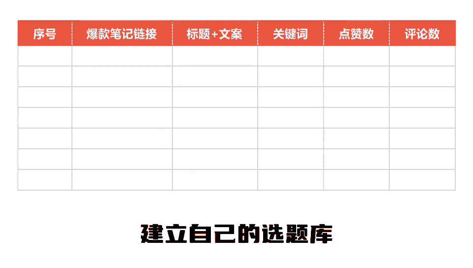
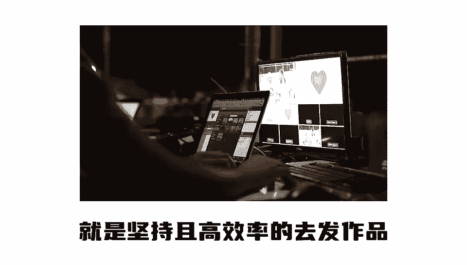

# 【2024版小红书体运营教程】全B站最良心的小红书开店运营高阶教程合集，小红书体开店 起号真的快 - P2：小红书到底怎么做 - 是你的孤风呀a - BV1Ys421P7Bn

所有人都告诉你，今年必须要做小红书，但从来没有人讲清楚到底怎么做，你以为做小红书就跟我二奶发朋友圈一样。

随手一拍的照片，加上个令人感动的文案刻字。

他就不断就能年入100万，结果发完作品你没5分钟就打开一看。

卧槽怎么没有人看，真是老太太钻被窝给爷整笑了。

今天我用一条视频讲清楚做桥的时候，如何用一周时间快速起号，如果没有效果，我倒立吃翔，第一步要明确你的定位，你是谁，你是做什么的，你能给用户带来什么价值，还有你的变现路径以及产品，第二步。

找到你这个领域内最近30天的低粉爆文笔记，你笔记的封面标题文案完全对标。

他们不要问，为什么同行已经替你测出了爆款结构不用。

那真的就是小鲨鱼的手臂整理出来之后呢，像我这样拉出来建立自己的选题库。

这样会保证之后你的账号不会轻易断更，第三步就是坚持且高效率的去画作品。

做小红书一定要矩阵起号，用数量和概率。

一个账号一天两到三更不出。