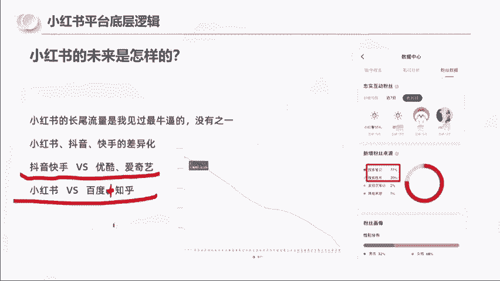
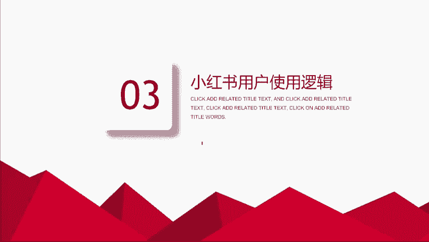
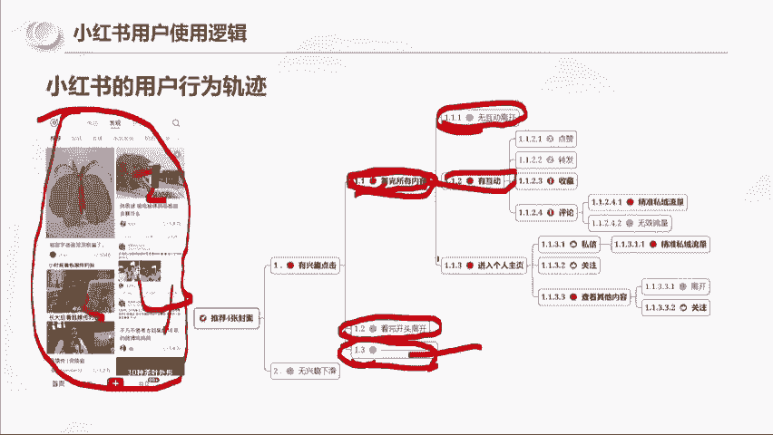

# 【2024版小红书体运营教程】全B站最良心的小红书开店运营高阶教程合集，小红书体开店 起号真的快 - P2：小红书用户使用逻辑 - 轻轻换一声卿卿 - BV15M48ePEA5

我们接着往后走啊，那么小红书我们要去做的话，我们了解了平台之后。

我们要还要了解用户的一个使用逻辑，可以看一下这张图啊，这张图是我去研究用户的一个一个流程图，我们可以发现说小红书平台你打开之后对吧，他给你推荐的是四篇笔，四篇笔记啊，四个封面，对不对，四个封面。

那么我们的行为轨迹是不是要么你就有有兴趣，你就点进去，要么你没有兴趣就下滑了，而点进去的里面要么就是看完所有内容啊，要么你就是看完离开了，是不是，那还有第三个是什么，思考一下，思考一下。

动一下你们的大脑，我们打开小红书啊，我们小红书给我们推送了四篇四张封面，我们要么点进去看完，要么我们看完离开了，还有一个选项是什么，有没有人能够想得到啊，今天的内容你们能够动起你们的脑子。

我相信会让你们，可能是今年收获最大的一个小时，看一半啊，这个这个朋友没有名字，但是我觉得回答的很漂亮，就是还有一个选项，就是没有看完，离开了没有看完离开了没有看完你开了啊，所以说看完所有内容之后的路径。

他又选择没有互动离开以及有互动离开，以及进入个人主页啊。

以及接下来的路径，所以这是我去研究用户，其实我就是研究我们自己，那你们有没有这样的一个思维是吧，我们再往后走，那么小红书平台做账号和抖音，它到底有什么不同呢，第一个就我们刚刚所说到的啊。

它的其实是属于信息的推荐方式就已经不同了，因为抖音打开软件，它是直接推送一条内容并自动播放的，你们不感兴趣，你们就会去刷到第二条，而小红书打开软件，它是推荐四条内容，它没有自动播放的。

你们不感兴趣的就直接下一条了，所以就意味着说什么，说明抖音的开头很重要，因为抖音是自动播放，而小红书的封面标题非常重要，如果你的封面标题不行，对不起我，我一一个我都不会点进去看，我直接下面四个了。

所以说小红书的标面标题封面非常重要，大家现在应该能这个解，这个拆解，你们应该能意识到封面标题的非常重要性啊，那么你们去思考一下，或者说啊你们有女朋友的，有男朋友的对吧，或者你们的同事，你们去研究一下。

你们的同事，他在刷小红书的时候，给他四篇笔记，他是怎么样去阅读的一个顺序，他是从一看到二，看到三，看到四，还是他打开手机扫一眼啊，直接划了，还是说打开一眼扫一眼直接点了，就我个人而言。

这四篇笔记我是不会按顺序1234去看的，我是扫一眼的，扫一眼也就意味着说一秒钟的时间，四篇笔记其实每一篇笔记连半秒都不到，所以说这个封面标题非常之重要，那么小红书平台啊，做和抖音还有一个什么区别。

其实他们的账号的运营方法也是不一样的，抖音平台你们去运营一个IP，其实主要还是要去博这个系统的一个，推荐流量啊，用想办法去破圈，而小红书它是因为社群属性和搜索流量大，它还可以通过账户笔记为形象展示。

去他人评论区吸引目标用户啊，像右边这个案例啊，是我前几天刷到的，就是这个人在这篇笔记啊，这篇笔记讲的是啥呢，这篇笔记讲的是就是没有听妈妈的话，拿着家里的钱去开店，就压力很大啊，他就在评论区说。

我也是对家里报喜不报忧，开奶茶店最多负债500万，不敢跟家里说，每次问只能说还行，因为奶茶店太卷，最后去做压，结果没想到一年把负债还清，还把生意发展到全国，就意味着他这个其实传递了一个什么信息。

一年他是负债500万，一年还清就意味着说什么，说他一年赚了500万，然后下面还有一条评论，不过你们家味道确实不错，就是价格高，不知道是不是一样对吧，还有一个用户好评，看到没有，所以如果说我想问一下大家。

如果是你们看到了这一个人，你们会不会点他的头像，会打会好吗，不会打不会，如果这篇笔记是你们刷到了，你们会不会点他的头像去看一下，因为他负债500万啊，一年还清会对不对，那我想问一下你，你们点了他的头像。

进了他的主页，和他发一篇笔记，你们看完了进他的主页，是不是达成了同样的一个目标，就是把你吸引到了他们的主页里面去，是不是，所以这就是小红书的一个魅力，它可以通过评论区去吸引用户。

不是只能够通过内容去吸引用户，啊那那也就意味着说对不对，比如说是不是就我以服装举例啊，我们用服装举例，我们换位思考一下，假设这篇笔记他讲的不是开店亏钱的事啊，啊或者说我还是开店开店亏钱啊。

就是呃找爸妈借了10万块钱啊，开开童装店啊，开不下去了，会不会小红书会不会有这样的笔记，肯定会有，就是那些开童装店开不下去的，那么是不是可以在评论区去说，现在实实体店的东西卖那么贵，怎么可能开得下去。

我在我在朋友群里买的一件小朋友的T恤，才六块九毛钱，而且跟实体店29块九的质量差不多啊，谁还愿意去实体店买东西，我想问一下大家，这一句评论区有没有杀伤力，是不是你们就可以理解啊。

同样的小红书他现在还干了一个什么事情，今年啊我发现他把群聊的一个这个好友数，就是一个人可以进群的上限，已经我现在已经建到15个群了，之前我只能建五个群，现在能建15个群，那也就意味着说。

它的这个玩法会更加的多样化了，包括它还可以，他还他还有一个官方页面招募群友，你建群之后，他还他还给你提醒你，你可以发布笔记招募群友，所以这个玩法就有很多种方式了，好那我们就问。

那么接下来我们的问题就来了，那我们的笔记封面如何脱颖而出呢，已经知道每次打开推荐四篇笔记，我们怎么样把封面做到超越他人呢，尽可能高的拿到点击呢，啊这里我插一个问题啊，我插一个问题，就是平台能够给你们的。

给普通人的唯一的一个数据，你们知道是啥吗，就假设啊我们200个人全部发笔记，他能够唯一给的东西是啥，你们知道吗，它能够唯一给的东西叫这个，叫报关，啥意思啊，就是把我们的笔记推送到别人的手机上面。

这个动作让你的手机看到这四篇笔记，这个动作叫报关，就是平台，唯一能做的，就是让你们的笔记出现在别人的手机屏幕上面，他只能做到这一步，他没有办法让看到你这个笔记的人点进去，他也没有办法让他点赞。

所以很多时候你们的小眼睛是由什么决定的，是由你们的点击率决定的，假设平台给这四篇笔记都给1000的报关，都给1000的报关，假设这篇笔记1000的报关里有200个人看。

就会显示你们的左下角就会显示小眼睛，其实这个叫小眼睛，它是属于阅读数，但是平台给你的不止200，他可他可能给了你1000，明白吗，明白吗，同样的这只猫，它可能也给了1000个报关。

但是因为这个猫比较吸引人，所以他有300个小眼睛，那就是30%的点击率，所以你的眼睛只有200，你的眼睛别人有300，不是说平台给了他300，给了你200，而是你的点击率会影响，好啊。

那我告诉大家我是怎么样去提升我的封面呢，接下来的这个方法，如果大家看了有用，就在评论区回复有用好不好，我的选择是啊，这是我的一个封面，我的选择是我做出了我的封面之后，我把很多个封面放到一起。

我把我的翻上去，看我是不是最能跳出来的那一个，我把我的封面放在这个手机的示意图上，看下跳能不能跳出来，我把我的封面放在这四个里面，能不能跳出来，有用打有用好吗，有用打有用，因为我跟大家说了。

我们这一次的三位老师全是实战派老师，我不会去跟你们说什么啊，标题的三个方法啊，这个吸引人的三个方法，我讲的就是我在用且确实有用的东西，接下来还有更多的干货啊，咱们继续啊，大家也可以在群继续啊。

咱们继续好，那么问题来了啊，就是笔记封面我们如何脱颖而出呢，啊这是我今天从网页版上啊，截图的十几个，那么划重点来了，就是在之前啊，在在今今年啊网页版推出来之前，我们要思考的是啥。

我们要思考的是四篇笔记啊，我们要思考的是四篇笔记，我们怎么脱颖而出，但是网页版出来之后，网页版的推送是是多少，是是这样推送的，是我是黄红框里面的一个推送啊，我是把两个拼到一起了，那就意味着说。

每如果说你要考虑到小红书后面的流量，他如果是手机端进入，你是四进一，它如果是网页版刷的话，你是15进一，是不是对你的封面要求更高了，那么这一张图我为什么截给大家看啊，我想跟大家讲一个点，讲一个点。

就是以网页版的一个阅读质感，我把这个同样啊这种在备忘录打字啊，这种算很简单，一个展现形式，这一篇笔记算一号笔记，这一篇算2号笔记，这一篇算3号笔记，这一篇算4号笔记，你们认为1234里面哪一个是。

如果你们选择这种表现形式，会会认可的方式，1234你们更认可哪一种方式，二对不对，为什么，因为二不仅他的标题更加的显眼，他还画了一个红圈做视觉引导，而一是吧一的字，三的字啊都是属于字都有点看不清了。

四还好一点，再晚网页版的视角里，四的字还是比较清晰的，而二的标题更加的清晰，而且他还用了这个用了这个红色，对不对，这就是我们把就是东西好坏是怎么来的，我告诉你们封面好与坏，标题好与坏，就像什么。

就像我们给我们的对象拍照一样，你拍一张照片可能就只能拍出50分，那我们怎么样保证自己的对象，能够选出好看的照片，是不是咱上来先给他干个100张，是不是你在100张里面选，你总能选出好看的吗。

所以我们去做小红书做封面，我们两种方法，一种是我们去看100个封面，找出我们觉得好的去学习，还是我们做100个去选一个呢，肯定是看嘛，对不对，然后讲到这个服装啊，我今天还去找了一下服装的例子。

就是我们如何去研究账号啊，我们要去向有结果的人的学习，因为我已经告诉大家，标题和封面非常的重要，那什么叫有结果的人呢，我觉得第一个你要看他的数据是否稳定啊，像这个账号，他前前面的数据还是比较稳的啊。

点赞都在100以上，可能最近的流量不行，但是他能够连续几篇拿到100点赞的这种账号，他其实一定是对平台有内容理解的，如果一个人对平台的内容不理解，他的数据就会变成什么，可能突然他有一条100点赞。

1000点赞的，但是再往后他无法连续，他无法连续，就是优秀的人，他的下限是更低的，就是我们没有人能够说，我一定能写出1万点赞的笔记，但是优秀的人他的下限可能就是100，但是如果说你对平台没有那么了解。

那你的笔记完全就是开概率，那这个账号它的特点在哪，因为你们要讲要可能有人会选择做服装，那我给你们简单讲一下，就是第一它的定位，他是专门研究篮球传达细分是吧，第二个他是小众篮球穿搭。

第二个为什么我说这个账号有用，是因为我们通过他的评论区，你去看是会有人找他要链接的啊，求第一套裤子的链接，他不是简单的说我给你点个赞，我点个收藏，我走了，你会在评论区看到有人要要是什么。

是代表购买欲是不是好，那我还找了几篇其他的这个衣服去看啊，像这个账号也是比较有特点的，这个账号他的一个拍摄角度是非常固定的，而且他的数据也很稳定，这个3号数据也很稳定啊，然后这个账号人家更直接了。

蹲价格侠，价格侠什么意思呢，就是谁谁去了店铺，翻到了件衣服的价格，告诉我这个直接就是考虑到价格层面了，能考虑到价格层面说明什么，说明这件衣服他已经心动了，那么我们再往后看第三个啊，这个账号他叫野生塔塔。

这个账号他也是很固定的一个商品，对不对，我们讲的账号定位清晰，他的账号定位是什么，账号定位就是这种他这个叫什么叫JK是吧，学生日常的这种风格，然后他的目标客户也很清晰是吧，就这种感觉很相似啊。

它的效果有没有，有人家会问他裙子哪家的啊，他说海胆与栗子好，那接下来问题来了，其实这三个账号他的变现方式是不一样的，是不一样的，你们来看一下啊，这个人家是告他是告诉别人，我的裙子在这一家店铺买的。

这一个也是告诉别人我在哪里买的这个衣服，而这一个呢这一个是发链接谁，我先问一下大家啊，就是篮球啊和这个黑衣服和这个水手服，你们觉得这三个哪个更赚钱，或者说哪个的运营水平更高，你们有这种感感觉吗。

就运营水平来讲啊，是打篮球的高还是黑衣服的高，还是水手服的高，有人说篮球啊，有人说第二个，有人说第三个，啊你们觉得篮球是吧，其实我我我讲我的个人观点啊，我讲我的个人观点。

可能我会觉得黑衣服的高一些就就变现手法啊，就变现手法，这个篮球他是卖衣服嘛是吧，他可能是没有上限的，但是就这个账号定位而言，就账号定位而言，我觉得黑衣服的呃段位高一点。

因为第一个他的这个数据更加的稳定是吧，篮球它是稳定稳定100加，那也意味着黑衣服一篇是他的十篇，第二个黑衣服的这个质感更高级，单价应该也会更高一些，这是我我的个人观点啊，我的个人观点啊。

就是黑衣服的整个调性，他就不是简单的说我要卖衣服这一件事情，本身他是我在卖衣服的这个事情里面，我去选择更高客单，更高预算更有钱的这个客户群体，而且我告诉你们，这三个账号里面有两个账号其实是有模板的。

这个水手服他就是在走，就是在出快出门的这个位置拍这个黑衣服，它就是在这个位置拍，而这个篮球它是户外，户内，包括这个停车场都拍，所以从这个拍摄的一个这个角度，和拍摄一个成本啊。

我们可能拍一条这个成本是差不多的，但是你做篮球的这个账号，他是一直在想，我今天在哪拍，明天在哪拍，而这两个剩下的黑衣服和水手服，它是有模板的，他是我只要有新衣服，我就知道在哪拍了。

而且他的这个模板是持续有数据的，这也是为什么我说黑衣服的，它这个运营水平更高，它的拍摄模板更加的明确，不用每天去抠脑袋，我明天怎么拍，他的数据更加的稳定，它的质感更加的高，至于他变现手法是挂店铺也好。

还是挂链接也好，其实他有了这个运营能力，只是他自己洗，只是看他自己想怎么玩而已，他想轻松一点，他就挂店铺啊，他想复杂一点，他觉得赚钱多是卖衣服，他其实完全可以挂链接的。

