# 【2024版小红书体运营教程】全B站最良心的小红书开店运营高阶教程合集，小红书体开店 起号真的快 - P33：第3节：小红书三大爆款流量选题结构上 - 遥远的她fa - BV1xX3PeVEaS

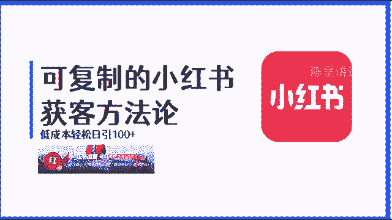

OK大家好，我们继续我们的课程，然后这节课的主题呢是三大爆款，流量选题的结构，这节课的内容比较多，所以会分成两个小节分开来跟大家讲，那我们第一小节主要讲解爆款的底层逻辑，和三大选题的分类。

第二小节我们主要来讲一下，通过两个方法可以轻松挖掘爆款选题，那我们先讲第一个小节的第一个知识点，爆款的底层逻辑，为什么我们要讲爆款逻辑呢，很多的人做账号的时候，根本就不懂得爆款的底层逻辑。

所以说很多人为什么做不出爆款来，主要是因为他完全靠自己去想，靠自己的去想，靠自己去想，是很难做成爆款账号的，而我运用了非常多的账号，基本上每一个账号在较短的时间，我都能够做出爆款来。

并且能够达到引流的效果，那主要就是因为我掌握了这套爆款的底层逻辑，那爆款的底层逻辑包括什么呢，这里的话分为两个点来给大家讲，首先第一个不要自嗨，第二个爆款都是重复的，什么叫不要自嗨。

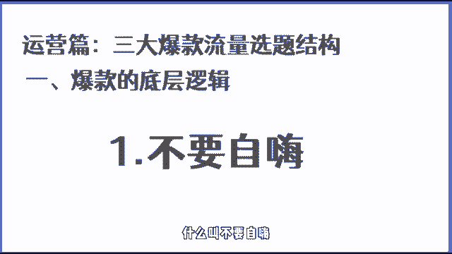

简单的来说就是我们做任何的内容，不能凭自己的想象去做，在这里我们可以看到，为什么很多的人经常抱怨自己做不好小红书，你看首先第一张图我也是认真的在整理，没人看，关键全部是干货，一般人我都不愿意告诉他。

我都莫名其妙推荐上了热门，我随意写的，被推荐的认真写的，没有人看，好难啊，不知道为什么要设计这么多的规则，大家把自己的专长做成视频，供大家观赏不就可以了吗，有没有人一直没有流量啊，举个爪。

你看很多的网友都在抱怨，为什么自己做不出爆款的笔记，又或是自己的笔记莫名其妙上的热门，感觉自己随便写的就能上热门，认真写的就没人看，这主要的原因就是压根都不懂得，爆款的底层逻辑。

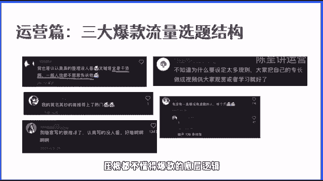

完全都是在自嗨，那我给大家看一下自嗨型的比例长什么样子，你看在上面给大家举的这两个例子，都是属于自嗨的，原因在哪里呢，大家作为一个用户，你们能够看得出来这两篇笔记到底在讲什么吗。

并且这两篇笔记讲的内容吸引人吗，所以说很多的人之所以做不好笔记，其中第一个就是在于他太会自嗨了，自己嗨自己嗨，太喜欢自己嗨了，所以说就导致了永远活在自己的世界，压根都不懂的。

用户压根都不懂的平台到底想要什么。

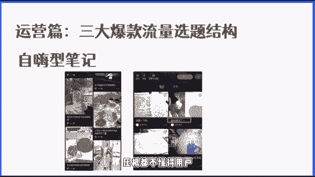

所以在这里有一个雷区，雷区是什么呢，小红书不是我们表达自己的地方，想要通过小红书引流，最终要实现变现的话，大家就要清楚地知道，我们所做的小红书的每一个动作，都是具有商业行为的。

所以不要再把小红书当朋友圈发了，你再当朋友圈发神也救不了你。

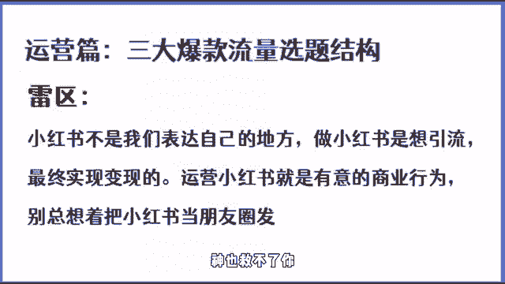

那如何从自嗨型的逻辑变成爆款型的逻辑呢，就要讲到一个认知的转换，就是自嗨型思维转变成用户思维，什么叫做用户思维，简单的三句话，你想做什么不重要，重要的是他想要什么，第二个不要把小红书当朋友圈发。

第三个不要凭感觉，这里特别是后面这两者，有的同学呢在刚开始做小红书的时候，包括就是很多的人来找我，咨询小红书怎么做流量的时候，我看了一下他们的账号，我简直都懵逼，要不就是把小红书当朋友圈发。

要不就是感觉这个内容一定会火，所以他做了这个内容，说这样的思维是没有办法做好的，所以大家要记住自嗨永远做不好内容，这是一个关键认知，你能不能做好笔记，能不能做出爆款。

能不能像我这样短期做出爆款来这一个思想，这一个认知就一定要清楚，第二个很核心的底层逻辑，爆款都是重复的，那如何来理解曝光都是重复的呢。

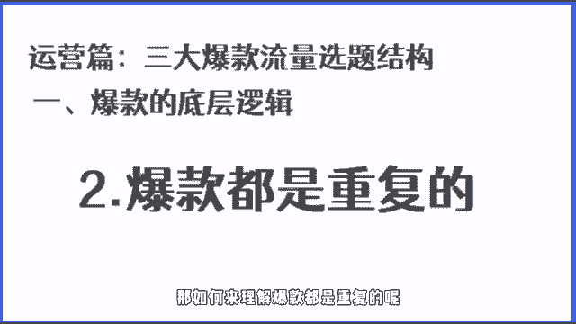

在这里给大家举几个例子，你们就知道了，首先大家看到这一张图，这张图上面一共有四个封面图，大家看大家认真的去看，有没有发现这十张图都有一个规律，不管是第一章，第二章，第三章还是第四章，他们用的封面排版。

还有它的整个封面的文案的，文案的公式都是一样的，你看小学英语基础知识学不全，拿这八张图每次都能考100分，小升初数学六年公式就这八页，三天背完，轻松90家，不愧是北大妈妈，将6年的语文浓缩成一张纸。

孩子看一天抵10年，你看看到没有，这是什么，这样的封面的文案和这样的封面的样板，是不是都是类似的，而它的数据都特别好，所有的基本上都破万了，这是第一个，第二个我们再来看一下账号的选题，这里举一个例子。

学摄影要学习的网站，大家看到没有，这三篇笔记是不是都在讲，学摄影要看什么网站啊，而且他们的数据都特别的好，这是选题，所以你看爆款是不是重复的。

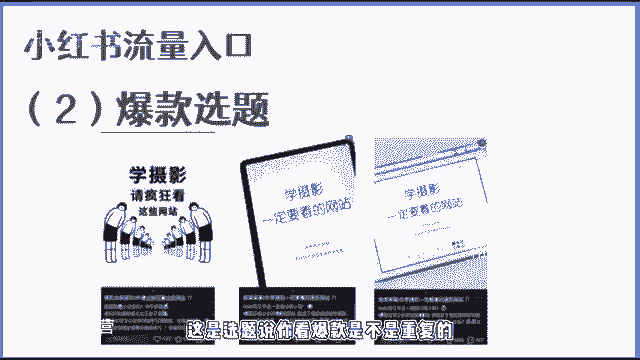

然后我们再来看一个案例，大家看一下这个案例讲的是什么呢，这个案例讲的是相机的参数，你看这样一个选题，为什么会有这么多的点赞，因为这些选题，这些内容都是用户喜欢看的，所以说爆款它都是重复的。

那如何练就爆款的思维呢，记住这四个核心，你就能够养成爆款的思维，首先第一个不要想着创造爆款，要去提炼爆款，第二个爆款背后是用户需求，满足需求就是优质内容，很多的人对于优质内容的定义就是优质的内容。

一定是要做得多么的精美，不是的，满足用户的需求就是优质内容，请记住，这是个重点啊，第三个学会提炼拆解爆款，成为一名爆款刺客，也就是说很多的人之所以不会做爆款，是因为不会拆解爆款，那如何来拆解爆款呢。

接下来的课程我会逐步的来教大家，怎么拆解爆款，并把爆款的优点的东西，荣威我们自己的内容放到我们的笔记里面去，让我们也成为爆款，第四个也是非常核心的思维，就是爆款都是重复的，我们要学会重复做爆款。

说这四个爆款的核心，我希望你看完这节课以后，一定要记住，因为接下来我们做内容，想要做出爆款的内容，获取到大量的流量。

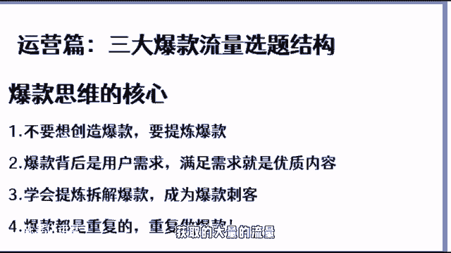

这一定是根本的根本的根本，那讲完爆款的底层逻辑之后，我们再来讲一下三大选题分类，那什么叫选题，简单的来讲，任何一个笔记都有一个主题，就像我们从小到大，我们写作文一样的，都会有一个核心思想。

而这一个核心思想核心主题它就叫选题，它可能是一个问题，也有可能是一个观点，而这个问题和这个观点他也是选题，而选题它的重要性在于，一个选题会决定笔记70%的流量，也就意味着，如果你不重视选题。

你封面标题文案写的再好，都不会有流量，所以流量的核心就是来自于选题，如果你的选题不对，你就很难让你的笔记有高流览量，因为你的笔记，没有戳中用户的需求和用户的痛点，那如何来设计选题，这里的话给大家一个。

90%的爆款博主都在用的笔记法则，叫做6+3加二笔记法则，60%是干货笔记，30%是软广笔记，20%是硬光笔记，这60%的干货笔记，30%的软广笔记，和20%的硬广笔记应该怎么去做呢。

在这里的话给大家做一个演示，首先第一个我们来讲一下干货笔记，所谓的干货笔记它的特质就是容易爆，但是呢不容易触发用户的付费内容，占整个账号运营的60%，干货型内容它的作用是什么，大家一定要听清楚了。

非常重要的干货重重点来了啊，重点来了，首先第一个引爆流量，干货内容它容易爆，那爆的笔记它就能干嘛呢，它就可以帮助我们把其他笔记的数据给带起来，第二个告诉通过第二个通过干货笔记的更新。

告诉平台我们的内容是什么，我们的内容适合谁，看应该推给谁，通过内容来建立我们自己的笔记和账号的标签，第三个，养号提供价值吸粉，那之前的话我们在上一节课跟大家讲了，我们不要课，我们没必要。

我们没必要去养号，而我说的养号是所谓的这种用户标签的养号，它是没意义的，而我们最应该做的养号，就是通过干货型的内容发布爆款的，容易火的干货型的内容来养号，这样的话我们的账号才能够越养越好。

第二个当我们去发布一些干货内容的时候，我们就能够提供价值，在提供价值，并且你设计好人设之后，你的小红书账号就会开始涨粉了，而涨粉的目的是什么呢，你会发现，但如果说你用过小红书，你经常用它，你就会发现。

如果说你关注了一个博主，你会大概率的经常刷到他，所以我们在吸粉的过程其实就是在养粉，通过内容来养粉，然后通过我们后面的其他的笔记来收割，另外一个就是拉高人设的专业度，在上节课我们讲了人设的定位。

不管你是学习型人设还是专业型人设，我们如何去拉钩，我们的人设肯定不是在于，只是简单的通过简介告诉别人，你是干嘛的就可以了，所以我们通过干货的内容分享，就能够拉高我们的人设专业度。

那这里的话我们主要得在一个干货笔记的类型，一共有这几种，大家可以先看一下，后续呢我会在后面的课程里面，教大家不同的选题的，不同类型的笔记，封面怎么做，标题怎么写，内容结构怎么做，所以大家不用担心。

但是呢今天这节课你一定要听完之后，就要清楚的知道你接下来如果要做小红书运营，你可以从哪几个方面来，那第一个就是学习的一个过程，你看第一张图讲的是零基础自学摄影七天速成。

然后根据他的这样一个时间来分享干货，这是一种，第二种呢就是像专业型的内容，比如说像我们所看到的第二张和第三张图，人生第一台单反相机，女神宾看语文常备的知识总结，你看这两者都是属于不同赛道用户关注的内容。

这种也叫做干货型内容，第四个呢就是学摄影一定要看的网站，像这种学习资料，学习网站，学习app，像这种东西，它也是属于干货，因为之所以它叫干货，是因为用户有需求，用户有痛点，用户需要它。

用户觉得这个帖子对他有帮助，这就叫做干货帖，那第二软文笔记软问题的特点是什么呢，第一个它又容易爆，它又能够直接导向与付费内容，它的核心就是主要围绕着变现的问题，具体的效果。

当然这里大家要注意的是具体的效果，不是产品介绍，这个时候可能有的同学就会说软文笔记，既然老师你讲了软文效果就是对吧，讲具体的一个效果，那我是不是就可以直接写，我用了我的这样一个产品，它的一个效果不是的。

具体的效果是我给大家举个例子，大家就理解了，假如说我学习插画，我的目标是什么，如果说我的目标是赚钱，那如果说我直接展现效果，我学了多久的插画，最后接到了单，赚到了钱，这是不是具体的效果。

比如说再给大家举个例子，那我们这个课程是做流量的，那如果说我想要给我们的课程引流的话，我要做什么，我不应该告诉他我怎么怎么获取到流量，而是我告诉他，我引到了流量，我把我的效果展现给他，对不对。

这样是不是更吸引人，以结果为导向嘛，用户他要的是结果，更多的不在于过程，因为过程不重要，结果才重要，这是一句金句啊，大家记住过程不重要，结果才重要，第三个就是个人经历。

那大部分的人都是喜欢看一个人的故事的，而我们在做人设，不管你是专业型人设还是做用户型人设，个人的经历帖一般都会有人看，只要你做的足够好，你设计的足够好，就会有人看，而别人看你的个人经历的过程中。

其实也是间接性的来提升对你的认可度，所以说像软文型的笔记的话，一般占我们账号整体内容的30%，那软文的最大的作用是什么，第一个通过人设的故事让用户产生情感共鸣，建立信任度的同时呢。

又无形的宣传了自己的业务，比如像我刚才举的例子，个人经历，这种的话是非常容易引起用户的共鸣的，特别是你在写你的故事的过程中讲到的一些点，用户如果说现在也在经历，他会感同身受，而感同身受就是情绪共鸣。

第二个就是你我们可以通过用户的好评，还有就是用户的使用效果，还有就是类似于具体结果的展现，像这一类的话，虽然说我们没有在刻意的告诉你，我的产品好，我怎么专业，我的东西好，但是呢通过结果的展现。

就能够让用户有好奇心，甚至有用户会去咨询，还有一个呢就是通过自己的案例，间接性的去秀肌肉，也就是说我们可以通过一些类似于比较装逼的，一些图片，也就是说我们可以通过一些具体的案例的结果。

来间接性的告诉用户，我搞定了这个东西，我能力比较强，你想要的我会，那这样的话也会有很多的人去找你，会去问你怎么去搞定的，比如你是学插画的，那你是如何通过三个月的时间接到单的，绝对会有人问你是怎么学成的。

学怎么学的，我可不可以像你这样三个月就能够接单，那在这里呢给大家看几个软文型笔记的分类，这里大家看到的前面的第一张图，这张图就是一个结果展现对吧，直接就展现给你，我加了很多的微信好友。

第二个呢就是金地铁，一个30岁的全职妈妈学了摄影，四个月接了单，然后呢，还有一个就是以目标变现为主的这样一个选题，比如说你像影视后期自学好还是报班，好像这样的选题就是一来用户关注度高。

二来了它也极具的具有变现能力的，你像这种自学还是报班，对于很多的用户来讲，他其实都很好奇，他也不知道咨询好还是报班好，主要通过这种内容一样的，可以吸引针对性的用户，第四个什么时候学插画最好。

现在想转行来得及吗，你像这种问题，这种选题就是急一句转化的选题，但凡是愿意去看这个内容的用户，他都会想要转行或者都想要报班，他都是有这种潜在需求的，像这种用户，它的转化率就非常高，他承担的概率就很高。

然后最后一个了，就是我学插画三四天了，既然接单了，你看这个和第二个其实有一定的相似，就是通过一个学习的过程告诉你，我得到了一个结果，而大部分用户关心的是你的结果，你的过程只是一个过程而已。

所以说像这种类型的封面和这种类型的选题，他就是典型的软文型选题，软文型选题它又容易爆，另外呢它的流量质量又高，所以说这是一种非常不错的选题的类型，第三个硬广型，简单来讲，所谓的硬广就是内容简单粗暴。

直接通过展现服务或者价值，直接导向于付费内容，那像这种内容呢，在小红书里面不易发多了，但是这种内容我们也要发，为什么，因为这种内容来的流量高，还有呢就是大家注意，像这种内容，它的推荐量一般都不高。

而我们也不需要这种内容，它的推荐量高，我们可以通过其他笔记来带动，我们这一篇硬广笔记，所以它的推荐量并不重要，重要的就是只要我的粉丝看到了这篇内容，有多少用户会被转化掉。

那它的作用呢就是例如通过人设故事产生共鸣，建立信任度，然后我们讲到的第三个类型笔记，就是我们的硬光笔记，所谓的硬光笔记就是内容简单粗暴，直接展现内容产品以及服务价值，直接写导向与付费的内容。

而这种内容呢在小红书里面大家一定要注意，不能发多了，因为这种内容发多了容易违规，也有可能在你操作不当的情况下。

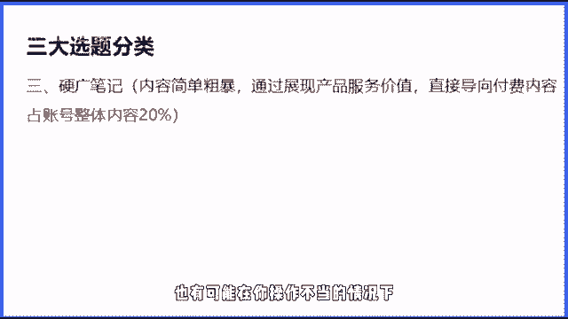

你这篇笔记就没了，所以说这种内容呢，我这种内容呢。

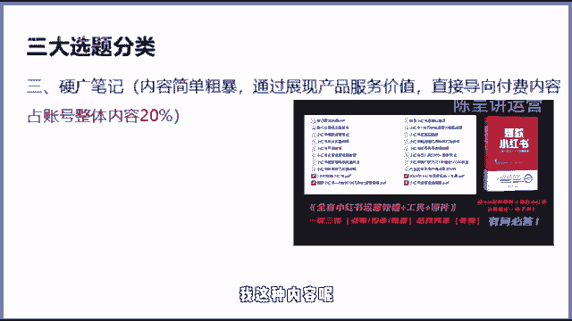

占我们整个账号整体内容的20%，并且呢大家知道这种内容，可能它的整个内容的播放量不会很高，但是呢不重要，因为它的推荐量不高，我们主要是通过发布这样的内容，让我们的粉丝看到，因为粉丝会经常刷到我们的内容。

说印光笔记的话，它有个特点，就是我们不在意他的流量，而是在于它的转化率，当然也有极个别的这样一个硬广笔记，它的流量比较高，例如我们看到的这一个案例，首先大家看到的前两个案例，一个是美剧发音课。

一个是报班前须知，这两个就是典型的产品介绍，在这两篇笔记里面都讲了，第一个是讲的那个英语的系统课，第二个讲的是插画的系统课，这两篇笔记讲的就是他有一门课程，这个课程的这个课程的价值。

以及这个课程对你来说有什么用，而看到这一篇笔记，大家可以看到这篇笔记的评论，有很多，所有评论的用户基本上都是在问他，咨询这个价格，还有就是想要报名这种笔记，它的转化率就非常高。

可能来十个流量就能报两到三个，甚至4~5个都很正常，然后呢我们看到的后面这三者，后面这三个笔记呢，虽然说他也是属于强广硬广，但是呢这三个笔记的流量相对来说比较大，因为后三者中的前面两个。

这两个都是典型的资料帖，而资料帖就会有比较大的流量，但是呢这种帖子有个不好的地方，就是因为它的流量大，大部分的人过来都只是白嫖一个资料，所以它的转化率也会有一定的影响，但是呢它的流量基数大。

对我们来说也是我们需要发的，然后最后一个就是我们的摄影搜图帖，像这种搜图帖啊，这种专业技能的搜图帖，对于用户来说也是非常致命的，那你像我们在7月份的时候，我们内部的那个妹子，她发的内容。

其中主要有一个就是来自于这个摄影的搜图，像，这种搜图啊，当然不是局限于摄影，所有的类目都可以做，这种的话其实包装的就是一个专业型人设，就是我的专业，然后呢你加我好友，你做我的徒弟。

我可以教会什么什么东西啊，当然具体我们刚才讲到这三种类型，比如说像我们的干货型的笔记呀，我们的软问型笔记，还有就是我们的硬光型笔记，接下来我们后续会教大家封面图，还有我们的标题。

还有我们的内容结构怎么写，那么大家你们看到我们上半节课你就知道了，这三种笔记类型我们都要发，而且呢建议大家遵循632的这样一个法则，也就是十个笔记里面60%占比，建议是干货笔记30%，建议是软广。

20%是强广，这样的话你的账号又健康，同时呢我们又能够达到引流的目的，在下半节课呢，我会教大大家，怎么去通过一些工具挖掘爆款选题，那通过爆款选题，结合着我们的选题分类，大家就可以找到非常多容易爆的内容。

那在这里的话。

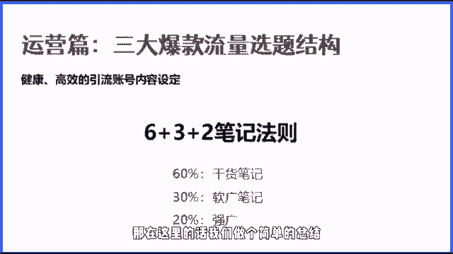

我们做个简单的总结，三大选题分类有一个核心的须知，大家要注意，首先第一个并不是所有的笔记都要引流，也并不是所有的笔记都需要有好的曝光，而我们要注意的是，我们发这篇笔记的目的是什么。

大家回顾一下我们刚才讲的这三类选题，它的作用是什么，大家想一想，如果说忘了，建议回去再看一遍啊，这是非常重要的，第二个核心的认知点，就是在内容获客的逻辑里面，每一次用户的浏览和触达。

都是和用户的一次链接，也就是说我们的内容由用户每一次的浏览，每一次的点击收藏，其实就是在跟用户进行一次连接，而每一次的连接它的目的是什么，就特别的重要了，这就是我们上半截的课程。

主要讲的就是这三大选题的结构，还有爆款的底层逻辑，希望大家一定要认真的去思考，这个上半节的课可能内容不是很长，但是呢大家一定要认真的去学习和思考，因为接下来我们做内容的过程中。

我们都会围绕着爆款以及选题来进行，好吧。