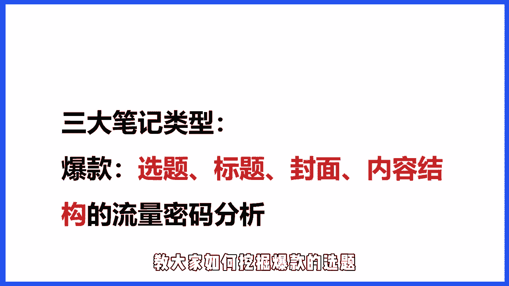
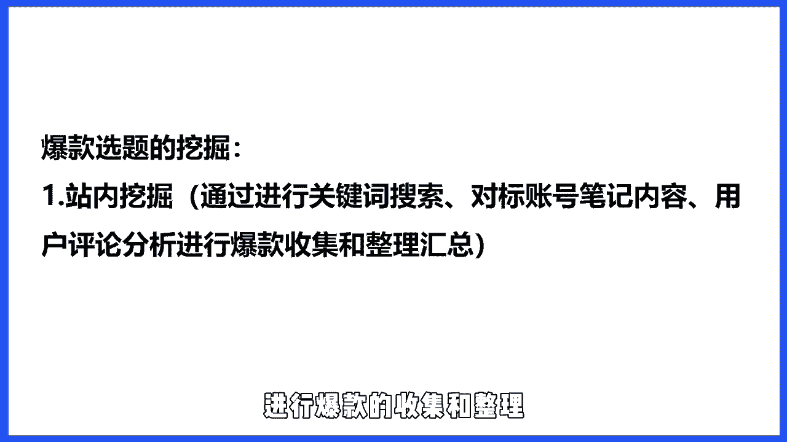
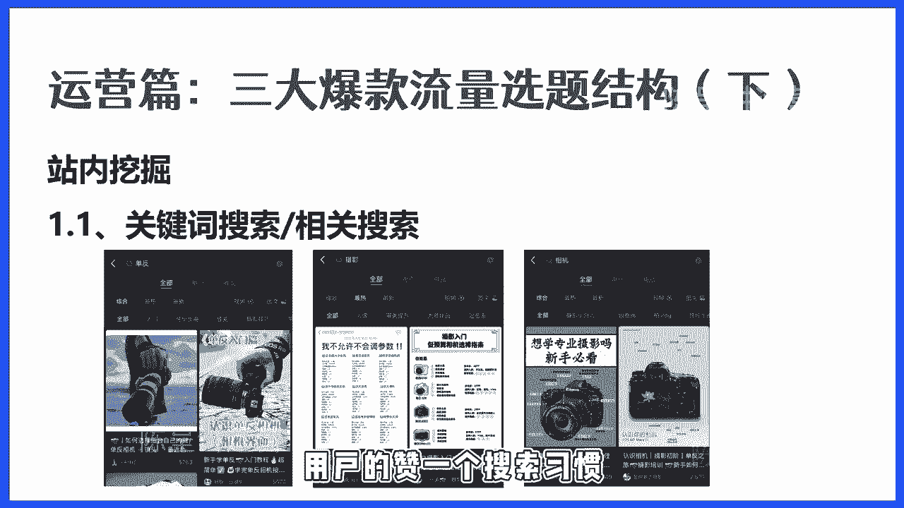
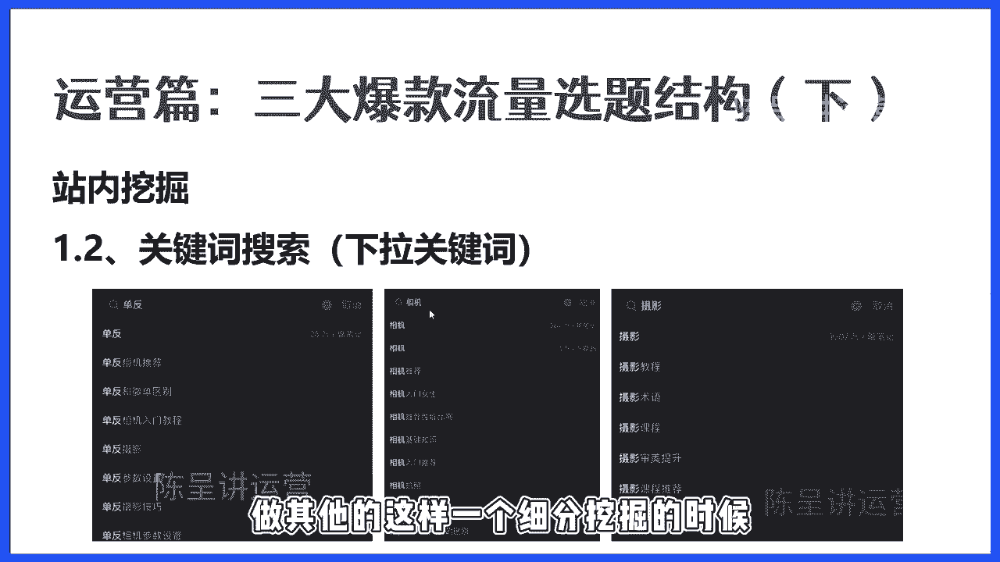
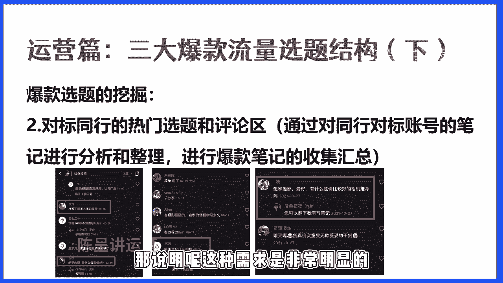
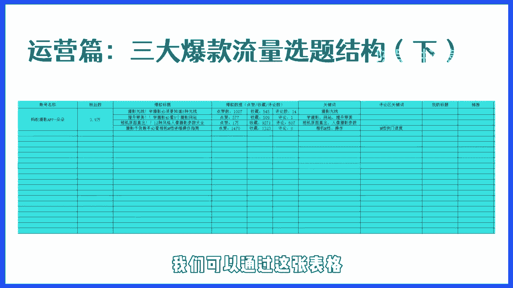
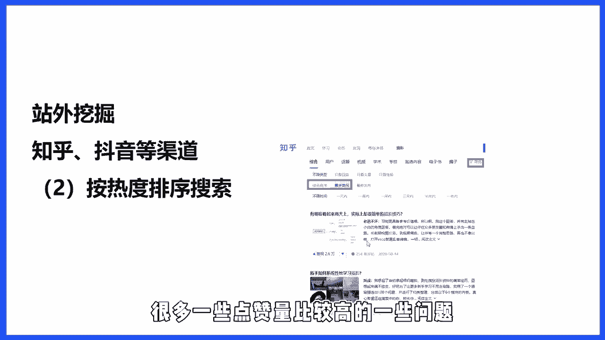
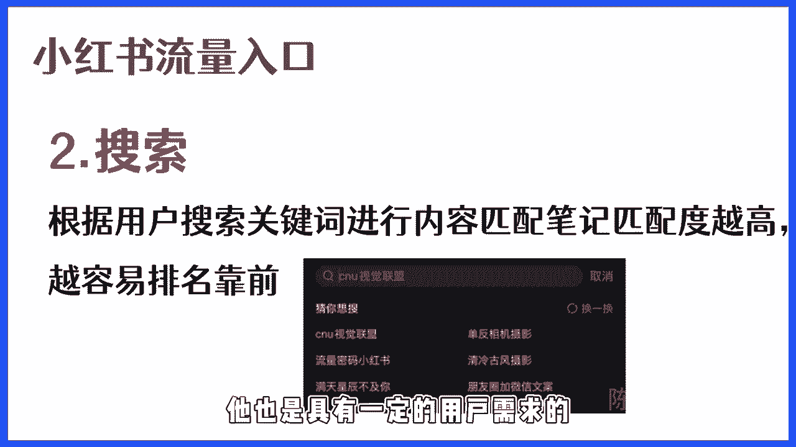
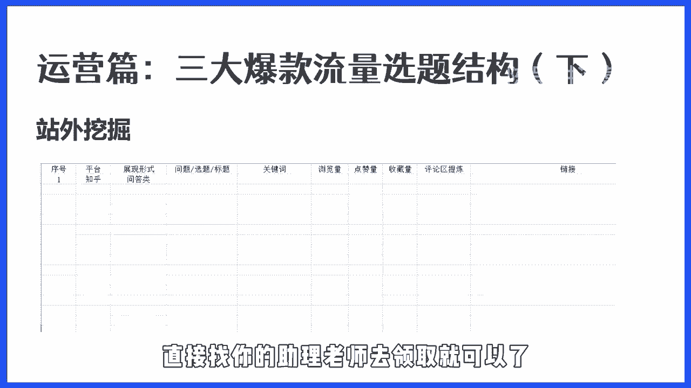

# 【2024版小红书体运营教程】全B站最良心的小红书开店运营高阶教程合集，小红书体开店 起号真的快 - P34：第4节：小红书选题结构完结下 - 遥远的她fa - BV1xX3PeVEaS

在上一小节我们讲了关于爆款的底层逻辑，以及三个选题的分类啊，这一小节的话我们主要来讲一下，通过两个方法轻松挖掘大量的报考选题。

通过上一小节的课程，我们讲解了笔记的构成类型，而每一个笔记它都是由选题，标题封面内容构成，接下来我们会逐一对这四个步骤，进行拆解和分析，今天先从选题入手，教大家如何挖掘报考的选题。

而爆款是什么，所谓的爆款其实就是用户和市场论证的产物，流量背后是需求，而需求背后他就是选题，一篇笔记是否能满足用户的需求，取决于他这篇笔记是否满足了用户的需求，而这就是选题的一个核心命脉。

所谓打蛇打七寸，爆款的七寸就是选题，所以学会了爆款选题，你离否也可以做出爆款的笔记，那如何来挖掘爆款的选题呢，这里的话给出两个方法，一个是站内挖掘，一个是站外挖掘，我们先从战略挖掘来讲。

所谓战略挖掘就是通过关键词搜索，对标账号的笔记内容以及用户评论的分析，进行包括的收集和整理呃。

这里的话给大家提供几种比较好用的方法，首先第一个就是关键词的搜索，相关搜索，在这里的话，我给大家举了三个例子，这三个例子分别都是来自于摄影的三个关键词，一个是单反，一个是摄影，一个是相机。

那我们在搜索这样不同的关键词的时候，我们就可以找到非常多的笔记，我们按照这样一个最热或者按照综合排序，把所有就可以找到非常多数据比较好的笔记，另外呢就是当我们在搜索关键词之后，在这样一个排序下面。

就会有一个相关于摄影人像审美提升，像这样一个相关推荐，相关搜索的话，主要是来自于，当一个用户搜索某一个关键词的时候，它有可能系统会根据他们的生活习惯，会列举出相关的这样一个关键词，而这些关键词的话。

也是我们可以拿来做一个收集和整理的，因为这一些都是系统通过用户的这样一个。

搜索习惯和反馈得出的一些相关关键词，那还有一个就是通过关键词的下拉搜索，就当我们搜索一个关键词的时候，它都会有一些下拉框，比如单反，单反的话，下面就会有单反相机推荐，单反和微单的区别。

单反相机的入门教程，那像这一类的关键词的话，都是搜索单反的人，它相关单反这样一个关键词会有哪些需求，而这一些需求的话，我们按照这样一个排序，越往上的，它的热度就越高，那相对于我们自己所做的这样一个。

课程产品来讲的话，我们只要找到对我们课程有一定关联的作为，我们后续做其他的这样一个细分挖掘的时候。

我们会有一个很大的一个帮助，另外呢就是关于这样一个同行的热门选题，还有评论区的这样一个挖掘，那所谓的所谓的对标同行的热门选题，就是通过同行的对标账户，进行笔记的分析和整理。

那我在这里的话其实就比较容易理解，就是当我们去搜索一些关键词，或者是我们去看一些同行的一些账号，他们的整个账号里面都会有数据比较好的，选题和笔记内容，那我们要做的就是，把他们所有热门的这样一些笔记。

把它进行一个整理，当我们在整理的过程中，我们就能够去通过分析，就能够看到相关的这一些热门选题，其实它都是有重复的，而我们要做的就是把这一些热门的选题，且重复的选题把它找出来，然后做一个逐一的整理。

便于我们后续可以直接拿去用，那还有一个就是关于这样一个评论区，那评论区的话基本上也是一个挖掘选题，挖掘用户需求很好的一个地方，那这里的话给大家截了一张图，这张图是一个爆款笔记，它下面的一个评论。

那我们在这里可以看到，其实有很多的用户都在评论区求这样一个，新手入门的相机，那像这样的需求单一出现，可能他不一定是符合需求的，但是如果说它出现的次数比较多，它的频率比较高的话，那次那基本上就说明了。

那说明了这种需求是非常明显的。

那像这一类的需求，我们也可以把它针对性的来做一篇笔记，那像这样一些，我们刚才做的这样一些需求分析之后，我们就可以把这些需求分析，按照我上述给大家这个表格来进行一个整理，比如说我对应的一个精品账号。

我都会把它的这样一些爆款的标题，播放量，收藏量和评论量，这些数据全都会把它放进去，同时呢我会把它的整个选题进行一个拆解，比如说像我们的第一个摄影光线，学摄影必须要知道的八种光线。

那它的核心关键词其实就是摄影光线，另外呢就是第二个提升审美，学摄影必看的八个网站，那这里的话我就会把它的整个标题里面的，核心关键词提炼出来，一个学摄影，一个网站，一个提升审美，那当我慢慢的。

当我开始去做这样一个爆款的，数据的分析的时候，大家就可以发现所有的爆款它都是重复的，基本上所有的账号里面他火过的内容，只要他发的内容比较多，他火过的内容基本上都是有重复的，而且这种重复率是非常高的。

那像这种内容的话，就是我们优先要做的，因为这种内容，它就是属于典型的符合用户需求的爆款选题，的一个很好的一个体现，那站内的选题的话，我们可以通过这张表格来进行一个收集和分析。

那站外站外呢站位的话其实和站内其类似，那站内站外的话给大家推荐两个核心的渠道，一个是知乎，一个是抖音，这两个渠道相对于其他渠道来讲的话，它的数据量比较大，而且呢对我们来说。

搜索的这样一个参考性比较重要的，那这里的话给大家讲三个方法，来进行一个站位的挖掘，首先第一个就是关键词的搜索下拉框，第二个是按照热度的排序，第三个就是评论区，为了更好的让大家理解站位挖掘的一个方法。

这里的话我给大家举一个知乎的例子，当我们在知乎搜索摄影相机的关键词的时候，在它的下拉框里面也会出现一些关键词，比如摄影就会出现摄影构图，摄影技巧，摄影入门，还有摄影入门相机，当我们搜索相机的时候。

就会出现相机的推荐，还有就是相关于相机的一些相关的关键词，那这一些关键词，它都是当一个用户搜索对应的，一个主关键词的时候，会根据它的搜索的匹配度，来进行一个相关的推荐。

那像这些相关推荐的话都可以整理下来，因为这些相关推荐都是平台的算法，进行一个整理，最终得出的一个结果，而这一些词也是具有一定的用户需求的，也是用户关注的一些比较大的一些关键词。

那另外一个就是关于这样一个热度搜索，热度搜索的话就是不管你是在抖音还是在知乎，我们在搜索任何一个内容的时候，它都会有一个热度的排序，那你现在知乎里面搜索摄影，我们就可以直接按照综合排序。

来进行一个直接搜索，按照最多点赞搜索出来的结果，就会包括很多一些点赞量比较高的一些问题。

而这些问题相对来讲，它也是具有一定的用户需求的。

那我们要做的就是把这一些相关的一些选题，直接来作为一个整理，整理之后来进行一个后续的啊，整理之后直接在小红书里面去搜索了解，看有没有对应的一些需求，如果有的话，这个选题也是我们可以拿来直接用的。

然后第三个就是关于评论区，评论区和我们在小红书进行一个评论区挖掘，是一样的，就是当用户会在评论区里面去提问，去问一个问题的时候，说明了用户他的需求是没有被满足的，那当我们在评论区里面发现一些高点站。

或者是说出现频率比较高的一些问题的时候，而这些问题大家都可以进行一个整理，因为这些问题，它都有可能是一些用户关注比较多的，一些爆款的一些选题，它是具备一定的需求的，而我们收集了之后，要做的还是那样。

就会把这些内容拿到小红书的渠道里面去搜索，如果说它具备热度，那我们也可以进行一个整理，然后这里的话也为了大家更好的去使用，站位挖掘的这样一个工具，那给大家准备了一张表格，那通过这个表格。

你就可以很好的通过这样一个站位的挖掘，把所有的内容进行一个整理，然后后续的话对我们自己在内容创作的过程中，会起到很大的帮助，然后这一节课就讲了这么多啊，最后的话再跟大家讲一个很重要的一个点。

就是为了更好的帮助所有做兼职的项目成员，更好的去做好这样一个项目，我们把所有的我们所做的这样一个产品的，爆款的选题，封面，标题等元素，全部都进行了一个素材化的一个整理，这个素材库的话，如果你想领取。

那你需要做的就是第一个，每天的课程都要认真的听完，并且提交对应的作业，根据这样一个课程所讲的内容去实操，然后当你把所有的内容课程全部学习完之后，直接找你的助理老师去领取就可以了好吧。

