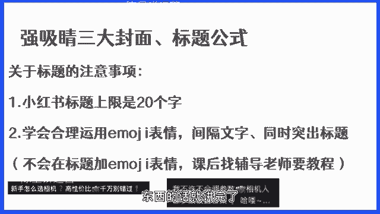
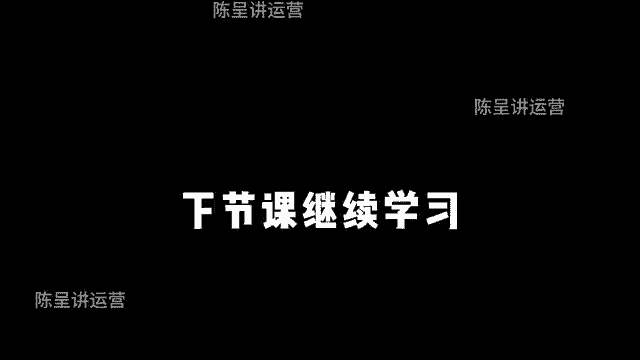

# 【2024版小红书体运营教程】全B站最良心的小红书开店运营高阶教程合集，小红书体开店 起号真的快 - P35：第5节：小红书爆款封面和标题拆解 - 遥远的她fa - BV1xX3PeVEaS

OK继续开始我们的课程啊，这节课呢主要讲解爆款的封面，还有标题的这样一个公式，那在讲解之前呢，有一个很重要的点，我要跟大家去讲一下，首先大家看到我们右边的这两张图，这两张图大家是不是似曾相识。

所有的小红书的流量，最大的入口都是来自于双瀑布流，对不对，而在这个地方，我们之前都是讲过，双瀑布流最直接的影响因素有哪些，还记得吗，选题标题和封面，那我们的封面和标题。

还有选题就会直接决定用户会不会点击，而大家在这里要注意的是，用户是被动刷到的内容，因为是平台通过用户的喜好标签，还有用户之前搜索过的关键词，来进行被动推送的，而用户是否会去点击。

是取决于第一个能不能满足用户的需求，第二个有没有足够多的吸引力，能够让用户去点击我们的笔记，所以说我们需要去解决，我们爆款的标题应该怎么写，我们的爆款封面怎么做，那这里呢我教大家一个爆款的封面速成法。

相较于市面上大部分的这样一个课程来讲的话，今天这一个速成法只要你认真的去听，你就可以立刻马上学会它，别的不多说，我们进入正式的内容，那首先呢关于这样一个爆款的速成方法，我这里会讲到一个方法。

以及再跟大家去提一个，关于素材库的一个收集的问题，那首先我把我的方法叫做，关键词拆解和结构化表达方法，那这里的话，首先我们要把爆款的标题进行一个分类，也就是说我们最经常会看到和用到的标题，有如下的六类。

时间，金钱数量夸张，业痛点还有好奇，那对应的这样一些标题呢也特别的多，我今天只举其中的这六个例子来给大家讲解，这个方法，大家一定要学会去用它，因为这套方法一学就会学了，就能够马上用。

然后我们就先讲的第一个时间，那这里的话给大家准备了一个案例，这个案例是6年PPT，月入2万，零基础自学PPT经验分享，那我们怎么来进行一个拆解呢，首先大家跟着我的思路来啊。

我们把这一个标题拆分成6年PPT，月入2万，零基础经验分享，那我们怎么来改呢，举个例子，如果说我要把它做成摄影的课程，那我可以怎么改，我可不可以改成4年摄影经验，月入2万，零基础自学摄影经验分享。

那这一个关键词和上面它原来的案例的关键词，我做了一些什么调整呢，首先第一个我的时间年限改了，第二个它针对的对象是PPT，我针对的是摄影经验，然后呢他是月入2万，我改成了月入1万，零基础经验分享。

你看通过这样一个拆解的方法，再利用它的结构进行一个表达，是不是快速的，就能够得出我们想要的这样一个爆款标题啊，当然这里呢我只是给大家举了个例子，可以写的更好对吧，大家可以自己去练习一下。

这是关于时间类的，我给大家举一个例子，金钱类的这样一个标题来给大家举个例子，案例是零零后靠写作怎么存10万，毫无保留经验分享，那这里面的关键词是什么，零零后靠写作怎么存10万，毫无保留经验分享。

那我怎么改呢，我这里给大家举个例子，九五后靠摄影怎么存20万，3年经验分享，你看我把这个标题进行一个拆分之后，我得出了一个新的标题，这个标题的主要关键词有哪些，九五后靠摄影怎么存20万，三点经验分享。

你看这种思路，大家自己要去体会一下哈，这个方法大家一定要深入的去体会一下，然后我再带家举几个例子，大家自己去好好的思考一下第三个数量，那数量呢我也给大家举了个例子，这个例子就是6年的电子书网站。

让你看书自由，让我们进行一个拆分，大家自己看这个课的时候，自己也去猜一下啊，看跟我猜出来的是不是一样的，六个免费电子书让你看书自由，那如果说我要改成我所做的这样一个内部，举个例子。

我们拿摄影来举个例子啊，改进成六个免费的摄影自学网站，让你轻松学会拍照，那我这个里面的关键词有哪些，我这里面的关键词就是六个免费电子书，让你看书自由，讲完金钱这一个案例了，我再来给大家举个例子啊。

我们举一个关于数量的例子，那数量这个例子呢，这里有一个案例，六个免费的电子书网站让你看书自由，那我们来猜一下它的关键词有哪些，六个免费电子书网站让你看书自由对吧，那我们改进之后的。

我按照我的方法改进之后，我们的标题可能会变成什么样子呢，来我们来看一下六个免费的摄影自学网站，让你轻松学会拍照，那这里面的关键词划线六个免费摄影自学网站，轻松学会拍照，你看我把关键词拆分了之后。

是不是就能够快速的组合出一个新的爆款，那我们再来看一个夸张类的，夸张类的在一个标题写作呢，你案例也有一个，举个例子，有了这几种方法学摄影省下一部单反钱，你看这里面的关键词就是有了这几种方法。

学摄影省下一部单反钱，那我把这里改了一下，改成什么了，掌握这六种方法学摄影省下一部单反钱，那你看我把这里面的几种改成了具体的六种，你看同样的标题，通过这样一个内容的改良，是不是我们的标题也会比较的。

我们的标题也会比较的不错啊，对吧啊，我们再来看一个例子，这个例子是裂痛点，那案例呢是十六七岁不会化妆，一分半还原自然原生美貌，这里面的关键其实是十六七岁不会化妆，一分半还原自然原生美貌。

那我们改进之后呢，你看改进池摄影呢我们怎么改的啊，初学不会摄影史科这九张图三天快速入门摄影，你看我就把十七十六七岁改成了初学，不会改成了不会摄影，化妆我就一分半，我就改成了死磕。

然后还原之后我就改成九张图，三天快速入门，你看我把这些关键词进行了一个调整，把有一些关键词真进行了一个增加，比如说我把一分半改成了一个比较有情绪的，比较好的一个词叫死磕。

你看我的整个标题是不是一下就更加的，是不是，我这个标题一看，就变得会比之前普普通通的标题更加平，更加的好一点的呀，对不对啊，这就是列痛点，然后呢我们再来看一个例子，这是最后一个例子了。

我们再看一下这个案例是考研一战上岸，其实很简单，它里面就会包括了考研一站上，考研一战上岸其实很简单，那我们改一下对吧，学会摄影其实很简单，有手就行，你看这么一个标题，简单的改了改。

当然这只是给大家举个例子，你们自己在课后呢，也可以把我上课过程中所录的这一些案例，自己也可以去改一改啊，去练习练习，那这里呢就给大家去总结出了，我们的这样一个案例，让我们把这个案例做一个总结。

爆款标题的分类和拆解的步骤，记住啊，拿着笔一定要认真记啊，首先第一个找到同一选题，下面1~3篇爆款笔记，第二提取关键词，第三步结合提取的关键词形成自己的标题，第四步加上emoji表情。

你看就通过我刚才教你们的这种方法，是不是我们就能够很快的做出，一个爆款的标题呀，那在这里的话值得注意的是，除了我们要学会干嘛，学会总结爆款的共性，并且把标题和关键词进行拆解，然后通过结构化的表达之外呢。

一定要注意我们要学会站在用户的需求，用户的角度去设计我们的标题，从而才能够做出一个真正能够吸引人，并且能够吸引更多用户的标题，那当然对于需求这一块呢，大家很多同学都是新手，就是刚开始做。

对于这一块不是很了解，那后续呢我也会专门的做一期，用户需求的详细讲解的课程，放在加仓课里面，来帮大家去更深层次的去理解用户的需求，那当然其实我们之前讲的这一个选题对吧，我们也一直在讲。

我们要去挖掘用户的需求，通过教大家的这样一个方法，我们就能够找到用户的需求，那今天的话既然我们是正科，那正课的话，我就把一些简单好用的方法直接教给你们，因为我考虑到很多同学没基础，我要一来讲得很复杂。

或者一来把很多东西讲的很专业，对于大部分的同学来说有点听不懂对吧，因为我们这节课，因为我们这一套课讲的本来就是方法论，希望通过这个课程的每一个方法论，能够让大家快速做出效果来。

所以说大家一定要认真的去听，然后当然大家也不用担心，关于标题确实还有很多东西要讲，我把它放在了加上课，好吧，嗯这是我们关于标题的一个注意事项啊，这是关于标题的一个点，我要跟大家去提一下，然后另外一个呢。

就是大家要学会自己搭建自己的爆款标题库，你要学会去总结各种各样的小红书的爆款标题，并把它们按照分类来进行划分，第二步要学会去结构化的拆解它们，因为你只有拆解了，你才能够找到他们这个结构。

并且能够去套路它，第三个呢就是大家一定要学会去进行资金词，金句的收集，什么叫金词金句，简单的来讲就是好的句子，好的词语，那这些词语和句子大家都要学会去收集它，因为平时我们在写标题的时候，我们会用得到。

例如刚才我们的案例里面讲到的死磕，这就是一个非常好的一个词，这个词是有情绪的，这个词绝对会比我认真努力学会它，你摇的要好，来得要好，学会和死磕这两个词，大家想想是哪个词更好。

所以说像这种关键词和这种京剧的类型的东西，一定要学会去整理，当然对于很多，作为我们兼职项目的伙伴来讲的话，我们也为大家准备了一套大家所做的这个课程，产品的标题库和我们的素材库，那每一节课听完了。

认真做作业，学完这个课程之后，你就可以拥有它，好吧，这个东西的话，是专门为我们所有做兼职的项目的伙伴准备的，当然如果说你不是我们兼职项目的成员，你是我们的付费用户，你也不用担心。

我们后续也会为大家去整理，找你的，找你的对接老师就可以了，好吧，这是关于我们的一个京剧金库的这样一个收集，要跟大家简单的讲讲，就是包括了这三个方面，那另外呢就是关于我们的标题的注意事项。

大家在做标题的时候，首先要注意，第一个小红书的标题上限是20个字，也就是你超过了20个字，你就没办法了，所以大家一定要学会在标题里面不要加废话，尽量的不要把一些啰嗦的语字，啰嗦的句子放进标题里面。

这样的话会让你的标题变得非常的臃肿，甚至可能你的标题都已经放不进去了啊，很坑爹很尴尬，第二个呢就是大家一定要学会善用emoji表情，emoji表情的作用，就像下图大家可以看到的这两个图。

以墨迹表情的作用，一方面是可以间隔我们的封面标题，另外一方面呢，可以让我们的内容不会看起来密密麻麻，有的人他在写标题的时候不加emoji表写，就会感觉整个标题非常的乱，所以说这一块大家一定要注意好吧。

当然如果说有的同学不会添加emoji表情，课后找辅导老师去要教程，让他教你就可以了，然后我们标题这一块东西的话就讲完了。

