# 【2024版小红书体运营教程】全B站最良心的小红书开店运营高阶教程合集，小红书体开店 起号真的快 - P38：小红书运营教程二 - 遥远的她fa - BV1xX3PeVEaS

今天的这节课呢，我们来讲一下小红书的笔记热词，如何去掌握关键词，关键词的一个挖掘方法，抢占更多的小红书流量好，那我们这节课呢主要是跟他跟大家讲的是，找到这个更多关键词的一个方法。

首先我给大家推荐的一个方法呢，是很很接地气的一个方法，也是非常实用的一个方法啊，我们不需要借助一些其他的这个，额外的一些工具，我们就可以完成这个关键词的一个挖掘，就比如说我们用这个淘宝很简单的。

比如说我们以纸尿裤这个关键词为例啊，我们搜索这个指指南库之后就会发现呢，它这里面会出现一些其他相关的一些，这个关联的一些关联，那些关键词，啊就比如说您是不是要找，因为和纸尿裤相近的这个词，有拉拉裤。

尿不湿对吧，帮宝适等等等等这些词，因为它这些词和这个和这个纸尿裤，这个词比较相近，我刚才说了对吧，所以说系统会给你推荐出其他的一些，大类的一些词语，也就是说你如果说想做这个纸尿裤的话。

那是不是也想做这个拉拉裤，或者说想做这个尿不湿对吧，好，通过这个方法，我们找到了这种类目的关键词之后呢，我们可以选择一些特定属性的一些产品，属性的一些词，那什么是产品，什么是一个产品属性的一个词呢。

啊这里面和大家讲简单的讲一下，就比如说我们简单的啊通过这种人群啊，产地啊，功效啊，效果啊等等这些词，它就是一个产品属性的一个词，这里面呢我用这个手机投屏来和大家看一下，好。

这个时候我打开的是这个小红书的app，的一个界面啊，我们就拿这个眼罩，我们换一个词，就拿眼罩这个关键词来搜索搜索，搜索出来之后呢，我们发现这个小红书的搜索框里面呢，出来这么多关于和眼罩相关的呃。

一些个这个长尾词，一些关键词我们来和大家说一下，有哪些词呢是产品的一些属性词，就比如说眼罩蒸汽。

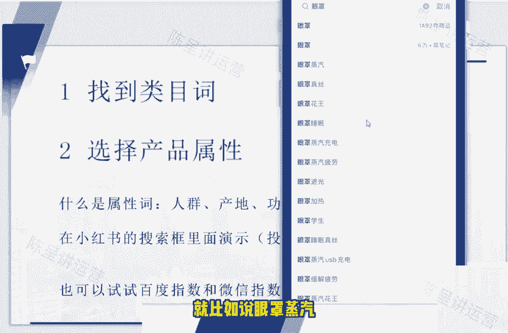

啊眼罩蒸气睡眠，遮光对吧，这是它的功效对吧，加热针对于学生用的对吧，啊这种USB充电的可以用来缓解疲劳的啊，可以用来充电的这些词，我们可以看到呢它就是一个产品的一个属性词，就是我刚才所所说到的。

我们扩充这种产品的这种词之后呢，就可以针对这些词呢来去写上，我们不同的不同的文章，不同的笔记好。

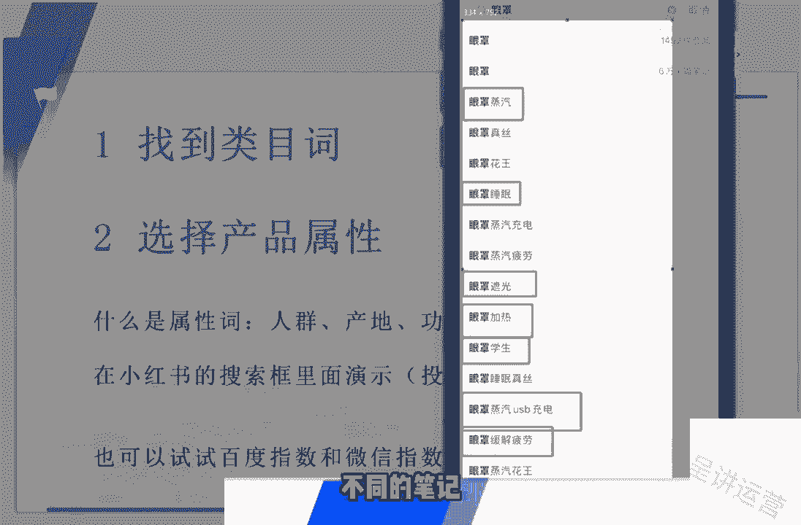

大家应该明白了吧，主要的是我们啊，通过第一个找到你所在所做的，这种类目的一个大类，然后呢选择这个类目的一个属性值，然后呢这个就是你所写文章的一个方向对吧，你写这个笔记的一个方向呃。

那我们除了用这个小红书的这个工具之外呢，我们还可以用什么工具呢，这里面呢我我给大家推荐的是一个是百度指数，还有一个呢是微信指数，我们首先来看一下这个百度指数，百度指数呢我们直接在百度里面。

百度这个百度指数之后呢，它这里面有一个官方。

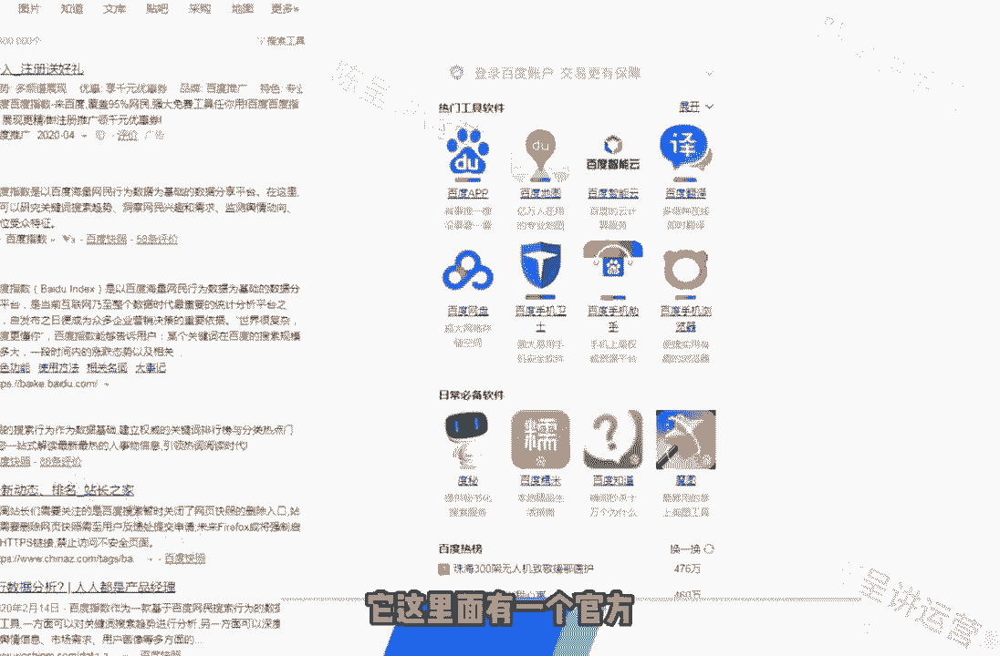

大家可能看不见，我截图给大家看一下。

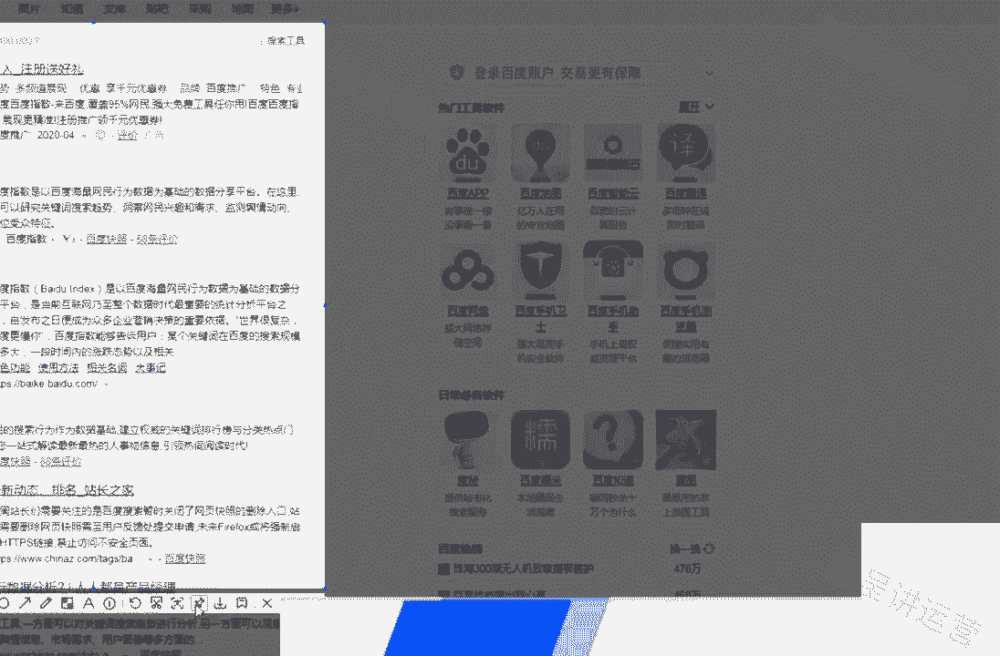

啊这里面有个百度的一个官方，我们点进去之后呢，就会来到百度官方的一个页面，我们在这上面最上面的写上这个，比如说我们搜索这个纸尿裤，对吧啊，搜索完这个纸尿裤之后呢。

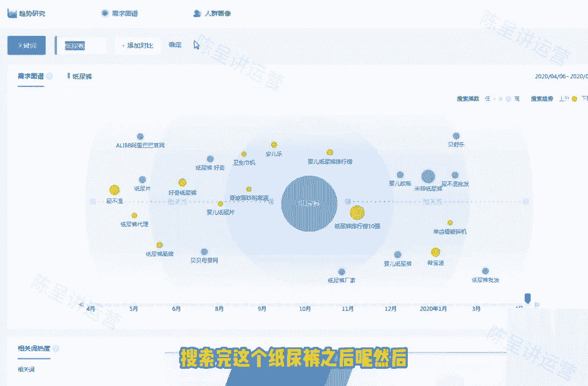

然后他在这里面，他在这个上面大家注意了，有一个需求图谱啊。

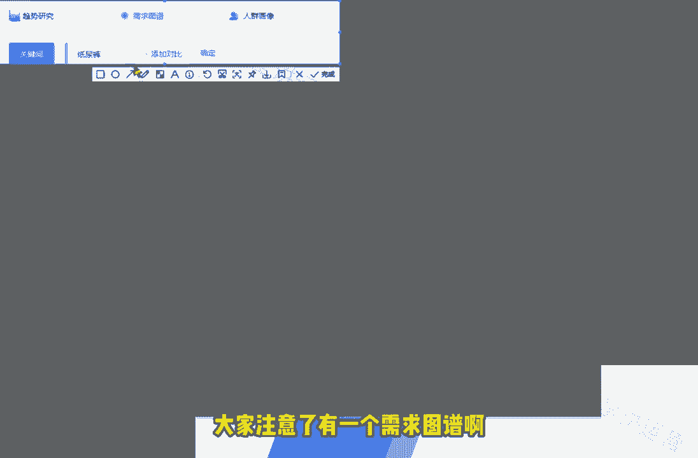

有一个需求的图谱就是扩展关键词那些地方，我们大家可以看一下，和这个关，和这个质量库比较关系比较近的一些词，或者说一些相似性，相关性的一些词，大家都可以看得到，对吧啊，搜索趋势是呈现上升还是下降的。

都可以在这里面看得到，包括一个时间的一个节点啊，每个时间段它到底出现了一个，啊他到底出现了一个什么样的一个，排名的一个关系，包括这个下面包括这个下面大家可以看一下。

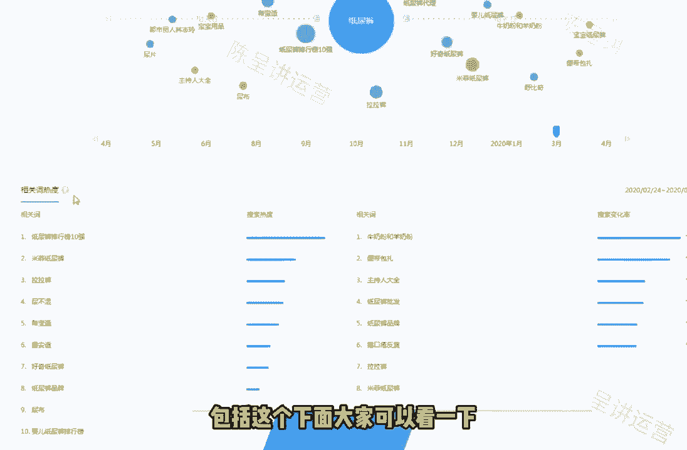

有一些相关词的一个热度啊，有一些这个相关词的热度。

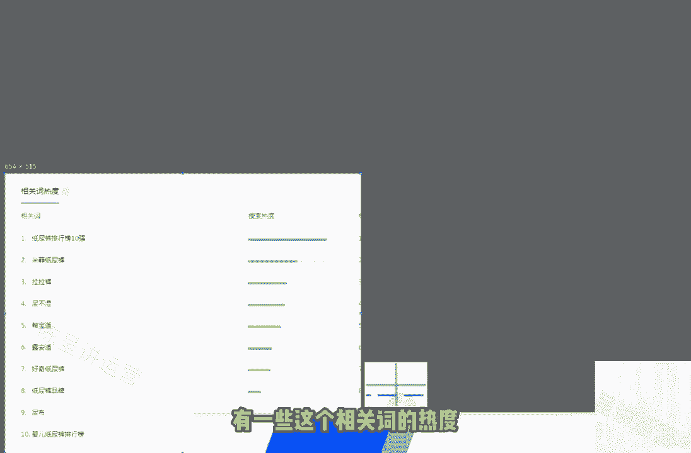

包括有一些这个其他的一些相关词，那有的相关词呢都是比较精准的，有些相关词呢就比较不太精准了，就比如说为什么你搜这个纸尿裤，他要和你推荐，他要给你推荐这个牛奶粉和羊奶粉啊，这个就比较好解释了嘛。

因为你搜纸尿裤的话，很可能家里面你有你家里面有小孩了对吧，那他可能就会给你推荐一些婴儿的周边用品，对吧，比如说小孩子可能有这种鹅口鹅口疮呀对吧，宝宝用品呀，你看懂了吗，他就是通过这样联想啊。

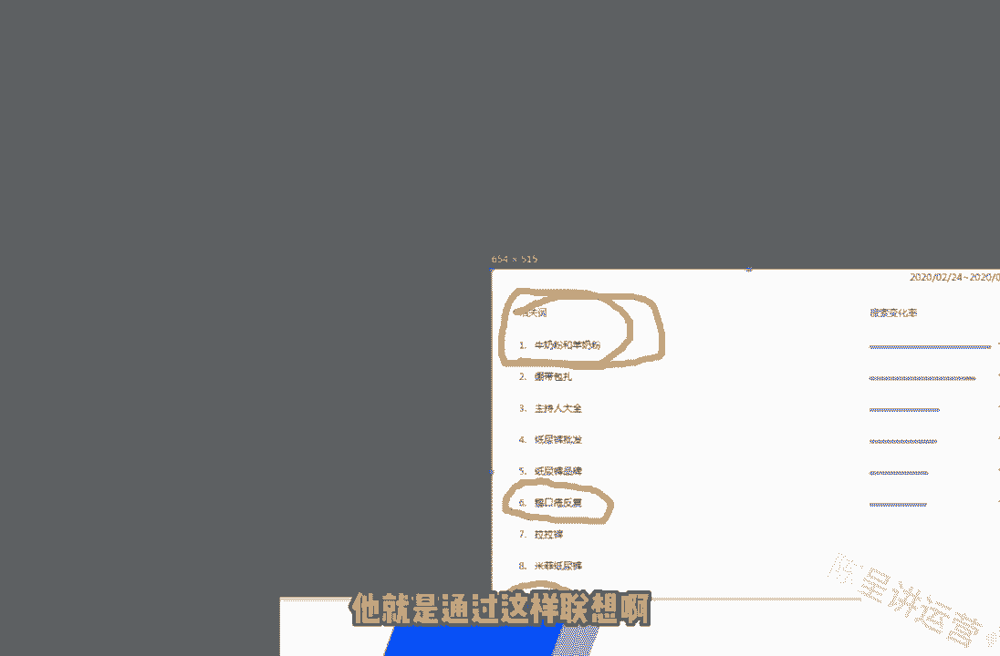

去给你推荐的一些其他啊，其他的这些一些关键词。

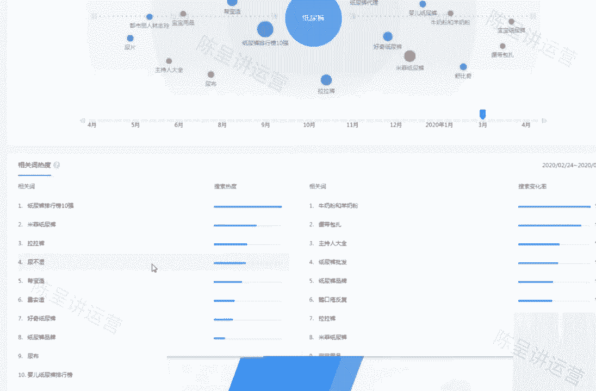

甚至呢我们可以通过这个微信指数，我们来看一下微信指数的一个使用方法，这边和大家讲解一下，我们打开这个微信的小程序，然后呢，我们在这个里面就可以搜到微信指数。

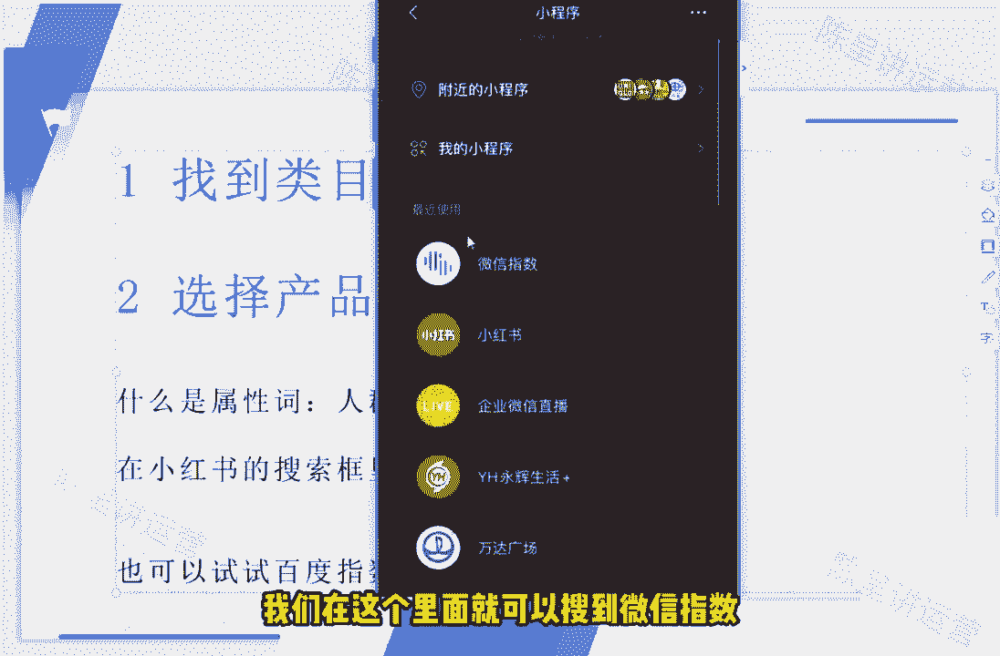

这么一个小程序，我们点击进去之后呢，你就会发现啊，这是一个搜索的框。

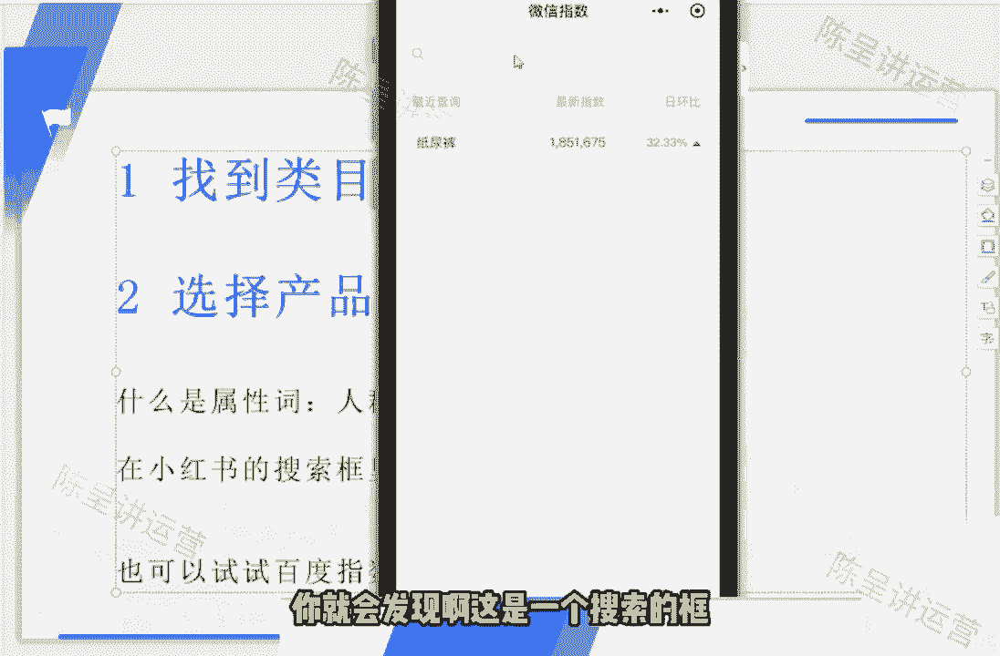

比如比如说我刚才搜过了这个纸尿裤对吧，我在搜搜索这个这个词的时候呢，就会出现这个词，在微信上出现了一个指数的一个频率，比如说14号啊，有这么多个数据对吧，150万对不对，那它的一个趋势。

它的一个变化的一个一个一个比较对吧，大家都可以看得到一个简单的一个比较，我们还可以通过这个里面的纸尿裤的这个，搜一搜呢去发掘一些其他的相关的一些关键词。

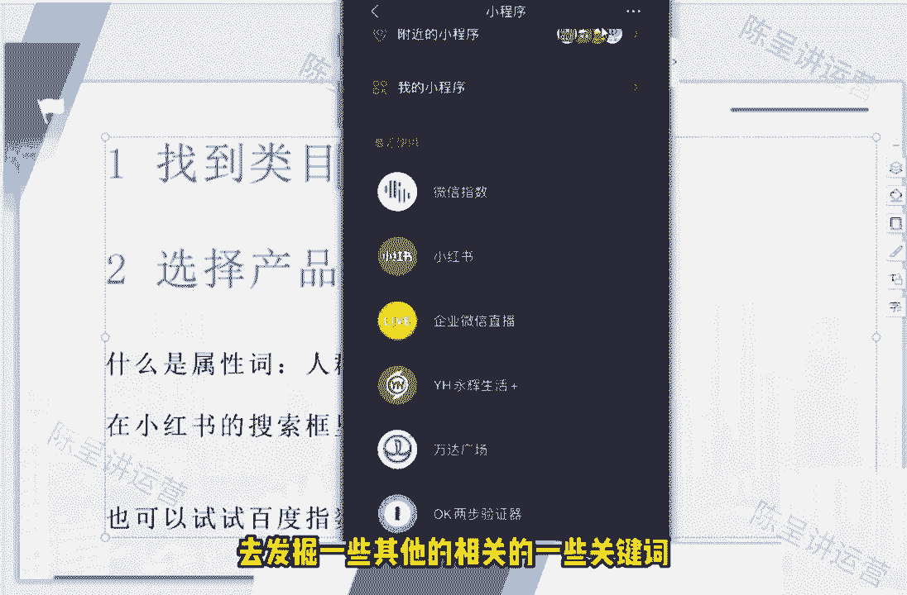

这里面呢就不跟大家去演示了，所有的大家可以记住一下所有热门的一些搜啊，搜索引擎，包括是商业性质的这些app呢，它的搜索框呢都是会给我们带来其他的，一些类目词，包括一些这个商品的属性的。

这里面大家要注意一下呃，关键词排名的一个，那我们知道了这个关键词之后呢，就和我们，我们就和大家来讲一下，这个关键词的一个排名方法，首先呢就是布局关键词，布局关键词的话呢，我建议大家写啊，写文章的时候。

我们来写这篇笔记的时候呢，还是建议大家去采用这个总分总的结，这个结构呢来写我们的文章，然后呢去代入我们的关键词，关键词布局的方法呢也比较简啊，也比较简单，主要呢是分成三个大步骤。

我这里呢和大家简单的去说一下，首先呢第一个大步骤呢，就是说我们的题目里面一定要带有，你所在行业所啊，所想操作的这个类目的一个关键词，然后呢因为总分总的结构嘛，就是开头要带上一带，带上一个这个关键词对吧。

中间分为几段我们来阐述这个东西，最后呢我们收尾的时候呢也要带上这个词，也就是说这个词总共在一篇文章里面，一个笔记里面出现的次数大约不要超过十次，7~10次左右呢是比较理想的一个状态。

我们围绕着这个主题呢去写的这个关键词呢，对吧，就可以从这个开头啊，中间啊，结尾啊带上这个关键词，对不对，那第三个呢，我们图片，图片中呢也可以加上这个关键词的一些标签啊。

大家都知道在写小红书这个笔记的时候，可以加上相关的词的一个标签对吧，甚至我们结尾的时候呢，也可以加上一个和这个关键词相关的一个话题，这样子的话呢就是一个完整的一个总分，总的一个结构。

有点像那个汉堡包的一个结构啊，从上从上到下，中间呢是夹着的对吧，这种结构呢是写文章，他的收入的这个概率是比较高的，那我们操作这个呃小红书这个关键词，关键词排名的时候呢，又会遇到又会遇到一些问题。

这边呢我总结了大概三个问题，问的是比较多的，我来和大家分享一下，也是也是我们这边比较常见的一个问题啊，首先第一个笔记排名上不去的话，那需要怎么样做一个优化，这边呢如果大家发现自己的这个笔记呢。

做了很长时间排名都上不去的话呢，也不要去啊，花很多的时间去优化了，我建议大家自己直接是重新选择这个关键词，然后呢重新对着这个关键词词去做一个笔记，有可能你选的这个词呢就比较热门。

所以说你你对你来说竞争来说的话呢，那个压力就是比较大的啊，第二点呢有很多人问对吧，我的排名老是掉怎么办啊，排名老师调呢，它实际上是证明了，首先第一点这个词呢有很多人跟你竞争。

第二点呢这个竞争大的这种子呢，那是确实也会给大家带来一定的收益，一定的利益的，所以说我们可以在这方面去花点力气，花点时间对吧，我们去多投入一些精力或者时间，来创作更加优质的一个笔记啊。

把这个掉下去的这个名字呢我们给补上对吧啊，然后还有人问人工排名比较靠谱，人工排名靠谱吗，这如果听到外面有人说，做这个人工排名到底应该做不做，这里面呢我额跟大家说一下，因为我们之前遇到的团队呢。

之前遇到的这个额团队或者是一些个人呢，他们有做过这个人工排名，但是风险呢是比较高的，也只是暂时的能给你排名去排上去，所以说他的排名风险还是比较高的，这里面呢大家可以根据啊。

你你们公司或者你们企业或者你个人，你团队的这个需求来进行排名，最好的一个方法是什么呢，就是说你先让他少少做一点去看一下，比如说先投一个500块钱，300块钱，我们去看一下这个效果啊，如果效果可以的话。

那再投多一点对吧，然后多一点效果还可以的话，那再投多一点，我只能说建议大家这样去操作，这个小红书人工排名啊，其他的话呢倒是不建议大家去做好了，那我们本节课呢，关于这个掌握关键词挖掘的一个方法呢。

这个小课呢就和大家分享啊，分享到这里了，我们这节课呢来和大家讲一下，小红书的一个搜索，玩转小红书的搜索四步，带你去玩转相关小红书搜索的一个机制，去了解小红书搜索推荐的一些排名规则。

更好的去提高我们笔记的一个展现质量，同时呢对应引流到比较优质的，高质量的一个客户，那我们说到这个优化搜索的话呢，就不得不就不得不提到，一个很关键的一个东西了，那就是一个关键词对吧。

首先呢关键词的选择的话，在前面的课程里面，我是和大家介绍过了，什么是这个核心关键词，什么是相关关键词，什么是长尾关键词，那这一节这一节课呢我们就不再去赘述了啊，这里我给大家圈一下，就是一个呃核心关键词。

核心关键词我就不写了啊，这里面有一个相关关键词和一个长尾关键词，大家可以看一下，为什么我是不建议大家去做这个核心关键词呢，因为核心关键词的话呢，呃就比如说呃面膜祛斑美白这样的，很简单的这种核心关键词呢。

它的竞争竞争呢是比较大的，一般都是有一些比较大的公司，头部的公司呢去做呃，我们如果去做的话呢，基本上预算也是不够的，就比如说别人可能做这个关键词，他的预算呢可能就达到一年的费用呢，就会达到100万。

或者说1000万之内啊，他是有这么多钱去做这种投放，或者说做这种啊关键词的竞争的，但是我们呢不可能说有这么多钱去做这个，投放和竞争，那怎么办呢，所以说我建议大家呢，可以做一些这个相关关键词的一个呃。

相关关键词和这个长尾关键词，虽然呢做这两种词的流量是比较少的，但是呢它更容易去做，更容易去给我们带来这个流量，而且呢我们是玩的一个矩阵嘛，不是说以多少的这个广告费，多少的这个投入来博取我们的这个流量呢。

我们是用矩阵的方式，就比如说我一个小红书号布局的是这个词，那我可以同时布局20个30个账号对吧，可以布布局无数个这样的关键词，那流量的话也是相对来说不会去啊，不会很少的，另外下面我要说的呢。

就是关键词不一定要全部连在一起才可以啊，才叫一个关键词，比如说一个长尾关键词对吧，那么分开的话呢，它其实也也是可以的，同时呢可以用上一个垂直领域下的，其他的这个相关关键词。

大家这个这个如果不太理解的话呢，可以看一下前面的课程或者后面的课程呢，我也会在具体的实操里面和大家说到啊，就比如说我们今天拿这个一个关键词，来举例子吧，就比如说补水护肤品这个关键词对吧。

啊比如说补水护肤品这个关键词，我在写文章标题的时候可以怎么带上去呢，那我我起的我起的这个标题呢，就是皮肤干燥，想要补水，有没有护肤品推荐对吧，那这个补水和护肤品它没有，它并没有连在一起，但是如果说啊。

但是如果说你去这样子啊，你去这样子去把它联系在一起的话呢，这个小红书的搜索引擎呢还是会认啊，还是会认得到的这样的一个长尾词，他还是同样的去会去收录的，这里面呢，我就用这个这个关键词呢给大家搜索了。

看一下，就比如说我们现在是啊，搜索的是补水面膜这个关键词对吧，我们看一下他排在前面的这些这些收入呢，就比如说，就比如说我们看到的这个第二个，排名第二的对吧，补水面膜，我现在搜的这个词是补水面膜。

他的这个标题里面呢是出现了这个补水面膜的，那是理应理应当出现在这里的对吧，但是大家还可以看一下其他的这些文章啊，其他的这些笔记的标题看到了吗，啊这个是补水面膜，啊敷面膜看到了吗。

相关的这些相关的一些这个相关关键词呢，它也是可以做上去的，涂抹式面膜啊，因为涂抹式面膜，它在文章里面应该是提到了补水的一个作用，所以说它标题里面加上这个词的话，小红书的搜索引擎呢也会是可以搜索到的。

比如说我们再来看一下这，啊这里大家可以看一下这个标题，他这个标题呢就根本没有补水啊，补水面膜补水这两个字对吧，那为什么他会被收录进收录进去了，我们来看一下，这里给大家画一下，看到了吗。

这里面补水补水面膜，补水啊，我有的地方可能是看漏掉的，漏掉的，大家在我们再仔细看一下，补水补水，二超超超级补水，补水，大家如果从这个我画红色的这个圈圈，那就可以发现这篇小红书笔记的一个规律。

虽然它的标题没有标明了一个补水面膜，但是他的文章里面大量的去布局了，这个相关的一个关键词，同样的话，它是会被小红书的搜索引擎给抓取到了，所以说这个这里呢大家一定要注意一下，这就是一个非常典型的一个例子。

但说到这个关键词的一个关键啊，这个标题关键词的一个抓取之后呢，我们再和大家说一下，正文内容里面的一个关键词分布，就像我刚才给大家看的这个文章，这篇文章我们再看一下，我们还可以找一下其他的一篇文章。

比如说我们找一下这篇文章，啊他的这篇文章为什么会排在，也是比较靠前的呢，我们来看一下它里面的这个啊一些，一些技巧大家可以看一下它，这里面呢有一个话题，补水面膜对吧，补水面膜，这里也有一个啊。

我们就慢慢的把这些这些词给找出来看一下，啊大家可以看一下我圈出来的这篇文章里面呢，他提到的这个补水面膜的相关的一个关键词，分布呢，实际上还是比较合理的，额，等会等会我会和大家说一下。

这里面我给大家提的一个建议是什么呢，就是说我们最好在文章的开头的前30个字，里面呢，去提到一下，我们这篇啊这篇笔记的一个相关关键词，大家可以看到他的这个关键词分布呢，还是比较均匀的对吧。

均匀的去分布在这篇文章里面，基本上呃他的这篇文章呢，基本上前面是提到了一些痛点对吧，提额提到了一些痛点，会刺激皮肤啊，我换个颜色会刺激皮肤造成敏感，所以说顺势而为的的去推出了。

他所推荐的这款补水面膜对吧，大家还记得那个写小红书笔记的几个步骤吗，那这个人呢就是按照这种步骤去写的，对吧啊，我最近比较喜欢的，大家应该还记得吧，就是我们上一节课说到的那个写作的一个风格。

最后呢是一个总结啊，最后是一个总结，所以说这篇这篇笔记呢他是写的，写的是相对来说比较成功的，也就不难啊，也就不难看出，他为什么能够排在这个关键关键词的，去关键词的前面了好了，这里呢就是我要和大家说的呢。

就是我们的这个开头呢和这个结尾呢，最好是要有相关的相关的这个关键词，比如说我们说的是补水面膜这个词对吧，那开头呢呃最好是正文前面的这个30个字，然后适当的话呢可以加一些别的关键词。

来为这个笔记带带一些别的流量，但并不是说关键词越多越好，就像我们刚才看到的这篇文章啊，它主要的还是围绕着这个补水来说的，但是适当的去提到了一个精华液，大家可以看到了吗。

这里面适当的去提到了一些精华液的一个呃，关键词有两个地方，一个是这，还有一个是这啊，有三个地方对吧，他适当的提到了这个精华液，大家知道这个精华液也是用来补水的，所以说这种这种啊其他类目的一个关键词呢。

也就是我们这里提这里去提到的，可以用上一个垂直领域下的其他的关键词，就比如说同样是补水用的对吧，那精华液同同样的也是可以用来补水的，所以说他的文章里面呢，就会去相应的去带一下这个东西啊。

最后呢就是我要说的这个图片的标签，图片的标签呢你也可以去适当的去添加一些，添加一些这个适当的图片标签，当然但是呢图片标签不要添加的很多，与内容贴切，那就比较好了，在正常的这个情况下呢。

关键词如何分布也是不要去刻意的追求，就基本上能够做到均匀分布就已经很不错了，就已经很不错了，大家可以参照我刚才给大家看的这篇文章对吧，然后呢好的内容呢才是一个王道，因为毕竟呢好的内容才有人去啊。

很详细的把你这篇文章看完，然后有感而发，去点赞转发收藏评论等等对吧，如果少了这些关键性的数据呢，对我们的这个小红书笔记的一个优化呢，还是存在一些问题的，我们再看一下这个文章的一个标签。

我看他我看这篇文章有没有去用到标签，啊大家可以看可以看到他的这个图片呢，就是没有几乎就没有用到什么标签对吧，因为他写的已经很已经很详细了，所有的这个介绍的都是很详细啊，如果这样子你介绍的非常详细的话。

从每个点都介绍了名字，介绍一个功效长的什么样子，多少钱多少片啊，补水效果，包括推荐度，都有个这样的一个详细的一个介绍的话呢，那基本上也就可以去不用加图片的这个标签了，这里大家也应该注意一下。

下面我们来和大家说到的呢，是这个选择话题的一个方法，在我们发完笔记发到最后的时候呢，通常是需要我们去选择话题的，这里给大家看一下啊，选择化形呢是在这么一个界面对吧，那所选的话题呢我一般建议大家是什么呢。

就是说赚的这个权重比较高，然后呢一篇笔记的话只能添加一个话题，所以说我们小红书里面呢，一篇笔记只能添加一个话题的话，大家一定要去谨慎对吧，一定要去拿准你所添加的这个文章的这篇标题，这篇笔记的这个标题啊。

话题呢尽量是与内容去贴切一点，并且呢选择参与人数比较多的那一个，这里面呢我给大家举个例子，比如说我今天写了一篇这个很啊，为什么要选择这个穿搭这个词呢，因为这个穿搭这个词呢，它是非常典型的一个话题。

一个例子，就比如说我今天写的是好，打个比方啊，我今天写的是如何让胖女孩去穿搭，看起来比较瘦一点对吧，大家记住啊，我的文章写的是如何让胖女孩穿搭衣服，看起来比较瘦一点，那所以说我们如果去选选这篇文章的。

这个话题的话，那有有哪些话题是千万不能选的呢，首先这个情侣穿搭是不能选的，因为他和我的，他虽然他的这个参与人数是比较多的对吧，但是他不能够。

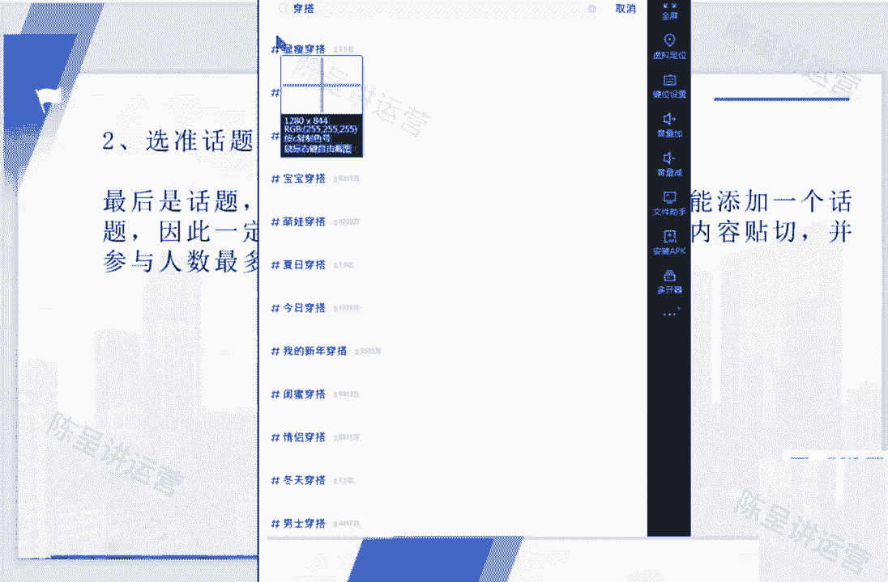

但是呢它不能够和我的文章内容，起到一个相互呼应的一个作用，对吧啊，就比如说萌王的一个穿搭，那我写的是女生的一个穿搭对吧，包括这个宝宝也也不能这样去选，对不对，那我可以去选什么呢，显瘦这个是比较好的对吧。

一共有我看一下，一共是一共有一共有是5亿多的啊，5。5亿的一个参与参与的一个活跃度啊，那就比如说包括这个古装啊或者男士啊，那他就非常不适合了对吧，所以说我们去选择这个相关话题的时候呢。

大家一定要注意一下，去贴合我们这篇笔记所讲的一个东西，你要搞清楚你这篇笔记所讲的一个主题是什么，基本上我们啊，大家还有还有一点要注意的是什么呢，就是说基本上我们所写出来的这些笔记啊。

呃这篇笔记的这个话题，在我们之前一定是有人去写到过了。

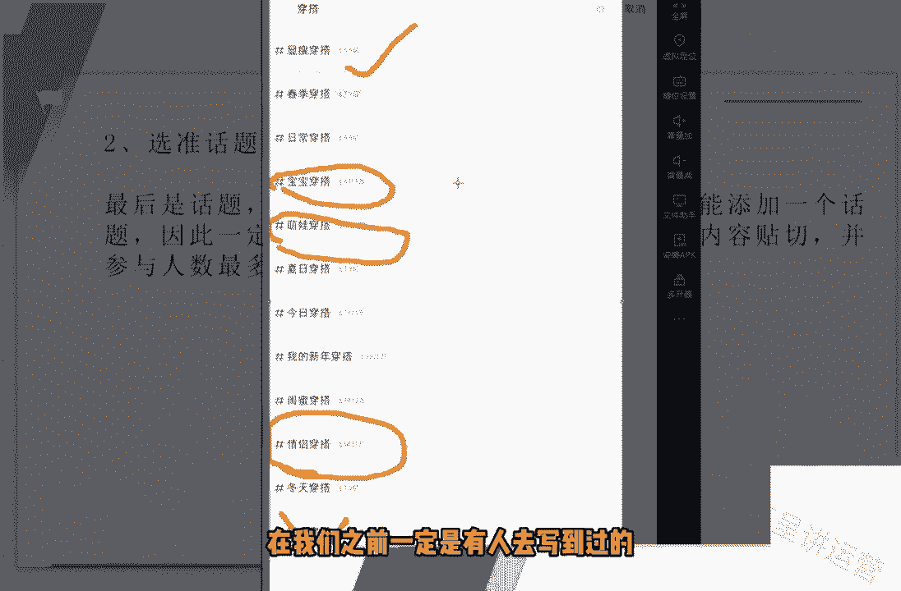

就比如说我们看一下穿搭这个词对吧，传单这个词大家可以看一下，有啊已经有这么多，已经有这么多人这么多个关键词，基本上能把我们所想想到的一些穿搭的，一些这个这个关键词呢，基本上都是涵盖了进去的。

所以说这个大家呢也不用去太太过于担心啊，说我写的这个词可能没有没有多少人去选择，对吧啊。

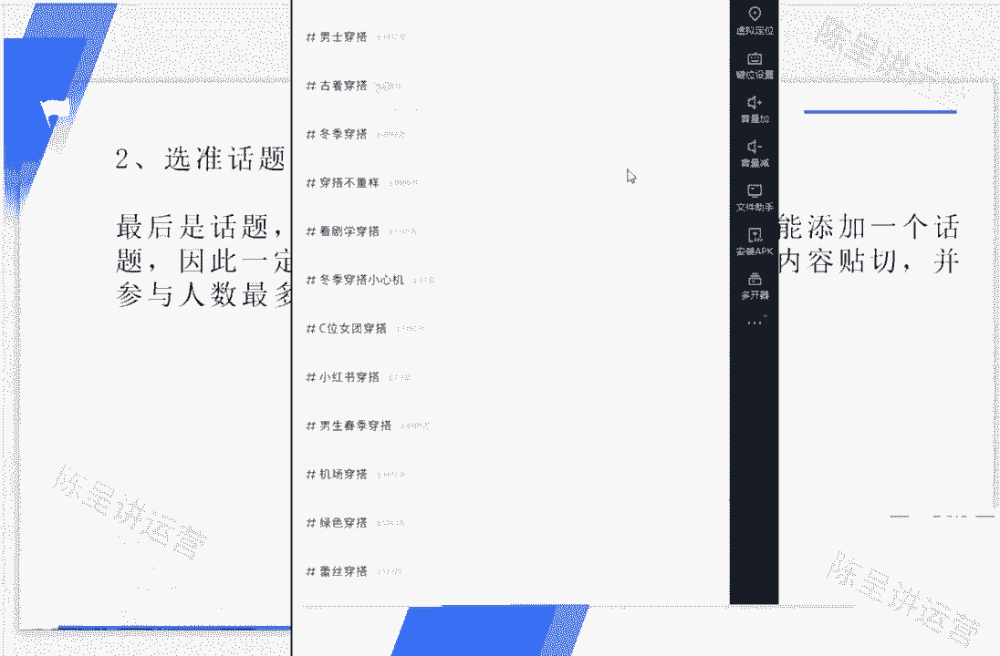

这个是大家一定要注意的，关于这个旋转话题这方面，好我们接着说这个第三个方法，第三个方法呢就是，啊啊也很简单，就是提高我们账号的一个权重，账号的权重呢，就包括我们这个小红书账号的一个等级啊。

获赞与收藏粉丝数量等等，我们基本上可以看一下，就是对照我们前面看到的这些个，关键词底下，比如说我们还是以这个补水面膜，这个词为为例子，我们来和大家看一下排在前面的这几个啊。

这几个博主我们来看一下这几个达人对吧，那这个就不用看了，这个魔法世家呢他是一个企业号，大家可以看一下，他那是一个企业号，所以说他的这个啊企业账号，他所以说他的这个权重呢就是比较高的。

我们可以看一下别的这种普通的账号，比如说我们在这看一下这个人，他的他的这篇笔记呢啊是一篇这个视频的笔记，好我们看一下这个这篇笔记吧，这篇笔记呢一共是816条评论，然后点赞呢看一下，啊点赞。

这个是在屏幕下面的，我来截图给大家看一下吧，他的点赞呢是，啊他的点赞呢是2万个赞，然后呢被收藏了是有11。30000个，评论是816个对吧，我们看一下这个人的账号，他的这个啊他的账号呢。

那你可以看一下他的账号权重就比较高了对吧，有关注他主动关注59个，这个就不用看了，他的粉丝就很多对吧，那他的这个获赞与收藏呢也是非常多的，所以说他的这个账号权重，整体来说的话是比较高的。

你就比如比如说我们可以看到他发的这篇，这种笔记呢，你看啊已经有好几千个了对吧，就比如说他他的这篇，他的这篇笔记呢啊被点赞了一千一千四，将近对吧，收藏是758，评论呢是145。

所以说想要有一个比较好的一个排名的话，首先你自身的这个账号呢，那权重是要比较高一些对吧，然后呢他的相关数据啊，相关的这些获赞与收藏啊，包括粉丝数量都要比较高一些，这个是没有办法。

就是一下子去达成这个目标的，因为因为每个人的账号他都是慢慢去积累的，这个也是没有办法的啊，所以说大家在平时去养号的时候，或者说去啊，刚开始做你自己这个小红书账号的时候呢。

可以去适当的写一些优质的这种笔记，然后呢用其他的一些小号去啊，点赞评论收藏，还有转发对吧，那么我们再说下一下啊，说下面一个就是关于刷数据这一块呃，如有的人就可能会说了对吧，我写了一篇笔记。

那我什么都不太知道，我就是想去得到一个热门，就是想去靠前，那我去找人刷这个笔记的相关的数据行不行呢，就比如说我去花钱去刷这个点赞，收藏与评论行不行呢，啊，这里面呢那有就有很多很多的这个几点呢。

要和大家说一下，第一点的话呢就是呃如果你不会的话呢，一定要去找这个专业的团队去刷啊，去帮你刷这些数据，如果说他不是专业的话呢，它刷出来的这些这些数据本身就不太好，然后呢最好是控制一下这个阅读啊。

点赞收藏评论之间的一个比例，这样子啊，这样子为什么叫控制这个比例呢，就给大家看一下，比如说啊打个比方，我现在写了一篇这个小红书笔记，也是写关于这个补水面膜的，那我们可以看一下补水面膜，它前面的这几个。

前面的这几个，他的这些点赞啊，收藏他的他的这个比例大概是多少，我们可以看一下，就比如说这篇笔记吧对吧，他的点赞是1万，收藏是收藏是9000多，也将近1万了对吧，评论呢就比较少有200多个。

所以说我们刷的时候呢，就可以参照着多看多看几个，多看几个这样的一个账号发布的，这个发布的这个自然的一个数据啊，我们再看一下这个数据。

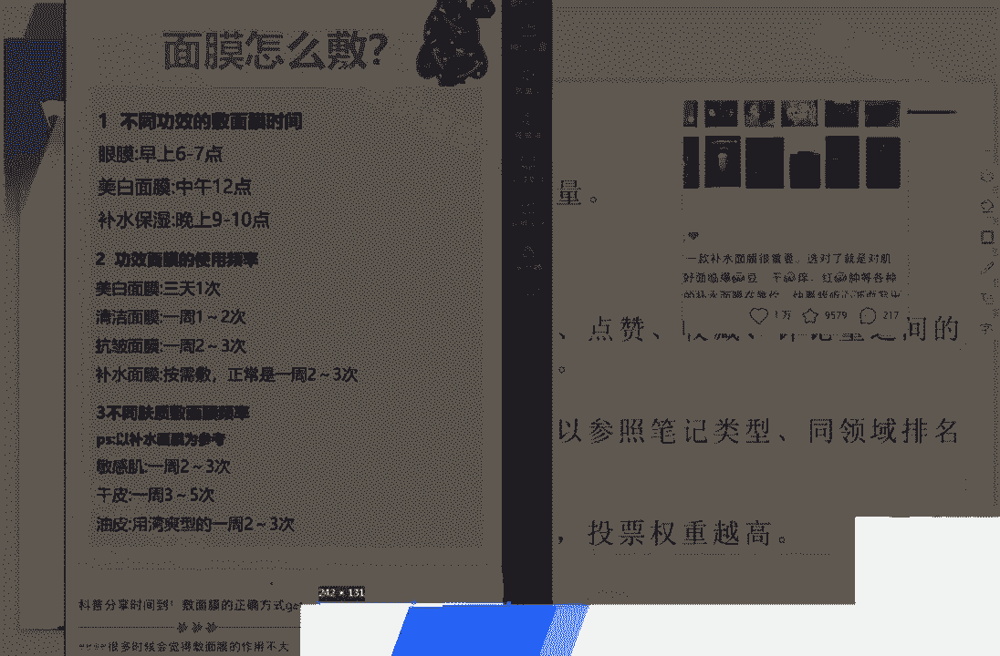

我来多截几个给大家看一下，大家可以看一下，这是我找到的这三篇笔记对吧，第一篇笔记1万额9200多，1万9200多，这是1万六八千多600多对吧，所以说我们如果去刷这种。

比如说我们是呃同样去写这个补水面膜，补水面膜相关的相关的这种笔记的话，你如果想去刷的话呢，你就可以参照一下啊，大致的一个比例，你不可能说呃点赞有2万，但是收藏只有几百，那肯定不行了对吧。

比如说点赞呢有3万，但是他的这个收藏呢只有8000，那这个也是不正常的，所以说他都会被这个小红书后台的这个检查的，一些呃相关的一些算法呢会发现的，我们大家如果刷的时候呢，可以同比例放大或者缩小。

就比如说如果说我想刷1000个赞的话，那这边是不是同等要缩小十倍，对吧啊，评论的话，那那只有几十个，对不对，那这样子的话是一个比较不错的一个比例啊，这里呢就是我我和大家说的，要控制住这个阅读啊。

点赞评论之间的一个比例，而且呢去刷的时候呢，这个账号呢质量呢一定要是比较好的，就是说不能找那种刚注刚注册的那种号，或者说啊没有活跃过的，没有发过笔记的那种账号对吧，就是给你这个笔记去增加权重的这个账号。

它本身也不能是很垃圾的账号，如果系统发现，你这篇笔记里面有很多垃圾的账号，就俗称僵尸僵尸号，僵尸粉对吧，再给你做这样的一些数据，那本那数据做做得再再高，也没有什么太大的意义啊，对然后呢。

下面这个就是我要刚我刚才说过的对吧，没有一个这这个这些点赞啊，评论啊，包括收藏这些数据呢没有一个绝对的啊，没有一个绝对的，但是呢大家去刷之前一定要去参考一下，如果说你确定要去刷这些数据的话呢。

你可以去参考一下这些数据，同领域对吧，同等类型，同等领域的里面的这些比例靠前的这些比例，它到底是什么样的一个数据，你可以按照这种同等的，就是这些数据呢去增加或者缩小你的时间，对吧啊。

然后最后一点呢和大家说的，就是我们账号的一个质量额，账号质量呢是和大家说过了，因为这里面啊已经重复了已经重复了，最后一点和大家说的是什么呢，就是说我们去刷的这个速度啊，比如说你的目标是1000个赞对吧。

你不要一下子就刷到1000个赞，还记得我们第一节课和大家说的，小红书的这个相关的推荐机制吗，那个流量池大家还记得吗，就是一级流量池到二级流量池到三级流量池，它是慢慢慢慢去推荐的，我们同时去刷的时候呢。

也不要刷的多快，因为不可能有一个账号，一开始就会达到三级流量池的那么一个标准的，它一定是从一级流量值过渡到二级，然后再过渡到三级啊，然后再去4G然后慢慢的往下，不可能你你说你一个笔记发出来5分钟。

一下子就会获得1000个赞，那这样子的话呃，小红书的这个反作弊机制呢，一下子就会发现你是啊有问题有作弊的对吧，那所以说刷刷的这个速度呢，大家也要去掌握一下，最好的话呢就一次性刷，不要超过50啊。

不要超过50~70个，这样子呢去慢慢慢慢的去增加它是比较好的，同时呢配合小红书他官方的一个推荐机制好了，那本节课呢就是和大家说的，就是玩转小红书的这个搜索相关的一些啊，一些步骤和一些玩法。

这节课呢也就和大家说，今天这节课呢，我们来和大家讲一下小红书的一个避坑指南，一般大家在做小红书的时候呢，都会遇到的同样的八个坑，这八个坑呢其实也是非常普遍的一个现象。

就包括我们有的学员在做这个项目的时候呢，也会遇到同样类型的问题，今天的话呢就统一把所有的问题，我们都整理一下，然后和大家一个一个来看一下，这些到底是哪些该注意的地方，首先第一个呢就是大多数人。

大多数人会遇到的一个问题，就是账号注册的一个问题呃，有的人注册账号的话呢，可能发了半年或者是好几个月的时，好几个月的那个小红书的笔记，但是这个笔记呢一直没有流量，一直没有排名。

一直没有这个相关的一些数据，那遇到这种问题是怎么办呢，它其他的操作也都是也都是正常的，那我这边建议的话呢，就是大家可以看一下你的这个账号的，问一个问题了，包括账号注册的一个问题啊，包括手机的这个问题。

首先我们来说一下这个解决方法吧，那很长时间不用的这个小红书号呢，你如果超过三个月的号，如果不用的话呢，那我建议你就不要去使用了，最好的话呢是自己重新注册一个，这样子的话呢是比较好的。

然后呢嗯还有的这个人呢，就比如说我之前可能封过，在这个手机上封过一个号对吧，那我又在这个手机上面去注册了这个，小红书的账号，这样子的话呢也是不行的，因为小红书已经识别到了，你的这个机器的一些参数。

就像我之前和大家在，那个应该是第二节课说的吧对吧，它会它会记录我们这个手机的各个硬件参数，主板号码呀，手机串码呀等等，它这些东西都会记住，那如何避免呢这些问题呢，呃大家可以在电脑上安装一个雷电模拟器。

就跟我一样安装一个雷电模拟器。

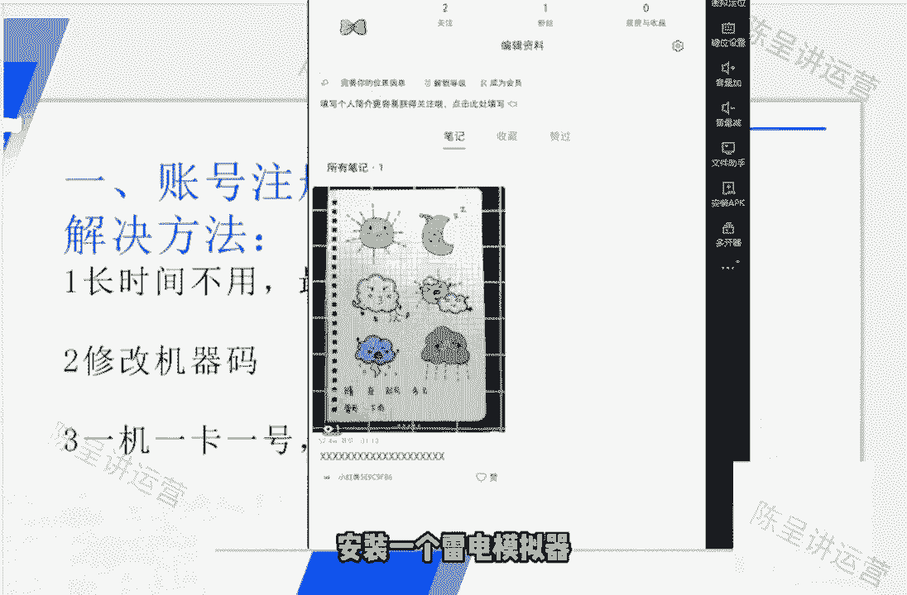

或者是夜神模拟器，像我安装的就是这个夜神的模拟器，看过我公开课的这个朋友呢，也应该知道这些模拟器到底是怎么去下载的啊，就是你可以去在百度上下载一个，比如说我这边今天讲课给大家用的，这个是夜神的模拟器啊。

再点击这个齿轮之后呢，点击这个齿轮之后呢，是设置，然后这里面有一个性能设置对吧，你可以调一下它的性能，然后分辨率呢调成调成这个手机版的对吧，然后我这边呢是调成一个分辨率是比较大的呃。

然后呢在这个里面呢手机型号啊，包括这个串码，他都是可以去随机生成的啊，包括这个号码都可以去随机创建的，大家都可以看一下，对吧，预设型号对吧，这里面有很多的手机型号。

我们通过这种方法去注册这个一个新号的话呢，是啊是比较好的，是注册这个小红书账号的话呢是比较好的，这样子的话呢就可以去避免掉，我们手机设备不多的一个问题，你看它这边可以设计设置这个手机的型号。

IMEI这个呃这个码对吧，然后手机号码包括网络定位啊等等。

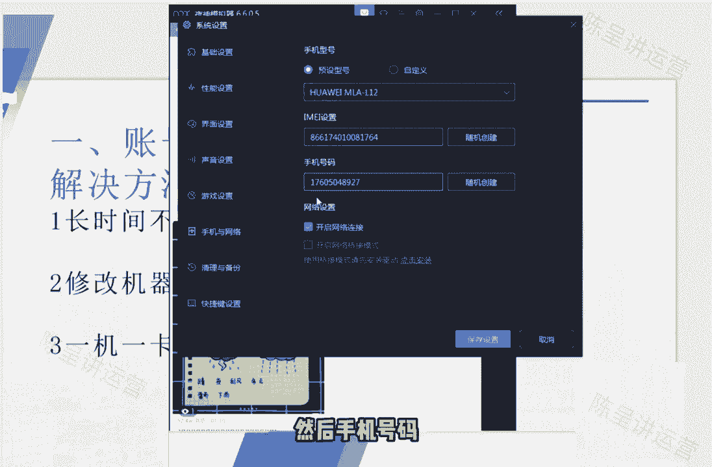

都是可以去调整的，就比如说我们这个账号定位在上海对吧，定位在上海，大家可以看一下定位在上海，然后我的这个额这个账号呢，他就是一直是在这个，啊上海看到了吗，这个地方有个上海好，大家如果啊如果方便的话呢。

可以用这个方法去注册一个新的账号，注册好了之后呢，我们就可以把这个账号退出来了，退出来之后呢，我们如果正常要使用这个账号的话，我建议大家的话呢还是要去使用一机一卡一号。

最好有条件的话当然是使用一机一卡一号了，就是一个一个手机只登录一个小红书账号，上面这个手呃，这个账号呢只连接这个手机流量啊，否则的话呢是大概率会被判定为营销号的，这些点呢大家都要去注意一下。

啊然后还有一点呢呃说到第二点，这个坑呢就是啊以前呢我们我们呢也遇到过，就是最好大家不要去公布自己的账号去给别人，比如说你去加到了一些这个互粉，互赞的一些QQ群啊，或者是微信群。

或者说有一些发布这样需求的一些网站，一些贴吧里面对吧，你去发布这样的信息，这个其实额有一点不太好，是什么呢，就是说你刚开始这个账号做做的不行的时候，那可能别人不会去眼馋你，或者说不别人不会去啊。

背地里给你去放冷枪对吧，那当你这个账号慢慢做好的时候呢，别人就会恶意的去给你刷这个数据，比如说我知道你的这个小红书账号了，就对吧，我就给你一篇笔记，我花个，比如说十块钱，50块钱给你多刷一点这个啊点赞。

但是呢收藏和那个评论什么都不刷，我就光给你刷刷点赞，那这个时候呢我们的账号就会遇到一个问题，就会被限流嘛，官方官方就认为这个账号作弊了对吧，但是官方但是你这个时候去申诉的话，跟官方说，你说这不是我刷的。

这是别人恶意去这个去刷了，这个东西好像好像也说不清对吧，一次两次的还可以，但是如果时间多了的话呢，官方也是不太会承认这个东西的，所以说大家最好不要在一开始的时候呢。

就把我们小红书的账号呢去给别人去看对吧，因为这样子的话会防止别人给你去刷这个数据，恶意的去刷这个数据，时间长了的话呢，呃有些东西是说不清楚的啊，第三点呢就是随意的去删改你的笔记，大家这边要记住啊。

没有违规的，没有违规的，这个前提下就不要去删除你的秘籍，否则的话呢，啊我们的这个笔记账号是会是会掉权重的，因为嗯因为这个系统就觉得很奇怪对吧，你好不容易发篇了，发了一篇笔记，内容呢可能有一些偏差。

或者可能有一些写的不太好，但是好歹还是和这个领域，和这个关键词有关系了对吧，你不停的去删改他，那呃这个平台呢，小红书平台就觉得你可能是个营销号对吧，这个账号发完了这个领域又删掉了，又发另一个领域去了。

所以说啊它会导致你的这个比例去限流，还有我建议大家不要去修改我们的笔记，为什么呢，因为你去修改你的笔记的话，你发现你这边笔记发下去的这个流量啊，包括各种参数不太理想，但是这个时候你去修改你的笔记的话呢。

也有一个问题，难道你修改的就一定是对的吗，或者说你修改了这篇笔记之后，你就一定会比你第一次发的这个笔记效果好吗，我看都是不太见得的对吧，所以说大家在遇到这个笔记，数据不太理想的时候呢。

不要去随意的去删改笔记啊，哪怕你觉得可能我现在发的笔记，和我之前之前的这个笔记风格不太一样，或者说讲的内容都不太一样啊，这些也都没有关系，这些也都没有关系，总之呢不要去随意的去删改我们的笔记。

呃第四点呢，就是很多人也会去做的一个错误的一个事情啊，就是啊就是频繁的去发这些种种草的这些笔记，我们可以看一下，一般的像这种比较好的这种小红书的账号呢，他们如果是真的是啊，真的是这个营销号的话。

你反而做的有些事情就不能像营销号对吧，你可以多分享一些这个心得呀，一些干货呀，就比如说使用各种化妆品的一个心得，一个内幕，一种趋势啊，包括你使用的一种干货，你你可能觉得这些素材去哪里找呢，很多呀。

网上百度上或者说别的化妆品的，那个别的化妆品的一些论坛或者贴吧，都能找到相关的一些文章或者说心得，或者说干货，这里面都很多的对吧啊，我们就可以去把这些东西呢去稍微修改一下，变成我们自己的。

而不要去老是发一些这个啊，老是发一些种草笔记，因为本身发这个种草笔记的话呢，就涉嫌有这种营销的这种行为对吧，我们可以给大家看一下，好像像这个你可以发一些周边的，比如说比如说我定位在上海。

就可以发一些和上海，上海这个地方有关系的一些东西对吧，吃喝吃喝玩乐对吧，都可以，我们来看一下别人是别人是怎么发的啊，很少对吧，粉丝他的像这个人，他的他的这个小红书笔记就比较不错啊对吧。

获赞与收藏达到了4。9万，但是我们可以看一下，他仅仅就发了四篇四个笔记，四个笔记的话啊，这两篇都是比较高的额一个是分享的什么壁纸，羽毛的壁纸没有任何的营销行为，就是分享一些心得和干货，大家可以看到对吧。

就是分享的这个壁纸啊，然后对吧，他分享的你看这种照片，加上这种啊滤镜的这种照片对吧，也是没有，也是没有什么东西的，对不对。

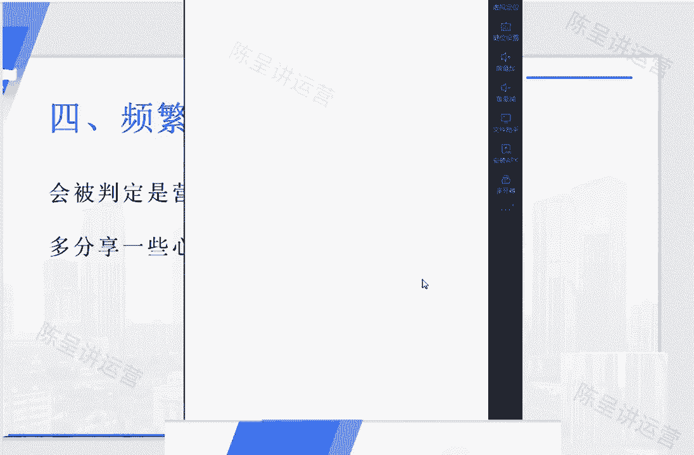

这个是种草的一个推荐，大家可以看一下，偶尔去发一个种草的推荐，而且写的是非常认真的，好我这个软件有点卡。

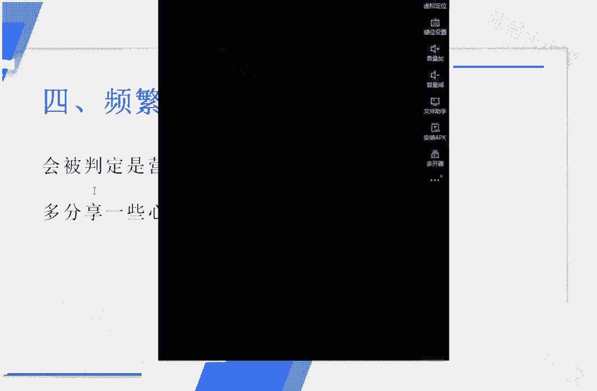

好总之呢和大家看了那个刚才的那个账号，大家也应该知道了，就是我们在小红书上面去引流是可以的，但是呢不要去多发啊，种草笔记一定要去适当的去加一些这个音啊，你的心得，你的干货对吧。

基本上我觉得比较好的一个合适的一个比例呢，是是一比三，什么意思呢，就是说我们每发一篇这个种草笔记的话，大约你就要发三篇相关的心得呀，或者干货啊，或者是生活类的这种文章，这个大家一定要注意一下。

那么第五点呢，是很多人会去盲目的去分发分发的这些内容，因为小红书的这个平台，大家有的人可能是第一次接触这个平台，但是我还要说的比较详细一点，就是小红书的平台呢，绝大多数的这个用户呢是比较年轻的女性群体。

他们大多数呢是集中在一二线一二线城市，所以说呃有一些博眼球，或者说在别的平台上呃，觉得很火的一些东西，就不要往这个小红书上面去搬了，小红书上面比较欢迎的内容，大家也看到了，是心得干货对吧。

种草的分享等等，这种文章，包括同城的吃喝玩乐，这种文章是小红书是非常欢迎的，那比如说我们在搬运一些这个快手啊，或者说一些恶搞的这种这种元素，这种文章，这种视频上去的话，小红书呢是啊。

小红书是不会不会很欢迎的，这这里面会导致我们账号异常的，所以说大家这边要注意一下，就是内容优先，我们的内容到底是贴合哪些东西的，我们的内容主要是来讲一些种草干货心得，包括分享这种经验的。

以这种内容为优先，不要去随便转载其他平台，不相干的那种风格的那种文章，呃说到第六点呢，就是不要去使，随便使用别人的这个相关的一些素材，额，如果我们这个如果我们使用了这个素材里面呢，就像我之前和大家说的。

可以去在这个淘宝或者天猫的买家秀里面，找一些图片过来用，那个是没有什么关系的，但是呢不要去用一些有版权的一些素材，这里面大家一定要注意一下，因为最近最近各个方面对于这个版权呢，抓的还是比较紧的。

所以的话呢所以说的话呢就包括一些额品牌啊，他们请的这些模特啊，啊我们要用他们的这些照片的时候呢，也要注意一下，如果大家想要用到这些模特或者是素材的，这种照片，可以去哪里找呢。

可以去找一些这个国外的一些人物，或者说去百度上搜一些无版权，可商用的这种素材的网站也是很多的，这里面呢也就不和大家去演示了，这里面啊关于这个版权的问题，大家注意一下，还有一个呢。

就是呃很多人不知道小红书里面的一些规则，其实规则的话，在第一课我说的也是比较详细了对吧，哪些东西该发，哪些东西不该发发的这个笔记里面呢，很多人有的人就是比较想引流，引流的时候。

引流的这个心情比较急切对吧，想快速的去加人，当然我知道这种心情呢是可以理解的，但是我们啊必须要做好这个度的一个把控，就比如说我们素材里面呃，我们的这个笔记里面不要去加上兼职抽奖，这些啊这些关键词对吧。

转发诱导，因为我说了小红书是严禁诱导用户的，如果发现的话，那是呃处罚是很严重的，就会导致我们账号被封号对吧，包括这个素材的啊，太暴露啊，对不对啊，特别是有的人卖一些这个女性的内衣。

或者说做一些丰胸的产品，那这样的这个素材呢就不要的，不要去太暴露一些，一定要注意一下，还有呢就是呃，诱导别人去给你这篇笔记去点赞啊，包括你叫别人剁手买买买啊，连这个也是不允许的，大家要注意一下。

因为你如果提到这个买买买的话，那就是涉及到涉嫌去诱导别人去购买这个东西，也是不行的，所以说大家在这个写笔记的时候呢，一定要注意到这些东西呢是不可以去触碰的，如果你对你的笔记里面的一些违规词。

或者说一些营销词不太确定的话呢，可以去看，回头看一下第一课，第一课里面我给到了那两个检测的网址，也是非常重要的，大家可以用那个检测网址呢去检测一下，到底你的文章里面，有没有相关的违规的一些词语好。

下面我们说的最后一点呢，就是大家注意的呢是重发笔记，有的人觉得我的这个笔记写得很好啊，不管是选题也好，关键词选取也好，标题也好，正文也好，或者说关键词出现的这个频率也好等等等等，我都做的非常到位了。

但是发了之后还不是很火，那我是不是有这个必要去重发这个笔记呢，实际上我实际上我在这边建议大家呢是啊，最好不要去重翻重发笔记，因为你去重发笔记的话呢，会有一个问题啊，会被判定为是是会被判定为抄袭的。

因为小红书他的他的这个逻辑很奇怪，如果你的这篇这篇笔记，这个文章发出去了之后呢，他是有概率是被小红书收录的，这个大家也应该知道对吧，如果说你的文章被收录了之后呢，你再去重新去发，把这篇文章删掉了。

然后再重新发的，这又发了一遍这个文章，他就很可能判定你是抄袭了，之前你发的这个文章啊，所以说小红书这个逻辑呢还是很奇怪的，跟其他的这个平台不太一样，所以说为了避免这样的事情发生的话呢，嗯哪怕不火的话。

也不要着急，因为我们我说了，我们这个小红书的账号呢，他不可能说靠其中一篇一篇笔记，或者说一两天的一个积累，就能达到一个比较不错的一个呃，这个获赞啊，或者说收藏的一个效果，这些东西呢都是需要慢慢去积累的。

不可能说我们单单靠几篇文章，或者说几天几天的时间，就能达到那么样一个程度对吧，呃把这个小红书账号养成呢，他是一个日积月累的一个过程，所以说大家在做这个小红书笔记的时候呢，也不要太去着急好了。

那本次的这个分享呢一共是啊，一共是八个啊，八个做小红书，做小红书这个账号八个坑呢。