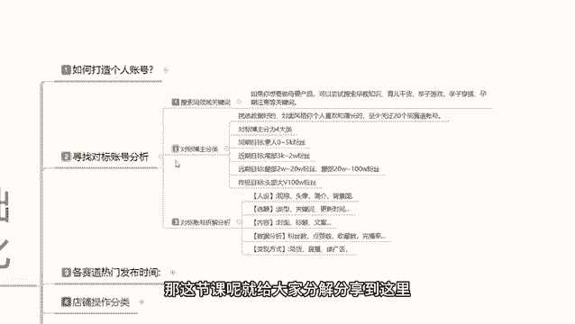
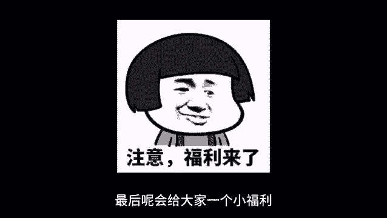

# 【2024版小红书体运营教程】全B站最良心的小红书开店运营高阶教程合集，小红书体开店 起号真的快 - P3：02、小红书开店-寻找对标账号分析 - 煤球很皮实 - BV1Q444eWEP5

大家好，今天给大家分享的是小红书，基础开店一体化的第二课时啊，寻找对标的一个账号分析，这节课呢给大家分享的是对标账号分析，这个对标账号分析呢，它涉及到我们小红书开店前中期，包括我们后期的一个人群定位。

因为你只有把自己的账号啊，归纳到你所属商品的一个渠道里面啊，小红书他才会给你推进推广对应的一个人群，你的转化率和访和那个展示率才高，展示率的话是看账号啊，转化率的话就靠你的一个对标分析。

自己能不能把它做好，我们先首先来了解一下，寻找对标账号的一个分析额，第一个呢就是说搜索同领域的关键词，第二个是对标模组的一个分类，第三个呢就是对标账号的一个拆解分析，首先了解一下搜索同等玉的一个关键词。

是什么意思呢，就是说，我们如果说你想要做母婴类的一个产品啊，只是说拿母婴打一个比方，你做服装也可以对吧，你做视频也可以，你车做车载也可以，都是可以的啊，我们就可以去尝试搜索呃，就是说拿母婴做的话。

就是说你尝试搜索早教知识，育儿干货，亲子游戏，亲子穿搭，孕期等关键词就说找你产品对应的啊，一定要找产品对应的，你比方说你做女装，你就要找穿搭啊，找找你对应的女装T恤啊，美妆博主这种都是可以去找的。

你只要找到你对应的一个领域了以后啊，小红书它整个系统，它就会把你的账号判定为喜爱的一个类型，他会把你放到同类型的一个喜爱里面去，我们在这个喜爱里面的话，你自己后续去发放笔记也好，发放商品也好。

包括你的关键词权重也好，你在这一个系统里面，就是小红书系统里面喜爱这一块板块里面，你去发放以后，他就会给你分享给对应板块的人，懂我意思吧，小红书，他这个人群呢千人千面这一个人群可能的话呃。

听过的朋友可能是听过，但是基本上现在所有做网络营销的，基本上都会了解千人千面这个词呃，淘宝拼多多，你只要说是做京东，只要说是你做商品卖货的，你基本上都了解这个词，千人千面在小红书上面它显示的特别明显。

它比其他三个平台啊，卖货的平台显示的还要明显，为什么，因为他是把你按照人群划分的，知道吧，他是按照你的兴趣去你所选的兴趣，你所搜索的内容来进行的人群划分，你只有搜索过这类的产品，你发放的东西推广出去。

才能给对应搜索的人群看，你不能说是我开幕一店对吧，我搜索服装啊，我比较喜欢把自己打扮的漂亮一点去看看，但是你自己买母婴类产品的，那完了你的账号后续所发的所有产品出去，就是发放的笔记也好，商品也好。

他推给的全是母婴类的一个用户，就是说我们在自己在小红书上面，你寻找对标账号的话，一定要做自己同领域的去观看他们的一个笔记，商品账号权重，然后去他们的评论区进行评论，这一步操作下来啊。

第一是给用户给其他用户留下第一印象，评论的话是留下第一印象，观看是给Z给系统留下第一印象，当你把这些印象全部留住以后，后续你发放的笔记也好，你上传的商品也好，他就会给你推广给对应的一个人群。

那对应人群去搜索同类型的一个产品的时候，就有可能发现你的一个商品啊，这个就是寻找对标账号的一个第一步啊，搜索同领域关键词一定要弄清楚了，千万不要去搜其他的，如果说你搜了其他的以后的话。

他那个词汇非常不好改变，知道吧，尤其是新号，你刚创建的时候，你只要搜了其他词汇，或者说是看不属于你对标账号的一个笔记内容，系统会给你推很多这种，你最少要花两到三天才能把它抹消掉。

所以说一个一个其他领域的都不要看，你进小红书的目的就是卖货，卖货的目的，那你就需要去寻找同领域的关键词，同领域的笔记，同领域的产品去反复的观看，这个时间段的话，最少要持续3~5天，小红书就会把你的标签。

指定到同领域的一个范围之内，你后续所发放的一个笔记也好，推广内容也好，商品也好，他就都在同一领域了，这个大家一定要把它牢记住啊，第二个就是对标博主类的一个分类，这个分类的话其实还是比较简单的啊。

首先呢是挑选数据好的啊，封面风格你个人看的喜欢和擅长的就可以，然后呢你去关注他，最少的话就是说关注20个同赛道的一个目标，然后呢对标博主分为四个大类，第一个呢就是同期目标，我们新人刚建号的时候。

就是树能领到5000粉丝就可以了，你不要去找那种3000到2万，2万到20万啊，大V1000000以上的这种粉丝，你不要去找啊，你的目标就是50~5000粉丝，因为我们是新号，刚撞创建的时候。

除非说是你的号已经运营了一段时间，但是你的目标群体变化啊，有变化了以后，你还没把他调整过来，那你就可以找下面三个对号入座，你的粉丝如果说超过300，那你可以找3000到2万，如果说你的粉丝超过3000。

你就可以找2万到20万，如果说你的粉丝过万，那你直接去看终极目标就行，懂意思吧，因为你的标签属性是会变的，所以说我们在找的时候，对标博主的一个分类，你一定要找同类的一个属性去做，而不是说找呃其他的那种。

你比方说我新创的一个创建了一个账号，我找3000到2万粉丝的行不行不行，为什么，因为你的账号全都不够，你去看了以后的话，你的对标数据就拉不起来，你直接去找0~5000粉丝的，这一部分人就可以了。

因为他们的是他们所面对的用户群体，和你所选择的用户群体是一样的，除非说是你一上来，你就想在小红书上面进行大投入，然后的话然后的话我想把店铺做大，然后商品卖起来，那你可以从第二个目标开始。

第三个目标和第四个目标千万不要选啊，第三个目标和第四个目标的话，那个远期和终极目标的话，说实话它是属于店铺里中后期碰到瓶颈以后，再自己再想办法调节店铺人群的时候，再去操作你其他两个目标。

如果说你选了以后的话，他你后续操作不起来，知道吧，因为他对你没有任何作用，你只有在第一个和第二个里面去选才有作用，如果说你前期你想慢慢做，那你就选0~5000，如果说你想步子跨大一点啊。

直接从第一第二跃到第三第四，那你就选第二个，3000到2000粉丝的一个目标群体，对应的一个博主，或者说对应的一个店铺去了解啊，同类赛道的，不管是博主也好，产品也好，关键词也好，笔记也好，都可以的。

知道吧，这个是不分类的，你只要把自己放到这个分类里面，大分类里面啊，就可以，之后呢我们要做的是什么呢，对标账号拆解分析，什么叫对标账号拆解分析呢，拆解我们选择的博主分类，或者我们同行的一个产品。

分析他的一个人设选题内容数据分析，还有他变现的一个方式，有些人的话他在这个小红书上面的话，他变现的话，他不一定是直接卖货，他有可能是带货直播接广告，你要个首先我们在享受书上面，你自己要做店的话。

你要先了解清楚他是带货的，直播的，接广告的还是做什么的，了解清楚了以后的话，然后去分析他的人设，成立头像简介背景图，第二个就是选题类型，关键词，还有他每天的一个笔记更新时间，第三个呢就是封面标题和文案。

他走的是什么路线，因为每个产品的话，他说实话嗯，你看着大大致的内线路线是一样的，但是他有很多细分的细分路线，分出来以后的话，它所对应的一个展示曝光量它是不一样的，然后根据你自己的一个产品，你自己在设定。

就是我之前上一节课给大家打呃，讲的如何打到个人账号里面，你自己要给自己设定一个目标去操作才可以，然后数据分析里面你要观察他的粉丝数，点赞数，收藏数和完播率，完播率你们如果说不会查的话，前期可以不用管。

因为完播率的话，只在乎在意自己账号的一个完播率，其他的完播率的话，他是后台小红书系统，后台自己操作的，我们可以不用去管它，你主要注意的是粉丝数，点赞数和收藏数对应目标的一个账号权重，在什么范围之内。

如果说你是新号，你就是领到5000，如果说你号有一定的权重，你就是3000到2万，再往上走的一个远期目标和终极目标，就和你没关系了，好吧，这个呢就是寻找对标账号的一个分析。

我们先把个人账号打打造清楚以后，然后分析对标账号，然后把账号自己的一个账号权重做起来以后，你才能往后面去了解，因为你这两步做不做不到位啊，你后续操作的话基本上都是白费，就是浪费时间好吧。

那这今天呢就给大家分享到这，下一节课呢给大家分享一下，那个各赛道的一个热门发货时间，让大家了解一下你自己的一个产品，所对应的一个，笔记也好，商品也好，发布的一个时间效应。

那这节课呢就给大家分解分享到这里。

最后呢会给大家一个小福利。

整理了小红书运营实操资料，可以评论区私信的方式领取，通过之后会第一时间发给大家，注意领取资料，不收费不收费不收费。

