# 【2024版小红书体运营教程】全B站最良心的小红书开店运营高阶教程合集，小红书体开店 起号真的快 - P3：1.新手为什么在薯店能赚钱 - 轻轻换一声卿卿 - BV15M48ePEA5

本堂课的内容主要是围绕着。

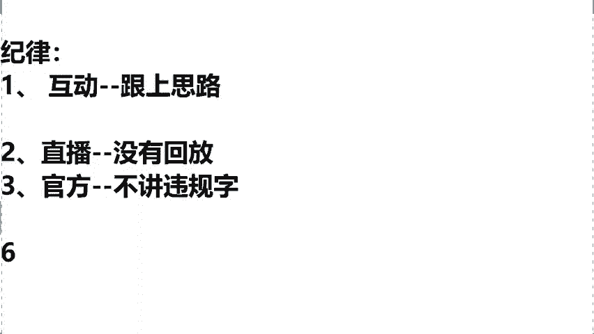

我们说零货源的新手小白，如何去打造一家。

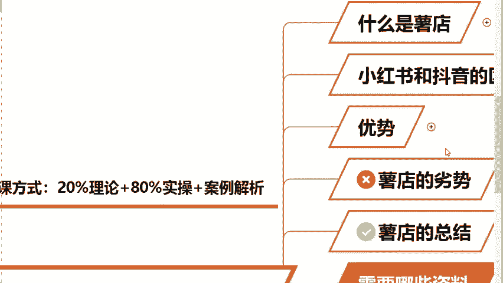

我们年收益不低于30万的小红书店铺，那么在这个这课程正式开始之前。

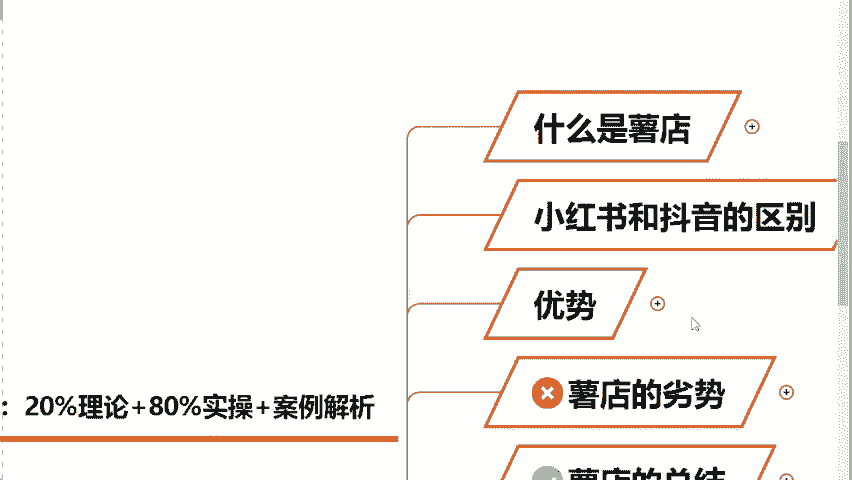

我先来了解一下同学们的一个基础情况对吧，我了解一下啊，如果说大家之前有去了解过我们，什么叫做数电同学，你在直播间给大一老师我打上一个一字，如果你说老师啊，我今天我啥也不了解啊，我是第一次听说的。

那么你在直播间给我打上一个零字，我来去看一下，同学们今天大概是一个什么样的情况呢，嗯包括我们这个A2同学呀，X同学呀，是不是包括我们这个什么GEO同学啊，啊都在说是零基础是吧，还有一部分说是听过的呃。

那么我了解了同学们没有关系，不管说你是清楚还是不清楚的，老师，我今天会从零去教给大家，如何去开一家属于你的小红书店铺，那么你包括在今天的听课过程当中，可能同学们会有一些问题啊，没有关系。

这堂课的疑问的话，大一老师我都会去全部的去讲到的，那么首先我们要强调一下，第一个什么叫做小红书店铺呢。

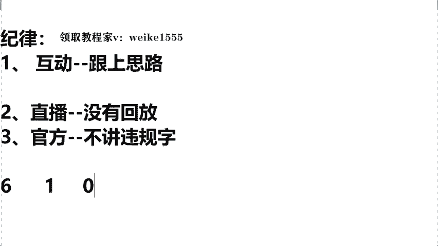

到底什么是鼠店呀，即使书店特别好理解。

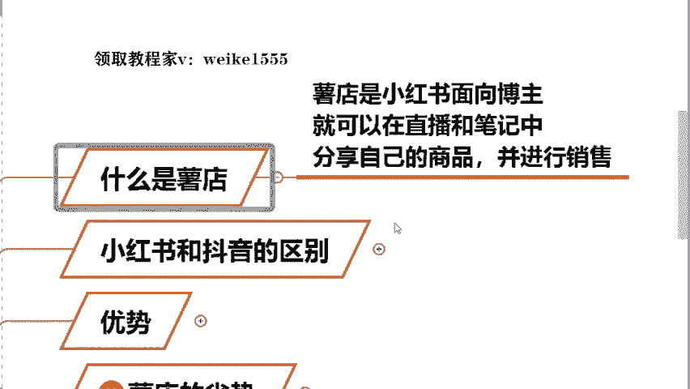

就是今天同学们，我们在小红书上，你去开一家属于你自己的店铺，这个就叫做薯店了，那么在这个小红书平台，我们到底应该怎么去做呢。

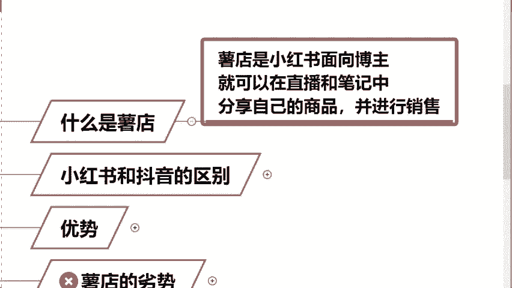

我们才能够去赚到钱呢，哎针对这个问题，大一老师我给大家去整理了七个知识点。

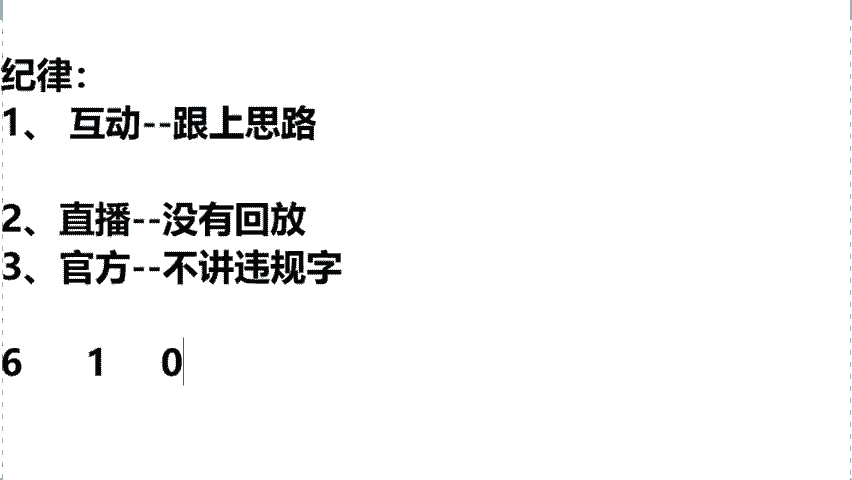

本堂课的话，我会围绕这七个点来进行逐一的讲解，包括来讲在上课前同学们去问到的，哎老师啊，我今天作为小白同学，我该来怎么去开店呢，对吧，我开店需要哪些资料啊，作为小白老师，我今天我没有产品。

没有货源怎么办呢，开始的话小白同学需要多少这个启动资金呀，回款的问题，流量的问题啊，选什么品可以直接去报单呢，那么以上这些干货内容啊，本堂课的话全部都会去讲到的，那么首先我们先按照顺序啊。

一个个来进行讲解，就是第一个问题，同学们经常去问的老师啊。

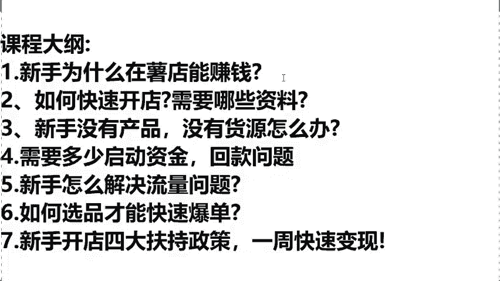

我今天作为一个新手啊，作为一个小白，我在小红书平台去做，我今天为啥能够去赚到钱，老师我今天我什么都不懂，我什么都不会的，我在小红书平台能够达到一个月入过万吗，那来同学们给你去看一下。

你像我的一个学生叫李娜啊，李娜同学的话。

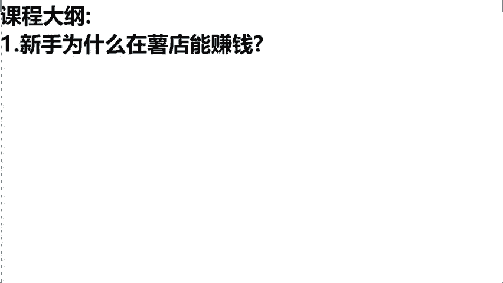

可能跟教室里边，大多数同学们情况是差不太多的，嗯甚至是情况比咱们还要差一些。

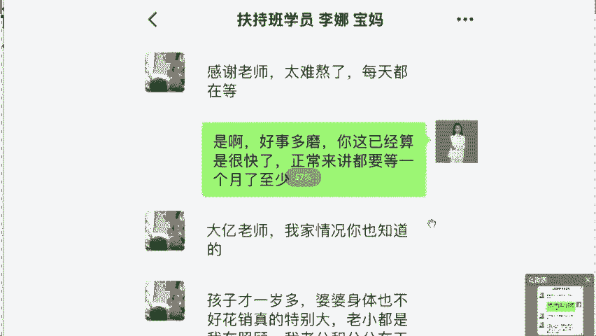

因为这个李娜的话他就是一个初中的文凭啊，之前跟我讲过，说老师我相当于是这个初中都没有去毕业，老家是云南那边的啊，就是山区那块的不太重视学习，刚刚在20出头的时候，已经是两个孩子的妈妈了。

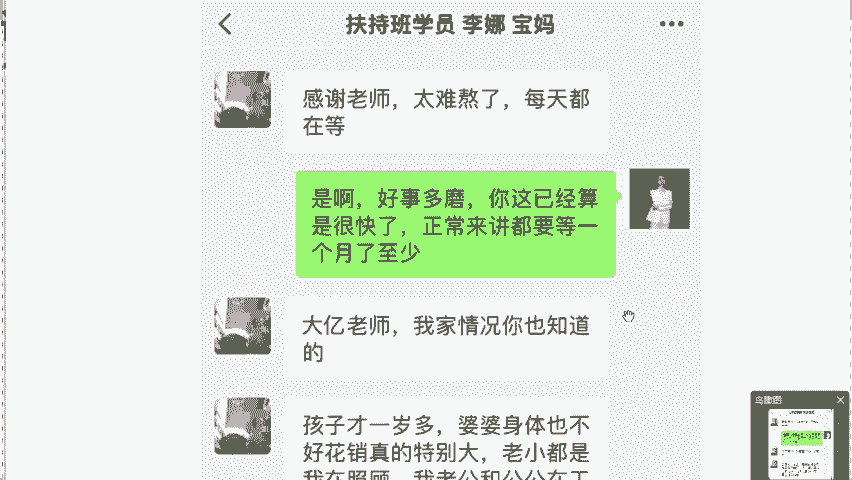

所以说他在前几个月来跟我去学习，小红书店铺的话呃，我的学生。

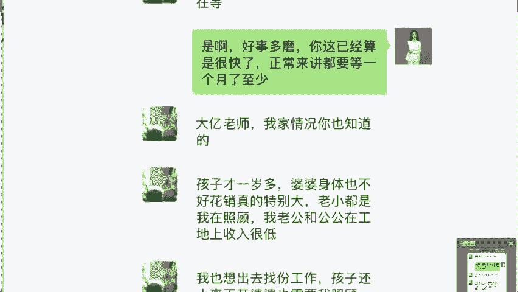

每个人需要你把这个个人情况去发给我，然后我去给你做一个个人的专属计划，所以当时我问了一下他的情况啊，李娜怎么说的啊，老师我说实话，我是一个四无人员，今天我一没有货源啊，二没有资金，三没有基础。

四没有学历，真的是要什么没什么，但是老师风口摆在这，我确实想做，想抓住我小时候封口的，希望大A老师你来帮我一下，所以说当时这个整个店铺啊，算是我去帮他去代运营的，我去辅导他来开的这个店铺。

那么各位可以看到，这个店铺在开起来的第一个月啊。

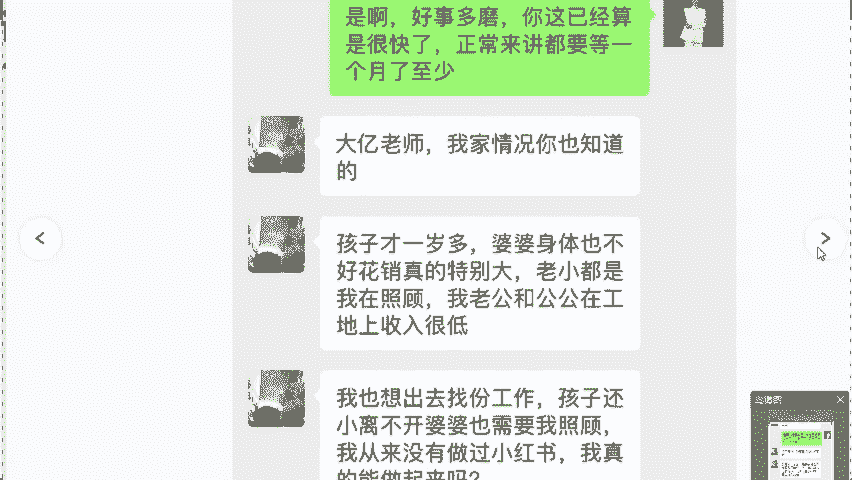

同学们所有的店铺数据几乎都是零，因为当时的话这个店铺还没有开始运营，所以说一单都没有出，那么在这个第二个月啊，我帮他去做的时候，你看在第二个月正式开始上架了，店铺已经开始出单了，第二个月直接是做了一个。

1万8684的一个销售额，那么我强调一下啊，这堂课当中我们所强调的所有的销售额，它不是咱们的一个利润，我们在做小红书的时候，利润大概可以做到40%，到60%左右，所以说大一老师的话呢，我在这儿啊。

咱们今天拿出计算器给咱们呢去算一笔账，我们看他这个销售额是1万8000，684块钱对吧，那么我们乘以一下你最低的啊，按照40%利润去计算的话啊，他的店铺在第一个月就可以达到纯利润。

大概是赚到一个7473块钱了，而且同学们我们在做店铺的时候，你记住了，咱们是这个越往后做，你的店铺的数据一定是稳定持续在增长的，像你滚雪球是一样的，能够去理解吗。

所以说你可以看到他这个店铺在第三个月的话，直接通过三个单品直接去报单了，销售额翻了个几十倍，做了一个18万的销售额，那么你在这儿同学们，我们再用这个18万啊，我们算一个整数啊。

用18万一个整数去乘以一下最低的，按照40%利润去计算的话，什么概念，也就是说在这个我们说前几个月，李娜这同学一个月就做了一个7万2的纯利润，所以同学们我想问一问大家啊，就今天你作为一个新手小白。

我今天如果说能带着你跟他一样做到，我们今天第一个月纯利润7000多，第第二个月直接翻倍干到7万来，各位这样的一个变现速度，那么你们觉得满意吗，如果说你们是觉得满意的话啊，你在直播间给大野老师。

我打上满意两个字，那么包括今天课堂上面，如果你满意的话，所有的选品问题，上架问题我都会讲到啊，这个点不要着急，咱们今天一步步去来，那么今天公屏上啊，所有说敲了满意的，李娜同学的店铺怎么去运营的。

后面的所有实操干实实实操干货。

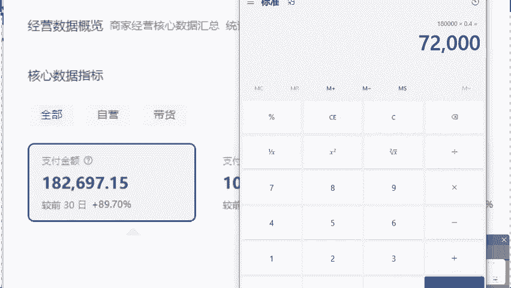