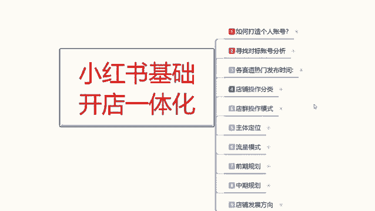
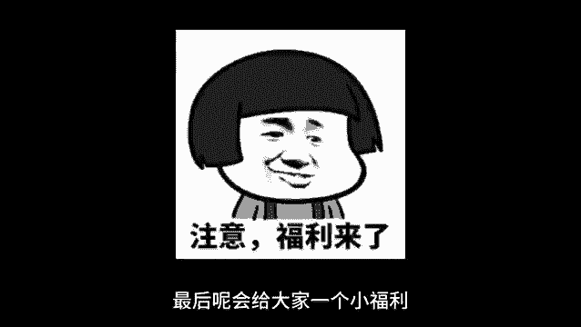
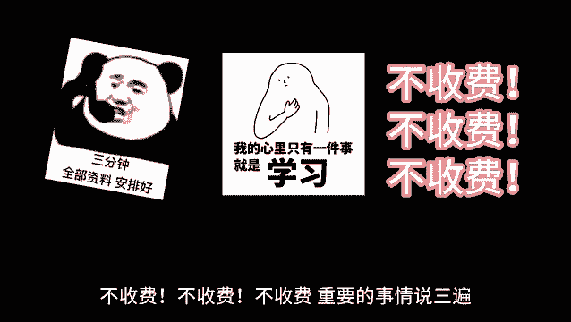

# 【2024版小红书体运营教程】全B站最良心的小红书开店运营高阶教程合集，小红书体开店 起号真的快 - P4：03、小红书开店-各赛道热门发布时间 - 煤球很皮实 - BV1Q444eWEP5

大家好，这一节呢给大家分享一下小红书技术，开店的一体化操作，这节课呢是第三课时，给大家分享一下各赛道的一个热门发布时间，让大家了解一下你自己对应产品额，选择什么样的一个时间段去发放，它是最好的一个。

可以获得最好的一个曝光的一个数据量，这里面的话两个发布时间其实是一样的，只是说介绍不同，就是说你们知道那个不同的发布时间发布作品，他会有一个不同的效果啊，今天的话就是跟你们分享一下。

怎么能根据我们的一个不同时间段，发布合适的一个内容，就是说你只我们只要记住这五个大的，一个原则的话，其实都是差不多的，第一个呢就是七点到九点啊，早上这个时间段，七点到九点。

这个时间段的话基本上都是怎么说呢，刚起床吃早饭上班，所以的话他比较适合发一些碎片化的内容，比如每日分享咨询等，让大家在忙碌之余也能学习到一些有用的东西，其他的话你其实没必要发了啊，七点到九点。

这这个的话你逛小红书基本上人不多，在这个里面你去发的话，你就只能发发日常，你自己如果说想做博主之类的，可以在这个时间去发，你正常做商品的话，在这个时间段的话，你不用去发了，没有什么用。

除非说你是卖食品之类的，卖早餐之类的，可以往这个时间段去考虑一下，第二个就是九点到12点，这是一个大点的一个时间啊，这个时间的话基本上都是都在工作，然后呢工作的时候有些摸鱼的啊，或者说闲的无聊的啊。

他会去玩一会玩一会小红书输了书，说的话他适合发布一些教育类的一个内容，比如美妆教程，工作技巧，然后11点以后的话，就可以发布一些关于美食类的一些服装推荐，为什么说11点以后的话可以发布美食呢，要吃饭好。

大家把这个点点了解清楚，12点倒数两点，他是休息时间，这个时间段的话说适合发布一些轻松的，搞笑的，娱乐的，或者说可爱类型的都可以去发啊，影视类的电影类的，但是这种类型的话，你也只能适合博主去做。

你正常卖货的话，你在这个时间段去发的话，效果不会太好，然后呢是三点到六点这个时间段，这个时间段的话基本上都在工作，也是和九点到12点是一样的啊，他们两个的时间点一个是上午，一个是下午。

只是说下午的一个数据量更好，然后是七点到12点之前，这个时间段啊，大部部分的话就是说属于自己的一个独立时光，这个时间段可以发送任何内容，因为这个时间段的话，就是说我们的一个活跃度的话，小红书。

于是尤其是小红书啊，夜生活开始了这个时间段，人们的活跃度远远高于前几个时间段，你了解这五个时间段分布以后啊，再对应自己产品去做一个大概的规划就可以，第二个发布时间呢是明确的。

各个赛道每个类型产品所对应的一个时间，美妆类的美食类家居穿搭健身学习护肤，萌宠探店，职场摄影娱乐情感养生旅游这几个点，他每个点的话就是说他都有自己独属的时间段，你把这些时间段了解以后的话，对号入座。

你自己是做什么商品的啊，去寻找对应的一个发布时间，去发放你自己的一个商品笔记就可以，你比方说美妆类的，你就比方比较适合在11点到一点，然后就晚上的七点到十点之间，因为这个时候的话，中午是女性出门时间啊。

这个你们要弄清楚，如果说不是上班族的女性，他基本上出门时间的话，基本上就是在11点到一点，要不就是晚上，而且绝大多数都是晚上七点到八点这个时间段，八点以后到十点以后的话，基本上都是已经化妆完了出去玩的。

你包括美食类的也是差不多的家居穿搭啊，这个我就一一不给你们讲解了，你们自己了解一下你自己做什么产品，做什么类目，我这个给大家划分的一个美妆也好，美食也好，他的一个商品也是这么发的，你要做引流也是这么发。

你要做网红做博主，他也是这么发，知道吧，就是把这个时间段把握好，提前5分钟发放你的商品笔记，发放你的产品内容啊，你会获得30%左右的一个曝光加成，因为他这个时候人群流量是最高的。

这个呢就是今天给大家分享的一个，各赛道的一个热门发布时间，大家了解一下就可以好吧，那这节分享呢就给大家分享到这，下一节课咱开始垫步操作。

最后呢会给大家一个小福利。

整理了小红书运营实操资料，可以评论区私信的方式领取，通过之后会第一时间发给大家，注意领取资料，不收费不收费不收费。

