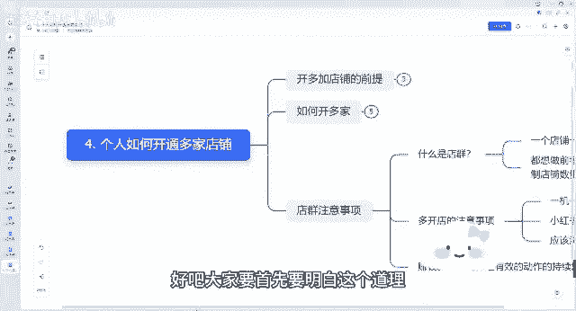

# 【2024版小红书体运营教程】全B站最良心的小红书开店运营高阶教程合集，小红书体开店 起号真的快 - P5：04.个人如何开通多家店铺 - 熊孩子在b站 - BV1U3vpe4EaW

大家好，今天我们来讲一讲我们的第四堂课，个人如何我们开通多家店铺，我们后期如果说一家店铺做好了，我们想开多家店铺，我们怎么去选择。

我们怎么去做矩阵的问题啊，呃我们会从几个方面跟大家来讲，首先第一个开多家店铺的前提，如何去开家多多家店铺啊，我们店群一些注意事项。

我们先来看一下开多家店铺的前提啊，所有的我们开通多家店铺的前提。

一定是，你已经能把你手里面的一家店铺给他运营好了，我们再去做，你连你自己手里面的第一家店铺还没有做好，你就想去大量的去铺，大量的去做，那是不现实的，你最终可能导致所有店铺都做不好是吧。

呃这个是第一个前提，我希望大家听完我的课程之后，能把你的第一家店铺做完之后出单了，能有稳定持续的出单了，我们再去大量的去铺垫好吧，这是第一个条件，第二个条件，你能有大量的闲余的时间。

空余的时间你去做对吧，我可能花一个店铺可能需要呃一个小时，两个小时，但是你可能花两个店铺可能就需要三个小时，四哦，五个小时六个小时了，就可能不是1+1=2的问题了，因为两个店铺你可能会发生的事情。

可能越来越更多好吧，否则你要先全力做好一家店铺，先把一家店铺做好，先把它的整体的熟悉，它的流程，整体的方法都给他熟悉了对吧，我们再去做其他的店铺，我们再把其他店铺给他做好，我们再去铺铺大量的店好吧。

这是开多家店铺的前提，我们要有一个稳定的出单，我们先稳定的能赚到钱啊，我们开店流程，我们运营流程，我们笔记啊，我们和混剪，所有这些我都能学会了，或者怎么去铺货，这些我都能明白了。

我再去开多家店铺好吧，那我们如何去开多家店铺呢。

首先流程流程方面，首先第一个小红书账号加实名账，账号的注册加实名对吧。

我们用营业执照，这是第一个，我们可以用自己的家人重新注册账号。

重新加实名，重新呃，用身份证注册小店店铺都可以对吧，这是第一个方法，第二个方法呢，我们用营业执照可以注册成企业号，企业号也可以多开小店好吧，需要600块钱的保证金对吧，再去再去开个体店对吧，这是流程。

第二个呢，我们每多一个营业执照，就是可以多开两家个体店的，懂我意思吧，就是一个营业执照可以多开两家个体店是吧。

你也知道可以在淘宝里面，或者说拼多多找人代办，正常情况下几百块钱就可以了对吧。

几百块钱和比如说你是做一个营业执照，可能只要个一一两百块钱，如果说营业执照加食品经营许可证，可能四五百左右，这个是需要身份证的。

以及需要你个人提供信息的对吧，这个只要你找一个可以做电商的呃。

营业执照就可以了，并不需要说你还是需要线下的，只要你同类目的就可以了好吧。

这是我们如何去开通多家的，那我们开通多家之后，我们会有一个店群。

那什么是店群呢，店群就是我一个店铺一个月能赚2万和一个月，一个店铺一个月能赚5000，你想你想你想要哪个，我问一下大家，你想要哪个，你想要一个店铺一个月赚2万，还是想要一个月店铺一个月能赚5000呃。

相信大部分肯定都是想做前者，但是难度以及付出的精力都是呃可能是N倍，你比如说一个店铺我做2万，但是一个店铺你做4万，可能你花费的时间是远远不止这个五千五千的。

四倍的，可能十倍都不止，对不对，那我们可以放低标准呀，我们既然一个店铺能做到5000，但是我们做到5000，做到1万，做到2万，难度很大，很很很高，那我们可以多做几个5000的店铺。

那我们是不是一都都能起来了，懂我说的意思吧，在小红书这个方面跟其他电商其实也是一样，你能做起来其实简单，但是你想做好做大做强，做到一个比较好的头部来说还是难度比较大的，所以说它跟其他平台不一样的一点。

就是他能迅速的去复制复制，我可能我说一个一个店，一个月我能有5000块钱的利润，但是我想一个月有2万块钱利润很难，但我可以做十个店，做20个店，每个店都有5000。

这个难度肯定是比你能把一个店做到10万，20万。

这个难度肯定是要低一些的好吧，因为我们整体的流程来说大家都熟悉了好吧。

这是第一个，我什么是店群，那我们多开店需要有哪些注意的事项呢，首先一机一卡一账号，这个大家能明白什么意思吧，就是一部手机，一张电话卡，一个小红书账号是吧主账号，建议我们一一个账号放在一个手机里面。

不要去一部手机，去多个账号去切换，有可能啊会你正常情况下一个账号违规的话，可能会连同其他账号也会判定为违规，懂我意思吧，所以说我建议是一机一卡一账号，目前小红书多台设备。

多个账号连载同一个WIFI下是不会受什么影响的，如果你同一个WIFI没有影响，但是你最好不要把多个账号登在一个，一个手机里面去对吧，呃而且呃正常情况下浏览器登录多个店铺，一个在电脑里面多登录一个店铺。

多个浏览器也是没有问题的，好吧，赚钱呢其实就是一套行之有效的动作，持续复制就可以了，为什么说很多连锁店，很多连锁店，可能一个连锁店可能能赚到一个，一年赚个几10万很简单，但是你让他赚几千万很难。

但是他去做连锁了。

这其实就跟我们做小红书店群其实是一样的，道理好吧。

大家要首先要明白这个道理，我们再去做后面的操作好吧，那我们今天这个个人如何开通多家店铺。

