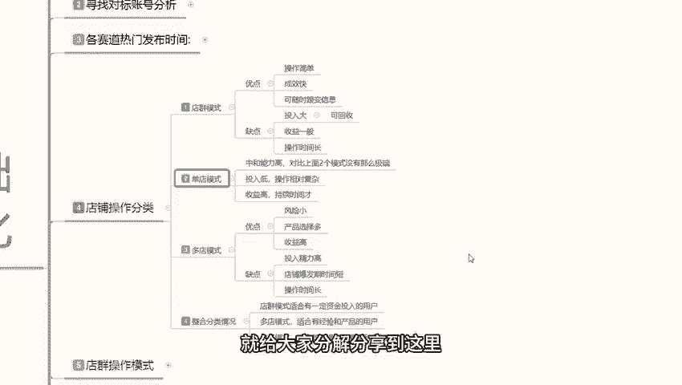
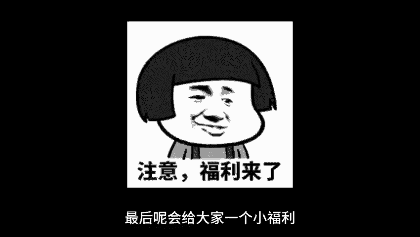
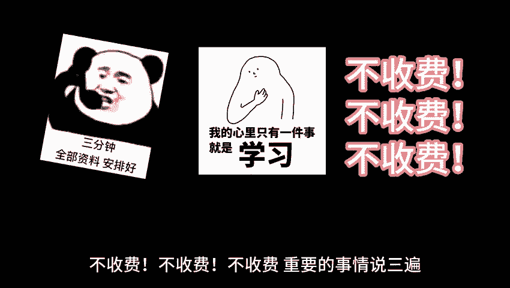

# 【2024版小红书体运营教程】全B站最良心的小红书开店运营高阶教程合集，小红书体开店 起号真的快 - P5：04、小红书开店-店铺操作分类 - 煤球很皮实 - BV1Q444eWEP5

大家好，今天给大家分享的是小红小红书，基础开店一体化的第四课，店铺操作的一个分类，我们首先了解一下什么是店铺操作的一个分类，我们在开店之前，你不要着急去开店啊，你把店铺的个人账号打好以后，标签做好以后。

然后了解发布时间，再去了解店铺操作的一个分类，店铺操作分类的话，其实我们在小红书上面你去做电的话，你其实可以把它分为店群多电单电啊，这三个模式，三个模式它是不一样的啊。

店群的话他的一个店铺数量是越多越好，多电模式的话，就是每个店铺你自己准备只做一个单品爆款的，单店模式的话，你比如说你只准备在小红书上面开一个店的，它每个模式所面对的一个操作方式和方向，它都是不一样的。

这节课的话主要是让你们大家自己确认一下，你在小红书上面你到底想去做哪个模式啊，哪个模式比较适合你，因人而异，分类不同啊，我们先了解一下电局模式啊，优点就是说操作比较简单，成效快啊。

可以随时变更的一个信息量额，缺点的话就是投入比较大，但是他这个投入的话是可以回收的，缺点就是然后呢就是收益一般，最后呢就是操作时间比较长，他这个，如果说你真想在小红书上面去做店群的话。

说实话啊缺点和优不，优点和缺点都是非常明确，优点就是小红书你做店群不需要动什么脑子啊，成效快是什么意思呢，就是说你店铺成型以后的话，他基本上每天就保持这个数据量，你想让它变多，他也不可能。

而且你自己的话不好操作过来，因为他的一个店铺数量开多了以后，你每个店重复操作这一个步骤下来的话，怎么说呢，就是说你就没有其他时间做其他东西了啊，就是你整个人就绑在这一些这些店铺里面。

然后呢他的一个可随时变更信息是什么意思呢，就是说你前面做店群，然后把数据粉丝累积一定的数量以后的话，你可以跟变信息，然后去往多点或单点模式去靠，但是你这种个面信息的话啊，时间会稍微长一点。

只是说你随时能更换而已，然后呢他的投入比较大，因为你做店群的话，你的店铺是越多越好，你十个以下你都不叫店群啊，你十个以上才叫电群，那十个以上你光一个保证金，你就要需要一两万块钱准备。

然后的话你的这个店铺里面你需要营业执照，不然的话你就需要去找十个身份证，每个身份证开一个个人店，那样的话太麻烦，如果说你不开个人店，你想开企业店，或者说是有资质，有店铺的那种的话。

一个身份证可以开三个店，开三个店的话，那还需要额外600块钱的一个店铺认证费用，一个店开下来的话，大概成本就在2000块钱左右，所以说它的一个投入还是比较大的，但是他这个里面的话有一点。

就是你如果说是用十个身份证的话，他的一个身份证保证金是可以回收的，如果说你是用企业的话，用身份证开三个店的话，这个里面除了600块钱不会不能回收以外啊，就是你开店时候用的一个资金不能回收以外。

你的保证金也是可以回收，就是一个店的话还能回收接近3000块钱，但是你的一个投入的话还是比较大的，缺点就是说然后他这个收益比较一般，因为你如果说在小红书上面去做店群的话。

你的收益其实和你打工比打工强不了多少，只是说自己的话，可能人生人生心里面自由一点，一个月收益的话也就几千块钱，想破万很难，最后一个呢就是操作时间长啊，只是只是说他比打工强一点，强在什么地方呢。

没有老板逼逼你哈，就这一个点，然后是多电模式，优点的话就是说风险小，然后呢产品选择的话就比较多，收益比较高，这种多电模式就是什么呢，我这个店铺的话，我把它开起来以后，我在小红书上面。

我准备只做一个这个产这一个店铺，我只准备只做一个爆款起来，或者说我有几个店铺里面能报一款，到两款就可以了，懂意思吧，就是优化后的电驱模式，但它不是电驱模式，它也是单电操作。

只是他的一个操作模式不一样而已，缺点的话就是说投入精力的话要高一点，因为它整体的话需要精细化操作，你只能先开一到两个店起来以后再去开第三个，第四个，第五个点，然后呢他的一个店铺爆发期时间比较短。

就是这种多电模式的话，他一般的话产品爆发期嗯，你前期准备可能要花一个月，最后爆发的话，可能就半个月到一个月到两个月啊，不会超过三个月，这个时间段爆发的话，你能赚多少钱，就取决于你自己产品的一个定价。

和你自己商品的一个性价比，你自己能做到什么程度了啊，就是爆发期时间比较短，他没办法在小红书上面长久的一个运营，然后就是操作时间长，为什么说他的一个操作时间也长呢，因为你是多电操作，它不是单电，单电操作。

知道吧，你多点操作啊，你第一个键步操作完，你还操作第二个，第三个，第四个呢，对不对，所以说他操作时间的话是非常长的，而且是精细化操作，比较费脑子啊，这个就是多电模式，当然了，如果说你把他的一个。

流程弄清楚以后还是比较简单的啊，然后呢是单电模式，单店模式啊，他的一个综合能力的话，相对于上面两个的话，其实呃就没那么极端了，他的一个投入比较低，操作相对复杂额收取收益的话也是比较高的，而且持续时间长。

你多电模式的话，你产品可能只能推广半个月，一个月两个月，但是多电的话，你基本上不单电模式的话，你基本上可以操作两年左右，但是他的一个爆发收益的话，就没有多电模式那么高啊，只是说他更持久一点啊。

就是说整合分类里的话，就是说你不管是做店群也好，单店也好，多电也好，你这三个模式其实都差不多的，各有优点啊，店群模式的话就比较适合你资金雄厚一点，但是对网络的话不怎么熟悉的人去操作，你建议的话。

现在你做小红书做店群的话，收益不是太高，但这点收益的话，你说实话没有太大必要，第二个呢就是多电模式，它呢就比较适合那个有经验的，你之前如果说做过淘宝，做过拼多多，或者做过京东，或者是在其他地方还在做的。

想在小红书上面发展的啊，对这种运营模式了解的，你可以去做多电单店模式的话，就任何人都可以做了，推荐的话就是新手，你就从单点模式开始操作啊，他主要的就是需要你有耐心和执行力就可以。

其他的话没有那么过多的一个需求量好吧，这个呢就是店铺操作的一个分类，你要先了解清楚你自己在小红书上面，你到底是要做什么，你后续才好去操作好吧，那这节课呢就给大家分解分享到这里。

最后呢会给大家一个小福利。

整理了小红书运营实操资料，可以评论区私信的方式领取，通过之后会第一时间发给大家，注意领取资料，不收费不收费不收费。

