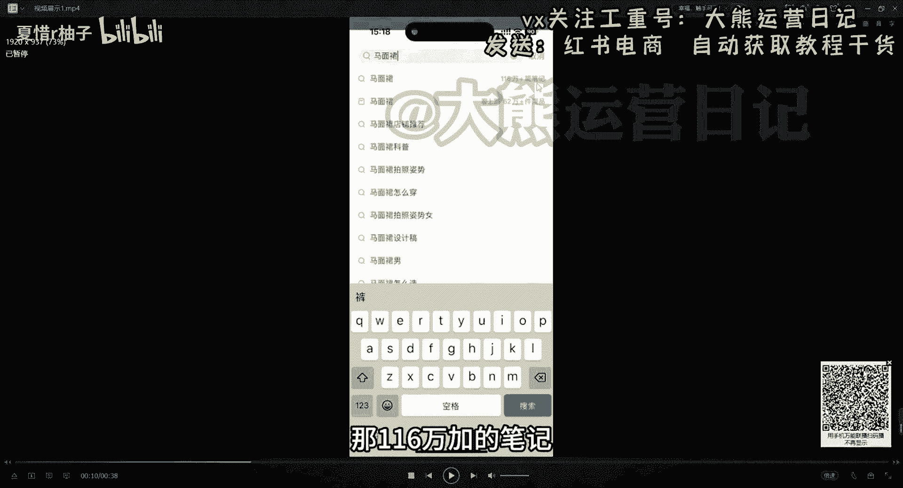

# 【2024版小红书体运营教程】全B站最良心的小红书开店运营高阶教程合集，小红书体开店 起号真的快 - P5：第6节.小红书类目的选择和判断(1) - 夏惜r柚子 - BV1B1bceAEWL

大家好，今天跟大家来啊，聊一聊我们第七节课小红书的内幕，我们如何去选择和判断这个类目到底能不能做，好吧，我们从几个方面来跟大家讲，首先呃呃关于为什么我们跟大家讲，选类目其实是非常重要的一件事情。

以及我们如何去挑选到一个，适合我们自己的类目啊，或者说有哪些推荐，不推荐的类目给大家展示一下，以及我们选类目的需要一些注意事项，好吧呃，首先为什么我们要选类目啊，为什么我们说了类目确实很重要。

首先呃我再问一下大家，你认为做一件事情其实是什么，最重要是方向重要呢，还是努力更重要，有人说方向，有人说努力，方向是最重要的，你如果说方向错了，后面你再努力，可能后面都是白费的对吧，选择其实在小红书。

在我们电商这个行业其实是大于努力的，你如果说选择错了，你这个类目选择错了，或者说你这个行业选择错了，那你想继续再付出再多努力，你也不一定能做出来，有人家方向做的好的，来做出来效果好对吧。

为什么当下要去做小红书，而不是淘宝投抖音，同理我们就选择了小红书这个方向呀，方向最重要，需要我们呃沿着大的趋势去顺势而为，而不是逆水行舟，你说我们现在去呃去看淘宝，去看天猫好做吗，非常非常不好做。

因为现在这个就不是方向，我们可能付出比现在做小红书三倍五倍的努力，也不一定有做小红书还效果好，对不对，所以说方向很重要，要不然努力白费好吧，选类目就是一次选方向的机会，我们选择一个好的方向对吧。

那我们后面可能就是非常的顺畅，要不然后面可能如履薄冰，那我们如何选择一个合适的内幕呢，我们从几个方面，首先呃受众人群和平台的主流人群要相符合，我们要知道小红书他目前的人群群体是哪些人。

而我们做的这个类目是哪些，符合哪些群体对吧，小红书她目前的人群群体啊，年龄在18~40岁的年轻女性比较多对吧，你可以发现你周围的很多女性，基本上都在玩小红书，而男性真正玩小红书的其实很少很少。

所以说腰要要求卖给这个人群，他们喜欢的东西投其所好才行对吧，你不能说我去卖给卖的比较多的，都是男性的对吧，确实你说可以做，但是卖给男性的并没有女性那么好卖，这个就是平台对吧，为男性比较好呃。

比较好卖的有哪些抖音唉，还可以对吧，但是小红书来说就是没有那么好做对吧，反过来你要去卖男性产品的话，必然不是很好卖对吧，比如说茶具，鱼竿帐篷篮球鞋，数码3C对吧，汽车用品等等这些你去卖。

你说你能有像女性卖的那些产品，比如说衣服呀，母婴用品呀，宠物用品啊对吧，水果啊，吃的啊这些对吧，肯定是没有他们比较好卖的，所以说建议大家如果做的话，建议以这个目标人群为主对吧。

那我们呃能找到对标账号对吧，第一个A类目不能做，B类目能不能做，取决于有没有同行正在做对吧，我们要了解的是这个类目啊，目前有没有同行正在做，你去小红书里面找了一圈，你发现没有人做。

那这个类目我建议你不要去做，不要去找到这种，你说这个冷门内幕是吧，人家做的很好了，且具备这个条件了对吧，你也能想办法做得到，那么就能做对吧，比如说货源笔记制作，这些人家从来就没有人做过这个类目的。

你再去做，那你那你你就，你就先不要把你当成这种能人来说好吧，一些冷门的内幕也可以做对吧，冷门的内幕就是但是不是偏的啊，能不能做就看有没有其他人做，比如说你是说的是一个冷门的，但是已经有人做过了。

已经有人做起来对，但是做人没有想象那么多，那我跟你讲，这个也是可以做的对吧，如果说从来没有人做出来，那你也不要去做，因为你肯定不是那个天选之子好吧，这个是我们通过对标账号的形式来找一找。

这个类目到底能不能做好，第三个呃，粗略的判断内幕是否值得做的方法，来给大家看一下，首先打开第一步，我们打开小红书，搜索一下内幕的名称或者产品的名称，比如说你是做什么的，你是做女装的。

我们搜索到女装她那个小的类目啊，比如说她是女装衬衫，女装开衫，连衣裙，卫衣等等，按照销量从高往低去排序，看看产品它的销量对吧，前排产品如果销量高再去考虑，如果说不超过3000的是吧。

说明产品的市场比较小，那咱们就换一个类目啊，以及我还要去1688里面看看，能不能找到同款的货源，如果说可以，那咱们继续做对吧，因为我们是做一件代发，并不是做有自己货源的，得去看看他们平台有没有他没有。

我们做的再好，我们平台做的再好，但是东西没有地方，没有地方给我们去呃，去发给人家，那肯定也不行，我们可以以女装，童装玩具杯子为例等等，我们都可以去搜索，以女装为例是一个热门的类目，可以去做。

但接下来问题是，女装里面要细分很多类目，比如说呃衬衫开衫，连衣裙，卫衣等等，那我们以一个视频来展示给大家看好的呃。

我们打开我们的小红书去搜索，搜索我们想做的类目啊，就比如说我们以马马面群为例，比较火的马面群。

我们搜索马面群110，那116万加的笔记。

说明这个确实能做，而且60万家的商品啊，说明这个这么多人做过，那咱们肯定是有能做的，对不对，马面群，你看一下这个是他的用户6000多对吧，6000多的点赞，以及我们点开他的这边有个商品。

点开上面我们看一下它的销量，我们一定要先哈点击销量看8000多人购买。

4000多人购买，我刚刚这边讲到了，你如果说不超过3000。

那说明这个产品的市场小，那咱们就换内幕，但是你可以看到他的产品超过8000了，对不对，超过超过3000了对吧，那我们就继续往下滑，看到有很多很多，它正常2000+2000加2000+1000加。

它最起码超过1000家了，那这个铃木就是能做的，以及我们打开它的视频，视频端能看到很多人，他的播放量1。4万的点赞，看到了吗，大几千的，大几百的，说明这个是有流量的，整体来说是有流量的，你不想打开很多。

其实是没有任何流量的，那不能做，这些都是我们有案例能找到的。

那他就是能做的好吧，呃这个就是我们去粗略的去判断一下，这个能不能做好吧，以及呃小结给大家一个小结，第一个同行同行是我们最好的老师，你要做的所有事情，其实你的同行已经做过了。

而且已经告诉你这个怎么去做了啊，我们一定要去学会参考同行，我不管说所有的平台，都是你一定要学会参考同行，第二个呢，所以要少靠自己思考，多当你去没有做过这类视频，当你去没有做过这个东西的时候。

你大部分时候只是想当然，我们去多去实际调研，多见同行案例，多去积累同行案例，你就会发现原来这样也可以做好吧，多找同行就行了，目前推荐的一些或者不推荐的内幕，具体有哪些。

给大家展示一下常见热门的内幕有很多好吧，常见热门的内幕，比如说服装的服装鞋包的呃，你服装鞋包女鞋呃，女装服饰配件，帽子袜子这些是关于女性的，因为她主要的人群群体是女性嘛，呃特点是爆款多，她是非标品。

那什么是非标品，大家有没有知道的对吧，什么是非标品，没有一个所谓的标准的价格的，我这件衣服啊，我可以卖多少钱，其实都合适，我在地摊上面这一件衣服我可能卖个几十块钱。

但是我在专卖店里面可能同样一件衣服对吧，我可能卖到几百块钱，几千块钱，所以说他可以卖出高的溢价，高的利润呐，它没有一个具体的标准的，而不像什么叫非标品，就比如说一件纸巾，一包纸巾你顶多一两块钱。

你最多了最多三四块钱，但是不可能你说一包纸巾，一包一块钱的纸巾对吧，我卖个十块钱，20块钱，这种情况下是没人买的，而且衣服不一样吧，几十块钱有人买几百块钱，也有人买几千块钱，几万块钱都有人买好吧。

但是同样一件衣服，可能从一两百到几千上万都有可能好吧，这就是非标品，我们建议大家去做一些非标品，因为我们可以把利润提高起来对吧，退缺点呢就是这个斜式服包的缺点，就是退货率稍微比较高。

如果说你在抖音里面像女装的话，退货率可能达到七八十%，都有可能，在呃，小红书里面能达到一个四五十%左右的，退货率比较高，这个也是所有这个卖女装的都是常见的，因为你这线上看着很好看。

但是你线下如果说穿的话，可能并没有想象中那么效果好，那人家就退货好吧，这个你得注意到退货的问题，第二个家纺家纺，比如说床单呀，床笠呀，四件套呀，毛毯呀，夏凉被呀，抱枕呃，地毯地垫这些也是一些非标品。

像床单这些家纺这些，其实你也有很贵的价格对吧，换了一个品牌，价格可能就不一样，母婴用品，童装童鞋毛绒，毛绒啊，毛绒玩具这些，其实它也属于一个小的非标品，因为这些也跟服饰服饰这些相关的。

每个节日他都会举办六一儿童节，或者说什么过年了，农年农年我换一个农农农联的这些童装呃，有这些图案的童装，那他就会有机会以及家纺百百货收纳清洁水杯，这些小的啊小的非标品对吧，百货是抖音上面最大的类目。

素材很多，我们去寻找素材，我们寻找类目的前提下，一定要是啊找到这个素材，到底能不能有没有蔬菜给到我们，价格是透明的，利润可能比较低，这个是它的特，这是它的缺点，转化率也可能比较低好吧。

但是这也算一个小的热门呐，啊水果特产零食应季的水果，比如说呃67月份的蜜瓜，9月份的猕猴桃，凯特芒果，10月份的风水泥，12月份的赣南脐橙是吧，这些等等等等，这些比较容易起后发图文，他就有流量。

我把这个产品展示得非常诱人，那他就会有流量好吧，对供应链的要求比较高，如果说你不是一个源头厂家，或者说你这个不知道产品到底你发货的好坏，那我们是很难去做的，除非说你是源头厂家。

或者说你对这个厂家确实了解熟悉对吧，我们以前跟他合作过，那我们可以没问题啊，以及他需要营业执照以及食品经营许可证好吧，这些都是我们需要去了解的，常见的一些热门的类目，大家可以截一下图，都可以看一下好吧。

以及呃小众类目的，比如说冷门的冷门那些类目，冷门需要靠自己挖掘，其实这个东西呢，也是需要去大家长期累月的积累的，因为你也不知道，这时候这个东西到底是不是冷门的，可能过了这段时间之后，它就不冷门了，好吧。

往往竞争比较小，找到一个就能很吃香，比如说香薰，香薰这东西可能贵的也能很贵，几十块钱，几百块钱，我们也有学员在做的香薰，户外的折叠椅这些东西，但是有有人想买买的东西，这一套可能要几百块钱，几千块钱。

定制类的，比如说定制的戒指，这些都属属于比较好奇的，比较新奇的，所以不大好找，所以大家建议先从热门的内幕开始搞，不要一上来就从小木那小众类目一旦上来，我们可以搞热门的，可以慢慢去找到这种小众冷门的。

或者你觉得这个可以，我们可以去测测试一下小众的冷门的内幕，以及不推荐的内幕，大大牌A货对吧，AA货的话建议大家不要搞，因为一搞的话呃，风电可能性很大很大，大品牌的产品需要品牌授权，一般人搞不到A货。

建议大家不要搞什么莆田啊，鞋啊这些不要搞大品牌的产品，也不要搞，临时需要品牌授权对吧，需要营业执照，营食品经营许可证，没有供应链，不好做，临时图书，需要制造和出版物经营许可证，没有供应链，也不要做美妆。

擦在脸上的东西，知识要求都是非常严格的对吧，小红书群体购买美妆产品还是比较认品牌的，因为他们整体来说都是属于这种年轻化的，女性，还是比较认品牌的，你要是没有品牌的，人家不太认可男性产品。

我刚刚讲到了鱼鱼竿对吧，帐篷等等这些太小众的产品，情趣内衣睡衣这些内容容易差篇违规的啊，爆款比较少的，而且购买频次比较低的也比较高，手机壳饰品穿穿戴甲市场太卷了，很难出爆款的手机壳，这些对吧。

别人都做了，已经做的很好了，你再去抢这个流量，那肯定抢不过人家好吧，这是不推荐的一些类目及选择类目十，需要注意的一些事项好吧，首先类目其实是没有优劣之分的，选择一个类目我们一定要坚持去坚持去干。

既然你选择了，那我们一定要坚持去干，很多人选择一个类目，刚做了几天，发现我笔记没有流量，于是就想换一个内幕，大家一定要消除这个想法对吧，你你做几天，你可能刚开始做，你账号标签还没打准呢，不会游泳。

我们换游泳池是没有用的，好吧，多去反思为什么同样的内幕，同样的产品，别人能有流量，而你没有原因到底在哪里，我们去改不就行了吗，一定不是内幕的问题，所以不要着急换内幕，想清楚是你账号权重够不够。

你标签精不精准，你是老号新号，你笔记是不是有问题，你的素材处理是不是不到位，不够吸引人对吧，想一想自己的问题，不要想类目的问题，目一定要垂直对吧，有两层含义，第一后期选品的时候注意产品类目要一致。

一个店铺一个阶段只做一个类目，你不要跟我讲，你这个店铺做好几个类目，又做男装，又做女装啊，又卖吃的，又卖衣服的对吧，不要做成杂货铺，什么都卖，这个是切记不要做的好吧，第二个只做一个垂直人群。

就算是女装也要划分年龄段，年龄段他有15~15到二二十的对吧，数18~20的，20~25的，25~30，三，15~40的等等，这些这都需要我们去划分的，或者说划分同一个种类，比如说针对相相应的人群。

同样是卖女装的，她有很多风格，小香风，夜店风上班，二位豪风对吧，做账号的就针对某一定特定的人群，你只要能把这个某一类特定人群给他圈定了，我们就不用担心再去做其他的了，就怕你做的很泛，做得狠饭。

最终会发现你这个谁也卖不出去好吧，一定要抓准同一类人群，比如说我现在能有的货源就是这种夜店风的，那我就面对夜店卷风这个发发视频发素材对吧，我就抓住这一部内容，人家收到我之后就很吸引他。

吸引他就能产生购买好吧，特别第三点，特别依靠品牌的类目不要去做，比如说奶粉，尿不湿，化妆品这些日化3C数码，人家看品牌的对吧，你如果说没有品牌资质，你做出来人家八九十%是不认的。

好吧呃这个就是几个简单的注意事项，以及我们一些品类的类目，大家可以了解一下，一定要选择我们相应的内幕，坚持去干就行了，不要呃这个是最重要的，这个大家可以多花一点时间都没问题好吧。

