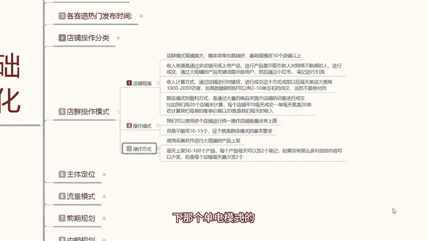
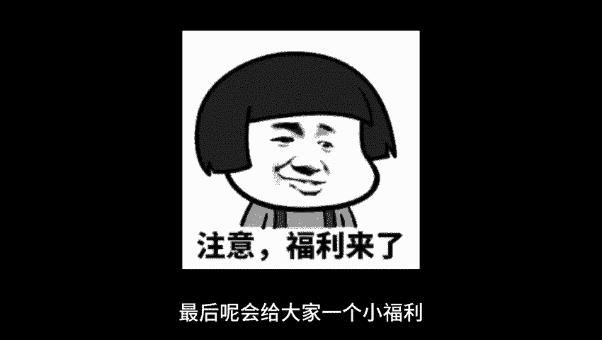

# 【2024版小红书体运营教程】全B站最良心的小红书开店运营高阶教程合集，小红书体开店 起号真的快 - P6：05、小红书开店-店群模式操作及注意事项 - 煤球很皮实 - BV1Q444eWEP5

大家好，今天给大家分享的是小红书基础，开店一体化的一个操作流程，这节课的话是给大家分享第五课啊，电群的一个操作模式，让大家了解一下电群它是怎么运作，怎么赚钱的，电池操作模式的话。

这里呢是给大家把他分了三个步骤，第一个是店铺规模，第二个是额操作模式，第三个是操作方式，先了解店群的一个规模，店群规模啊，他整个的话你在小红书上面做店群，你在其他地方做店群都是一样的，规模越大越好。

整体的话就是说你规模越大，效果也就越好，基础规模的话你就说最少在十个点以上啊，越多越好，不限制上限，但是有下限最少十个啊，第二个呢就是收入来源，它是通过多店无线上传产品，然后进行产品展示，吸引人。

新用吸引新人，对网络不熟悉的人，就是那种啧嗯刚接触网络不久，比较新奇啊，看什么都比较是吧，这种人去进行成交，然后呢，通过大规模的一个产品关键词展示给用户，然后通过小红书。

或者说是通过小红书的一个笔记进行引流引导，然后让他们进行购买转化成交收入，计算方式的话就是说通过店铺的一个进行铺货，然后进行成交，这个方式成型以后的话，每天单店的话就是说大概有1000到2000个访客。

你成型的话，你最少要有500个往上的商品才叫成型啊，就是一个店铺里面你最少有500个商品，你才算成型，然后如果数据做好的话，就是说基本上有两到十单左右，运气好，有两到十单，运气不好，一单都没有。

也是正常的，当然这个他也不是绝对的，就说你小红书的话，你做店群你就只能靠运气，运气好，每天开个几单，运气不好，每天一单都没，就这个样，而且你店铺规模的话，你说实话一个店一一单没有十个店的对吧。

总会开那么个几单上十单，他就是靠这种累积合并起来以后的话，就是你小红书店群的一个收入，为什么说我之前给大家讲的时候，就给大家说过啊，电群体操作起来以后的话，它的一个整体收益其实不高的。

而且投入的话和你收益不是太成正比啊，然后呢是小红书的一个操作模式，操作模式的话其实是也是比较简单的，因为小店群操作它就是一个一个模板，套一个模板，你直接去操作就行了，你使用多个店铺进行统一操作。

店铺数量的话没有上限，但是不能低于10~15个，这个就是电气模式的一个基本要求，然后你后续操作的话，你每天上传产品，你用一件代发也好，呃，你觉得自己没有那么多数据属性，你把别的产品，你把拼多多。

把淘宝的，把那个阿里的或者京东的那种产品，你基本上都可以放到你节目，你去哪，只要是有一件事，一件代发，一键上传，你去把这种产品找到以后，就能往你店铺里面放，而且你不分类型，不分属性，什么都不用分。

你就是一个搬运工，你把别人的产品拿到这个地方，你然后做一定的差价出来，自己就可以卖卖了，也许就值钱，所以说他操作模式是非常简单的，就是一环套一环啊，复制第一个复制，第二个复制，第三个无限复制就行。

操作方式，使用采集软件进行大规模的一个产品上架啊，你自己一个一个上传肯定是不行的，你直接用采集软件啊，小红书上面系统也有有匹配的，然后呢每天一个店啊，记住了一个店，每天只能上传50~100个产品。

再多的话就没用了啊，系统会判定你重复发布产品的，然后每个产品每天可以发两个笔记，每个产品每天可以发两个笔记，一个店铺每天最多不超过五篇笔记，它包括商品，笔记内容全是复制的，什么都不用你去管。

你也不需要操那么多心啊，如果没有那么多，那你每个店铺每天发个两到三天篇笔记，十个店铺每天发三四篇笔记，你就通过这种方式去做引流就行了，就是说但是呢这个里面每天笔记，你最少要发两个。

因为笔记它是有时间上限的，他的像做店群的话，他的笔记效应只有两天到三天左右，短的话可能只有一天啊，你要把这个了解清楚啊，就是每个笔记他都有时间效应的，就是引流的一个时间效应。

所以说你们每个店每天最少要发两天以上的，一个笔记量，这个就是整个店群的一个操作模式，它是非常简单的，它没有什么过多的一个技巧，无限搬运，就是把别人的复制过来，拿到自己这边店铺里面，拿自己的账号。

然后去做就行了，这个就是小红书的一个电讯，那这节课呢就给大家分享到这，下一节课的话，给大家讲解一下，那个单电模式的和多电模式的一个主体定位。

最后呢会给大家一个小福利。

整理了小红书运营实操资料，可以评论区私信的方式领取，通过之后会第一时间发给大家，注意领取资料，不收费不收费不收费。

