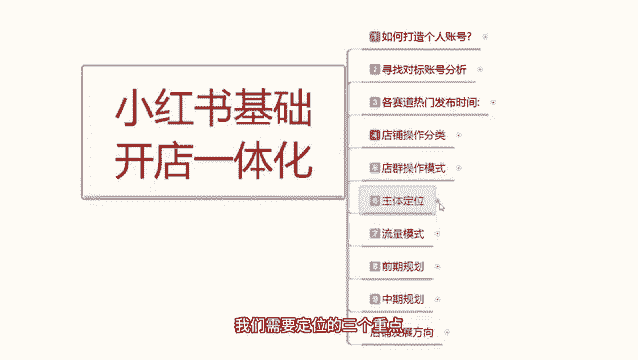
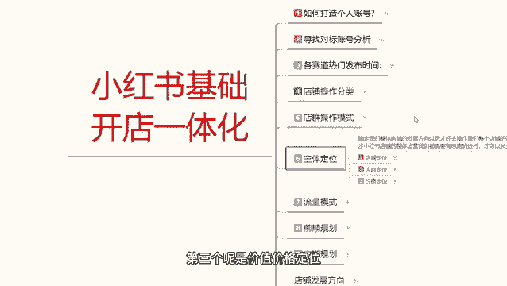
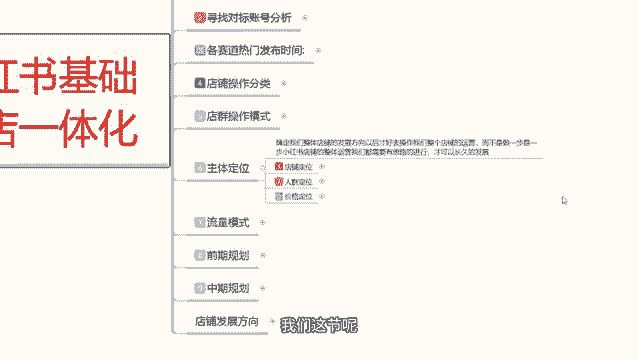
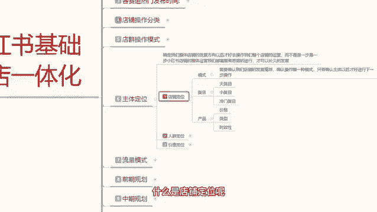
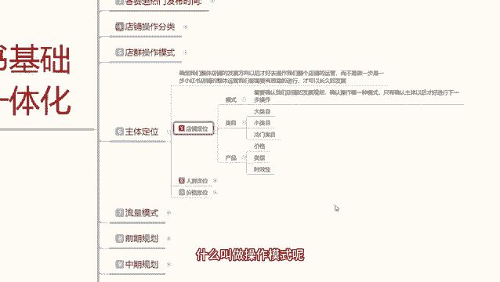
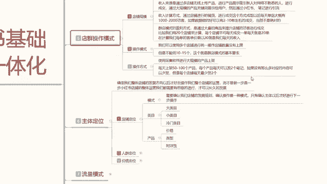
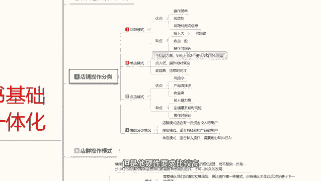
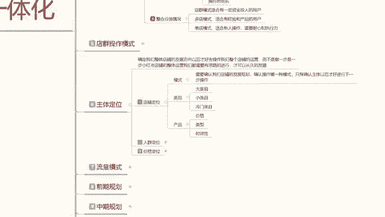

# 【2024版小红书体运营教程】全B站最良心的小红书开店运营高阶教程合集，小红书体开店 起号真的快 - P7：06、小红书开店-三大主体定位（店铺+人群+价格）） - 煤球很皮实 - BV1Q444eWEP5

大家好，今天给大家分享的是小红书，基础开店的一体化操作整体流程，第六课时主体的一个定位，主体定位的话主要是给大家讲解一下，我们单店操作和多点操作里面，我们需要定位的三个重点。

第一个是店铺定位，第二个是人群定位，第三个呢是价值价格定位。

我们首先来了解一下什么是主体地位啊，就是确定我们整体店铺的一个发展方向，方向确定好以后呢，我们后续去操作店铺功能才好操作呃，包括整个店铺的一个运营，而不是说我们再去做小红书或做其他的啊。

基本上都是一样的，你不能说是做一步试一步，你只要只有把自己的一个小红书，店铺的整体运营规划做好了啊，我们有思路的去操作，你才能把它做大做强，你不然的话你做一步试一步的话，说实话你这个就是纯碰运气。

你没有自己的一个方向，没有自己的一个目标，你后续再做做再多的事情，你没有这些主体定位，你把它不明确的话，你后续你操作不了，就是没有后续发展啊，你持久不了，所以说我们一定要确认自己啊。

你整体店铺到底是往哪个方向靠的，额包括之前给大家分享的一些内容，也都给大家讲过了，主体定位就决定了你后续发展，你是做持久性的啊，间接性的还是说想体验一下好吧，那开始进入我们的一个正题。

我们这节呢先来了解一下店铺定位。

什么是店铺定位呢。

店铺定位的话，说实话在这里面呢是分为三个点，第一个是模式，第二个是内幕，第三个是产品，什么是模式呢，就是需要确认我们店铺的一个发展规划，确认操作哪一种模式，只有确认主体以后才好进行下一步的操作。

什么叫做操作模式呢。

就是上一节给大家分享店群的一个操作分类，额不能说是店群啊。

应该是店铺操作的一个分类，分三个模式，店群模式，单电模式和多电模式三个模式，我们选一个你做店群的，你就说你自己有一部分资金，但是自己不知道去做什么，然后的话这部分钱你放在那里面的话也是浪费。

就想去做店群试一下，这个的话之前也给大家说过，你做店群平均的话每个月收入也就几千块钱，过万的话可能性不大，而且你的投入的话大概是额在3万到5万左右，看你的店铺规模，你的规模越大，你投入越高。

如果说你的店铺规模不大，十个店20个店的话，那也就一两万块钱，当然你的收入呢也就没有那么高，如果说你是做20个店，往30个店靠的话，那你的收入的话大概可能是五千六千，七千八千九千啊。

当然了还要看你的整体店群规模，第二个呢就是单店模式，第三个呢就是多电模式，单电模式的话，我们去操作的时候，就说你做一个店铺，因为我自己的话本来产品就没有太多，只有一个突出重点可以去做，你去做单点模式。

或者说你是新人，你想了解小红书做点这一块，你也可以去做单店模式，因为单店模式的话，你不管是做一件代发，也可以，你去自己线下找产品，也可以，或者说你自己本身有一个主退款的一个产品，也可以。

都可以做单店模式，多电模式的话就不行，多电模式的话，你就只能去怎么说呢，你要有自己的一个呃出货厂商啊，为你提供多元化的一个店铺属性，你比方说你自己做家具啊，做服装啊，做装饰啊，做化妆啊，做面膜啊做等等。

你要有多元化多方向的一个产品，你才能去做多DM模式，这个的话说实话它比较适合的话，就是厂家来去操作，为什么，因为厂家的话他的货源可以自己把控啊，你如果说个人想去做多电模式的话，说实话很难。

而且你不好操作，投入也比较大，嗯虽然说他的一个收益高，产品选择的话也比较多，而且风险小，但是他硬性要求比较高。

这是三个选择模式，所以说我们在操作店铺定位的时候，你一定要把自己的一个模式给选清楚，你选模选完模式以后，你不管是说电锯也好，单点也好，多电也好，模式选完以后选内幕，大类目，小类目，冷门类目。

然后选完类目选产品，产品里面要选什么呢，价格类型，时效性这三个你都要选，要一一去针对，内幕里面就是大类目，小类目，冷门内幕，三个里面就是根据你自己产品去定的，所以说我们在做主体定位的时候。

你一定要把自己的店铺定位弄清楚，你不管是做多电也好，单电也好，单电的话，你就需要去怎么说呢，大类目小类目人类目，因为你自己本来就没有什么太好的，一个产品出入，那你无非就是网上一件代发，线下货源自己去找。

那你找的话，你就只能从大类目，小类目，冷门内幕三个类目里面去选，这三个类目，他们所面对的一个受众群体，也是不一样的冷门类目，起点低，爆发点高，但是他不好做，为什么，因为他的数据和格调的话。

它把它做爆起来很难需要有一定的沉淀，而且对这一个产品非常了解，知道这个产品的一个市场在什么地方才好去做，小类目就不一样了，小类目的话你啊基本上都可以做，但是你需要自己出产品，大类目就不一样。

大类目和另外的一个小类目和内幕就不一样，他的话就说没有那么多复杂的一个问题，直接16881件代发，你自己找不到产品，你去做大类目就行，你有自己的产品就做小类目，如果说自己的产品不好，你要去线下找。

那就去做冷门类目，这三个点各有优势，各有优点，你把这三内幕选择好以后呢，再去选择产品的一个价格类型和实效性，价格的话，那确定了我们产品所面对的一个用户群体，选择性啊，每个价格的折扣性它是不一样的。

类型的话就是说你产品的类型，男性女性，实用性，时效性都是不一样的啊，时效性的意思，就是说这个产品是在什么时候用的，你比方说季节性的产品对吧，温补性的产品对吧，美容类的产品啊。

汽车装饰的产品它都是有时效性的，所以说我们在选定内幕的时候，你首先要了解自己要做什么模式，模式，选完以后的话，然后选内幕，内幕选完以后选产品，比方说我如果说我是一个新人啊，我想在小红书上面坐垫。

那我首先是选模式，电池模式我肯定不考虑多电模式，我没有资源，我只能做单电模式，单电模式我选完以后的话，结合我自身的情况，大类目我只能做16881件代发，我会去考虑小类目，如果说我自己有工厂。

我就会去考虑小类目的一个操作啊，推广自己的一个产品，产品数据，如果说两者我都没有，而且我又不想做大类目，因为大类目的竞争压力非常大，那我就只能选冷门类目，冷门类目怎么做呢，去线下的周边市场啊。

去选择当地的一个特色做冷门，然后宣传往全国各地商家赚钱，你也赚钱，全国各地的用户也会喜，如果说喜欢这个产品，这个类型这个属性，那么你的产品就一定能卖爆，因为他的一个，入点很小，但是片面性很大。

他只是没有推广出去，所以叫冷门，内部，选完内幕内幕以后，我选筛选价格，选类型，选时效性，把这三个点，然后结合我们自自己选的模式，选的类目就是我们店铺的一个整体定位，包括我前期中期。

后期三个发展的一个方式和方向，我就已经全部确定好了，确定好以后的话，我下面就要选择我们的一个人群定位之后，再选择价格定位，这个就是主体的一个定位，好吧，因为时间的关系呢，这节课呢就给大家分享到这。

下节课呢给大家分享一下啊，店铺定位做完以后，我们选人群定位怎么去选。

最后呢会给大家一个小福利，整理了小红书运营实操资料，可以评论区私信的方式领取，通过之后会第一时间发给大家，注意领取资料，不收费不收费不收费。

