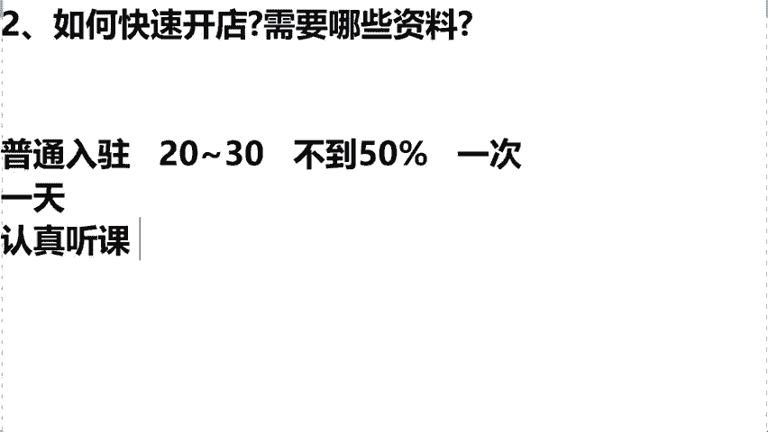
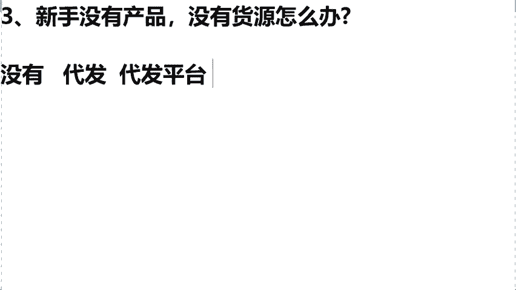
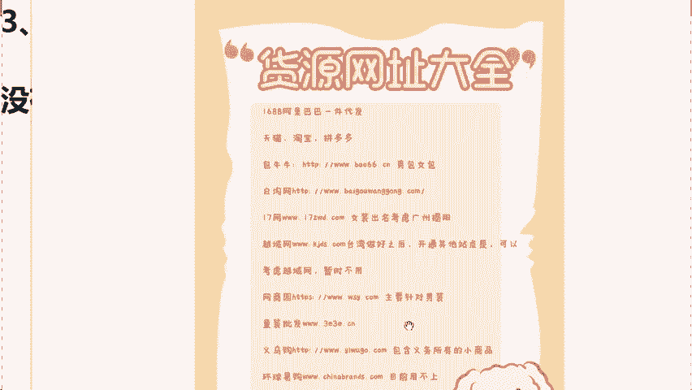
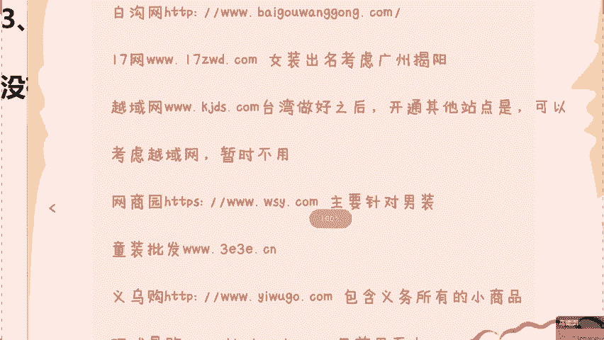
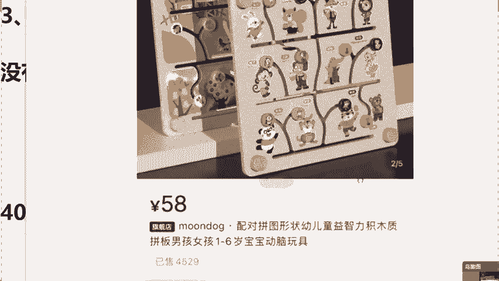
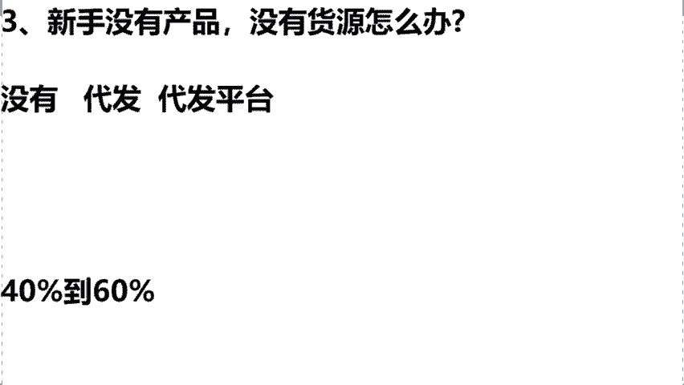
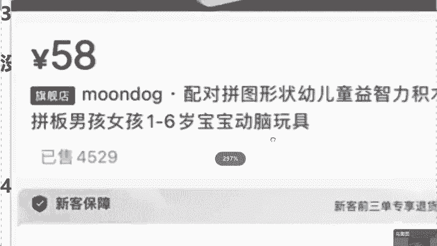
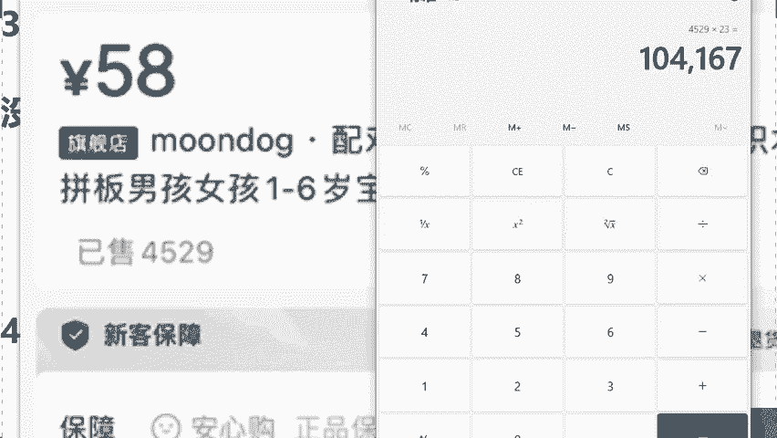

# 【2024版小红书体运营教程】全B站最良心的小红书开店运营高阶教程合集，小红书体开店 起号真的快 - P8：6.新手无货源怎么办 - 轻轻换一声卿卿 - BV15M48ePEA5

那么来我们今天的话呢，同学们说，老师啊，我作为一个小白，作为一个新手，我想做小红书店铺，我今天没有货源，没有产品该怎么来做呢，来同学们啊。

我们说到咱们这个货源问题的话，我来问一下呃，咱们直播间同学们，如果今天你是有货源的话呢，你在直播间啊把泪目给我敲在公屏上，那么如果说老师我今天是没有会员的，你在直播间打上没有两个字。

我来看一下同学们大概是一个什么样的情况，很多人都说没有，是不是啊，那我来简单的去说一下，如果说你是自己有会员的话呢，你的货源供应链啊是有价格有优势的话，我待会会教给你，如何用咱们的产品来进行去定价。

包括来讲去打造爆款商品，那么我看到更多的是没有会员的，是不是，那么这样，同学的话，今天你没有怎么办呢，难不成老师我没有货源的话，我就不能通过小红书去开店去赚钱了吗，当然不是了，来同学们。

如果说没有会员的，拿本儿记好了，咱今天直接从代发去做起，那我解释一下什么叫代发，比如说今天我们去这个卖货对吧，首先第一步咱们得干嘛呀，得找货源，那么货源从哪来呢，同学们，你想找货源，首先得找厂家。

那同学们肯定绝对有人会说，老师厂家我也找不到啊，对不对，同学们啊，今天我们来去对接一些，我来帮你对接一些叫做线上厂家，我们通过线上厂家去拿货的话，这个同学叫什么呢，统称为叫做代发平台，我解释一下啊。

说白了，咱们今天的话用别人的产品来赚我们自己的钱，我们作为中间商直接来赚一个差价，来同学们这个地方大家能不能够去理解，如果说能够听懂理解的话，公屏扣一我去看一下，都能去理解，是不是我强调一下啊。

这堂课的话都是干货啊，一定要听懂，学会了，包括来讲我们今天这个货源同学了，问老师，我去哪里找呢，对吧。

我这个哪里找货源呢，这个时候我也没有必要去低调了啊，大一老师，我的话做电商这么多年了。

手里边的话各种品类的话我都有，包括来讲，无论你是想卖这个鞋子呀，卖包包啊，卖建材，卖百货呀，任何你想去卖的产品，我在这儿能够去帮你对接到最优质的厂家，我常年同学们，我是来帮助我学生进行去选品的。

而且来讲在这个今年我也是带着我的团队，到目前为止一共是测评了10万多家的爆款，所以后期不管你们店铺有多少流量啊，出了多少单，我能够保证咱们今天同学们，商家百分百准时的来给咱们去发货。

这个问题我来给你去兜底，那么最重要的一个点在哪里，就是说我们今天能够保证所有货品达到利润，40%到60%以上。

同学们，你记住了啊，就目前来讲，在平台上面我们能做到40%到60，利润的话，只有小红书可以达到，为什么前面说到过小红书平台，它的用户80%是中高端女性，所以更加容易让我们去打造爆款商品，销量高。

咱们赚的就多，因为说这些女性，她们购买能力本来都特别的强，同学们非常强，利润非常高，变现的话是非常暴利的，只要你能卖出去，咱们可以直接赚到钱，不需要new资金，也不需要new货源。

用代发可以直接变现赚钱，包括刚才我看到说，老师这个利润真的有这么高吗，同学们呃，那么我在这儿，咱们用我的学生去举一个例子好吧，我们来算一下啊，这个商品能不能达到40%的利润。

你看我这个学生，他卖的是什么啊，他卖的叫做儿童拼图。

这个拼图在小红书售卖价格同学们58块钱，那么咱们今天同学们可能会有疑问了，老师我去卖这一单，我能赚多少钱呢，那我们说想知道赚多少，首先要知道拿货成本是多少钱对吧，才能算出利润，那今天怎么来进货呢。

来跟上我的一个思路，首先第一步把商品进行截图，截图保存过后，同学们第二步打开叫做1688的一个平台，同学们点击里边的小相机标识，在这个位置，把刚才截图的图片进行上传，点击旁边的搜索。

那么你就会发现这个里边啊，有我们今天一样的拼图，一模一样的，那么成本价啊，高低不一，有20的，有十块的，有18的，有27的，这些各种各样的价格都是有的，我在这儿啊，我拿一个最高的我们的成本价。

就算他是27块钱来，咱们用这个58的卖价，减去27的一个进价，我今天毛利剩了31，对不对，我还没有减掉运费，我在这儿给大家去减掉一个八元钱的运费，是不是我们今天的一个纯利润就是23块钱。

你今天的话你卖一个拼图，我们说用这个拼图可以去直接除二卖，除这个降到23对吧，你再除以一个58，就是咱们的一个利润了，那么他今天大概是在37。6%左右，我想问一下咱们今天直播间各位同学啊。

就如果说你去做产品的话，你的一个产品利润可以高达40%的话，你们觉得满意吗，来如果说啊你们觉得满意的话，你在直播间把满意两个字给我打在公屏上，那如果说能够去听懂理解的话，对这个利润是满意的话。

来公屏上打上满意两个字，包括我看到说同学们在问的老师，我今天我满意是满意，但是我不知道说这个58能不能卖得出去呀，对吧，我们关键重点在于老师我能卖多少单才是关键，所以在这儿啊给大家去看一下他的店铺。

他这个店铺呢在今年夏天，儿童拼图到目前为止一共是卖了，我们来看一下多少个订单，来我们去看一下这个店铺啊，嗯我要去找一下他这个店铺在这儿嗯。

到现在为止是卖了一个4529个订单。

我们直接用这个4529去乘以下，咱们今天多少，23块钱的一个，我们成本是多少钱，同学们，这一个单品，让他在今年夏天直接赚到了10万块钱，所以同学们啊，作为小白同学，我告诉大家，只要说产品选好了。

利润空间真的非常大，而且来讲他今天只是一个单品的利润，如果后期同学们20个单品，30个单品呢，所以说啊小红书平台现在非常好做，只要今天你选对了产品，咱们就能够去出单，就能够去赚钱的数据。

就是一个最好的证明，所以说讲到这儿的话啊，我们解决了小白同学货源问题，选品问题。

