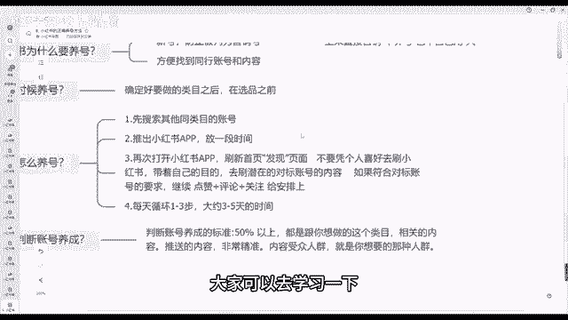
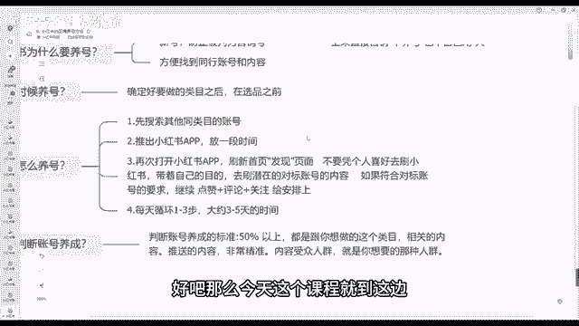

# 【2024版小红书体运营教程】全B站最良心的小红书开店运营高阶教程合集，小红书体开店 起号真的快 - P9：08.小红书的正确养号方法 - 熊孩子在b站 - BV1U3vpe4EaW

大家好，我是阿强，今天来跟大家讲到一个非常重要的一节，我们小红书如何去正确的养号，对吧，呜大家一定要知道我上一节课讲了，如何去选择我们正确的类目啊，先选择类目，养号其实也很重要的，你如果说号不养的话。

你后面想要去呃操作的话，其实比你不养号，操作是呃养号是比不养号是要顺畅很多的好吧，一定要养号，学会养号这个习惯，你后面去不断的去铺号的话，你自己做的话速度也会更快一点好吧。

呃那接下来我们会以四个四个维度来跟大家讲。

首先小红书为什么要养号对吧，大家先想一下什么是养号，我把我这个号养成这个他们喜欢的样子对吧，养成我是正确会推给别人的样子，或者说我推推给推给我的也是这个标签的，为什么会说打标签呢，就打去打到正确的标签。

人家就会有更多我们这个同类型的人群，点击刷到我们的号，要不然你看大量的，假如说我这条视频我能有个1000播放量，但是有个900播放量，都是跟我们这个无关紧要的，那你去转化那的难度，跟你1000。

跟你500的播放量，能有400个人跟我这个标签是同样的，你说哪个转化效果好，肯定是500，有400的这个效果好，所以说我们拿到一个手里面有个新号，一定要不要着急去发作品，不要着急去营销对吧，先学会养号。

新号我们防止被判为营销号。

前期不要着急，一上来就挂产品，一上来就卖货对吧，一上来直接营销，不养号也不自己用对吧，我只只你就是这样，很多人就是剪好一个视频，或者说我写好一个笔记，我直接发上去画产品呃，我自己平常也不刷。

只有当时我发产品的时候，发作品的时候，我打开一下，这种情况下很很容易被平台判为营销号，然后后期就不给你流量了，你发一个视频可能只有几个流量，几十个流量对吧，看一个笔记基本上没有播放，没有观看对吧。

很容易出现这种情况，不要着急，前期我们一步一步来，为什么很多人说我前期呃我发了话，很多天都没有赚到钱对吧，没有出单很正常，你太心急了，那做所有事情并不是说心急就能成功的好吧。

第二个方便我们找到同行的账号对吧，我们信我们信号养号，第一个我们能防止呃平台判定我们营销号，第二个我们也能养号，也能找到同行，我们也能找到对标啊，找到对标怎么做的，我们知道自己之之后应该怎么做好吧。

那什么时候开始讲号呢，我们要确定自己的类目之后，确定完自己类目之后再去养号，不要着急养号，养号，你不要上来，你类目还没确定，你怎么去养号啊，你都不知道你卖什么的对吧，我确定我卖什么了。

比如说我上一节课讲到的卖马面裙的，那我就确定我卖这个女装。

卖这个马面裙了，那我就开始通过马面群来养号了。

呃我们具体怎么去养号呢，首先第一步我们先搜索其他同类目的账号。

比如说你是卖卖马云群的，那我们去先找到这些卖卖马面群账号，我们去搜索几家，多点击几下，再次打开小红书app对吧，我们退出小红书app，我们第一步先搜索其他同类目的账号，我们搜索完之后。

我们退出小红书app对吧，放一段时间我们再打开app，打开小红书app，刷新首页，刷新首页页面，不要凭个人喜好去刷小红书。

带着自己的目的对吧，去刷潜在的对标账号对吧。

我们刷开刷那个首页，刷首页，如果说也有卖马面群的，我们点开对吧，如果符合对标账号的要求的，我们点我们可以点赞评论关注，给他安排上一键三连，给他安排上每天循环到1~1到三，11~3步对吧，1~3步。

然后大约3~5天，111天的话3~5次就行了好吧，大概是这个操作具体怎么去养号的，那我们如何判断养号成功呢，据这么判断养号成功呢，首先判断账号养成的标准在50%以上，50%以上都是跟你这个刷到你刷到的。

这个发现页里面，那个发现页里面，50%的都是跟你这个相同类目的，相关的内容的，推送的内容非常精准，内容受众人群也是，也是你就是你想要的那个人群人群，我刷你这个账号，你就想象出来别人刷这个账号能不能刷到。

你，就相当于如果说你能刷到别人，那别人也能刷到你就差不多这种，这就是养号好吧，我们能把号养成之后，那我们这个账号后期再去做账号，那难度就比你不养号难度要好很多好吧，那这个就是小红书如何去正确养号的方法。

大家可以去学习一下。

操作一下就行了，实一定要实操好吧。

