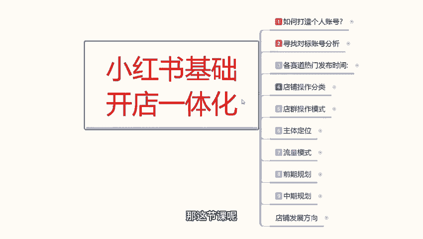
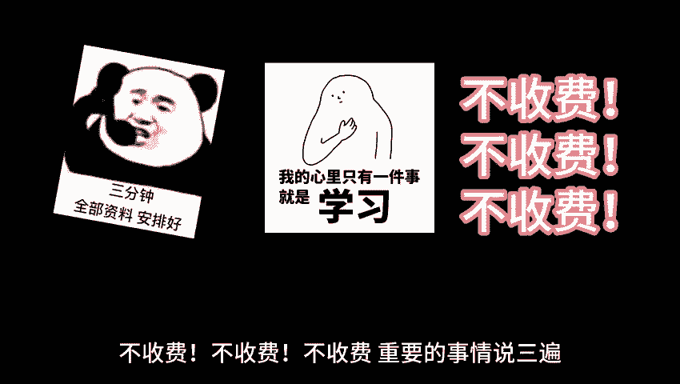

# 【2024版小红书体运营教程】全B站最良心的小红书开店运营高阶教程合集，小红书体开店 起号真的快 - P9：08、小红书开店-店铺产品价格定位 - 煤球很皮实 - BV1Q444eWEP5

大家好，今天给大家分享的是小红书，基础开店一体化的整体操作流程，第六大课时主体定位里面的一个价格定位额，之前给大家说过了啊，店铺定位主体的一个定位，我们把店铺定位做完，人群定位做完。

最后却又是确认我们产品的一个价格定位，价格定位它也是有选择性的啊，他不是说我们直接你想卖多少卖多少啊，价格定位的话，他的选择性而且相对复杂，而且比较认真一点，如果说你在这里你把它听不懂，不了解的话。

你自己后续去做的话，我们是没办法去做的啊，因为你对应的人群属性和你自己的一个产品，价格不符，你没办法去操作的，我们来看一下啊，价格定位，产品，价格定位，确定了我们所面对的用户是什么类型的。

我们需要做店铺人群系统，才会给予我们对应的一个搜索人群，就是说我们产品价格如果说你没有确认，你确认了店铺，确认了人群，你没有确定价格，后续系统给你排序的呃，推广的一个用户给你的话，他也是不准确的。

所以说我们在这里的话，一定要先把价格定位做完，然后去选定人群，懂我意思吧，价格选定完了，人群选定完了，你的店铺发展思路，有了后续就是我们操作整体店铺的一个方式，我们先来了解一下产品价格定位啊。

它是分三个阶级的呃，三个对应的属性，分属三个不同的一个店铺操作模式，第一个是分级低中高三个层次，第一次三折以下就是我们产品发布以后，你原价卖100，打三折卖30，这种的话也是一种促销活动。

以前很多人会用，但是现在也有，但是主要是出现在拼多多啊，小红书上面也有，但是这种的话说实话我不怎么提倡，因为他的话属于低端消费人群，但是小红书整体用户的话，他说实话他是属于中高端的一个消费人群。

你在小红书上面做低端消费的话，你说实话做不起来啊，很难，第二个呢就是综五折，包括四折，五折六折，他都属于中啊，就是小红书的一个程序划分，属于终端消费的一个人群，第三个呢就是高端消费人群，七折八折。

九折和不打折，但是基本上你在小红书做，你在其他任何地方做，你产品不打折的话，别人看都看不下去啊，你怎么都要有一个折扣，就算你是卖正品正版啊，你去操作以后，小红书他都要有折扣的，你没有折扣。

不别人看着你就不是诚心实意，你来你就是来忽悠傻子的，别人是不会去买的，那这三个折扣他是怎么区分的呢，三折以下他是小红书，就会直接把你的产品判定为低端产品，它所属对应的一个人群的话。

就是低端的消费购买能力，懂我意思吧，系统会根据他个人的一个属性分配，和消费能力的一个分配，那你选择三折以下，你就选定了这一部分人群，如果说你选择四折，五折六折，那你就选择了中端人群。

如果说你选择高七折以上，那就是高端人群，那小红书目前用的用户主打85%，90%甚至90%几的一个女性用户，25岁到35岁的一个主体，消费年龄范围之内，他基本都是高端用户，他对他自己的皮肤。

对他自己的穿着，对不对，对自己的一个美食培养视频，他都是有要求的，你做低端中端的话，你只能去做25岁到14岁这种小朋友，或者说是刚步入社会，没有多大消费能力的人去操作，就看你自己的人群去选。

不怎么选定啊，低中高三个档次都能选，只是说你对应的产品选择的话，所面对的人群和属性它是不一样的，就靠我们自己怎么去划分，怎么去了解，我们选定自己的折扣以后，然后呢是选定基础定价啊，就是说因为这个的话。

我建议大家的话是做中，或者是高低端也可以做啊，这个没有明确的，它只是我们对应的人群定位不一样而已啊，看大家自己怎么去操作，确定基础的一个折扣分类以后的话，然后是基础定价，基础定价是什么意思呢。

我产品我进货价三十五十八十，100几块几毛，他都有个基础定价，那你基础定价的话，我们再配合折扣低一中高三个折扣范围，那就需要需要去设定我们的一个产品价格，对不对，产品价格设置的话。

一般呢就是在产品出厂价值的1~3倍左右，你去做这个价格就可以啊，价格的话需要确认我们产品的一个基础价值，加运费加内容，就是我们最终所设定的产品的一个出厂价，你在小红书上面准备卖多少钱。

参加活动准备卖多少钱，你自己都要考虑进去，我们打个比方，基础价格50加运费十加利润50，那就是110，这是一倍左右的利润啊，一倍左右的利润，如果说你然后再打个折对吧，110的成本你打个八折。

那他就相当于是八十一八十二八十，88，一百一十八十八啊，一百一八折88，对不对，那你除去基础价格加运费的话，你再算一下你自己还能赚多少钱，这是一倍利润，两倍利润三倍，女人都是这么算的，当然了。

你两倍利润，三倍利润，你就只能做低端和中端的一个产品，打三折打五折，这么去操作啊，每每一个基础定价，等于就说你把利润如果说定的太高，那你就只能把折扣压下来，因为你的产品和你的虚假，如果说相差太大的话。

你的产品是没办法卖出去的，现在人都不傻啊，你不要想着我拿个几十块钱的衣服，我准备卖个几百块钱可以卖，但你这店铺绝对做不到，而且卖个几天，这个店铺就废了，你的前期操作努力就白费了。

就看你自己能不能把他一次性卖报，多赚一笔啊，当然了，可能性很小，这个就是赌命赌运气了啊，然后呢基础定价就是说商品的价格越高，利润越低，这样的话可以提升我们产品的一个知名度，如果说你想做长久的话。

就是这个操作模式，商品价格越高，利润越低，这样的话提升我们产品的一个知名度，在第一件主推产品操作店铺数据的时候，就比较方便，你做单店多爆款的话，就可以按照这个模式去操作。

因为第二件爆款才是你赚钱的最终目的，第一件的话说实话不亏本，能保持生活，保证店铺的一个正常运营，等你账号的一个权重起来以后，你第二件爆款才是你赚钱的时候，而且持续时间非常好。

基本上都有在半年到两年左右之间的，一个时间段啊，比较适合全季节性的一个产品，你要做那种短期爆发的什么季节性产品的话，基本上就三个月，六个月之类的产品的话，这种方式就不不怎么适合了。

就说我整合了所有的一个数据经验，我们在操作的时候，最赚钱的时候就是在第二件主产品上架的时候，有一定店铺基础数据和讯与整体的利润的话，可以进行提高，我们正常基础定价的话，50+10，运费加50的利润。

我可以把它提高到1。5倍左右啊，技术第二阶产品提高的1。5倍甚至是两倍，那当然了，这要看店铺的一个整体反馈，也不能说是我在这张嘴说上上上嘴巴皮一扑，下嘴巴皮一说，哎我定价我也初始就低两倍。

那你卖都卖不出去的啊，当然还是要了解，根据自己的账号，根据自己实际情况去了解，去确认的，有时候你做三倍其实都可以的，就看你的产品符不符合了，有没有实在的前沿性啊和前瞻性，所以说我们店铺第一件产品的话。

它你正常去操作的话，如果说对产品自己没有太大信心，第一件产品的话就说价格不要定太高了啊，而且你的那个产品定位选完以后的话，技术定价确认，然后选择对应的折扣，对应折扣选完以后选择对应的人群。

人群选完以后选，再按照店铺的一个思路，这就是整体我们小红书店铺的一个主体定位，把这三个点做好以后，你后期就只需要去做数据，做笔记做分享，然后就等着店铺报，有时间多的，你就可以开第二个店，开机三个点。

第四个点都是按照这种操作模式，你要把整个操作模式流程熟悉了以后，你在小红书上面开店，你才能去持久，包括你做矩阵，小红书开店，你不光是创建一个店店铺就可以了，你还要去做矩阵的，只是说这个矩阵的话。

不包括我在给大家讲，开店这个主体里面范围之内，好吧，那这节课呢就给大家分享到这里，下节课呢给大家讲解的是啊，小红书整体它的一个流量运行模式，让我们了解一下你小红书店铺的一个流量，到底是通过什么方式来的。

包括我们店铺的一个转化率，那这节课呢就给大家分享到这里。

最后呢会给大家一个小福利，整理了小红书运营实操资料，可以评论区私信的方式领取，通过之后会第一时间发给大家，注意领取资料，不收费不收费不收费。

